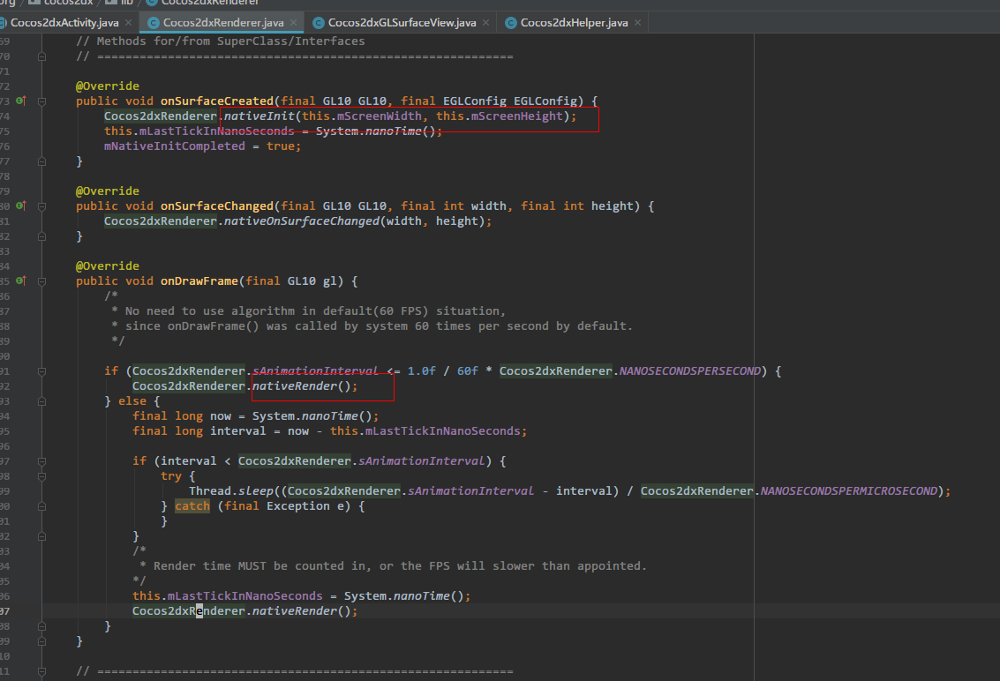
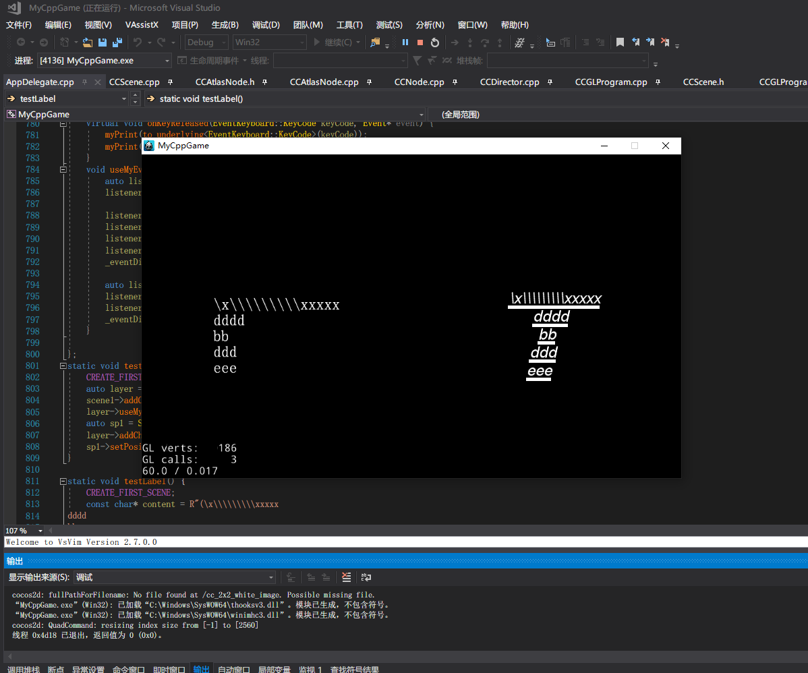

# cocos2dx 下载安装
准备条件：需要安装python2.7版本  

## 下载
有两种方式可以下载
1. cocos2dx [github](https://github.com/cocos2d/cocos2d-x)   
  


2. cocos2dx[下载地址](http://cocos2d-x.org/filedown/cocos2d-x-3.17.2)

## 安装
执行python.exe setup.py 目的是创建和检测环境变量，并且把某些路径添加到path中
```cmd
python.exe setup.py
```


## 创建完整Demo
控制台执行cocos命令，查看帮助  


## 引擎目录介绍
* ${project_root}/cocos2d
  * build  
      一些编译脚本和win32/xcode项目目录
  * cmake  
      cmake 编译命令
  * cocos  
      cocos 模块
  * docs  
      文档
  * extensions  
      扩展的一些功能，依赖cocos模块
  * external  
      独立三方库，不依赖cocos模块
  * licenses  
      许可证
  * tools  
      一些工具

* ${project_root}/cocos2d/cocos  
    - 2d  
        - CCAction 
          - Action(动作基础类)
          - FiniteTimeAction(有限时间动作类)
          - Speed(变速动作)
          - Follow(跟随结点动作)
        - CCActionCamera
          - ActionCamera(设置摄像机动作) 
          - OrbitCamera(轨道摄像机动作) 
        - CCActionCatmullRom([Cardinal Spline样条曲线https://en.wikipedia.org/wiki/Cubic_Hermite_spline](https://en.wikipedia.org/wiki/Cubic_Hermite_spline))  
          - 插值数据设置
          - PointArray(一组point数组)
          - CardinalSplineTo(Cardinal Spline样条曲线运动)
          - CardinalSplineBy(Cardinal Spline样条曲线运动)
          - CatmullRomTo(Cardinal Spline样条曲线运动)
          - CatmullRomBy(Cardinal Spline样条曲线运动)
        - CCActionEase
          - ActionEase(插值运动基类)
          - [插值函数参考](https://easings.net/)
          - 插值函数参考
          - [贝塞尔曲线](https://zh.wikipedia.org/wiki/%E8%B2%9D%E8%8C%B2%E6%9B%B2%E7%B7%9A)
        - CCActionGrid
          - GridAction
          - Grid3DAction
          - TiledGrid3DAction
          - AccelDeccelAmplitude
          - AccelAmplitude
          - DeccelAmplitude
          - StopGrid
          - ReuseGrid
        - CCActionGrid3D
          - Waves3D
          - FlipX3D
          - FlipY3D
          - Lens3D
          - Ripple3D
          - Shaky3D
          - Liquid
          - Waves
          - Twirl
        - CCActionInstant(无时间运动)
          - ActionInstant
          - Show
          - Hide
          - ToggleVisibility
          - RemoveSelf
          - FlipX
          - FlipY
          - Place
          - CallFunc
          - CallFuncN
          - __CCCallFuncND
          - __CCCallFuncO
        - CCActionInterval(有时间运动)
          - ActionInterval
          - Sequence
          - Repeat
          - RepeatForever
          - Spawn
          - RotateTo
          - RotateBy
          - MoveBy
          - MoveTo
          - SkewTo
          - SkewBy
          - ResizeTo
          - ResizeBy
          - JumpBy
          - JumpTo
          - BezierBy
          - BezierTo
          - ScaleTo
          - ScaleBy
          - Blink
          - FadeTo
          - FadeIn
          - FadeOut
          - TintTo
          - TintBy
          - DelayTime
          - ReverseTime
          - Animate
          - TargetedAction
          - ActionFloat
        - CCActionManager
          - ActionManager
        - CCActionPageTurn3D
          - PageTurn3D
        - CCActionProgressTimer
          - ProgressTo
          - ProgressFromTo
        - CCActionTiledGrid
          - ShakyTiles3D
          - ShatteredTiles3D
          - ShuffleTiles
          - FadeOutTRTiles
          - FadeOutBLTiles
          - FadeOutUpTiles
          - FadeOutDownTiles
          - TurnOffTiles
          - WavesTiles3D
          - JumpTiles3D
          - SplitRows
          - SplitCols
        - CCActionTween
          - ActionTweenDelegate
          - ActionTween
        - CCAnimation
          - AnimationFrame
          - Animation
        - CCAnimationCache
          - AnimationCache
        - CCAtlasNode
          - AtlasNode
        - CCAutoPolygon
          - PolygonInfo
          - AutoPolygon
        - CCCamera
          - Camera
        - CCCameraBackgroundBrush
          - CameraBackgroundBrush
          - CameraBackgroundDepthBrush
          - CameraBackgroundColorBrush
          - CameraBackgroundSkyBoxBrush
        - CCClippingNode
          - ClippingNode
        - CCClippingRectangleNode
          - ClippingRectangleNode
        - CCComponent
          - Component
        - CCComponentContainer
          - ComponentContainer
        - CCDrawingPrimitives
          - DrawPrimitives命名空间
        - CCDrawNode
          - DrawNode
        - CCFastTMXLayer
          - CCFastTMXLayer
        - CCFastTMXTiledMap
          - TMXTiledMap
        - CCFont
          - Font
        - CCFontAtlas
          - FontAtlas
        - CCFontAtlasCache
          - FontAtlasCache
        - CCFontCharMap
          - FontCharMap
        - CCFontFNT
          - FontFNT
        - CCFontFreeType
          - FontFreeType
        - CCGLBufferedNode
          - GLBufferedNode
        - CCGrabber
          - Grabber
        - CCGrid
          - GridBase
          - Grid3D
          - TiledGrid3D
        - CCLabel
          - Label
        - CCLabelAtlas
          - LabelAtlas
        - CCLabelBMFont
          - LabelBMFont
        - CCLabelTextFormatter
          - Label 实现label的部分方法
        - CCLabelTTF
          - LabelTTF
        - CCLayer
          - Layer
          - __LayerRGBA
          - LayerColor
          - LayerGradient
          - LayerRadialGradient
          - LayerMultiplex
        - CCLight
          - BaseLight
          - DirectionLight
          - PointLight
          - SpotLight
          - AmbientLight
        - CCMenu
          - Menu
        - CCMenuItem
          - MenuItem
          - MenuItemLabel
          - MenuItemAtlasFont
          - MenuItemFont
          - MenuItemSprite
          - MenuItemImage
          - MenuItemToggle
        - CCMotionStreak
          - MotionStreak
        - CCNode
          - Node
          - __NodeRGBA
        - CCNodeGrid
          - NodeGrid
        - CCParallaxNode
          - ParallaxNode
        - CCParticleBatchNode
          - ParticleBatchNode
        - CCParticleExamples
          - ParticleFire
          - ParticleFireworks
          - ParticleSun
          - ParticleGalaxy
          - ParticleFlower
          - ParticleMeteor
          - ParticleSpiral
          - ParticleExplosion
          - ParticleSmoke
          - ParticleSnow
          - ParticleRain
        - CCParticleSystem
          - ParticleSystem
        - CCParticleSystemQuad
          - ParticleSystemQuad
        - CCProgressTimer
          - ProgressTimer
        - CCProtectedNode
          - ProtectedNode
        - CCRenderTexture
          - RenderTexture
        - CCScene
          - Scene
        - CCSprite
          - Sprite
        - CCSpriteBatchNode
          - SpriteBatchNode
        - CCSpriteFrame
          - SpriteFrame
        - CCSpriteFrameCache
          - SpriteFrameCache
        - CCTextFieldTTF
          - TextFieldDelegate
          - TextFieldTTF
        - CCTileMapAtlas
          - TileMapAtlas
        - CCTMXLayer
          - TMXLayer
        - CCTMXObjectGroup
          - TMXObjectGroup
        - CCTMXTiledMap
          - TMXTiledMap
          - TMXLayerInfo
          - TMXTilesetInfo
          - TMXMapInfo
        - CCTransition
          - TransitionEaseScene
          - TransitionScene
          - TransitionSceneOriented
          - TransitionRotoZoom
          - TransitionMoveInL
          - TransitionMoveInR
          - TransitionMoveInT
          - TransitionMoveInB
          - TransitionSlideInL
          - TransitionSlideInR
          - TransitionSlideInB
          - TransitionSlideInT
          - TransitionShrinkGrow
          - TransitionFlipX
          - TransitionFlipY
          - TransitionFlipAngular
          - TransitionZoomFlipX
          - TransitionZoomFlipY
          - TransitionZoomFlipAngular
          - TransitionFade
          - TransitionCrossFade
          - TransitionTurnOffTiles
          - TransitionSplitCols
          - TransitionSplitRows
          - TransitionFadeTR
          - TransitionFadeBL
          - TransitionFadeUp
          - TransitionFadeDown
        - CCTransitionPageTurn
          - TransitionPageTurn
        - CCTransitionProgress
          - TransitionProgress
          - TransitionProgressRadialCCW
          - TransitionProgressRadialCW
          - TransitionProgressHorizontal
          - TransitionProgressVertical
          - TransitionProgressInOut
          - TransitionProgressOutIn
        - CCTweenFunction
          - tweenfunc命令空间下定义的插值函数
    - 3d  
      - CCAABB
        - AABB
      - CCAnimate3D
        - Animate3D
      - CCAnimation3D
        - Animation3D
      - CCAnimationCurve
        - AnimationCurve
      - CCAttachNode
        - AttachNode
      - CCBillBoard
        - BillBoard
      - CCBundle3D
        - Bundle3D
      - CCBundle3DData
        - MeshVertexAttrib
        - ModelData
        - NodeData
        - NodeDatas
        - MeshData
        - MeshDatas
        - SkinData
        - MaterialData
        - NTextureData
        - NMaterialData
        - MaterialDatas
        - Animation3DData
        - Reference
      - CCBundleReader
        - BundleReader
      - CCFrustum
        - Frustum
      - CCMesh
        - Mesh
      - CCMeshSkin
        - MeshSkin
      - CCMeshVertexIndexData
        - MeshIndexData
      - CCMotionStreak3D
        - MotionStreak3D
      - CCOBB
        - OBB
      - CCObjLoader
        - tinyobj
        - material_t
        - mesh_t
        - MaterialReader
        - MaterialFileReader
      - CCPlane
        - Plane
      - CCRay
        - Ray
      - CCSkeleton3D
        - Bone3D
        - Skeleton3D
      - CCSkybox
        - Skybox
      - CCSprite3D
        - Sprite3D
      - CCSprite3DMaterial
        - Sprite3DMaterial
        - Sprite3DMaterialCache
      - CCTerrain
        - Terrain
    - audio  
      - 声音模块
    - base  
      - CCAllocatorBase
        - AllocatorBase
      - CCAllocatorDiagnostics
        - AllocatorDiagnostics
      - CCAllocatorGlobal
        - extern CC_ALLOCATOR_GLOBAL ccAllocatorGlobal;
      - CCAllocatorGlobalNewDelete
        - 重定义了new free new[]
      - CCAllocatorMutex
      - CCAllocatorStrategyDefault
      - CCAllocatorStrategyFixedBlock
      - CCAllocatorStrategyPool
      - CCAllocatorStrategyGlobalSmallBlock
      - atitc
        - atitc_decode
      - base64
        - base64 函数
      - CCAsyncTaskPool
        - AsyncTaskPool
        - ThreadTasks
      - CCAutoreleasePool
        - AutoreleasePool
      - ccCArray
        - _ccArray
        - _ccCArray
      - ccConfig
        - 设置项目
      - CCConfiguration
        - Configuration
      - CCConsole
        - Console
      - CCController-android
        - ControllerImpl
      - CCController
        - Controller
      - CCData
        - Data
      - CCDataVisitor
        - DataVisitor
        - PrettyPrinter
      - CCDirector
        - Director
          - 导演类
        - DisplayLinkDirector
          - 重命名
      - CCEvent
        - Event
      - CCEventAcceleration
        - EventAcceleration
      - CCEventController
        - EventController
      - CCEventCustom
        - EventCustom
      - CCEventDispatcher
        - EventDispatcher
      - CCEventFocus
        - EventFocus
      - CCEventKeyboard
        - EventKeyboard
      - CCEventListener
        - EventListener
      - CCEventListenerAcceleration
        - EventListenerAcceleration
      - CCEventListenerController
        - EventListenerController
      - CCEventListenerCustom
        - EventListenerCustom
      - CCEventListenerFocus
        - EventListenerFocus
      - CCEventListenerKeyboard
        - EventListenerKeyboard
      - CCEventListenerMouse
        - EventListenerMouse
      - CCEventListenerTouch
        - EventListenerTouchOneByOne
        - EventListenerTouchAllAtOnce
      - CCEventMouse
        - EventMouse
      - CCEventTouch
        - EventTouch
      - CCEventType
        - 定义了内部保留的事件名
      - ccFPSImages
        - 定义了fsp_len fpslabel的资源内容
      - CCIMEDelegate
        - IMEDelegate
      - CCIMEDispatcher
        - IMEDispatcher
      - ccMacros
        - 一些宏定义
      - CCMap
        - 定义了适配Ref内存管理的map
      - CCNinePatchImageParser
        - NinePatchImageParser    
      - CCNS
      - CCProfiling
        - Profiler
        - ProfilingTimer
      - CCProperties
        - Properties
      - CCProtocols
        - __RGBAProtocol
        - BlendProtocol
        - TextureProtocol
        - LabelProtocol
        - DirectorDelegate
        - PlayableProtocol
      - ccRandom
        - RandomHelper
      - CCRef
        - Clonable
        - Ref
      - CCRefPtr
        - RefPtr
      - CCScheduler
        - Timer
        - TimerTargetSelector
        - TimerTargetCallback
        - TimerScriptHandler
        - Scheduler
      - CCScriptSupport
        - ScriptHandlerEntry
        - SchedulerScriptHandlerEntry
        - TouchScriptHandlerEntry
        - BasicScriptData
        - ActionObjectScriptData
        - SchedulerScriptData
        - TouchesScriptData
        - TouchScriptData
        - KeypadScriptData
        - CommonScriptData
        - ScriptEvent
        - ScriptEngineProtocol
        - ScriptEngineManager
      - CCStencilStateManager
        - StencilStateManager
      - CCTouch
        - Touch
      - ccTypes
        - Color3B
        - Color4B
        - Color4F
        - Tex2F
        - PointSprite
        - Quad2
        - Quad3
        - V2F_C4B_T2F
        - V2F_C4F_T2F
        - V3F_C4B_T2F
        - V3F_T2F
        - V2F_C4B_T2F_Triangle
        - V2F_C4B_T2F_Quad
        - V3F_C4B_T2F_Quad
        - V2F_C4F_T2F_Quad
        - V3F_T2F_Quad
        - BlendFunc
        - TextVAlignment
        - TextHAlignment
        - GlyphCollection
        - T2F_Quad
        - AnimationFrameData
        - FontShadow
        - FontStroke
        - FontDefinition
        - LabelEffect
        - Acceleration
      - CCUserDefault-android
        - UserDefault
      - CCUserDefault
        - UserDefault
      - ccUTF8
        - StringUtils命名空间下一些转换函数
      - ccUtils
        - utils
      - CCValue
        - Value
      - CCVector
        - Vector
      - etc1
        - ETC1相关函数
      - firePngData
      - CCObjectFactory
        - ObjectFactory
      - pvr
        - PVRTDecompressPVRTC
      - s3tc
        - s3tc_decode
      - TGAlib
        - sImageTGA
        - tga相关函数
      - uthash
        - 包装hash相关函数
      - utlist
        - list容器帮助函数
      - ZipUtils
        - ZipUtils解压压缩相关函数
        - ZipFile
    - deprecated  
      - 废弃的一些类，主要由__String、__Set、__NotificationCenter、__Integer、__Float、__Double、__Dictionary、DictElement、__Bool等组成
    - editor-support  
      - 编辑器部分
      - cocosbuilder
        - 依赖cocos extensions模块
      - cocostudio
        - 依赖ui、flatbuffers、densions模块
      - spine
        - spine动画模块
    - math 
      - CCAffineTransform
        - AffineTransform
      - CCGeometry
        - Size
        - Rect
      - CCVertex
        - 一些顶点线帮助函数
      - Mat4
        - 矩阵函数
        - Mat4
      - MathUtil
        - MathUtil包括一些平台硬件加速计算
      - Quaternion
        - Quaternion
      - TransformUtils
        - AffineTransform
      - Vec2/Vec3/Vec4
        - 一些向量类
    - navmesh  
      - 导航网格部分
    - network 
      - 下载部分，主要包括curl,websocket
      - CCDownloader-android
        - DownloaderAndroid
      - CCDownloader-curl
        - curl下载
      - CCDownloader
        - Downloader
      - HttpClient-android
        - HttpClient
      - HttpClient
        - HttpClient
      - HttpCookie
        - HttpCookie
      - HttpRequest
        - HttpRequest
      - SocketIO
        - SocketIO
      - Uri
        - Uri
      - WebSocket
        - WebSocket
    - physics
      - 2D物理功能 依赖 chipmunk引擎
    - physics3d  
      - 3D物理功能 依赖 bullet
    - platform  
      - Java_org_cocos2dx_lib_Cocos2dxAccelerometer
      - Java_org_cocos2dx_lib_Cocos2dxBitmap
      - Java_org_cocos2dx_lib_Cocos2dxHelper
      - Java_org_cocos2dx_lib_Cocos2dxRenderer
      - JniHelper
      - TouchesJni
      - CCApplication-android
        - Application
      - CCCommon-android
      - CCDevice-android
      - CCEnhanceAPI-android
        - EnhanceAPI
      - CCFileUtils-android
        - FileUtilsAndroid
      - CCGL-android
      - CCGLViewImpl-android
        - GLViewImpl
      - javaactivity-android
      - CCDataManager
        - DataManager
      - CCDevice
        - Device
      - CCSAXParser
        - SAXDelegator
        - SAXParser
    - renderer  
      - CCBatchCommand
        - BatchCommand
      - CCCustomCommand
        - CustomCommand
      - CCFrameBuffer
        - Viewport
        - RenderTargetBase
        - RenderTarget
        - RenderTargetRenderBuffer
        - RenderTargetDepthStencil
        - FrameBuffer
      - CCGLProgram
        - VertexAttrib
        - Uniform
        - GLProgram
      - CCGLProgramCache
        - GLProgramCache
      - CCGLProgramState
        - UniformValue
        - VertexAttribValue
        - GLProgramState
      - CCGLProgramStateCache
        - GLProgramStateCache
      - CCGLProgramStateCache
        - GLProgramStateCache
      - ccGLStateCache
      - CCGroupCommand
        - GroupCommandManager
        - GroupCommand
      - CCMaterial
        - Material
      - CCMeshCommand
        - MeshCommand
      - CCPass
        - Pass
      - CCPrimitive
        - Primitive
      - CCPrimitiveCommand
        - PrimitiveCommand
      - CCQuadCommand
        - QuadCommand
      - CCRenderCommand
        - RenderCommand
      - CCRenderCommandPool
        - RenderCommandPool
      - CCRenderer
        - RenderQueue
        - RenderStackElement
        - Renderer
      - ccShaders
        - 内置shader
      - CCTechnique
        - Technique
      - CCTexture2D
        - Texture2D
      - CCTextureAtlas
        - TextureAtlas
      - CCTextureCache
        - TextureCube
      - CCTrianglesCommand
        - TrianglesCommand
      - CCVertexAttribBinding
        - VertexAttribBinding
      - CCVertexIndexBuffer
        - VertexBuffer
        - IndexBuffer
      - CCVertexIndexData
        - VertexStreamAttribute
        - VertexData
    - storage 
      - 本地存储，Android使用了 SQLiteDatabase，其他平台使用了sql3
    - ui  
      - UIAbstractCheckButton
        - AbstractCheckButton
      - UIButton
        - Button
      - UICheckBox
        - CheckBox
      - UIHBox
        - HBox
      - UIHelper
        - Helper
      - UIImageView
        - ImageView
      - UILayout
        - LayoutProtocol
        - Layout
      - UILayoutComponent
        - LayoutComponent
      - UILayoutManager
        - LayoutManager
      - UILayoutParameter
        - Margin
        - LayoutParameter
        - LayoutParameterProtocol
        - LinearLayoutParameter
        - RelativeLayoutParameter
      - UIListView
        - ListView
      - UILoadingBar
        - UILoadingBar
      - UIPageView
        - PageView
      - UIPageViewIndicator
        - PageViewIndicator
      - UIRadioButton
        - RadioButton
      - UIRelativeBox
        - RelativeBox
      - UIRichText
        - RichElement
        - RichElementText
        - RichElementImage
        - RichElementCustomNode
        - RichElementNewLine
        - RichText
      - UIScale9Sprite
        - Scale9Sprite
      - UIScrollView
        - ScrollView
      - UIScrollViewBar
        - ScrollViewBar
      - UISlider
        - Slider
      - UITabControl
        - TabHeader
        - TabControl
      - UIText
        - Text
      - UITextAtlas
        - TextAtlas
      - UITextBMFont
        - TextBMFont
      - UITextField
        - UICCTextField
        - TextField
      - UIVBox
        - VBox
      - UIVideoPlayer-android
        - VideoPlayer
      - UIWebView
        - WebView
      - UIWidget
        - UIWidget
    - vr  
      - vr部分

* ${project_root}/cocos2d/extensions  
    - assets-manager
      - 热更新功能
    - GUI
      - CCTableView和CCControlView
    - Particle3D
      - 3D例子
    - physics-nodes
      - 物理结点


## base Demo
### Ref 引用计数释放基类
#### retain 引用计数加1
#### release 引用计数减1
#### autorelease 加入到自动释放池中
#### getReferenceCount 返回引用计数
因为空间内部类方法create里面已经调用了autorelease,使用new和create方法创建的对象
```cpp
#define TAG "AppDelegate"
#if CC_TARGET_PLATFORM == CC_PLATFORM_ANDROID
#include <jni.h>
#define myLog(...) __android_log_print(ANDROID_LOG_DEBUG, TAG, __VA_ARGS__)
#else
#include <stdio.h>
#define myLog(fm,...) CCLOG("%s\t" fm,TAG,__VA_ARGS__)
#endif


#define myPrintCount(y) myLog("%s count is %d", #y,y->getReferenceCount())
static void* p1;
static void* p2;
static void TestRef() {
	const auto di = Director::getInstance();
	auto scene1 = Scene::create();
	di->runWithScene(scene1);

	Node* newNode1 = new Node();
	Node* newNode2 = Node::create();
	myPrintCount(newNode1);
	myPrintCount(newNode2);
	newNode1->retain();
	newNode2->retain();
	myPrintCount(newNode1);
	myPrintCount(newNode2);
	p1 = newNode1;
	p2 = newNode2;
	thread newThread([](){
		std::this_thread::sleep_for(std::chrono::milliseconds(1000));
		Director::getInstance()->getScheduler()->performFunctionInCocosThread([]() {
			Node* newNode1 = (Node*)p1;
			Node* newNode2 = (Node*)p2;
			myPrintCount(newNode1);
			myPrintCount(newNode2);
		});
	});
	newThread.detach();
}
```
```
AppDelegate  newNode1 count is 1
AppDelegate  newNode2 count is 1
AppDelegate  newNode1 count is 2
AppDelegate  newNode2 count is 2
AppDelegate  newNode1 count is 2
AppDelegate  newNode2 count is 1
```
autorelease表示加入到释放池中，该帧最后一个任务就是清理，当前加入到池中的对象，
```cpp
Node* newNode2 = Node::create();
myPrintCount(newNode2);
newNode2->retain();
myPrintCount(newNode2);
p2 = newNode2;
thread newThread([]() {
  std::this_thread::sleep_for(std::chrono::milliseconds(1000));
  Director::getInstance()->getScheduler()->performFunctionInCocosThread([]() {
    Node* newNode2 = (Node*)p2;
    myPrintCount(newNode2);
    newNode2->autorelease();
    newNode2->retain();
  });
  std::this_thread::sleep_for(std::chrono::milliseconds(1000));
  Director::getInstance()->getScheduler()->performFunctionInCocosThread([]() {
    Node* newNode2 = (Node*)p2;
    myPrintCount(newNode2);
    newNode2->autorelease();
    newNode2->retain();
  });
});
newThread.detach();
```
```
AppDelegate  newNode2 count is 1
AppDelegate  newNode2 count is 2
AppDelegate  newNode2 count is 1
AppDelegate  newNode2 count is 1
```


### Director 继承自 Ref
#### getOpenGLView/getTextureCache 获取当前GlView/获取当前纹理缓存池
#### getWinSize/getVisibleSize 获取当前OpenGLView 大小
```cpp
	const auto di = Director::getInstance();

	auto glView = di->getOpenGLView();
	myPrint(glView);

	auto tc = di->getTextureCache();
	myPrint(tc);

	auto wsize = di->getWinSize();
	auto vsize = di->getVisibleSize();
	myPrint(wsize);
	myPrint(vsize);
```


#### convertToGL/convertToUI UI和GL坐标互相转换
```cpp
	Vec2 newPos(1.0f, 1.0f);
	const auto& newGLPos = di->convertToGL(newPos);
	const auto& newUIPos = di->convertToGL(newGLPos);
	myPrint(newGLPos);
	myPrint(newUIPos);
```
  

#### runWithScene/pushScene/popScene/popToRootScene/popToSceneStackLevel/replaceScene/getRunningScene 场景启动，压栈，出栈，替换
```cpp
	auto getSceneFunc = [](const string& title,const Color4B& backColor)->Scene* {
		auto ret = Scene::create();
		auto colorLayer = LayerColor::create(backColor);
		colorLayer->setPosition(0, 0);
		ret->addChild(colorLayer);
		auto label = Label::createWithSystemFont(title, "", 18);
		colorLayer->addChild(label);
		label->setAnchorPoint(Vec2(0.5f,0.5f));
		label->setPosition(400, 240);
		return ret;
	};
	auto scene1 = getSceneFunc("scene1", Color4B(100,0,0,255));
	di->runWithScene(scene1);

	thread newThread([getSceneFunc]()->void {
		std::this_thread::sleep_for(std::chrono::milliseconds(1000));
		cocos2d::Director::getInstance()->getScheduler()->performFunctionInCocosThread([getSceneFunc]()->void {
			auto scene2 = getSceneFunc("scene2", Color4B(0, 100, 0, 255));
			Director::getInstance()->pushScene(scene2);

		});
		std::this_thread::sleep_for(std::chrono::milliseconds(1000));
		cocos2d::Director::getInstance()->getScheduler()->performFunctionInCocosThread([getSceneFunc]()->void {
			Director::getInstance()->popScene();
		});

		std::this_thread::sleep_for(std::chrono::milliseconds(1000));
		cocos2d::Director::getInstance()->getScheduler()->performFunctionInCocosThread([getSceneFunc]()->void {
			auto scene2 = getSceneFunc("scene2", Color4B(0, 100, 0, 255));
			auto scene3 = getSceneFunc("scene3", Color4B(0, 0, 100, 255));
			Director::getInstance()->pushScene(scene2);
			Director::getInstance()->pushScene(scene3);
		});

		std::this_thread::sleep_for(std::chrono::milliseconds(1000));
		cocos2d::Director::getInstance()->getScheduler()->performFunctionInCocosThread([getSceneFunc]()->void {
			Director::getInstance()->popToRootScene();
		});

		std::this_thread::sleep_for(std::chrono::milliseconds(1000));
		cocos2d::Director::getInstance()->getScheduler()->performFunctionInCocosThread([getSceneFunc]()->void {
			Director::getInstance()->pause();
		});
		std::this_thread::sleep_for(std::chrono::milliseconds(1000));
		Director::getInstance()->resume();

	});
	newThread.detach();

```
 
#### end/pause/resume/restart 结束 暂停 恢复 重启
```cpp
...
auto scene1 = getSceneFunc("scene1", Color4B(100,0,0,255));
di->runWithScene(scene1);

thread newThread([]()->void {
  std::this_thread::sleep_for(std::chrono::milliseconds(1000));
  cocos2d::Director::getInstance()->getScheduler()->performFunctionInCocosThread([]()->void {
    Director::getInstance()->pause();
  });
  std::this_thread::sleep_for(std::chrono::milliseconds(1000));
  Director::getInstance()->resume();

});
newThread.detach();
```
暂停之后（下一帧不在执行驱动定时器，导致动画或者定时器都不会再执行，需要其他方式调用恢复）
#### setClearColor/getClearColor/setDepthTest/setAlphaBlending 设置获取glclear值，开关gl深度和Alpha混合测试

[深度测试](https://learnopengl-cn.readthedocs.io/zh/latest/04%20Advanced%20OpenGL/01%20Depth%20testing/)

[混合](https://learnopengl-cn.readthedocs.io/zh/latest/04%20Advanced%20OpenGL/03%20Blending/)

```cpp
const auto& cc = di->getClearColor();
myPrint(cc);
auto at1 = LayerColor::create(Color4B(0, 100, 0, 100), wsize.width / 2, wsize.height);
at1->setTag(200);
scene1->addChild(at1);

auto at2 = LayerColor::create(Color4B(0, 0, 100, 100), wsize.width / 2, wsize.height);
at2->setTag(100);
at2->setIgnoreAnchorPointForPosition(false);
at2->setAnchorPoint(Vec2(1,0));
at2->setPosition(Vec2(wsize.width,0));
scene1->addChild(at2);


thread newThread([]() {
  std::this_thread::sleep_for(std::chrono::milliseconds(1000));
  cocos2d::Director::getInstance()->getScheduler()->performFunctionInCocosThread([]()->void {
    auto scene1 = Director::getInstance()->getRunningScene();
    scene1->removeChildByTag(100);
    scene1->removeChildByTag(200);
  });
  std::this_thread::sleep_for(std::chrono::milliseconds(1000));
  cocos2d::Director::getInstance()->getScheduler()->performFunctionInCocosThread([]()->void {
    auto scene1 = Director::getInstance()->getRunningScene();
    auto wsize = Director::getInstance()->getWinSize();
    Director::getInstance()->setAlphaBlending(false);
    auto at1 = LayerColor::create(Color4B(0, 100, 0, 100), wsize.width / 2, wsize.height);
    scene1->addChild(at1);
    auto at2 = LayerColor::create(Color4B(0, 0, 100, 100), wsize.width / 2, wsize.height);
    at2->setIgnoreAnchorPointForPosition(false);
    at2->setAnchorPoint(Vec2(1, 0));
    at2->setPosition(Vec2(wsize.width, 0));
    scene1->addChild(at2);

  });
});
newThread.detach();
```
```
AppDelegate  (Color4F): red = 0.000000,gree = 0.000000,blue = 0.000000,alpha = 1.000000
```


#### getScheduler/setScheduler/getActionManager/setActionManager/getEventDispatcher/setEventDispatcher 设置获取定时器，动作管理 时间分发器

```cpp
auto sche1 = di->getScheduler();
auto am = di->getActionManager();
auto ed = di->getEventDispatcher();
myPrint(sche1);
myPrint(am);
myPrint(ed);
```
```
AppDelegate  (Address): address = 00225388
AppDelegate  (Address): address = 002252C8
AppDelegate  (Address): address = 00230478
```

#### pushMatrix/pushProjectionMatrix/popMatrix/popProjectionMatrix/loadIdentityMatrix/loadProjectionIdentityMatrix/loadMatrix/loadProjectionMatrix/multiplyMatrix/multiplyProjectionMatrix/getMatrix/getProjectionMatrix/resetMatrixStack/initProjectionMatrixStack 矩阵压栈出栈（三种模式mv, project,纹理 ），设置栈顶元素为单位矩阵，设置获取矩阵，矩阵相乘，

mv project 矩阵相关的东西
```cpp
sche1->schedule([](float)->void{
  auto di = Director::getInstance();
  auto size = di->getWinSize();
  static int count = 1;
  if (count == 1) {
    float zeye = di->getZEye();
    Mat4 matrixPerspective, matrixLookup;
    Mat4::createPerspective(80, (GLfloat)size.width / size.height, 10, zeye + size.height / 2, &matrixPerspective);
    Vec3 eye(size.width / 2, size.height / 2, zeye), center(size.width / 2, size.height / 2, 0.0f), up(0.0f, 1.0f, 0.0f);
    Mat4::createLookAt(eye, center, up, &matrixLookup);
    Mat4 proj3d = matrixPerspective * matrixLookup;
    di->loadMatrix(MATRIX_STACK_TYPE::MATRIX_STACK_PROJECTION, proj3d);
    
  }
  else {
    float zeye = di->getZEye();
    Mat4 matrixperspective, matrixlookup;
    Mat4::createPerspective(60, (GLfloat)size.width / size.height, 10, zeye + size.height / 2, &matrixperspective);
    Vec3 eye(size.width / 2, size.height / 2, zeye), center(size.width / 2, size.height / 2, 0.0f), up(0.0f, 1.0f, 0.0f);
    Mat4::createLookAt(eye, center, up, &matrixlookup);
    Mat4 proj3d = matrixperspective * matrixlookup;
    di->loadMatrix(MATRIX_STACK_TYPE::MATRIX_STACK_PROJECTION, proj3d);
  }
  count++;
},scene1,0.2,1,1.0f,false,"dddddddddddd");
```
### Node 继承自 Ref
#### _setLocalZOrder/setLocalZOrder/getLocalZOrder/getZOrder/setGlobalZOrder/getGlobalZOrder 设置获取z值或者全局Z值，决定子结点渲染顺序和事件分发顺序
如果z值小于0，则在父节点绘制之前绘制，然后绘制父节点，然后绘制zorder大于0的子元素（根据zorder大小倒叙遍历绘制），

#### setScaleX/getScaleX/setScaleY/getScaleY/setScaleZ/getScaleZ/setScale/getScale/setSkewX/setSkewY/getSkewY/getSkewX 设置获取xyz方向上缩放或者skew形变
```cpp
#define CREATE_FIRST_SCENE const auto di = Director::getInstance();\
auto scene1 = Scene::create();\
di->runWithScene(scene1);

#define CREATE_LABLE(name) auto name = Label::createWithSystemFont(#name,"",24);\
scene1->addChild(name);

#define CREATE_SPRITE(name) auto name = Sprite::create("HelloWorld.png");\
scene1->addChild(name);

static void testNode() {
	CREATE_FIRST_SCENE;
	auto n1 = Node::create();
	auto t2 = Node::create();

	CREATE_SPRITE(label1);
	CREATE_SPRITE(label2);

	label1->setPosition(100, 100);
	label2->setPosition(200, 100);

	p1 = label1;
	p2 = label2;

	thread newThread([]() {
		std::this_thread::sleep_for(std::chrono::milliseconds(1000));
		Director::getInstance()->getScheduler()->performFunctionInCocosThread([]() {
			Sprite* label1 = (Sprite*)p1;
			Sprite* label2 = (Sprite*)p2;
			label1->setLocalZOrder(10);
		});
		std::this_thread::sleep_for(std::chrono::milliseconds(1000));
		Director::getInstance()->getScheduler()->performFunctionInCocosThread([]() {
			Sprite* label1 = (Sprite*)p1;
			Sprite* label2 = (Sprite*)p2;
			label1->setScaleX(0.5);
			label2->setScaleY(0.5);
		});
		std::this_thread::sleep_for(std::chrono::milliseconds(1000));
		Director::getInstance()->getScheduler()->performFunctionInCocosThread([]() {
			Sprite* label1 = (Sprite*)p1;
			Sprite* label2 = (Sprite*)p2;
			label1->setScaleX(1);
			label2->setScaleY(1);
			label1->setSkewX(120);
			label2->setSkewY(120);
		});
		std::this_thread::sleep_for(std::chrono::milliseconds(1000));
		Director::getInstance()->getScheduler()->performFunctionInCocosThread([]() {
			Sprite* label1 = (Sprite*)p1;
			Sprite* label2 = (Sprite*)p2;
			label1->setSkewX(0);
			label2->setSkewY(0);
		});
	});
	newThread.detach();
}
```

#### setPositionNormalized/setNormalizedPosition/getPositionNormalized/getNormalizedPosition 标准化位置
```cpp
_position.x = _normalizedPosition.x * s.width;
_position.y = _normalizedPosition.y * s.height;
```
#### getPosition/setPosition/setPositionX/getPositionX/setPositionY/getPositionY/setPosition3D/getPosition3D/setPositionZ/getPositionZ 设置xyz方向上的位置
#### setAnchorPoint/getAnchorPoint/getAnchorPointInPoints/setIgnoreAnchorPointForPosition/isIgnoreAnchorPointForPosition 设置获取锚点,设置获取是否忽略强制的锚点
```cpp
#define NEW_POS(node,x,y) node->setPosition(x,y)
#define NEW_ANC(node,x,y) node->setAnchorPoint(Vec2(x,y))
	thread newThread([]() {
		std::this_thread::sleep_for(std::chrono::milliseconds(1000));
		Director::getInstance()->getScheduler()->performFunctionInCocosThread([]() {
			Sprite* label1 = (Sprite*)p1;
			Sprite* label2 = (Sprite*)p2;
			NEW_ANC(label1, 0.5f, 0.5f);
			NEW_ANC(label2, 0.5f, 0.5f);
			NEW_POS(label1, 100, 400);
			NEW_POS(label2, 400, 400);
		});
		std::this_thread::sleep_for(std::chrono::milliseconds(1000));
		Director::getInstance()->getScheduler()->performFunctionInCocosThread([]() {
			Sprite* label1 = (Sprite*)p1;
			Sprite* label2 = (Sprite*)p2;
			NEW_ANC(label1, 0, 0);
			NEW_ANC(label2, 1, 1);
		});
		std::this_thread::sleep_for(std::chrono::milliseconds(1000));
		Director::getInstance()->getScheduler()->performFunctionInCocosThread([]() {
			Sprite* label1 = (Sprite*)p1;
			Sprite* label2 = (Sprite*)p2;
			NEW_ANC(label1, 0.5f, 0.5f);
			NEW_ANC(label2, 0.5f, 0.5f);
			NEW_POS(label1, 100,100 );
			NEW_POS(label2, 200,100);
		});
	});

	newThread.detach();
```


#### setContentSize/getContentSize 设置content大小
获取内容大小
#### setVisible/isVisible设置是否可见
#### setRotation/getRotation/setRotation3D/getRotation3D/setRotationQuat/getRotationQuat/setRotationSkewX/setRotationX/getRotationSkewX/getRotationX/setRotationSkewY/setRotationY/getRotationSkewY/getRotationY 设置获取旋转
```cpp
#define NEW_ROT(node,x,y) node->setRotationX(x);node->setRotationY(y)
#define NEW_SKEROT(node,x,y) node->setRotationSkewX(x); node->setRotationSkewY(x)
	thread newThread([]() {
		std::this_thread::sleep_for(std::chrono::milliseconds(1000));
		Director::getInstance()->getScheduler()->performFunctionInCocosThread([]() {
			Sprite* label1 = (Sprite*)p1;
			Sprite* label2 = (Sprite*)p2;
			NEW_ANC(label1, 0, 0);
			NEW_ANC(label2, 0, 0);
			NEW_ROT(label1, 45,0);
			NEW_ROT(label2, 0, 45);
		});
		std::this_thread::sleep_for(std::chrono::milliseconds(1000));
		Director::getInstance()->getScheduler()->performFunctionInCocosThread([]() {
			Sprite* label1 = (Sprite*)p1;
			Sprite* label2 = (Sprite*)p2;
			NEW_ROT(label1, 0, 0);
			NEW_ROT(label2, 0, 0);
			NEW_SKEROT(label1, 45, 0);
			NEW_SKEROT(label2, 0, 45);

		});
		std::this_thread::sleep_for(std::chrono::milliseconds(1000));
		Director::getInstance()->getScheduler()->performFunctionInCocosThread([]() {
			Sprite* label1 = (Sprite*)p1;
			Sprite* label2 = (Sprite*)p2;
			NEW_ANC(label1, 0, 0);
			NEW_ANC(label2, 1, 1);
			NEW_ROT(label1, 45, 0);
			NEW_ROT(label2, 0, 45);
		});
		std::this_thread::sleep_for(std::chrono::milliseconds(1000));
		Director::getInstance()->getScheduler()->performFunctionInCocosThread([]() {
			Sprite* label1 = (Sprite*)p1;
			Sprite* label2 = (Sprite*)p2;
			NEW_ANC(label1, 0, 0);
			NEW_ANC(label2, 1, 1);
			NEW_SKEROT(label1, 45, 0);
			NEW_SKEROT(label2, 0, 45);
		});
	});
```

#### addChild/getChildByTag/getChildByName/enumerateChildren/getChildren/getChildrenCount 添加或者获取子结点
#### removeFromParent/removeFromParentAndCleanup/removeFromParent/removeChild/removeChildByTag/removeChildByName/removeAllChildren/removeAllChildrenWithCleanup 移除自己活着按照条件移除子元素
#### getParent 获取父节点
#### getTag/setTag/getName/setName/getUserData/setUserData/getUserObject/setUserObject 获取活着设置附带的信息（TAG,name,自定义信息）
#### getGLProgram/getShaderProgram/setGLProgram/setShaderProgram/getGLProgramState/setGLProgramState 获取或者设置glProject或者设置Shader变量或者设置Shader
```cpp
	thread newThread([]() {
		std::this_thread::sleep_for(std::chrono::milliseconds(1000));
		Director::getInstance()->getScheduler()->performFunctionInCocosThread([]() {
			Sprite* label1 = (Sprite*)p1;
			Sprite* label2 = (Sprite*)p2;

			auto n1GLProgram = label1->getGLProgram();
			auto n2GLProgramState = label2->getGLProgramState();
			const char* vshader = R"(
attribute vec4 a_position;
attribute vec2 a_texCoord;
attribute vec4 a_color;
#ifdef GL_ES
varying lowp vec4 v_fragmentColor;
varying mediump vec2 v_texCoord;
#else
varying vec4 v_fragmentColor;
varying vec2 v_texCoord;
#endif

void main()
{
    gl_Position = CC_PMatrix * a_position;
    v_fragmentColor = a_color;
    v_texCoord = a_texCoord;
}			)";
			const char* changefs = R"(
#ifdef GL_ES
precision lowp float;
#endif

varying vec4 v_fragmentColor;
varying vec2 v_texCoord;
uniform vec3 u_mask;

void main()
{
	vec4 texColor = texture2D(CC_Texture0, v_texCoord);
    texColor.rgb = vec3(texColor.r * u_mask.r , texColor.g * u_mask.g , texColor.b * u_mask.b);
    gl_FragColor = texColor;
}
			)";
			const char* notredfs = R"(
#ifdef GL_ES
precision lowp float;
#endif
varying vec2 v_texCoord;  
void main()
{
    vec4 texColor = texture2D(CC_Texture0, v_texCoord);
    texColor.r = 0;
    gl_FragColor = texColor;
}
			)";
			p3 = n1GLProgram;
			p4 = n2GLProgramState;
			auto program1 = GLProgram::createWithByteArrays(vshader, notredfs);
			auto program2 = GLProgram::createWithByteArrays(vshader, changefs);
			auto program2State = GLProgramState::getOrCreateWithGLProgram(program2);
			program2State->setUniformVec3("u_mask", Vec3(0.5f,0.3f,0.8f));
			label1->setGLProgram(program1);
			label2->setGLProgramState(program2State);

		});
		std::this_thread::sleep_for(std::chrono::milliseconds(1000));
		Director::getInstance()->getScheduler()->performFunctionInCocosThread([]() {
			Sprite* label1 = (Sprite*)p1;
			Sprite* label2 = (Sprite*)p2;
			GLProgram* program1 = (GLProgram*)p3;
			GLProgramState* program2State = (GLProgramState*)p4;
			label1->setGLProgram(program1);
			label2->setGLProgramState(program2State);
		});
	});
	newThread.detach();
```

#### isRunning 是否在渲染树上
#### scheduleUpdateWithPriorityLua/
#### onEnter/onEnterTransitionDidFinish/onExit/onExitTransitionDidStart/setOnEnterCallback/getOnEnterCallback/setOnExitCallback/getOnExitCallback/setonEnterTransitionDidFinishCallback/getonEnterTransitionDidFinishCallback/setonExitTransitionDidStartCallback/getonExitTransitionDidStartCallback 进入、移出、进入动画完成、移出动画完成 以及它们的回调
```cpp
class NNode : public Node {
public:
	static NNode* create() {
		NNode * ret = new (std::nothrow) NNode();
		if (ret && ret->init())
		{
			ret->autorelease();
		}
		else
		{
			CC_SAFE_DELETE(ret);
		}
		return ret;

	}
	virtual void onEnter() {
		myPrint(this);
		myPrint("onEnter");
		Node::onEnter();
	}
	virtual void onEnterTransitionDidFinish() {
		myPrint(this);
		myPrint("onEnterTransitionDidFinish");
		Node::onEnterTransitionDidFinish();
	}
	
	void runTest(Node* parent) {
		this->setOnEnterCallback([this]() {
			myPrint(this);
			myPrint("setOnEnterCallback");
		});
		this->setonEnterTransitionDidFinishCallback([this]() {
			myPrint(this);
			myPrint("setonEnterTransitionDidFinishCallback");
		});
		parent->addChild(this);
	}
};
...
auto testNode = NNode::create();
testNode->runTest(scene1);

```
```
AppDelegate  (Address): address = 1347AAB0
AppDelegate  onEnter
AppDelegate  (Address): address = 1347AAB0
AppDelegate  setOnEnterCallback
AppDelegate  (Address): address = 1347AAB0
AppDelegate  onEnterTransitionDidFinish
AppDelegate  (Address): address = 1347AAB0
AppDelegate  setonEnterTransitionDidFinishCallback
```
#### cleanup
#### draw/visit 内部绘制需要的方法
#### getScene
#### getBoundingBox
#### setEventDispatcher/getEventDispatcher/setActionManager/getActionManager 获取或者设置事情分发器和动作管理
```cpp
...
auto ed = scene1->getEventDispatcher();
string eventName = "__0_1__";
auto et = EventListenerCustom::create(eventName, [](EventCustom* et) {
  const char* data = (const char*)et->getUserData();
  myPrint(data);
});
ed->addEventListenerWithFixedPriority(et, -1);
ed->dispatchCustomEvent(eventName, (void*)eventName.c_str());
```
```
AppDelegate  __0_1__
```
#### runAction/stopAllActions/stopAction/stopActionByTag/stopAllActionsByTag/stopActionsByFlags/getActionByTag/getNumberOfRunningActions/getNumberOfRunningActionsByTag/numberOfRunningActions 运行或者停止或者获取特定条件的动作
```cpp
auto ac1 = Sequence::create(MoveTo::create(1.0f, Vec2(400, 400)),RotateTo::create(1.0f,100,100), DelayTime::create(1.0f), CallFunc::create([]() {
  myPrint("dddd");
}),RemoveSelf::create(), nullptr);
auto ac2 = Spawn::create(MoveTo::create(1.0f, Vec2(400, 400)), RotateTo::create(1.0f, 100, 100), DelayTime::create(1.0f), CallFunc::create([]() {
  myPrint("eeeee");
}),  nullptr);
label1->runAction(ac1);
label2->runAction(ac2);
```


#### setScheduler/getScheduler/isScheduled/scheduleUpdate/scheduleUpdateWithPriority/unscheduleUpdate/schedule/scheduleOnce/unschedule/unscheduleAllCallbacks/update 获取和设置或者取消定时器
```cpp
auto sche = label1->getScheduler();
//void Scheduler::schedule(const ccSchedulerFunc& callback, void *target, float interval, unsigned int repeat, float delay, bool paused, const std::string& key)
sche->schedule([](float di) {
  Sprite* label1 = (Sprite*)p1;
  static int cout = 0;
  myPrint(cout);
  cout++;
  if (cout == 8) {
    auto sche = label1->getScheduler();
    sche->unschedule("_sche1_", sche);
  }
},sche,0,10,0,false,"_sche1_" );
```
```
AppDelegate  (int): 0
AppDelegate  (int): 1
AppDelegate  (int): 2
AppDelegate  (int): 3
AppDelegate  (int): 4
AppDelegate  (int): 5
AppDelegate  (int): 6
AppDelegate  (int): 7
```

#### resume/pause 恢复或者暂停定时器和动作和事件分发
#### updateTransform/getNodeToParentTransform/getNodeToParentAffineTransform/setNodeToParentTransform/nodeToParentTransform/getParentToNodeTransform/getParentToNodeAffineTransform/getNodeToWorldTransform/getNodeToWorldAffineTransform/getWorldToNodeTransform/getWorldToNodeAffineTransform/worldToNodeTransform/setAdditionalTransform 更新或者获取mv矩阵
#### convertToNodeSpace/convertToWorldSpace/convertToNodeSpaceAR/convertToWorldSpaceAR/convertTouchToNodeSpace/convertTouchToNodeSpaceAR 转换坐标，和gl坐标，ui坐标，锚点相关
#### getComponent/addComponent/removeComponent/removeAllComponents 
#### getOpacity/getDisplayedOpacity/setOpacity/updateDisplayedOpacity/isCascadeOpacityEnabled/setCascadeOpacityEnabled/getColor/getDisplayedColor/setColor/updateDisplayedColor/setCascadeColorEnabled/isCascadeColorEnabled/setOpacityModifyRGB/isOpacityModifyRGB 获取设置颜色值或者检测部分颜色开关装填
#### getCameraMask/setCameraMask 设置相机mask
#### setPhysicsBody/getPhysicsBody 获取物理结点

### Scene
#### create/createWithSize 创建Scene
#### getCameras/getDefaultCamera/getLights 获取Scene绑定的Camera和BaseLight
#### render 场景渲染

### Sprite
#### create/createWithTexture/createWithSpriteFrame/createWithSpriteFrameName 按照条件创建精灵
#### setTexture/setTextureRect/setSpriteFrame/getSpriteFrame/getDisplayFrame/getTextureRect 设置和获取纹理和精灵帧以及其他信息
#### isDirty/setDirty 获取和设置脏区域（重新计算mv矩阵）
#### isFlippedY/setFlippedY/isFlippedX/setFlippedX 设置和获取是否翻转
#### getPolygonInfo/setPolygonInfo 设置和获取多边形信息，可以通过多边形信息创建
#### setBlendFunc/getBlendFunc 设置混合
```cpp
static void testSprite() {
	CREATE_FIRST_SCENE;
	auto wsize = Director::getInstance()->getWinSize();
	auto at1 = LayerColor::create(Color4B(0, 100, 0, 100), wsize.width / 2, wsize.height);
	auto at2 = LayerColor::create(Color4B(0, 100, 0, 100), wsize.width / 2, wsize.height);
	scene1->addChild(at1);
	at1->addChild(at2);
	p3 = at1;
	p4 = at2;
	at1->setPosition(0, 0);
	at2->setPosition(200, 200);
	auto sp1 = Sprite::create("HelloWorld.png");
	auto sp2 = Sprite::create("HelloWorld.png");
	scene1->addChild(sp1);
	sp1->setPosition(100, 100);
	sp1->addChild(sp2);
	sp2->setAnchorPoint(Vec2(0,0));
	sp2->setPosition(50, 50);
	p1 = sp1;
	p2 = sp2;
	thread newThread([]() {
		std::this_thread::sleep_for(std::chrono::milliseconds(1000));
		Director::getInstance()->getScheduler()->performFunctionInCocosThread([]() {
			Sprite* sp1 = (Sprite*)p1;
			Sprite* sp2 = (Sprite*)p2;
			sp1->setFlippedX(true);
			sp2->setFlippedY(true);
		});
		std::this_thread::sleep_for(std::chrono::milliseconds(1000));
		Director::getInstance()->getScheduler()->performFunctionInCocosThread([]() {
			Sprite* sp1 = (Sprite*)p1;
			Sprite* sp2 = (Sprite*)p2;
			sp1->setFlippedX(false);
			sp2->setFlippedY(false);
			/** Blending disabled. Uses {GL_ONE, GL_ZERO} */
			//static const BlendFunc DISABLE;
			LayerColor* at1 = (LayerColor*)p3;
			at1->setBlendFunc(BlendFunc::DISABLE);
		});
		std::this_thread::sleep_for(std::chrono::milliseconds(1000));
		Director::getInstance()->getScheduler()->performFunctionInCocosThread([]() {
			/** Blending enabled for textures with Alpha premultiplied. Uses {GL_ONE, GL_ONE_MINUS_SRC_ALPHA} */
			//static const BlendFunc ALPHA_PREMULTIPLIED;
			LayerColor* at1 = (LayerColor*)p3;
			at1->setBlendFunc(BlendFunc::ALPHA_PREMULTIPLIED);
		});
		std::this_thread::sleep_for(std::chrono::milliseconds(1000));
		Director::getInstance()->getScheduler()->performFunctionInCocosThread([]() {
			/** Blending enabled for textures with Alpha NON premultiplied. Uses {GL_SRC_ALPHA, GL_ONE_MINUS_SRC_ALPHA} */
			//static const BlendFunc ALPHA_NON_PREMULTIPLIED;
			LayerColor* at1 = (LayerColor*)p3;
			at1->setBlendFunc(BlendFunc::ALPHA_NON_PREMULTIPLIED);
		});
		std::this_thread::sleep_for(std::chrono::milliseconds(1000));
		Director::getInstance()->getScheduler()->performFunctionInCocosThread([]() {
			/** Enables Additive blending. Uses {GL_SRC_ALPHA, GL_ONE} */
			//static const BlendFunc ADDITIVE;
			LayerColor* at1 = (LayerColor*)p3;
			at1->setBlendFunc(BlendFunc::ADDITIVE);
		});
		std::this_thread::sleep_for(std::chrono::milliseconds(1000));
		Director::getInstance()->getScheduler()->performFunctionInCocosThread([]() {
			LayerColor* at1 = (LayerColor*)p3;
			at1->setBlendFunc(BlendFunc::ALPHA_NON_PREMULTIPLIED);
		});

	});
	newThread.detach();
}
```


### camera
#### createPerspective/createOrthographic 创建透视、正交摄像机
[两种摄像机介绍](https://www.jianshu.com/p/3d7cc97c47bc)


#### lookAt 类型GL中的lookat函数
[](https://blog.csdn.net/dcrmg/article/details/53106457)
#### getProjectionMatrix、getViewMatrix 获取相机的project矩阵、View矩阵
#### project/projectGL/unproject/unprojectGL/unproject/unprojectGL 转化坐标

### Action
#### Speed/Follow 加速和跟随运动，注意这里只能处理ActionInterval(有时间运动)
#### 插值函数类
#### ActionInstant(无时间运动)
#### ActionInterval(有时间运动)
```cpp
#define RUN_ACTION_TEST(x) std::this_thread::sleep_for(std::chrono::milliseconds(1000));\
Director::getInstance()->getScheduler()->performFunctionInCocosThread([]() {\
Sprite* sp1 = (Sprite*)p1;\
Sprite* sp2 = (Sprite*)p2;\
x;\
})
static void testAction() {
	CREATE_FIRST_SCENE;
	auto sp1 = Sprite::create("HelloWorld.png");
	scene1->addChild(sp1);
	auto sp2 = Sprite::create("HelloWorld.png");
	scene1->addChild(sp2);

	p1 = sp1;
	p2 = sp2;
	sp1->setPosition(200, 300);
	sp2->setPosition(600, 300);
	thread newThread([]() {
		RUN_ACTION_TEST(
			auto action1 = MoveTo::create(0.3f,Vec2(100,100));
			auto action2 = action1->clone();
			auto speedAction2 = Speed::create(action2,0.5f);
			sp1->runAction(action1);
			sp2->runAction(speedAction2);
		);
		RUN_ACTION_TEST(
			sp1->setPosition(200, 300);
			sp2->setPosition(600, 300);
			auto action1 = MoveTo::create(1.0f, Vec2(100, 100));
			auto action2 = Follow::create(sp1);
			sp1->runAction(action1);
			sp2->runAction(action2);
		);
		RUN_ACTION_TEST(
			sp2->stopAllActions();
			sp1->setPosition(200, 300);
			sp2->setPosition(600, 300);
			auto action1 = MoveTo::create(1.0f, Vec2(100, 100));
			auto action2 = MoveTo::create(1.0f, Vec2(500, 100));
			sp1->runAction(EaseElasticInOut::create(action1));
			sp2->runAction(EaseCubicActionInOut::create(action2));
		);
		RUN_ACTION_TEST(
			sp1->setPosition(200, 300);
			sp2->setPosition(600, 300);
			auto action1 = Hide::create();
			auto action2 = FlipY::create(true);
			sp1->runAction(action1);
			sp2->runAction(action2);
		);
		RUN_ACTION_TEST(
			sp1->setVisible(true);
			sp2->setFlippedY(false);
			sp1->setPosition(200, 300);
			sp2->setPosition(600, 300);
			auto action1 = Blink::create(1.0f,20);
			auto action2 = RotateTo::create(1.0f,100,200);
			sp1->runAction(action1);
			sp2->runAction(action2);
		);

	});
	newThread.detach();
}
```

### Layer
#### create 创建
#### setTouchEnabled 设置是否可以监听touch事件
#### onTouchBegan/onTouchMoved/onTouchEnded/onTouchCancelled/onTouchesBegan/onTouchesMoved/onTouchesEnded/onTouchesCancelled touch事件
#### onAcceleration 感应器事件
#### onKeyPressed/onKeyReleased 键盘感应事件
### LayerColor 可以绘制的layer，可以设置宽度高度颜色值
layer的事件都被标记为废弃，不应该使用该类
### event
```cpp
//c++14 convert enum to int
#include <type_traits>
#ifdef ANDROID
template <typename E>
constexpr int to_underlying(E e) noexcept
{
    return 1;
}
#else
template <typename E>
constexpr auto to_underlying(E e) noexcept
{
	return static_cast<std::underlying_type_t<E>>(e);
}
#endif
class TLayer : public Layer {
public:
	static TLayer* create() {
		TLayer *ret = new (std::nothrow) TLayer();
		if (ret && ret->init())
		{
			ret->autorelease();
			return ret;
		}
		else
		{
			CC_SAFE_DELETE(ret);
			return nullptr;
		}
	}
	virtual bool onTouchBegan(Touch *touch, Event *unused_event) {
		Vec2 glloc = touch->getLocation();
		Vec2 uiLoc = touch->getLocationInView();
		Vec2 relSlefLoc = convertTouchToNodeSpace(touch);
		myPrint(glloc);
		myPrint(uiLoc);
		myPrint(relSlefLoc);
		return true;
	}
	virtual void onTouchMoved(Touch *touch, Event *unused_event) {
	}
	virtual void onTouchEnded(Touch *touch, Event *unused_event) {
	
	}
	virtual void onTouchCancelled(Touch *touch, Event *unused_event) {
	}
	virtual void onKeyPressed(EventKeyboard::KeyCode keyCode, Event* event) {
		myPrint(to_underlying<EventKeyboard::KeyCode>(keyCode));
		myPrint("pressed");
	}
	virtual void onKeyReleased(EventKeyboard::KeyCode keyCode, Event* event) {
		myPrint(to_underlying<EventKeyboard::KeyCode>(keyCode));
		myPrint("released");
	}
	void useMyEvent() {
		auto listener = EventListenerTouchOneByOne::create();
		listener->setSwallowTouches(_swallowsTouches);

		listener->onTouchBegan = CC_CALLBACK_2(TLayer::onTouchBegan, this);
		listener->onTouchMoved = CC_CALLBACK_2(TLayer::onTouchMoved, this);
		listener->onTouchEnded = CC_CALLBACK_2(TLayer::onTouchEnded, this);
		listener->onTouchCancelled = CC_CALLBACK_2(TLayer::onTouchCancelled, this);
		_eventDispatcher->addEventListenerWithSceneGraphPriority(listener, this);

		auto listener2 = EventListenerKeyboard::create();
		listener2->onKeyPressed = CC_CALLBACK_2(TLayer::onKeyPressed, this);
		listener2->onKeyReleased = CC_CALLBACK_2(TLayer::onKeyReleased, this);
		_eventDispatcher->addEventListenerWithSceneGraphPriority(listener2, this);
	}

};
static void testLayer() {
	CREATE_FIRST_SCENE;
	auto layer = TLayer::create();
	scene1->addChild(layer);
	layer->useMyEvent();
	auto sp1 = Sprite::create("HelloWorld.png");
	layer->addChild(sp1);
	sp1->setPosition(400, 400);
}
```
```
AppDelegate  (Vec2): x = 359.999603,y = 141.000107
AppDelegate  (Vec2): x = 360.000000,y = 339.000000
AppDelegate  (Vec2): x = 359.999603,y = 141.000107
AppDelegate  (int): 146
AppDelegate  pressed
AppDelegate  (int): 146
AppDelegate  released
AppDelegate  (int): 141
AppDelegate  pressed
AppDelegate  (int): 141
AppDelegate  released
```
### Label
#### create/createWithSystemFont/createWithTTF/createWithBMFont/createWithCharMap 创建文本
#### setTTFConfig/getTTFConfig/setBMFontFilePath/getBMFontFilePath/setCharMap/setSystemFontName/getSystemFontName/setSystemFontSize/getSystemFontSize 获取或者设置对于文本类型的属性
#### setString/getString/setTextColor/getTextColor
#### enableShadow/enableOutline/enableGlow/enableItalics/enableBold/enableUnderline/enableStrikethrough 设置是否使用内置的文本特效
#### setAlignment/setHorizontalAlignment/setVerticalAlignment 设置文本对齐方式
#### setHeight/setDimensions/getLineHeight/setLineSpacing/getLabelType 设置宽高和其他属性
```cpp
static void testLabel() {
	CREATE_FIRST_SCENE;
	const char* content = R"(\x\\\\\\\\\xxxxx
dddd
bb
ddd
eee
)";
	auto l1 = Label::createWithSystemFont(content, "", 24);
	auto l2 = Label::createWithTTF(content, "fonts/arial.ttf", 24);
	l1->setAnchorPoint(Vec2(0.5f,0.5f));
	l2->setAnchorPoint(Vec2(0.5f, 0.5));
	scene1->addChild(l1);
	scene1->addChild(l2);
	l1->setPosition(200, 200);
	l2->setPosition(600, 200);
	l2->enableUnderline();
	l2->enableItalics();
	l2->setHorizontalAlignment(TextHAlignment::CENTER);
}
```

### TableView
```cpp
#include "../cocos2d/extensions/GUI/CCScrollView/CCTableView.h"
using cocos2d::extension::TableView;
using cocos2d::extension::TableViewCell;
using cocos2d::extension::TableViewDataSource;
using cocos2d::extension::TableViewDelegate;
class TableDataAndViewDel : public TableViewDataSource, public TableViewDelegate {
public:
	TableDataAndViewDel(int param1, Size param2)
		:num(param1)
		, size(param2)
	{
	}

	virtual void tableCellTouched(TableView* table, TableViewCell* cell) {

	}
	virtual void tableCellHighlight(TableView* table, TableViewCell* cell) {

	}
	virtual void tableCellUnhighlight(TableView* table, TableViewCell* cell) {
	}
	virtual void tableCellWillRecycle(TableView* table, TableViewCell* cell) {

	}
	virtual Size tableCellSizeForIndex(TableView* table, ssize_t idx) {
		return size;
	}
	virtual Size cellSizeForTable(TableView* table) {
		return size;
	}
	virtual TableViewCell* tableCellAtIndex(TableView *table, ssize_t idx) {
		auto cell = table->dequeueCell();
		if (cell == nullptr)
			cell = TableViewCell::create();
		LayerColor* bg = (LayerColor*)cell->getChildByName("bg");
		if (bg == nullptr) {
			bg = LayerColor::create(Color4B(100, 200, 200, 255), size.width, size.height - 5);
			bg->setPosition(0, 0);
			bg->setName("bg");
			cell->addChild(bg);
		}
		char buff[100] = { '\0' };
		snprintf(buff, sizeof(buff), "No ddddddd ==>>>>>>%d", idx + 1);
		Label* lebel = (Label*)cell->getChildByName("label");
		if (lebel == nullptr) {
			lebel = Label::createWithSystemFont(buff, "", 24);
			lebel->setAnchorPoint(Vec2(0, 0.5f));
			lebel->setPosition(0, size.height / 2);
			lebel->setName("label");
			lebel->setTextColor(Color4B(255,0,0,255));
			cell->addChild(lebel);
		}
		else {
			lebel->setString(buff);
		}
		ClippingNode* cp = (ClippingNode*)cell->getChildByName("cp");
		if (cp == nullptr) {
			cp = ClippingNode::create();
			cp->setName("cp");
			cp->setContentSize(Size(size.height - 20,size.height - 20));
			auto mask = DrawNode::create();
			mask->drawSolidCircle(Vec2(0, 0), 30, CC_DEGREES_TO_RADIANS(90), 50, Color4F(1.0f, 1.0f, 1.0f, 1.0f));
			mask->setContentSize(Size(60, 60));
			mask->setPosition(Vec2(40,40));
			cp->setStencil(mask);
			cp->setContentSize(Size(80,80));
			cell->addChild(cp);
			auto sp_hello = Sprite::create("HelloWorld.png");
			sp_hello->setScale(0.5);
			sp_hello->setPosition(Vec2(40, 40));
			cp->addChild(sp_hello);
		}
		return cell;
	}
	virtual ssize_t numberOfCellsInTableView(TableView *table) {
		return num;
	}
private:
	int num;
	Size size;
};
static void testTableView() {
	CREATE_FIRST_SCENE;
	auto tvDel = new TableDataAndViewDel(100, Size(400, 80));
	auto tv = TableView::create(tvDel, Size(400, 300));
	tv->setIgnoreAnchorPointForPosition(false);
	tv->setAnchorPoint(Vec2(0, 0));
	tv->setPosition(0, 0);
	tv->setDelegate(tvDel);
	tv->setVerticalFillOrder(TableView::VerticalFillOrder::TOP_DOWN);
	scene1->addChild(tv);
}
```


## 重要概念
### 运行时部分
* 系统创建glview,并且驱动director->mainloop
#### win32部分
```cpp
//win32/main.cpp
//win32 规定的启动入口
int WINAPI _tWinMain(HINSTANCE hInstance, 
                       HINSTANCE hPrevInstance,
                       LPTSTR    lpCmdLine,
                       int       nCmdShow)
{
    UNREFERENCED_PARAMETER(hPrevInstance);  //防止编译器警告未使用参数，无意义
    UNREFERENCED_PARAMETER(lpCmdLine);      //防止编译器警告未使用参数，无意义
    AppDelegate app;                        //创建AppDelegate，因为AppDelegate继承了Application(win32平台下编译到代码中的Application在CCApplication-win32这个版本),所以也调用了Application 
    return Application::getInstance()->run();//调用Application的单例的run方法
}
```
  
  
```cpp
//win32/CCApplication-win32.h win32/CCApplication-win32.cpp
int Application::run()
{
    PVRFrameEnableControlWindow(false);

    ///////////////////////////////////////////////////////////////////////////
    /////////////// changing timer resolution
    ///////////////////////////////////////////////////////////////////////////
    UINT TARGET_RESOLUTION = 1; // 1 millisecond target resolution
    TIMECAPS tc;
    UINT wTimerRes = 0;
    if (TIMERR_NOERROR == timeGetDevCaps(&tc, sizeof(TIMECAPS)))
    {
        wTimerRes = std::min(std::max(tc.wPeriodMin, TARGET_RESOLUTION), tc.wPeriodMax);
        timeBeginPeriod(wTimerRes);
    }

    // Main message loop:
    LARGE_INTEGER nLast;
    LARGE_INTEGER nNow;

    QueryPerformanceCounter(&nLast);

    initGLContextAttrs(); //调用appdelegate 中的 initGLContextAttrs，由于main.cpp中使用了AppDelegate app; 该方法创建了Application,相当如Application::getInstance()返回的就是app 

    // Initialize instance and cocos2d.
    if (!applicationDidFinishLaunching()) //调用appdelegate中的applicationDidFinishLaunching的方法
    {
        return 1;
    }

    auto director = Director::getInstance();
    auto glview = director->getOpenGLView();

    // Retain glview to avoid glview being released in the while loop
    glview->retain();

    LONGLONG interval = 0LL;
    LONG waitMS = 0L;

    LARGE_INTEGER freq;
    QueryPerformanceFrequency(&freq);

    while(!glview->windowShouldClose())
    {
        QueryPerformanceCounter(&nNow);
        interval = nNow.QuadPart - nLast.QuadPart;
        if (interval >= _animationInterval.QuadPart)
        {
            nLast.QuadPart = nNow.QuadPart;
            director->mainLoop();//驱动Director循环
            glview->pollEvents();//分发上次分发到现在收到的touch,keyboard等事件
        }
        else
        {
            // The precision of timer on Windows is set to highest (1ms) by 'timeBeginPeriod' from above code,
            // but it's still not precise enough. For example, if the precision of timer is 1ms,
            // Sleep(3) may make a sleep of 2ms or 4ms. Therefore, we subtract 1ms here to make Sleep time shorter.
            // If 'waitMS' is equal or less than 1ms, don't sleep and run into next loop to
            // boost CPU to next frame accurately.
            waitMS = (_animationInterval.QuadPart - interval) * 1000LL / freq.QuadPart - 1L;
            if (waitMS > 1L)
                Sleep(waitMS);
        }
    }

    // Director should still do a cleanup if the window was closed manually.
    if (glview->isOpenGLReady())
    {
        director->end();
        director->mainLoop();
        director = nullptr;
    }
    glview->release();

    ///////////////////////////////////////////////////////////////////////////
    /////////////// restoring timer resolution
    ///////////////////////////////////////////////////////////////////////////
    if (wTimerRes != 0)
    {
        timeEndPeriod(wTimerRes);
    }
    return 0;
}
```
#### Android部分
activity->Cocos2dxGLSurfaceView(同时创建了renderer)  
  
  
  
  

```cpp
void Director::mainLoop()
{
    if (_purgeDirectorInNextLoop)
    {
        _purgeDirectorInNextLoop = false;
        purgeDirector();
    }
    else if (_restartDirectorInNextLoop)
    {
        _restartDirectorInNextLoop = false;
        restartDirector();
    }
    else if (! _invalid)
    {
        drawScene();
     
        // release the objects
        PoolManager::getInstance()->getCurrentPool()->clear(); 
    }
}
```

### 内存部分
#### CCRef 引用计数基础类
* retain 增加计数器
* release 减少计数器（当计数器为0,则直接释放this）
* autorelease 加入到自动释放池中，该帧最后会调用一次release
* getReferenceCount 获取引用计数值
#### AutoreleasePool 负责保存
* addObject 添加CCRef对象
* clear 清空当前保存的对象，而且每个CCRef对象调用一次release
* contains 是否包含CCRef对象
#### PoolManager 负责管理AutoreleasePool
* getCurrentPool 获取AutoreleasePool对象
* isObjectInPools 是否包含对象
```cpp
Ref* Ref::autorelease()
{
    PoolManager::getInstance()->getCurrentPool()->addObject(this);
    return this;
}
Node * Node::create()
{
    Node * ret = new (std::nothrow) Node();
    if (ret && ret->init())
    {
        //调用autorelease
        ret->autorelease();
    }
    else
    {
        CC_SAFE_DELETE(ret);
    }
    return ret;
}
void Director::mainLoop()
{
    else if (! _invalid)
    {
        //清理对象
        PoolManager::getInstance()->getCurrentPool()->clear();
    }
}
void AutoreleasePool::clear()
{
    std::vector<Ref*> releasings;
    releasings.swap(_managedObjectArray);
    for (const auto &obj : releasings)
    {
        obj->release();
    }
}
```
### 动作(包括动画)部分
#### Action 动作基础类
* clone 复制当前this动作，需要继承的动作自己实现
* reverse 翻转动作，需要继承的动作自己实现
* isDone 是否完成
* startWithTarget(Node *target) 以传输的结点（target）为载体开始执行动作
* stop 停止
* step(float dt) dt从0~1 每帧调用一次，内部使用，不要随便重写该方法
* update(float dt) dt从0~1 每帧调用一次
* setTarget 设置动作载体
* setOriginalTarget 设置载体，内部使用，不要轻易调用该方法
#### FiniteTimeAction 有限时间动作 继承自Action，增加了时间属性
* setDuration(float duration) 设置时间属性 单位为秒
#### ActionInterval 有间隔动作（有时间动作） 继承自 FiniteTimeAction 增加了已经执行了的时间(单位为秒)
* getElapsed 获取已经执行的动作时间，单位为秒
* setAmplitudeRate 设置振幅，部分子类动作（例如：GridAction）需要该参数
#### ActionInstant 瞬间动作（时间为0），继承自 FiniteTimeAction
#### ActionManager 管理动作
* addAction 添加动作
* removeAction 移除动作
* getActionByTag 获取动作
* pauseTarget(Node *target)/resumeTarget(Node *target) 暂停或者恢复target上的所有动作
* update 驱动器，没帧调用一次
   
   
使用了hash保存action,和target  
#### Node
   
#### Director 
驱动了actionManager执行update方法  
   
```cpp
void Action::startWithTarget(Node *aTarget)
{
    _originalTarget = _target = aTarget;
}
bool ActionInterval::initWithDuration(float d)
{
    _duration = std::abs(d) <= MATH_EPSILON ? MATH_EPSILON : d;
    _elapsed = 0;
    _firstTick = true;
    _done = false;
    return true;
}
void ActionInterval::step(float dt)
{
    if (_firstTick)
    {
        _firstTick = false;
        _elapsed = 0.000001f;
    }
    else
    {
        _elapsed += dt;
    }
    float updateDt = std::max(0.0f,
                              std::min(1.0f, _elapsed / _duration)
                              );
    if (sendUpdateEventToScript(updateDt, this)) return;
    this->update(updateDt);
    _done = _elapsed >= _duration;
}
void ActionInstant::step(float /*dt*/)
{
    float updateDt = 1;
    update(updateDt);
}

void ActionInstant::update(float /*time*/)
{
    _done = true;
}
void ActionManager::update(float dt)
{
    for (tHashElement *elt = _targets; elt != nullptr; )
    {
        _currentTarget = elt;
        _currentTargetSalvaged = false;

        if (! _currentTarget->paused)
        {
            // The 'actions' MutableArray may change while inside this loop.
            for (_currentTarget->actionIndex = 0; _currentTarget->actionIndex < _currentTarget->actions->num;
                _currentTarget->actionIndex++)
            {
                _currentTarget->currentAction = static_cast<Action*>(_currentTarget->actions->arr[_currentTarget->actionIndex]);
                if (_currentTarget->currentAction == nullptr)
                {
                    continue;
                }

                _currentTarget->currentActionSalvaged = false;

                _currentTarget->currentAction->step(dt); //执行动作的step方法，驱动动作执行update方法

                if (_currentTarget->currentActionSalvaged)
                {
                    // The currentAction told the node to remove it. To prevent the action from
                    // accidentally deallocating itself before finishing its step, we retained
                    // it. Now that step is done, it's safe to release it.
                    _currentTarget->currentAction->release();
                } else
                if (_currentTarget->currentAction->isDone())
                {
                    _currentTarget->currentAction->stop();

                    Action *action = _currentTarget->currentAction;
                    // Make currentAction nil to prevent removeAction from salvaging it.
                    _currentTarget->currentAction = nullptr;
                    removeAction(action);
                }

                _currentTarget->currentAction = nullptr;
            }
        }

        // elt, at this moment, is still valid
        // so it is safe to ask this here (issue #490)
        elt = (tHashElement*)(elt->hh.next);

        // only delete currentTarget if no actions were scheduled during the cycle (issue #481)
        if (_currentTargetSalvaged && _currentTarget->actions->num == 0)
        {
            deleteHashElement(_currentTarget);
        }
        //if some node reference 'target', it's reference count >= 2 (issues #14050)
        else if (_currentTarget->target->getReferenceCount() == 1)
        {
            deleteHashElement(_currentTarget);
        }
    }

    // issue #635
    _currentTarget = nullptr;
}

```
### 定时器部分
#### Timer 继承自 Ref 定时器基础类
* setupTimerWithInterval 设置定时器参数，包括间隔，重复次数，延迟时间
* update 每帧调用一次，驱动调用 trigger 方法
* trigger 内容实现接口
* cancel 取消定时器
#### TimerTargetSelector 继承自 Timer， Target Selector 实现Timer类
#### TimerTargetCallback 继承自 Timer，Target Callback 实现Timer类
#### TimerScriptHandler 继承自 Timer，ScriptHandler 实现Timer类
#### Scheduler 继承自 Ref 调度或者管理定时器类
* update 调度器mainloop
* schedule 添加定时器
* unschedule 取消定时器
* pauseTarget 暂停某个对象的定时器
* resumeTarget 恢复某个对象的定时器
```cpp
void Timer::update(float dt)
{
    if (_elapsed == -1)
    {
        _elapsed = 0;
        _timesExecuted = 0;
        return;
    }

    // accumulate elapsed time
    _elapsed += dt;
    
    // deal with delay
    if (_useDelay)
    {
        if (_elapsed < _delay)
        {
            return;
        }
        _timesExecuted += 1; // important to increment before call trigger
        trigger(_delay);
        _elapsed = _elapsed - _delay;
        _useDelay = false;
        // after delay, the rest time should compare with interval
        if (isExhausted())
        {    //unschedule timer
            cancel();
            return;
        }
    }
    
    // if _interval == 0, should trigger once every frame
    float interval = (_interval > 0) ? _interval : _elapsed;
    while ((_elapsed >= interval) && !_aborted)
    {
        _timesExecuted += 1; // important to increment before call trigger
        trigger(interval);
        _elapsed -= interval;

        if (isExhausted())
        {
            cancel();
            break;
        }

        if (_elapsed <= 0.f)
        {
            break;
        }
    }
}
// main loop
void Scheduler::update(float dt)
{
    _updateHashLocked = true;

    if (_timeScale != 1.0f)
    {
        dt *= _timeScale;
    }

    //
    // Selector callbacks
    //

    // Iterate over all the Updates' selectors
    tListEntry *entry, *tmp;

    // updates with priority < 0
    DL_FOREACH_SAFE(_updatesNegList, entry, tmp)
    {
        if ((! entry->paused) && (! entry->markedForDeletion))
        {
            entry->callback(dt);
        }
    }

    // updates with priority == 0
    DL_FOREACH_SAFE(_updates0List, entry, tmp)
    {
        if ((! entry->paused) && (! entry->markedForDeletion))
        {
            entry->callback(dt);
        }
    }

    // updates with priority > 0
    DL_FOREACH_SAFE(_updatesPosList, entry, tmp)
    {
        if ((! entry->paused) && (! entry->markedForDeletion))
        {
            entry->callback(dt);
        }
    }

    // Iterate over all the custom selectors
    for (tHashTimerEntry *elt = _hashForTimers; elt != nullptr; )
    {
        _currentTarget = elt;
        _currentTargetSalvaged = false;

        if (! _currentTarget->paused)
        {
            // The 'timers' array may change while inside this loop
            for (elt->timerIndex = 0; elt->timerIndex < elt->timers->num; ++(elt->timerIndex))
            {
                elt->currentTimer = (Timer*)(elt->timers->arr[elt->timerIndex]);
                CCASSERT
                  ( !elt->currentTimer->isAborted(),
                    "An aborted timer should not be updated" );

                elt->currentTimer->update(dt);

                if (elt->currentTimer->isAborted())
                {
                    // The currentTimer told the remove itself. To prevent the timer from
                    // accidentally deallocating itself before finishing its step, we retained
                    // it. Now that step is done, it's safe to release it.
                    elt->currentTimer->release();
                }

                elt->currentTimer = nullptr;
            }
        }

        // elt, at this moment, is still valid
        // so it is safe to ask this here (issue #490)
        elt = (tHashTimerEntry *)elt->hh.next;

        // only delete currentTarget if no actions were scheduled during the cycle (issue #481)
        if (_currentTargetSalvaged && _currentTarget->timers->num == 0)
        {
            removeHashElement(_currentTarget);
        }
    }
 
    // delete all updates that are removed in update
    for (auto &e : _updateDeleteVector)
        delete e;

    _updateDeleteVector.clear();

    _updateHashLocked = false;
    _currentTarget = nullptr;

#if CC_ENABLE_SCRIPT_BINDING
    //
    // Script callbacks
    //

    // Iterate over all the script callbacks
    if (!_scriptHandlerEntries.empty())
    {
        for (auto i = _scriptHandlerEntries.size() - 1; i >= 0; i--)
        {
            SchedulerScriptHandlerEntry* eachEntry = _scriptHandlerEntries.at(i);
            if (eachEntry->isMarkedForDeletion())
            {
                _scriptHandlerEntries.erase(i);
            }
            else if (!eachEntry->isPaused())
            {
                eachEntry->getTimer()->update(dt);
            }
        }
    }
#endif
    //
    // Functions allocated from another thread
    //

    // Testing size is faster than locking / unlocking.
    // And almost never there will be functions scheduled to be called.
    if( !_functionsToPerform.empty() ) {
        _performMutex.lock();
        // fixed #4123: Save the callback functions, they must be invoked after '_performMutex.unlock()', otherwise if new functions are added in callback, it will cause thread deadlock.
        auto temp = std::move(_functionsToPerform);
        _performMutex.unlock();
        
        for (const auto &function : temp) {
            function();
        }
    }
}
void Director::drawScene()
{
    if (! _paused)
    {
        _eventDispatcher->dispatchEvent(_eventBeforeUpdate);
        _scheduler->update(_deltaTime);
        _eventDispatcher->dispatchEvent(_eventAfterUpdate);
    }
}
```

### 绘制部分


## 打包运行
### win32直接开发vs,这边开发使用的2017  
  
  
  
### Android 需要下载as,下载ndk 直接用android studio打开
AS我这边测试直接跑不起来，需要修改基础地方才能打包
打开  
  
   
打开解析直接报错  
  
修改了  
    
    
    
    
最后运行成功   
  
AS环境  
    
    

