# lua 用法
## lua自带库用法
### base库（通用功能和协成库）
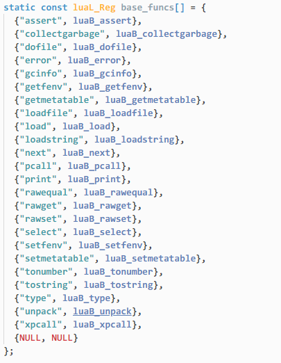    
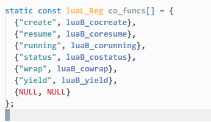    

关键代码
```c
//返回sizes（lauxlib.c)
static int libsize (const luaL_Reg *l) {
  int size = 0;
  for (; l->name; l++) size++;
  return size;
}

// 查找或者创建表 （lauxlib.c） 递归创建表 
LUALIB_API const char *luaL_findtable (lua_State *L, int idx,
                                       const char *fname, int szhint) {
  const char *e;
  lua_pushvalue(L, idx);    //栈顶为idx对于的值(top+1)
  do {
    e = strchr(fname, '.');
    if (e == NULL) e = fname + strlen(fname);
    lua_pushlstring(L, fname, e - fname);     //栈顶设置字符串 top为字符串（top+1）
    lua_rawget(L, -2);                        //获取(*idx)[fname_sub] top为content             
    if (lua_isnil(L, -1)) {  /* no such field? */       //不存在
      lua_pop(L, 1);  /* remove this nil */             //移除content(null) (top-1)
      lua_createtable(L, 0, (*e == '.' ? 1 : szhint)); /* new table for field */ //创建table,top为table(top+1)
      lua_pushlstring(L, fname, e - fname);             //设置fnamesub,top为字符串（top+1)
      lua_pushvalue(L, -2);                             //复制table top为复制的table(top+1)
      lua_settable(L, -4);  /* set new table into field *///设置(*table)[top - 2] = [top-1] (top-2)
    }
    else if (!lua_istable(L, -1)) {  /* field has a non-table value? *///存在也不是table(这种情况有冲突)
      lua_pop(L, 2);  /* remove table and value */              //移除value 和字符串，
      return fname;  /* return problematic part of the name */  //返回名字和[*idx]
    }
    lua_remove(L, -2);  /* remove previous table */     //移除老table
    fname = e + 1;
  } while (*e == '.');
  return NULL;            //创建完毕，返回为NULL
}

//加载库的函数（lauxlib.c)
LUALIB_API void luaI_openlib (lua_State *L, const char *libname,
                              const luaL_Reg *l, int nup) {
  if (libname) {
    int size = libsize(l);    //返回sizes
    /* check whether lib already exists */
    luaL_findtable(L, LUA_REGISTRYINDEX, "_LOADED", 1); //获取或者创建registry["_LOADED"]
    lua_getfield(L, -1, libname);  /* get _LOADED[libname] *///获取registry["_LOADED"][libname]
    if (!lua_istable(L, -1)) {  /* not found? */  //如果结果不是table
      lua_pop(L, 1);  /* remove previous result */   //移除结果
      /* try global variable (and create one if it does not exist) */
      if (luaL_findtable(L, LUA_GLOBALSINDEX, libname, size) != NULL) //获取或者创建_G[libname] 如果全局表中有且不是table,则显示冲突警告
        luaL_error(L, "name conflict for module " LUA_QS, libname);
      lua_pushvalue(L, -1);   //复制新建或者已经存在的表 _G[libname]
      lua_setfield(L, -3, libname);  /* _LOADED[libname] = new table */ registry["_LOADED"][libname] = _G[libname] （top-2）
    }
    lua_remove(L, -2);  /* remove _LOADED table */  //移除_LOADED表，只留下了_G[libname] 或者 registry["_LOADED"][libname]
    lua_insert(L, -(nup+1));  /* move library table to below upvalues */ 把_G[libname]插入到nup值（闭包值，创建函数（cclosure）的时候可以设置闭包）前面
  }
  for (; l->name; l++) {
    int i;
    for (i=0; i<nup; i++)  /* copy upvalues to the top */
      lua_pushvalue(L, -nup);
    lua_pushcclosure(L, l->func, nup);  //设置cclosure(func,nups)
    lua_setfield(L, -(nup+2), l->name); //_G[libname][name] = cclosure
  }
  lua_pop(L, nup);  /* remove upvalues */ 移除闭包，栈顶为_G[libname]
}


LUALIB_API void (luaL_register) (lua_State *L, const char *libname,
                                const luaL_Reg *l) {
  luaI_openlib(L, libname, l, 0);
}

// 加载Base库和协成库
LUALIB_API int luaopen_base (lua_State *L) {
  base_open(L); //加载base函数
  luaL_register(L, LUA_COLIBNAME, co_funcs);//注册协成库
  return 2;
}

//帮助函数
static void auxopen (lua_State *L, const char *name,
                     lua_CFunction f, lua_CFunction u) {
  lua_pushcfunction(L, u);    //设置cfunc top=cfunc top+1
  lua_pushcclosure(L, f, 1);  //设置cclosure(cclosure第一个闭包值为cfunc) top为cclosure,top不增不减，只是从cfunc替换成了cclosure
  lua_setfield(L, -2, name);  //[*-2][name] = cclosure (top-1)
}

// 参数为table,index，返回table 的key ,value 
static int ipairsaux (lua_State *L) {
  int i = luaL_checkint(L, 2);
  luaL_checktype(L, 1, LUA_TTABLE);
  i++;  /* next value */
  lua_pushinteger(L, i);
  lua_rawgeti(L, 1, i);
  return (lua_isnil(L, -1)) ? 0 : 2;
}

//返回三个东西，分别是闭包函数，table,initvalue
static int luaB_ipairs (lua_State *L) {
  luaL_checktype(L, 1, LUA_TTABLE);
  lua_pushvalue(L, lua_upvalueindex(1));  /* return generator, */
  lua_pushvalue(L, 1);  /* state, */
  lua_pushinteger(L, 0);  /* and initial value */
  return 3;
}

//加载base函数
static void base_open (lua_State *L) {
  /* set global _G */
  lua_pushvalue(L, LUA_GLOBALSINDEX);//获取全局表globalTab
  lua_setglobal(L, "_G");         //globalTab["_G"] = globalTab，设置了_G即为全局表
  /* open lib into global table */
  luaL_register(L, "_G", base_funcs); //给全局表绑定base函数
  lua_pushliteral(L, LUA_VERSION);
  lua_setglobal(L, "_VERSION");  /* set global _VERSION */ //设置_G["_VERSION"] = LUA_VERSION
  /* `ipairs' and `pairs' need auxliliary functions as upvalues */
  auxopen(L, "ipairs", luaB_ipairs, ipairsaux);
  auxopen(L, "pairs", luaB_pairs, luaB_next);
  /* `newproxy' needs a weaktable as upvalue */
  lua_createtable(L, 0, 1);  /* new table `w' */
  lua_pushvalue(L, -1);  /* `w' will be its own metatable */
  lua_setmetatable(L, -2);
  lua_pushliteral(L, "kv");
  lua_setfield(L, -2, "__mode");  /* metatable(w).__mode = "kv" */
  lua_pushcclosure(L, luaB_newproxy, 1);
  lua_setglobal(L, "newproxy");  /* set global `newproxy' */
}


```

* ```assert (v [, message])```    
参数v的值为false（即nil或false）时发出错误,终止堆栈 否则，返回其所有参数。message是错误消息，默认为 assertion failed!  

```lua
print(assert(false))
print(assert(true))
print(assert(false,"assert failure"))
print(assert(true,"assert success"))
```
```cmd
D:\learn\luaSource\lua-5.1.4-2019_7_10\lua-5.1.4\build\lua.exe: .\test.lua:1: assertion failed!
stack traceback:
        [C]: in function 'assert'
        .\test.lua:1: in main chunk
        [C]: ?


D:\learn\luaSource\lua-5.1.4-2019_7_10\lua-5.1.4\build> .\lua.exe .\test.lua
true

D:\learn\luaSource\lua-5.1.4-2019_7_10\lua-5.1.4\build\lua.exe: .\test.lua:1: assert failure
stack traceback:
        [C]: in function 'assert'
        .\test.lua:1: in main chunk
        [C]: ?

D:\learn\luaSource\lua-5.1.4-2019_7_10\lua-5.1.4\build> .\lua.exe .\test.lua
true    assert success
```

* ```collectgarbage ([opt [, arg]])```    
此函数是垃圾收集器的通用接口。 它根据第一个参数opt执行不同的功能：  
1. "collect":执行完整的垃圾收集周期。 这是默认选项。
2. "stop": 停止垃圾收集器。
3. "restart": 重启垃圾收集器。
4. "count": 返回Lua使用的总内存（以KB为单位）。
5. "step": 执行垃圾收集步骤。 步骤“大小”由arg（较大的值表示更多的步骤）设置。如果步骤完成收集周期，则返回true。
6. "setpause": 将arg设置为收集器暂停的新值。 返回暂停的先前值。
7. "setstepmul": 将arg设置为收集器的步长乘数的新值，返回之前设置的值。

* ```dofile ([filename])```   
打开指定文件并将其内容作为Lua块执行。 当不带参数调用时，dofile执行标准输入（stdin）的内容。返回文件代码的返回值。 如果出现错误，dofile会将错误转发给其调用者（即dofile不会以受保护模式运行）。  
```cmd
PS D:\learn\luaSource\lua-5.1.4-2019_7_10\lua-5.1.4\build> cat .\file1.lua
print("Do file params")
PS D:\learn\luaSource\lua-5.1.4-2019_7_10\lua-5.1.4\build> cat .\test.lua
dofile("file1.lua")
PS D:\learn\luaSource\lua-5.1.4-2019_7_10\lua-5.1.4\build> .\lua.exe .\test.lua
Do file params

<!-- ctrl+z 表示输入结束 -->
PS D:\learn\luaSource\lua-5.1.4-2019_7_10\lua-5.1.4\build> .\lua.exe .\test.lua
print("wwwww")
print("eeee")
print(true,false,200)
^Z
wwwww
eeee
true    false   200
PS D:\learn\luaSource\lua-5.1.4-2019_7_10\lua-5.1.4\build>
```  

* ```error (message [, level])```  
终止最后一个被调用的受保护函数，并将消息作为错误消息返回。 error永远不会返回    
通常，erro会在message开头添加有关错误位置的一些信息。 level参数指定如何获取错误位置。 对于级别1（默认值），错误位置是调用错误函数的位置。 级别2将错误指向调用调用错误的函数的位置; 传递0级可避免向消息添加错误位置信息。

```lua
local function xx(msg,level)
    local function yy()
        local function zz()
            error(msg,level)
        end
        zz()
    end
    yy()
end
print(pcall(xx,"testlevel0",0))
print(pcall(xx,"testlevel1",1))
print(pcall(xx,"testlevel2",2))
print(pcall(xx,"testlevel3",3))
print(pcall(xx,"testlevel4",4))
```
```cmd
PS D:\learn\luaSource\lua-5.1.4-2019_7_10\lua-5.1.4\build> .\lua.exe .\test.lua
false   testlevel0
false   .\test.lua:4: testlevel1
false   .\test.lua:6: testlevel2
false   .\test.lua:8: testlevel3
false   testlevel4
```

* ```gcinfo```   
已经废弃，使用collectgarbage("count")代替  


* ```getfenv ([f])```  
环境表部分介绍

* ```getmetatable (object)```    
如果object没有metatable，则返回nil。 否则，如果对象的元表具有```__metatable```字段，则返回该字段的值。否则，返回object的元表。  

```lua
print(getmetatable("1100"))
print(getmetatable("220"))
print(getmetatable(io))
print(getmetatable(os))
local xxx = {}
local mt = {}
print(mt)
setmetatable(xxx, mt)
print(getmetatable(xxx))

local xxx2 = {}
local mt2 = {}
local mt2_mtfiled = {}
mt2["__metatable"] = mt2_mtfiled
print(mt2)
print(mt2_mtfiled)
setmetatable(xxx2, mt2)
print(getmetatable(xxx2))
```
```cmd
PS D:\learn\luaSource\lua-5.1.4-2019_7_10\lua-5.1.4\build> .\lua.exe .\test.lua
table: 00BC27B0
table: 00BC27B0
nil
nil
table: 00BC2990
table: 00BC2990
table: 00BC2670
table: 00BC26C0
table: 00BC26C0
```


* ```loadfile ([filename])```  
与load类似，但是如果没有给出文件名，则从文件filename或标准输入中获取块。

```lua
local xx = loadfile()
print(xx)
print(xx())
```

```cmd
PS D:\learn\luaSource\lua-5.1.4-2019_7_10\lua-5.1.4\build> .\lua.exe .\test.lua
print("ddd",_G)
^Z
function: 00F16510
ddd     table: 00EDB9D0
```


* ```load (func [, chunkname])```    
使用函数func加载一个块来获取它的部分。 每次调用func都必须返回一个与之前结果连接的字符串。 返回空字符串，nil或no值表示块的结尾。    
如果没有错误，则将已编译的块作为函数当做返回值返回; 否则，返回nil加上错误消息。 返回函数的环境是全局环境。  
chunkname用作错误消息和调试信息的名称。默认为“=(load)”。

* ```loadstring (string [, chunkname])```  
与load类似，但从给定的字符串中获取块。  
要加载和运行给定的字符串，请使用该惯用法  
```assert(loadstring(s))()```  
```lua
print(loadstring("return 100,200,function() return {} end")())
```
```cmd
PS D:\learn\luaSource\lua-5.1.4-2019_7_10\lua-5.1.4\build> .\lua.exe .\test.lua
100     200     function: 002B5450
```

* ```next (table [, index])```  
允许程序遍历表的所有字段。 它的第一个参数是一个表，它的第二个参数是该表中的索引。 next返回表的下一个索引及其关联值。 当使用nil作为其第二个参数调用时，next返回初始索引及其关联值。 当使用最后一个索引调用时，或者在空表中使用nil时，next返回nil。 如果第二个参数不存在，则将其解释为nil。尤其您可以使用next（t）来检查表是否为空。  
未指定索引的枚举顺序，即使对于数字索引也是如此。（要按数字顺序遍历表，请使用数字或ipairs函数。）    
如果在遍历期间将任何值分配给表中不存在的字段，则next的行为是未定义的。 但是，您可以修改现有字段。 特别是，您可以清除现有字段。  
```lua
local t = {}
t["name"] = "nameValue"
t[1] = "1value"
t[3] = "3value"
local nextKey,nextValue = next(t,nil)
print(nextKey,nextValue)
nextKey,nextValue = next(t,nextKey)
print(nextKey,nextValue)
nextKey,nextValue = next(t,nextKey)
print(nextKey,nextValue)
nextKey,nextValue = next(t,nextKey)
print(nextKey,nextValue)
```
```cmd
PS D:\learn\luaSource\lua-5.1.4-2019_7_10\lua-5.1.4\build> .\lua.exe .\test.lua
1       1value
name    nameValue
3       3value
nil     nil
```

* ```pcall (f, arg1, ···)```   
在保护模式下使用给定参数调用函数f。 这意味着f内的任何错误都不会传播; 相反，pcall捕获错误并返回状态代码。 它的第一个结果是状态代码（布尔值），如果调用成功且没有错误，则为true。 在这种情况下，pcall还会在第一个结果之后返回调用的所有结果。 如果有任何错误，pcall返回false加上错误消息。

```lua
print(pcall(function(...) 
    print(...)
    return 20,400
end,10,20))
print(pcall(function(...) 
    print(...)
    error("ddddddaaaaaa")
    return 20,400
end,"aaaa"))
```
```cmd
PS D:\learn\luaSource\lua-5.1.4-2019_7_10\lua-5.1.4\build> .\lua.exe .\test.lua
10      20
true    20      400
aaaa
false   .\test.lua:7: ddddddaaaaaa
```

* ```print (···)```   
接收任意数量的参数，并将其值打印到stdout，使用tostring函数将它们转换为字符串。 print不适用于格式化输出，但仅作为显示值的快速方法，通常用于调试。 对于格式化输出，请使用string.format。  

```lua
print("aa",10,{},print,io)
```
```cmd
PS D:\learn\luaSource\lua-5.1.4-2019_7_10\lua-5.1.4\build> .\lua.exe .\test.lua
aa      10      table: 010723A8 function: 01067F70      table: 0103F030
```

* ```rawequal (v1, v2)```   
检查v1是否等于v2，而不调用任何metamethod。 返回一个布尔值。

```lua
local a = {}
local b = {}
local function eqFunc(x,y)
    return true
end
print(a,b)
print(a == b)
local mt = {
    ["__eq"] = eqFunc
}
setmetatable(a,mt)
setmetatable(b,{
    ["__eq"] = eqFunc
})
print(a == b)
print(rawequal(a,b))
```
```cmd
PS D:\learn\luaSource\lua-5.1.4-2019_7_10\lua-5.1.4\build> .\lua.exe .\test.lua
table: 002221C8 table: 002224E8
false
true
false
```

* ```rawget (table, index)```   
获取table [index]的实际值，而不调用任何metamethod。 table必须是table; index可以是任何值。

```lua
local a = {}
local mta = {
    ["__index"] = function ( table,key )
        return "defalut value"
    end
}
setmetatable(a, mta)
print(a["aaa"])
print(rawget(a,"aaa"))
```
```cmd
PS D:\learn\luaSource\lua-5.1.4-2019_7_10\lua-5.1.4\build> .\lua.exe .\test.lua
defalut value
nil
```

* ```rawset (table, index, value)```   
将table [index]的实际值设置为value，而不调用任何metamethod。 table必须是一个表，index不能为nil，value可以为任何值。  
该函数返回表。  

```lua
local a = {}
local b = {}
local mta = {
    ["__newindex"] = function ( table,key,value )
        b[key] = value
    end
}
setmetatable(a, mta)
a[100] = "100value"
a["ddd"] = "dddvalue"
rawset(a,"ccc","cccvalue")
for k,v in pairs(a) do
    print(k,v)
end
```
```cmd
PS D:\learn\luaSource\lua-5.1.4-2019_7_10\lua-5.1.4\build> .\lua.exe .\test.lua
ccc     cccvalue
```

* ```select (index, ···)```   
如果index是数字，则返回参数编号索引后的所有参数。 否则，index必须是字符串“＃”，并且select返回它收到的额外参数的总数。

```lua
print(select("#",1,2,3,4))
print(select(2,1,2,3,4))
```
```cmd
PS D:\learn\luaSource\lua-5.1.4-2019_7_10\lua-5.1.4\build> .\lua.exe .\test.lua
4
2       3       4
```

* ```setfenv (f, table)```   
环境表部分介绍

* ```setmetatable (table, metatable)```   
设置给定表的元表。 （您无法从Lua更改其他类型的元表，只能从C更改。）如果metatable为nil，则删除给定表的metatable。 如果原始元表具有“__metatable”字段，则会引发错误。
该函数返回表

```lua
local tab = {}
local mt = {}
local mt2 = {}
print(tab,mt,mt2)
setmetatable(tab, mt)
mt["__metatable"] = true
setmetatable(tab, mt2))
```
```cmd
PS D:\learn\luaSource\lua-5.1.4-2019_7_10\lua-5.1.4\build> .\lua.exe .\test.lua
table: 00113510 table: 00113150 table: 00113290
D:\learn\luaSource\lua-5.1.4-2019_7_10\lua-5.1.4\build\lua.exe: .\test.lua:7: cannot change a protected metatable
stack traceback:
        [C]: in function 'setmetatable'
        .\test.lua:7: in main chunk
        [C]: ?
```

* ```tonumber (e [, base])```   
尝试将其参数转换为数字。 如果参数已经是数字或可转换为数字的字符串，则tonumber返回此数字; 否则，它返回零。  
可选参数指定解释数字的基础。 base 可以是2至36之间的任何整数, 表示进制  

```lua
print(tonumber("30"))
print(tonumber("0xc2c2c2",16))
print(tonumber("100",10))
print(tonumber("444",8))
print(tonumber("010101",2))
```
```cmd
PS D:\learn\luaSource\lua-5.1.4-2019_7_10\lua-5.1.4\build> .\lua.exe .\test.lua
30
12763842
100
292
21
```

* ```tostring (e)```   
接收任何类型的参数并将其转换为合理格式的字符串。 要完全控制数字的转换方式，请使用string.format。
如果e的metatable具有“__tostring”字段，则tostring以e作为参数调用相应的值，并使用调用的结果作为结果。
```lua
local tab = {}
local mt = {}
mt["__tostring"] = function(t) return "this is a table with mt" end
setmetatable(tab, mt)
print(tostring(tab))
```
```cmd
PS D:\learn\luaSource\lua-5.1.4-2019_7_10\lua-5.1.4\build> .\lua.exe .\test.lua
this is a table with mt
```

* ```type (v)```   
返回其唯一参数的类型，编码为字符串。 该函数的可能结果是“nil”（字符串，不是值nil），“number”，“string”，“boolean”，“table”，“function”，“thread”和“userdata”。


* ```unpack (list [, i [, j]])```   
返回给定表中的元素。 这个功能相当于
      return list[i], list[i+1], ···, list[j]
除了上面的代码只能写入固定数量的元素。 默认情况下，i为1，j为列表的长度，由length运算符定义

```lua
print(unpack({1,2,3,4}))
print(unpack({1,2,3,4,[8] = 20,[256] = 400}))
```
```cmd
PS D:\learn\luaSource\lua-5.1.4-2019_7_10\lua-5.1.4\build> .\lua.exe .\test.lua
1       2       3       4
1       2       3       4
```

* ```xpcall (f, err)```   
此函数类似于pcall，但您可以设置新的错误处理程序。  
xpcall在保护模式下调用函数f，使用err作为错误处理程序。 f内的任何错误都不会传播; xpcall捕获错误，使用原始错误对象调用err函数，并返回状态代码。 它的第一个结果是状态代码（布尔值），如果调用成功且没有错误，则为true。 在这种情况下，xpcall还会在第一个结果之后返回调用的所有结果。 如果有任何错误，xpcall返回false加上err的结果。

```lua
print(xpcall(function ()
    error("faluse")
end,function(...) 
    print("error catch func")
    print(...)
end))
```
```cmd
PS D:\learn\luaSource\lua-5.1.4-2019_7_10\lua-5.1.4\build> .\lua.exe .\test.lua
error catch func
.\test.lua:2: faluse
false   nil
```


* ```_VERSION```   

* ```_G```  
保存全局环境的全局变量（不是函数）（即_G._G = _G）。 Lua本身不使用这个变量; 改变其值不会影响任何环境，反之亦然。 （使用setfenv更改环境）  
```clua
print(_G)
for k,v in pairs(_G) do
    print(k,v)
end
```
```cmd
table: 012CA850
string  table: 01301F28
xpcall  function: 012FE840
package table: 012CA9E0
tostring        function: 012F7FE8
print   function: 012F7F58
os      table: 012CABC0
unpack  function: 012F8078
require function: 012FE2E8
getfenv function: 012F7AD8
setmetatable    function: 012F7FA0
next    function: 012F7418
assert  function: 012F7610
tonumber        function: 012F7E80
io      table: 012CAA80
rawequal        function: 012F8108
collectgarbage  function: 012F7460
arg     table: 01302298
getmetatable    function: 012F7730
module  function: 012FE0F0
rawset  function: 012F7D18
math    table: 01302568
debug   table: 01302338
pcall   function: 012F7F10
table   table: 012CAD50
newproxy        function: 012CD510
type    function: 012F8270
coroutine       table: 012CAAD0
_G      table: 012CA850
select  function: 012F7D60
gcinfo  function: 012F7388
pairs   function: 012CD408
rawget  function: 012F8228
loadstring      function: 012F7BF8
ipairs  function: 012CD3B0
_VERSION        Lua 5.1
dofile  function: 012F7580
setfenv function: 012F7C40
load    function: 012F7778
error   function: 012F76A0
loadfile        function: 012F7BB0
```


* ```ipairs (t)```   
返回三个值：迭代器函数，表t和0，以便构造  
for i,v in ipairs(t) do body end  
将迭代对（1，t[1]），（2，t[2]），...，直到表中不存在的第一个整数键。  
```lua
local t = {1,2,3}
local func,tab,index = ipairs(t)
print(t,func,tab,index)
print(func(tab,0))
print(func(tab,1))
print(func(tab,2))
```
```cmd
PS D:\learn\luaSource\lua-5.1.4-2019_7_10\lua-5.1.4\build> .\lua.exe .\test.lua
table: 012C6640 function: 012BE938      table: 012C6640 0
1       1
2       2
3       3
```

* ```pairs (t)```   
返回三个值：next函数，表t和nil，以便构造
for k,v in pairs(t) do body end  
将迭代表t的所有键值对。  
有关在遍历期间修改表的注意事项，请参阅下一个函数。
```lua
local xx = {
    ["key1"] = "ddd1",
    ["key2"] = "ddd2",
    ["key4"] = "ddd4"
}
local func,tab = pairs(xx)
local nextKey,nextValue = func(tab)
print(nextKey,nextValue)
nextKey,nextValue = func(tab,nextKey)
print(nextKey,nextValue)
nextKey,nextValue = func(tab,nextKey)
print(nextKey,nextValue)
nextKey,nextValue = func(tab,nextKey)
print(nextKey,nextValue)
```
```cmd
PS D:\learn\luaSource\lua-5.1.4-2019_7_10\lua-5.1.4\build> .\lua.exe .\test.lua
key1    ddd1
key4    ddd4
key2    ddd2
nil     nil
```

* ```coroutine.create (f)```   
协成部分

* ```coroutine.resume (co [, val1, ···])```   
协成部分

* ```coroutine.running ()```   
协成部分

* ```coroutine.status (co)```   
协成部分

* ```coroutine.wrap (f)```   
协成部分

* ```coroutine.yield (···)```   
协成部分


### package库
* ```module (name [, ···])```   
[参考地址](http://lua-users.org/wiki/ModulesTutorial) 创建一个module，lua5.2已经移除，不建议使用  

* ```require (modname)```  
require部分查看

* ```package.cpath```   
require用于搜索C加载程序的路径。  
Lua初始化C路径package.cpath的方式与初始化Lua路径package.path的方式相同，使用环境变量LUA_CPATH或luaconf.h中定义的默认路径。  

* ```package.loaded```  
require用来控制已加载哪些模块的表。 当您require modname且package.loaded [modname]不为false时，require只返回存储在那里的值。  

* ```package.loaders```  
require用来控制如何加载模块的表。  

* ```package.loadlib (libname, funcname)```  
动态链接程序与libname（C库）。 在这个库中，查找函数funcname并将此函数作为C函数返回。 （因此，funcname必须遵循协议（参见lua_CFunction））。

* ```package.path```  
require用于搜索Lua加载程序的路径。  
在启动时，如果未定义环境变量，Lua会使用环境变量LUA_PATH的值或使用luaconf.h中定义的默认路径初始化此变量。 任何 ”;;” 在环境变量的值中由默认路径替换。  

* ```package.preload```  
用于存储特定模块的加载器的表  

* ```package.seeall (module)```   
为module设置metatable，其__index字段引用全局环境，以便此模块从全局环境继承值。 用作module的选项。 lua5.2已经移除，不建议使用 

### 环境变量
lua中的Thread(协成),userdata,function 包含环境概念  
thread中的环境表，只能在C层访问  
userdata中的环境表，可以方便设置附带各种信息  
function的环境表，主要用于查找，赋值全局变量和创建闭包（函数）时候设置环境  

相关函数  
* ```getfenv ([f])```  
返回函数使用的当前环境。 f可以是Lua函数或指定该堆栈级别的函数的数字：Level 1是调用getfenv的函数。 如果给定函数不是Lua函数，或者f为0，则getfenv返回全局环境。 f的默认值为1。  
```lua
print(_G)
print(getfenv(print))
print(getfenv())
local function xx(...)
    myPrint(...)
end
local envTab = {["myPrint"] = print};
print(envTab)
setfenv(xx,envTab)
xx("100",20,100)
print(getfenv(xx))
```
```cmd
PS D:\learn\luaSource\lua-5.1.4-2019_7_10\lua-5.1.4\build> .\lua.exe .\test.lua
table: 0027B698
table: 0027B698
table: 0027B698
table: 002B3350
100     20      100
table: 002B3350
```

* ```setfenv (f, table)```   
设置给定函数使用的环境。 f可以是Lua函数或指定该堆栈级别的函数的数字：级别1是调用setfenv的函数。 setfenv返回给定的函数。
作为一种特殊情况，当f为0时，setfenv会改变正在运行的线程的环境。 在这种情况下，setfenv不返回任何值。

```lua
local env = {
    ["newPrint"] = print,
    ["getfenv"] = getfenv
}
print(env)
setfenv(1,env)
newPrint("dddd")
newPrint( getfenv() )
```
```cmd
PS D:\learn\luaSource\lua-5.1.4-2019_7_10\lua-5.1.4\build> .\lua.exe .\test.lua
table: 01012C68
dddd
table: 01012C68
```

```lua
local a = print     --获取全局函数
local function xxx()--定义函数
    return 10
end
xx = xxx            --全局变量赋值
```
```cmd
PS D:\learn\luaSource\lua-5.1.4-2019_7_10\lua-5.1.4\build> .\luac.exe -l -l .\test.lua

main <.\test.lua:0,0> (4 instructions, 16 bytes at 00A93F78)
0+ params, 2 slots, 0 upvalues, 2 locals, 2 constants, 1 function
        1       [1]     GETGLOBAL       0 -1    ; print
        2       [4]     CLOSURE         1 0     ; 00A37140
        3       [5]     SETGLOBAL       1 -2    ; xx
        4       [5]     RETURN          0 1
constants (2) for 00A93F78:
        1       "print"
        2       "xx"
locals (2) for 00A93F78:
        0       a       2       4
        1       xxx     3       4
upvalues (0) for 00A93F78:

function <.\test.lua:2,4> (3 instructions, 12 bytes at 00A37140)
0 params, 2 slots, 0 upvalues, 0 locals, 1 constant, 0 functions
        1       [3]     LOADK           0 -1    ; 10
        2       [3]     RETURN          0 2
        3       [4]     RETURN          0 1
constants (1) for 00A37140:
        1       10
locals (0) for 00A37140:
upvalues (0) for 00A37140:
PS D:\learn\luaSource\lua-5.1.4-2019_7_10\lua-5.1.4\build>
```
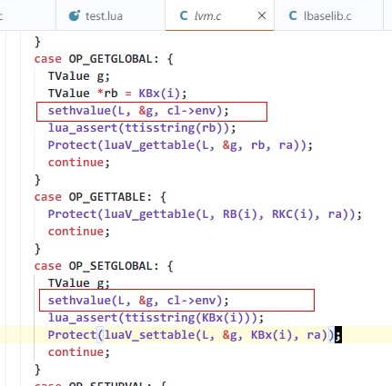  
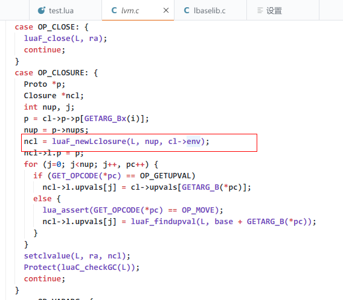  
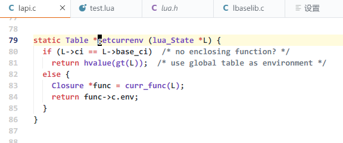  
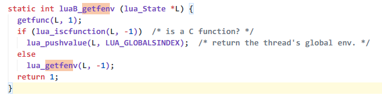  

```lua
local print = print
local setfenv = setfenv
local function printEnv(name)
    print(name,"env",env)
end
local function f1()
    local function f2()
        local function f3()
            local function f4()
                setfenv(1,{["env"] = "env1"})
                setfenv(2,{["env"] = "env2"})
                setfenv(3,{["env"] = "env3"})
                setfenv(4,{["env"] = "env4"})
                setfenv(5,{["env"] = "env5"})
                print("content")
                print("f5","env",env)
                -- printEnv("content")
            end
            f4()
            print("f4","env",env)
            -- printEnv("f4")
        end
        f3()
        print("f3","env",env)
        -- printEnv("f3")
    end
    f2()
    print("f2","env",env)
    -- printEnv("f2")
end
f1()
print("f1","env",env)
-- printEnv("f1")
```
```cmd
PS D:\learn\luaSource\lua-5.1.4-2019_7_10\lua-5.1.4\build> .\lua.exe .\test.lua
content
content env     nil
f4      env     nil
f3      env     nil
f2      env     nil
f1      env     nil
PS D:\learn\luaSource\lua-5.1.4-2019_7_10\lua-5.1.4\build> .\lua.exe .\test.lua
content
f5      env     env1
f4      env     env2
f3      env     env3
f2      env     env4
f1      env     env5
```

### 协成

* ```coroutine.resume (co [, val1, ···])```   
开始或继续执行co,co第一次调用，则为开始启动携程，参数val1,...则被当做参数传递给携程启动函数，如果co已经被yield，则该函数为恢复执行，参数被当做yield的返回值  
如果co运行没有任何错误，则该函数返回true + yield返回值，或者函数最终返回值，如果发生了错误，则resume返回false并且+错误消息
```lua
local co = coroutine.create(function(...) 
    print("start coro with argu:",...)
    local resumeValue = coroutine.yield("coro first yield value")
    print("resume coro with argu", resumeValue)
    return "coro run finish"
end)
print(coroutine.resume(co,"start from main thread"))
print(coroutine.resume(co,"resume from main thread"))
print(coroutine.resume(co,"resume from main thread2"))
```
```cmd
PS D:\learn\luaSource\lua-5.1.4-2019_7_10\lua-5.1.4\build> .\lua.exe .\test.lua
start coro with argu:   start from main thread
true    coro first yield value
resume coro with argu   resume from main thread
true    coro run finish
false   cannot resume dead coroutine
```

* ```coroutine.running ()```   
返回正在运行的协同程序，或者在主线程调用时返回nil。

* ```coroutine.status (co)```   
返回co的状态，如果coroutine正在运行,则返回running; 如果协程被暂停，或者它尚未开始运行，则返回suspended; 如果协程已激活但未运行（被另一个协程恢复），则为normal; 如果协程已经完成其功能，或者它已经因错误而停止，则返回dead。

* ```coroutine.wrap (f)```   
使用f创建一个新的协同程序。 f必须是Lua函数。 返回一个函数，每次调用它时都会恢复协同程序。 传递给函数的任何参数都表现为要恢复的额外参数。 返回第一个布尔值 + resume返回的相同值， 如果出现错误，则传播错误。
```lua
local cowrap = coroutine.wrap(function(...) 
    print("start coro with argu:",...)
    local resumeValue = coroutine.yield("coro first yield value")
    print("resume coro with argu", resumeValue)
    return "coro run finish"
end)
print(cowrap("start from main thread"))
print(cowrap("resume from main thread"))
print(cowrap("resume from main thread2"))
```
```cmd
PS D:\learn\luaSource\lua-5.1.4-2019_7_10\lua-5.1.4\build> .\lua.exe .\test.lua
start coro with argu:   start from main thread
coro first yield value
resume coro with argu   resume from main thread
coro run finish
D:\learn\luaSource\lua-5.1.4-2019_7_10\lua-5.1.4\build\lua.exe: .\test.lua:9: cannot resume dead coroutine
stack traceback:
        [C]: in function 'cowrap'
        .\test.lua:9: in main chunk
        [C]: ?
```

* ```coroutine.yield (···)```   
暂停正在运行的协程。协程不能以C函数，元方法或迭代器启动。yield的任何参数都作为结果传递以resume函数。

```lua
local function runScene(color,title)
    local scene = display.newScene()
    local layer = display.newLayer(color)
    display.runScene(scene)
    layer:addTo(scene):move(0,0)
    if title then
        local label = cc.Label:createWithSystemFont("Hello World", "Arial", 40)
        label:addTo(layer):move(display.cx, display.cy + 200)
        return scene,layer,label
    else
        return scene,layer
    end
end
local function getAddTestAct(node)
    local actions = {}
    local currentAct = 0
    local delay = 1
    node:runAction(cc.RepeatForever:create(cc.Sequence:create(
                                                cc.DelayTime:create(delay),
                                                cc.CallFunc:create(function() 
                                                    if currentAct > #actions then
                                                    else
                                                        currentAct = currentAct + 1
                                                        local tab = actions[currentAct]
                                                        if tab then
                                                            delay = tab[1]
                                                            tab[2]()
                                                        end
                                                    end
                                                end)
                                            )))
    return function (delay,action)
        if action == nil then
            action = delay
            delay = 1
        end
        actions[#actions + 1] = {delay,action}
    end
end
local function waitByNode(second,node,co)
    node:runAction(cc.Sequence:create(cc.DelayTime:create(second),cc.CallFunc:create(function (  )
        coroutine.resume(co)
    end)))
    coroutine.yield()
end
local _,layer,title = runScene(cc.c4b(255,0,0,255),"test UI Widget")
local test = ccui.Widget:create()
test:setContentSize(cc.size(100,100))
test:align(cc.p(0.5,0.5),100,100)
test:addTo(layer)
-- 异步测试（使用回调）
local function asyncTest1()
    local addAct = getAddTestAct(test)
    addAct(2,function() 
        title:setString("test Act1")
        print("test Act1")
    end)
    addAct(1,function() 
        title:setString("test Act2")
        print("test Act2")
    end)
    addAct(function() 
        title:setString("test Act3")
        print("test Act3")
    end)
end
local function asyncTest2()
    local co = nil
    co = coroutine.create(function() 
        waitByNode(2,test,co) --等待2秒
        title:setString("test Act1")
        print("test Act1")
        waitByNode(1,test,co) --等待1秒
        title:setString("test Act2")
        print("test Act2")
        waitByNode(1,test,co)
        title:setString("test Act3")
        print("test Act3")
    end)
    coroutine.resume(co)
end
-- asyncTest1()
asyncTest2()
```

### require加载
```c
//loadlib.c
static const luaL_Reg pk_funcs[] = {
  {"loadlib", ll_loadlib},
  {"seeall", ll_seeall},
  {NULL, NULL}
};

//loadlib.c
static const luaL_Reg ll_funcs[] = {
  {"module", ll_module},
  {"require", ll_require},
  {NULL, NULL}
};

static int loader_preload (lua_State *L) {
  const char *name = luaL_checkstring(L, 1);
  lua_getfield(L, LUA_ENVIRONINDEX, "preload");
  if (!lua_istable(L, -1))
    luaL_error(L, LUA_QL("package.preload") " must be a table");
  lua_getfield(L, -1, name);
  if (lua_isnil(L, -1))  /* not found? */
    lua_pushfstring(L, "\n\tno field package.preload['%s']", name);
  return 1;
}

static int loader_Lua (lua_State *L) {
  const char *filename;
  const char *name = luaL_checkstring(L, 1);
  filename = findfile(L, name, "path");
  if (filename == NULL) return 1;  /* library not found in this path */
  if (luaL_loadfile(L, filename) != 0)
    loaderror(L, filename);
  return 1;  /* library loaded successfully */
}

static int loader_C (lua_State *L) {
  const char *funcname;
  const char *name = luaL_checkstring(L, 1);
  const char *filename = findfile(L, name, "cpath");
  if (filename == NULL) return 1;  /* library not found in this path */
  funcname = mkfuncname(L, name);
  if (ll_loadfunc(L, filename, funcname) != 0)
    loaderror(L, filename);
  return 1;  /* library loaded successfully */
}

static int loader_Croot (lua_State *L) {
  const char *funcname;
  const char *filename;
  const char *name = luaL_checkstring(L, 1);
  const char *p = strchr(name, '.');
  int stat;
  if (p == NULL) return 0;  /* is root */
  lua_pushlstring(L, name, p - name);
  filename = findfile(L, lua_tostring(L, -1), "cpath");
  if (filename == NULL) return 1;  /* root not found */
  funcname = mkfuncname(L, name);
  if ((stat = ll_loadfunc(L, filename, funcname)) != 0) {
    if (stat != ERRFUNC) loaderror(L, filename);  /* real error */
    lua_pushfstring(L, "\n\tno module " LUA_QS " in file " LUA_QS,
                       name, filename);
    return 1;  /* function not found */
  }
  return 1;
}


//loadlib.c
static const lua_CFunction loaders[] =
  {loader_preload, loader_Lua, loader_C, loader_Croot, NULL};

//loadlib.c
static int gctm (lua_State *L) {
  void **lib = (void **)luaL_checkudata(L, 1, "_LOADLIB");
  if (*lib) ll_unloadlib(*lib);
  *lib = NULL;  /* mark library as closed */
  return 0;
}


//loadlib.c
LUALIB_API int luaopen_package (lua_State *L) {
  int i;
  /* create new type _LOADLIB */
  luaL_newmetatable(L, "_LOADLIB"); //获取registry["_LOADLIB"],新建userdata(ll_register中)会使用该表
  lua_pushcfunction(L, gctm);
  lua_setfield(L, -2, "__gc");    //registry["_LOADLIB"]["__gc"] = gctm
  /* create `package' table */
  luaL_register(L, LUA_LOADLIBNAME, pk_funcs);  _G["package"] = pk_funcs
#if defined(LUA_COMPAT_LOADLIB) 
  lua_getfield(L, -1, "loadlib");
  lua_setfield(L, LUA_GLOBALSINDEX, "loadlib");
#endif
  lua_pushvalue(L, -1);               //复制_G["package"]表
  lua_replace(L, LUA_ENVIRONINDEX);   //替换环境表，之后该函数内新增的函数都使用_G["package"]环境表
  /* create `loaders' table */
  lua_createtable(L, 0, sizeof(loaders)/sizeof(loaders[0]) - 1);//new_table
  /* fill it with pre-defined loaders */
  for (i=0; loaders[i] != NULL; i++) {              //new_table 新增四个加载函数loaders   
    lua_pushcfunction(L, loaders[i]);
    lua_rawseti(L, -2, i+1);
  }
  lua_setfield(L, -2, "loaders");  /* put it in field `loaders' */  //_G["package"]["loaders"] = new_table
  setpath(L, "path", LUA_PATH, LUA_PATH_DEFAULT);  /* set field `path' */ //设置_G["package"]["path"]
  setpath(L, "cpath", LUA_CPATH, LUA_CPATH_DEFAULT); /* set field `cpath' *///设置_G["package"]["cpath"]
  /* store config information */
  lua_pushliteral(L, LUA_DIRSEP "\n" LUA_PATHSEP "\n" LUA_PATH_MARK "\n"
                     LUA_EXECDIR "\n" LUA_IGMARK);
  lua_setfield(L, -2, "config");  //设置_G["package"]["config"]
  /* set field `loaded' */
  luaL_findtable(L, LUA_REGISTRYINDEX, "_LOADED", 2);//创建registry["_LOADED"] //require会使用该表
  lua_setfield(L, -2, "loaded");                    //_G["package"]["loaded"]=registry["_LOADED"]
  /* set field `preload' */
  lua_newtable(L);                                  //new_table2
  lua_setfield(L, -2, "preload");                   //设置_G["package"]["preload"]=new_table2
  lua_pushvalue(L, LUA_GLOBALSINDEX);               //复制全局表
  luaL_register(L, NULL, ll_funcs);  /* open lib into global table */_G注册require和module
  lua_pop(L, 1);
  return 1;  /* return 'package' table */
}

//loadlib.c
static int ll_require (lua_State *L) {
  const char *name = luaL_checkstring(L, 1);//获取第一个参数
  int i;
  lua_settop(L, 1);  /* _LOADED table will be at index 2 */
  lua_getfield(L, LUA_REGISTRYINDEX, "_LOADED");//获取registry["_LOADED"] == _G["package"][loaded]
  lua_getfield(L, 2, name);
  if (lua_toboolean(L, -1)) {  /* is it there? */
    if (lua_touserdata(L, -1) == sentinel)  /* check loops */
      luaL_error(L, "loop or previous error loading module " LUA_QS, name);
    return 1;  /* package is already loaded */
  }
  /* else must load it; iterate over available loaders */
  lua_getfield(L, LUA_ENVIRONINDEX, "loaders"); //获取环境表中的loaders luaopen_package中require注册了环境
  if (!lua_istable(L, -1))
    luaL_error(L, LUA_QL("package.loaders") " must be a table");
  lua_pushliteral(L, "");  /* error message accumulator */
  for (i=1; ; i++) {
    lua_rawgeti(L, -2, i);  /* get a loader */
    if (lua_isnil(L, -1))
      luaL_error(L, "module " LUA_QS " not found:%s",
                    name, lua_tostring(L, -2));
    lua_pushstring(L, name);
    lua_call(L, 1, 1);  /* call it */
    if (lua_isfunction(L, -1))  /* did it find module? */
      break;  /* module loaded successfully */
    else if (lua_isstring(L, -1))  /* loader returned error message? */
      lua_concat(L, 2);  /* accumulate it */
    else
      lua_pop(L, 1);
  }
  lua_pushlightuserdata(L, sentinel);
  lua_setfield(L, 2, name);  /* _LOADED[name] = sentinel */
  lua_pushstring(L, name);  /* pass name as argument to module */
  lua_call(L, 1, 1);  /* run loaded module */
  if (!lua_isnil(L, -1))  /* non-nil return? */
    lua_setfield(L, 2, name);  /* _LOADED[name] = returned value */
  lua_getfield(L, 2, name);
  if (lua_touserdata(L, -1) == sentinel) {   /* module did not set a value? */
    lua_pushboolean(L, 1);  /* use true as result */
    lua_pushvalue(L, -1);  /* extra copy to be returned */
    lua_setfield(L, 2, name);  /* _LOADED[name] = true */
  }
  return 1;
}
```

* ```require (modname)```    
加载给定的模块。 该函数首先查看package.loaded表以确定是否已加载modname。 如果是，则require返回存储在package.loaded [modname]中的值。 否则，它会尝试为模块找到加载程序。  
要查找加载程序，require需要在package.loaders数组中遍历查找。 通过更改此数组，我们可以更改查找模块的方式。 以下说明package.loaders的默认配置。  
首先需要查询package.preload [modname]。 如果它有一个值，那么这个值（应该是一个函数）就是加载器。 否则，需要使用package.path中存储的路径搜索Lua loader。 如果失败，它将使用package.cpath中存储的路径搜索C loader。 如果这也失败了，它会尝试一个多功能的加载器（loader_Croot）（参见package.loaders）。  
找到loader后，需要使用单个参数modname调用加载器。 如果加载器返回任何值，则需要将返回的值赋给package.loaded [modname]。 如果加载器没有返回任何值并且没有为package.loaded [modname]指定任何值，则require会为此条目指定true。 在任何情况下，require都会返回package.loaded[modname]的最终值。  
如果加载或运行模块时出现任何错误，或者无法找到模块的任何加载程序，则发出错误信号。

```lua
print("test preload")
package.preload["module_preload"] = function(...) 
    print("preload argument: ",...)
    return 200
end
package.preload["module_preload2"] = function(...) 
    print("preload2 argument: ",...)
end
local preload = require("module_preload")
print(preload)
local preload = require("module_preload2")
print(preload)
local handle = io.popen("cd")
local result = handle:read("*a")
print(result)
package.path = package.path .. ";../?.lua"
print("test Lua loader")
local lua_load = require("module_lua_load")
print(lua_load)
package.cpath = package.cpath .. ";../?.dll"
print("test C loader")
local c_load = require("module_c_load")
print(c_load)
```
```cpp
extern "C" {
#define	LUA_BUILD_AS_DLL
#define LUA_LIB
#include "lua.h"
}

extern "C" {
	LUA_API int luaopen_module_c_load(lua_State* L) {
		int n = lua_gettop(L);
		lua_getglobal(L, "print");
		lua_pushstring(L, "c loader argument:");
		for (int i = 1; i <= n; i++)
		{
			lua_pushvalue(L, n);
		}
		lua_pcall(L, n + 1, 0, 0);
		lua_pushnumber(L, 200);
		return 1;
	}
}
```
```cmd
D:\learn\luaSource\lua-5.1.4-2019_7_10\lua-5.1.4\build>.\lua.exe .\test.lua
test preload
preload argument:       module_preload
200
preload2 argument:      module_preload2
true
D:\learn\luaSource\lua-5.1.4-2019_7_10\lua-5.1.4\build

test Lua loader
lua loader argument:    module_lua_load
200
test C loader
c loader argument:      module_c_load
200
```

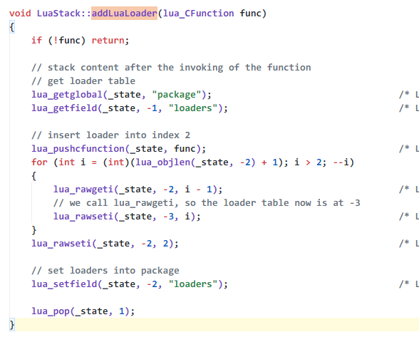  


### debug库(可以获取函数堆栈信息，设置获取闭包值，设置获取局部变量值，获取调用信息) 


## cocos2dx-lua 中的帮助函数

``` * cocos\cocos2d\bitExtend.lua ```  
简单的二进制库，包括二进制16进制转换，and，or,not,_rshift(右移)

``` * cocos\cocos2d\Cocos2d.lua ```  
基础函数，随机数获取，clampf（区间限定函数），点（point）相关函数(构造，相加，相减，缩放，取中间值，向量，。。。)  
size ,rect相关构造函数和帮助函数 c3b,c4f等颜色构造函数和帮助函数，Vertex2F、Vertex3F、tex2F、Quad3、V2F_C4B_T2F、vec3、blendFunc、mat4等gl相关的类和相关函数  

``` * cocos\cocos2d\Cocos2dConstants.lua ```  
定义了大量常量，常量应该从这里获取

``` * cocos\cocos2d\DrawPrimitives.lua ```  
定义了一些绘制图像


``` * cocos\cocos2d\functions.lua ```  
定义了一些关键方法（class,import,clone,dump）和扩展了lua自带的库

``` * cocos\cocos2d\json.lua ```  
lua实现了json

```* cocos\cocos2d\luaj.lua、luaoc.lua ```  
lua简单包装了LuaJavaBridge.callStaticMethod、LuaObjcBridge.callStaticMethod

```* cocos\cocos2d\Opengl.lua、OpenglConstants.lua ```  
包装了gl函数和定义了gl常量

```* cocos\cocos2d\ExtensionConstants.lua ```  
定义了Extension模块下的常量（CCScrollView CCTableView CCEditBox CCAssetManager 需要使用这里的常量）

```* cocos\framework\components\event.lua ```  
定义了一套事件分发

```* cocos\framework\extends\LayerEx.lua ```  
扩展了layer方法

```* cocos\framework\extends\MenuEx.lua ```  
扩展了Menu方法

```* cocos\framework\extends\NodeEx.lua ```  
扩展了Node方法

```* cocos\framework\extends\SpriteEx.lua ```  
扩展了Sprite方法

```* cocos\framework\extends\UIWidget.lua ```  
扩展了UIWidget方法

```* cocos\framework\audio.lua ```  
包装了Audio

```* cocos\framework\device.lua ```  
扩展了平台相关代码

```* cocos\framework\display.lua ```  
定义了部分UI相关功能

```* cocos\framework\transition.lua ```  
定义了动作相关功能

# UI Demo
|类名	    |说明  |
|  ----  | ---- |
|Scale9Sprite| 九宫格精灵| 
|Widget| UI控件基础类| 
|Layout| 组合其他UIView的容器类| 
|UIButton| 按钮| 
|CheckBox| 复选框| 
|HBox| 水平方向的layout（类似Android Linearlayout）| 
|VBox| 垂直方向的layout（类似Android Linearlayout）| 
|RelativeBox| 相对布局| 
|ImageView| 显示图片View| 
|ScrollView| 可以拖动或者滑动View|
|ListView| 可以滑动的列表容器| 
|LoadingBar| 进度条| 
|PageView| 多页View| 
|RadioButton| 单选按钮，多项互斥按钮需要RadioButtonGroup配合使用| 
|RichText| 富文本| 
|Slider| 可以拖动的控制器| 
|Text| 显示文本的View| 
|EditBox| 输入法编辑器 (IME)| 
|TextField| 输入法编辑器 (IME)| 
|VideoPlayer| 播放视频的View| 
|WebView| 显示网页的View| 

## Scale9Sprite 
* 九宫格图片显示view  
* 继承于Sprite  
* 支持正常九宫格贴图和灰色贴图(片段着色器不一样)  
```cpp
// v0----------------------
// |        |      |      |
// |        |      |      |
// v1-------X------+------|
// |        |      |      |
// |        |      |      |
// v2-------+------X------|
// |        |      |      |
// |        |      |      |
// v3-------------------- (1,1)  
// u0       u1     u2     u3
// 矩形为rect(u1,v1,u2-u1,v2-v1)
void Scale9Sprite::setState(Scale9Sprite::State state)
{
    ...
    case State::NORMAL:
        glState = xxx_glgetProgamName(GLProgram::SHADER_NAME_POSITION_TEXTURE_COLOR_NO_MVP, getTexture());
        break;
    case State::GRAY:
        glState = xxx_glgetProgamName(GLProgram::SHADER_NAME_POSITION_GRAYSCALE, getTexture());
}
const char* ccPositionTexture_GrayScale_frag = R"(
#ifdef GL_ES
precision mediump float;
#endif
varying vec4 v_fragmentColor;
varying vec2 v_texCoord;
void main(void)
{
    vec4 c = texture2D(CC_Texture0, v_texCoord);
     c = v_fragmentColor * c;
    gl_FragColor.xyz = vec3(0.2126*c.r + 0.7152*c.g + 0.0722*c.b);
    gl_FragColor.w = c.w;
}
)";
const char* ccPositionTextureColor_noMVP_frag = R"(
#ifdef GL_ES
precision lowp float;
#endif
varying vec4 v_fragmentColor;
varying vec2 v_texCoord;
void main()
{
    gl_FragColor = v_fragmentColor * texture2D(CC_Texture0, v_texCoord);
}
)";
```
```lua
local function test_Scale9Sprite()
    -- local ss = ccui.Scale9Sprite:create(cc.rect(14,14,2,2),"checkbox_off_background.png")
    -- ss:setContentSize(cc.size(itemHeight - 10,itemHeight - 10))
    local ss = ccui.Scale9Sprite:create("HelloWorld.png")
    if true then
        local ss2 = ccui.Scale9Sprite:create("HelloWorld.png")
        ss2:setState(1)
        ss2:addTo(ss):move(195 * 2,270 / 2)
    end
    return ss
end
```


## Widget
* UI控件基础类
* 继承于Node(ProtectedNode)并且实现了LayoutParameterProtocol协议  
* 实现了touch事件和UI常见的属性（大小，旋转变形），增加点击三种状态（normal、press、disable）
* 绘制功能为空和绘制属性无效  
```lua
local function test_Widget()
    local w = ccui.Widget:create()
    w:setContentSize(cc.size(itemHeight,itemHeight))
    w:setTouchEnabled(true)
    w:addTouchEventListener(function(ref,eventType)
        print("touch",ref,eventType)
    end)
    w:addClickEventListener(function(ref)
        print("click",ref)
    end)
    return w
end
```


```cmd
[LUA-print] touch	userdata: 0x0ea8cc00	0
[LUA-print] touch	userdata: 0x0ea8cc00	2
[LUA-print] click	userdata: 0x0ea8cc00
[LUA-print] touch	userdata: 0x0ea8cc00	0
[LUA-print] touch	userdata: 0x0ea8cc00	2
[LUA-print] click	userdata: 0x0ea8cc00
[LUA-print] touch	userdata: 0x0ea8cc00	0
[LUA-print] touch	userdata: 0x0ea8cc00	2
[LUA-print] click	userdata: 0x0ea8cc00
[LUA-print] touch	userdata: 0x0ea8cc00	0
[LUA-print] touch	userdata: 0x0ea8cc00	2
[LUA-print] click	userdata: 0x0ea8cc00
[LUA-print] touch	userdata: 0x0ea8cc00	0
[LUA-print] touch	userdata: 0x0ea8cc00	2
[LUA-print] click	userdata: 0x0ea8cc00
[LUA-print] touch	userdata: 0x0ea8cc00	0
[LUA-print] touch	userdata: 0x0ea8cc00	2
[LUA-print] click	userdata: 0x0ea8cc00
```


## Layout 
* 用于组合UI的容器基类
* 可以显示view(支持纯色，多颜色，贴图),并且可以支持重新排序子元素位置，支持裁剪
* 继承于Widget并且实现了LayoutProtocol（该协议用于确定子元素布局）  
```cpp
protected:
    LayerColor* _colorRender;
    LayerGradient* _gradientRender;
    Scale9Sprite* _backGroundImage;
```
```lua
local function test_Layout()
    local ly = ccui.Layout:create()
    ly:setContentSize(cc.size(display.width / 2,itemHeight))
    ly:setBackGroundColor(cc.c3b(255,255,0))
    ly:setBackGroundColorType(ccui.LayoutBackGroundColorType.solid)
    ly:setAnchorPoint(cc.p(0,0))
    return ly
end
```


## Button  
* 用作按钮
* 继承于 Widget
* 通过三个scale9Sprite（不同状态显示）实现贴图和一个title实现按钮文字     
```cpp
    //三个函数实现button显示状态和贴图个动画
public:
    virtual void onPressStateChangedToNormal() override;
    virtual void onPressStateChangedToPressed() override;
    virtual void onPressStateChangedToDisabled() override;
protected:
    Scale9Sprite* _buttonNormalRenderer;
    Scale9Sprite* _buttonClickedRenderer;
    Scale9Sprite* _buttonDisabledRenderer;
    Label* _titleRenderer;
```
```lua
local function test_UIButton()
    local btn = ccui.Button:create("HelloWorld.png")
    return btn
end
```


## AbstractCheckButton 抽象复选框类
* 继承于 Widget
* 用于RadioButon checkBox 和tabControl基类
```cpp
    //三个函数实现显示状态和缩放
public:
    virtual void onPressStateChangedToNormal() override;
    virtual void onPressStateChangedToPressed() override;
    virtual void onPressStateChangedToDisabled() override;
protected:
    //三个背景贴图和两个十字架（选中提示）状态贴图
    Sprite* _backGroundBoxRenderer;
    Sprite* _backGroundSelectedBoxRenderer;
    Sprite* _backGroundBoxDisabledRenderer;
    Sprite* _frontCrossRenderer;
    Sprite* _frontCrossDisabledRenderer;
```

## CheckBox
* 用作复选框
* 实现了 AbstractCheckButton
* 增加了选中和取消选中的事件回调
```cpp
typedef std::function<void(Ref*,CheckBox::EventType)> ccCheckBoxCallback;
void addEventListener(const ccCheckBoxCallback& callback)
```
```lua
local function test_checkBox()
    local cb = ccui.CheckBox:create("checkbox_off_background.png","checkbox_on_background.png")
    cb:addEventListener(function(ref,eventType)
        print(ref,eventType)
    end)
    return cb
end
```

```cmd
[LUA-print] userdata: 0x0f451440	0
[LUA-print] userdata: 0x0f451440	1
[LUA-print] userdata: 0x0f451440	0
[LUA-print] userdata: 0x0f451440	1
[LUA-print] userdata: 0x0f451440	0
[LUA-print] userdata: 0x0f451440	1
[LUA-print] userdata: 0x0f451440	0
[LUA-print] userdata: 0x0f451440	1
```


## HBox(水平)/VBox(垂直)
* 继承于Layout
* 特定方向的线性布局
```lua
local function test_HBox()
    local hb = ccui.HBox:create(cc.size(display.width / 2,itemHeight))
    hb:setAnchorPoint(cc.p(0,0))
    if true then
        local btn = ccui.Button:create("checkbox_on_background.png")
        btn:addTo(hb)
    end
    if true then
        local btn = ccui.Button:create("checkbox_on_background.png")
        btn:addTo(hb)
    end
    if true then
        local btn = ccui.Button:create("checkbox_off_background.png")
        btn:addTo(hb)
    end
    return hb
end
local function test_VBox()
    local vb = ccui.VBox:create(cc.size(display.width / 2,itemHeight))
    vb:setAnchorPoint(cc.p(0,0))
    if true then
        local btn = ccui.Button:create("checkbox_on_background.png")
        btn:addTo(vb)
    end
    if true then
        local btn = ccui.Button:create("checkbox_on_background.png")
        btn:addTo(vb)
    end
    if true then
        local btn = ccui.Button:create("checkbox_off_background.png")
        btn:addTo(vb)
    end
    return vb
end
```
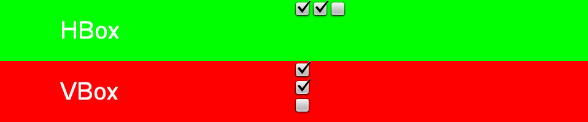


## RelativeBox 
* 继承于Layout
* 按照相对布局显示的view  
```lua
local function test_RelativeBox()
    local rl = ccui.RelativeBox:create()
    rl:setContentSize(cc.size(display.width / 2,itemHeight))

    local iv = ccui.ImageView:create("checkbox_off_background.png")
    iv:addTo(rl)
    local lp = iv:getLayoutParameter()
    lp:setAlign(ccui.RelativeAlign.alignParentLeftBottom)

    if true then
        local iv = ccui.ImageView:create("checkbox_off_background.png")
        iv:addTo(rl)
        local lp = iv:getLayoutParameter()
        lp:setAlign(ccui.RelativeAlign.alignParentTopRight)
    end
    return rl
end
```


## ImageView 
* 用于显示图片(注意和Scale9Sprite的区别) ，也支持九宫格显示 
* 继承于widget 并且实现了BlendProtocol（半透明结点挂载半透明元素需要该协议确定如何显示）
```cpp
protected:
    Scale9Sprite* _imageRenderer
```
```lua
local function test_ImageView()
    local iv = ccui.ImageView:create("HelloWorld.png")
    return iv
end
```


## ScrollView 
* 显示可以滑动的view  
* 继承于Layout，实现了滑动相关功能（方向，回弹，滚动条,滑动回调函数）
* 通过内部 _innerContainer 实现偏移
* 必须条件：contentSize,innerContainerSize
```cpp
public:
    enum class EventType
    {
        SCROLL_TO_TOP,
        SCROLL_TO_BOTTOM,
        SCROLL_TO_LEFT,
        SCROLL_TO_RIGHT,
        SCROLLING,
        BOUNCE_TOP,
        BOUNCE_BOTTOM,
        BOUNCE_LEFT,
        BOUNCE_RIGHT,
        CONTAINER_MOVED,
		SCROLLING_BEGAN,
		SCROLLING_ENDED,
        AUTOSCROLL_ENDED
    };
    typedef std::function<void(Ref*, EventType)> ccScrollViewCallback;
    virtual void addEventListener(const ccScrollViewCallback& callback);
protected:
    Layout* _innerContainer;
```
```lua
local function test_ScrollView()
    local sv = ccui.ScrollView:create()
    sv:setContentSize(cc.size(display.width / 2,itemHeight))
    sv:setDirection(ccui.ScrollViewDir.horizontal)
    sv:setInnerContainerSize(cc.size(display.width,itemHeight))
    sv:setScrollBarEnabled(false)
    sv:setBounceEnabled(true)
    sv:addEventListener(function(ref,eventType) 
        print(ref,eventType)
    end)
    for i=1,10 do
        local ss = ccui.Scale9Sprite:create(cc.rect(14,14,2,2),"checkbox_off_background.png")
        ss:setContentSize(cc.size(itemHeight - 10,itemHeight - 10))
        ss:move(display.width / 10 * i,itemHeight / 2)
        sv:addChild(ss)
    end
    return sv
end
```

```cmd
[LUA-print] userdata: 0x0f430618	7
[LUA-print] userdata: 0x0f430618	9
[LUA-print] userdata: 0x0f430618	10
[LUA-print] userdata: 0x0f430618	4
[LUA-print] userdata: 0x0f430618	2
[LUA-print] userdata: 0x0f430618	7
[LUA-print] userdata: 0x0f430618	9
[LUA-print] userdata: 0x0f430618	4
[LUA-print] userdata: 0x0f430618	7
[LUA-print] userdata: 0x0f430618	9
...
[LUA-print] userdata: 0x0f430618	7
[LUA-print] userdata: 0x0f430618	9
[LUA-print] userdata: 0x0f430618	7
[LUA-print] userdata: 0x0f430618	9
[LUA-print] userdata: 0x0f430618	12
[LUA-print] userdata: 0x0f430618	9
```

## ListView
* 按照列表样式显示的View
* 继承于ScrollView,实现了listView相关的功能（添加获取移除item，设置Margin、padding）
* listView回调(为是否选中或者取消选中某项，如果子元素没有处理点击事件，则不会受到回调)

[what_is_margin_and_padding](https://www.htmldog.com/guides/css/beginner/margins/)   
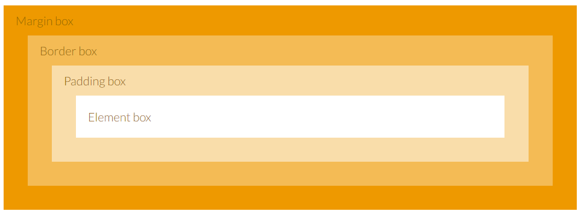   
```cpp
public:
    /**
     * ListView element item click event.
     */
    enum class EventType
    {
        ON_SELECTED_ITEM_START,
        ON_SELECTED_ITEM_END
    };
    typedef std::function<void(Ref*, EventType)> ccListViewCallback;
    void addEventListener(const ccListViewCallback& callback);
protected:
    Vector<Widget*> _items
```
```lua
local function test_ListView()
    local lv = ccui.ListView:create()
    lv:setDirection(ccui.ScrollViewDir.horizontal)
    lv:setContentSize(cc.size(display.width / 2,itemHeight))
    lv:setScrollBarEnabled(false)
    lv:setBounceEnabled(true)
    lv:addEventListener(function(ref,eventType) 
        print(ref,eventType)
    end)
    for i=1,20 do
        local btn = ccui.Button:create("checkbox_off_background.png")
        lv:pushBackCustomItem(btn)
    end
    return lv
end
```

```cmd
[LUA-print] userdata: 0x0f683600	0
[LUA-print] userdata: 0x0f683600	1
[LUA-print] userdata: 0x0f683600	0
[LUA-print] userdata: 0x0f683600	1
[LUA-print] userdata: 0x0f683600	0
[LUA-print] userdata: 0x0f683600	1
[LUA-print] userdata: 0x0f683600	0
```


## LoadingBar
* 按照进度样式显示的View
* 继承于Widget

```cpp
public:
    //Percent value from 1 to 100.
    void setPercent(float percent);
    float getPercent() const;
private:
    Scale9Sprite* _barRenderer;
```
```lua
local function test_LoadingBar()
    local lb = ccui.LoadingBar:create("HelloWorld.png")
    lb:setDirection(ccui.LoadingBarDirection.LEFT)
    local ang = 90
    lb:runAction(cc.RepeatForever:create(
                    cc.Sequence:create(
                        cc.DelayTime:create(0.1),
                        cc.CallFunc:create(function() 
                            lb:setPercent(math.abs( 100 * math.sin(math.rad(ang)) ))
                            ang = ang + 5
                        end)
                    )
                ))
    return lb
end
```


## PageView
* 按照翻页样式显示的View
* 继承于ListView，实现了翻页行为（添加获取移除页面）和回调

```cpp
public:
    enum class EventType
    {
        TURNING
    };
    typedef std::function<void(Ref*, EventType)> ccPageViewCallback;
    void addEventListener(const ccPageViewCallback& callback);
protected:
    PageViewIndicator* _indicator;
    ssize_t _currentPageIndex 
```
```lua
local function test_PageView()
    local pv = ccui.PageView:create()
    pv:setDirection(ccui.ScrollViewDir.vertical)
    local ivsize = ccui.ImageView:create("sliderThumb.png")
    local size = ivsize:getContentSize()
    pv:setContentSize(size)
    pv:addEventListener(function(ref,eventType) 
        print(ref,eventType,pv:getCurrentPageIndex())
    end)
    for i=1,3 do
        local iv = ccui.ImageView:create("sliderThumb.png")
        pv:addPage(iv)
    end
    pv:setAnchorPoint(cc.p(0,0))
    return pv
end
```

```cmd
[LUA-print] userdata: 0x0f5ae1b0	0	1
[LUA-print] userdata: 0x0f5ae1b0	0	2
[LUA-print] userdata: 0x0f5ae1b0	0	1
[LUA-print] userdata: 0x0f5ae1b0	0	0
```


## RadioButton RadioButtonGroup 
* 单选按钮  
* RadioButtonGroup 继承于 Widget
* RadioButton 继承于 AbstractCheckButton

```cpp
//RadioButton
public:
    enum class EventType
    {
        SELECTED,
        UNSELECTED
    };
    typedef std::function<void(RadioButton* radioButton, EventType)> ccRadioButtonCallback;
    void addEventListener(const ccRadioButtonCallback& callback);
private:
    RadioButtonGroup* _group;

//RadioButtonGroup
public:
    enum class EventType
    {
        SELECT_CHANGED,
    };
    typedef std::function<void(RadioButton* radioButton, int index, EventType)> ccRadioButtonGroupCallback;
    void addEventListener(const ccRadioButtonGroupCallback& callback);
private:
    Vector<RadioButton*> _radioButtons;
```
```lua
local function test_RadioButtonGroup()
    local group = ccui.RadioButtonGroup:create()
    group:setContentSize(cc.size(display.width / 2,itemHeight))
    for i=1,3 do
        local rb = ccui.RadioButton:create("checkbox_off_background.png","checkbox_on_background.png")
        rb:addEventListener(function(ref,event) 
            print("click RadioButton",i,ref,event)
        end)
        rb:addTo(group):move(50 + i * 50,itemHeight / 2)
        group:addRadioButton(rb)
    end
    group:addEventListener(function(radioButton,clickIndex,event) 
        print("click RadioButtonGroup",radioButton,clickIndex,event)
    end)
    return group
end
```
  
```cmd
[LUA-print] click RadioButton	2	userdata: 0x0e9481d8	0
[LUA-print] click RadioButton	1	userdata: 0x0eaf0308	1
[LUA-print] click RadioButtonGroup	userdata: 0x0e9481d8	1	0
[LUA-print] click RadioButton	3	userdata: 0x0e948238	0
[LUA-print] click RadioButton	2	userdata: 0x0e9481d8	1
[LUA-print] click RadioButtonGroup	userdata: 0x0e948238	2	0
[LUA-print] click RadioButton	1	userdata: 0x0eaf0308	0
[LUA-print] click RadioButton	3	userdata: 0x0e948238	1
[LUA-print] click RadioButtonGroup	userdata: 0x0eaf0308	0	0
[LUA-print] click RadioButton	2	userdata: 0x0e9481d8	0
[LUA-print] click RadioButton	1	userdata: 0x0eaf0308	1
[LUA-print] click RadioButtonGroup	userdata: 0x0e9481d8	1	0
[LUA-print] click RadioButton	3	userdata: 0x0e948238	0
[LUA-print] click RadioButton	2	userdata: 0x0e9481d8	1
[LUA-print] click RadioButtonGroup	userdata: 0x0e948238	2	0
[LUA-print] click RadioButton	2	userdata: 0x0e9481d8	0
[LUA-print] click RadioButton	3	userdata: 0x0e948238	1
[LUA-print] click RadioButtonGroup	userdata: 0x0e9481d8	1	0
```


## RichText 
* 富文本view  
* 继承于Widget，实现了富文本功能  
```cpp
public:
    void formatText();
private:
    Vector<RichElement*> _richElements;
```
```lua
local function test_RichText()
    local rt = ccui.RichText:create()
    if true then
        local ele = ccui.RichElementText:create(10,cc.c3b(255,255,120),255,"RichElementText","",16)
        rt:pushBackElement(ele)
    end
    if true then
        local ele = ccui.RichElementImage:create(10,cc.c3b(255,255,120),255,"checkbox_off_background.png")
        rt:pushBackElement(ele)
    end
    if true then
        local customNode = display.newLayer(cc.c4b(122,122,0,255),cc.size(display.width / 8,itemHeight))
        local ele = ccui.RichElementCustomNode:create(10,cc.c3b(255,255,120),255,customNode)
        rt:pushBackElement(ele)
    end
    rt:formatText()
    return rt
end
```


## Slider 
* 可以拖动的控制器view  
* 继承于 Widget 
```cpp
public:
    enum class EventType
    {
        ON_PERCENTAGE_CHANGED,
        ON_SLIDEBALL_DOWN,
        ON_SLIDEBALL_UP,
        ON_SLIDEBALL_CANCEL
    };
    typedef std::function<void(Ref*,EventType)> ccSliderCallback;
    //Percent value from 1 to 100.
    void setPercent(int percent);
    void setMaxPercent(int percent);
    void addEventListener(const ccSliderCallback& callback);
protected:
    Scale9Sprite*  _barRenderer;
    Scale9Sprite* _progressBarRenderer;
    Sprite* _slidBallNormalRenderer;
    Sprite* _slidBallPressedRenderer;
    Sprite* _slidBallDisabledRenderer;

```
```lua
local function test_Slider()
    local s = ccui.Slider:create("sliderProgress.png","sliderThumb.png")
    s:setPercent(20)
    s:addEventListener(function(ref,event) 
        print(s:getPercent(),ref,event) 
    end)
    return s
end
```


```cmd
[LUA-print] 18	userdata: 0x0f160ea0	0
[LUA-print] 18	userdata: 0x0f160ea0	1
[LUA-print] 17	userdata: 0x0f160ea0	0
[LUA-print] 16	userdata: 0x0f160ea0	0
[LUA-print] 15	userdata: 0x0f160ea0	0
[LUA-print] 14	userdata: 0x0f160ea0	0
[LUA-print] 13	userdata: 0x0f160ea0	0
[LUA-print] 12	userdata: 0x0f160ea0	0
[LUA-print] 11	userdata: 0x0f160ea0	0
[LUA-print] 10	userdata: 0x0f160ea0	0
[LUA-print] 9	userdata: 0x0f160ea0	0
...
```

## Text 
* 显示文本view  
* 继承于 Widget 并且实现了混合协议
```lua
local function test_Text()
    local t = ccui.Text:create("Test","",52)
    t:setTextColor(cc.c4b(255,1,122,255))
    return t
end
```


## EditBox  TextField 
* 输入法编辑器 (IME)
* EditBox 继承于 Widget 并且实现了 IMEDelegate
```cpp
    enum class KeyboardReturnType
    {
        DEFAULT,
        DONE,
        SEND,
        SEARCH,
        GO,
        NEXT
    };
    enum class InputMode
    {
        ANY,
        EMAIL_ADDRESS,
        NUMERIC,
        PHONE_NUMBER,
        URL,
        DECIMAL,
        SINGLE_LINE,
    };
    enum class InputFlag
    {
        PASSWORD,
        SENSITIVE,
        INITIAL_CAPS_WORD,
        INITIAL_CAPS_SENTENCE,
        INITIAL_CAPS_ALL_CHARACTERS,
        LOWERCASE_ALL_CHARACTERS
    };
    void setDelegate(EditBoxDelegate* delegate);
    void registerScriptEditBoxHandler(int handler);
private:
    Scale9Sprite* _normalRenderer;
    Scale9Sprite* _pressedRenderer;
    Scale9Sprite* _disabledRenderer
```
```lua
local function test_EditBox()
    local size = cc.size(display.width / 2,itemHeight)
    local ss = ccui.Scale9Sprite:create(cc.rect(14,14,2,2),"checkbox_off_background.png")
    ss:setContentSize(size)
    local eb = ccui.EditBox:create(size,ss)
    eb:registerScriptEditBoxHandler(function(eventType) 
        print(eventType)
        if eventType == "ended" then
            print("result",eb:getText())
        end
    end)
    return eb
end

local function test_TextField()
    local size = cc.size(display.width / 2,itemHeight)
    local tf = ccui.TextField:create("plactholder","",24)
    tf:setContentSize(size)
    tf:setTouchSize(size)
    tf:addEventListener(function(ref,eventType) 
        print(ref,eventType)
    end)
    return tf
end
```


```cmd
[LUA-print] began
[LUA-print] changed
[LUA-print] changed
[LUA-print] changed
[LUA-print] changed
[LUA-print] changed
[LUA-print] ended
[LUA-print] result	wwwaa
[LUA-print] return
[LUA-print] userdata: 0x0ea99920	0
[LUA-print] userdata: 0x0ea99920	1
[LUA-print] began
```


## 自定义View
### 无限循环view
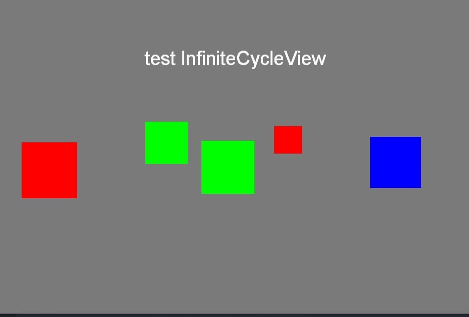  
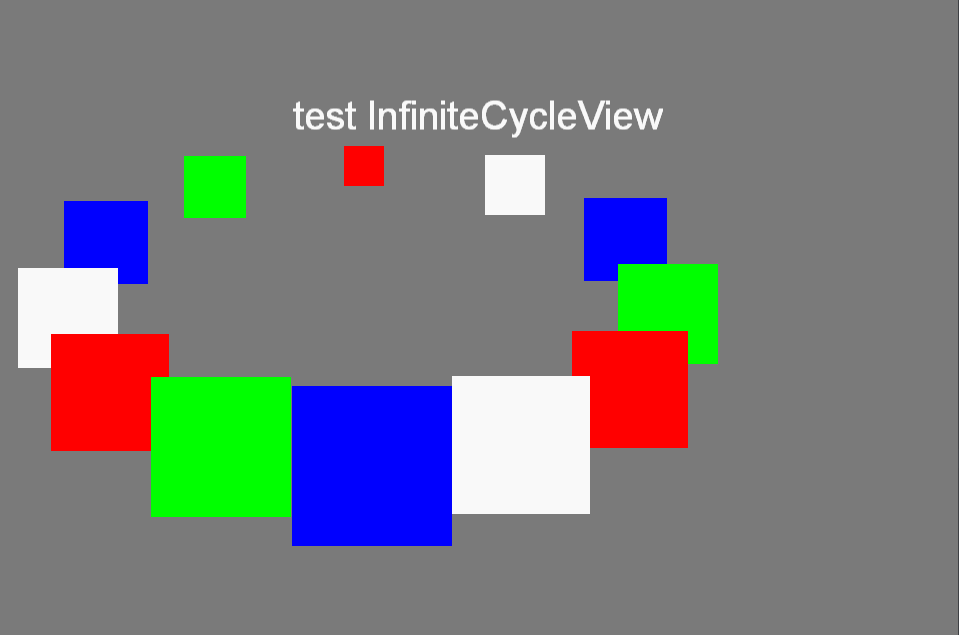  
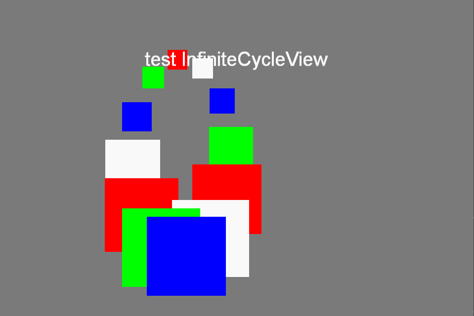  
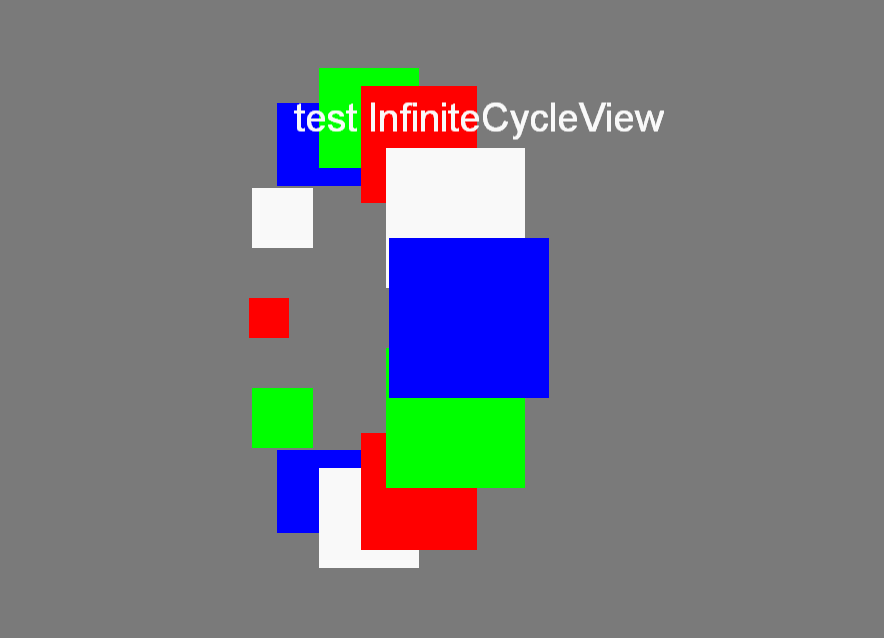  
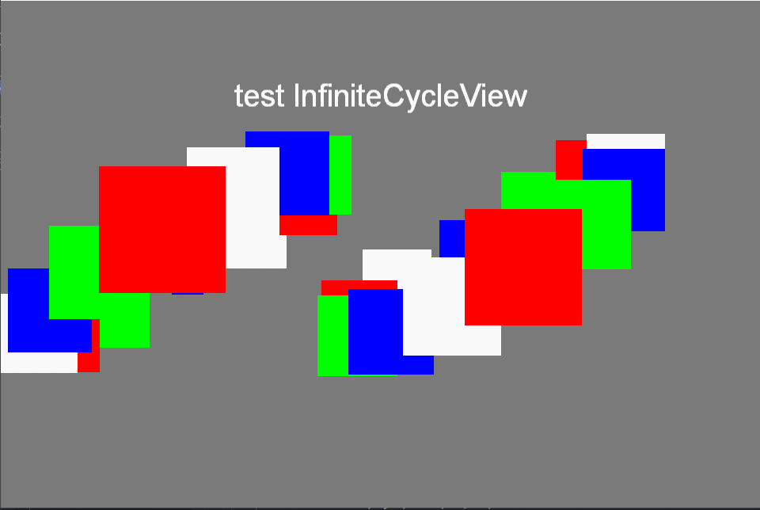  
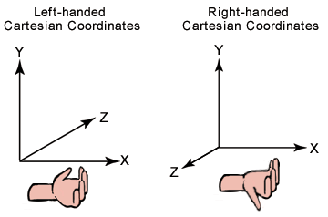  
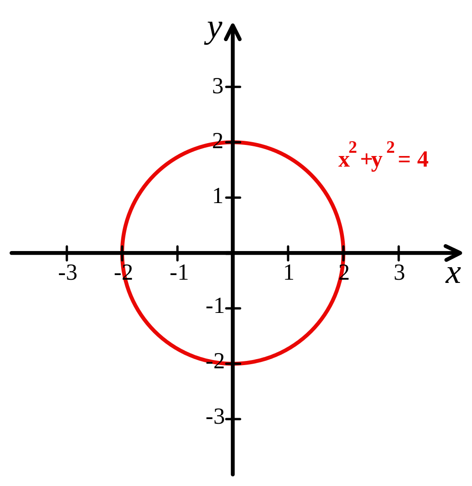  
  
  
```lua
-- customui.lua
local InfiniteCycleView = class("InfiniteCycleView",cc.Node)
local sin = math.sin
local cos = math.cos
local abs = math.abs
local acos = math.acos
local rad = math.rad
local sqrt = math.sqrt
local PI = math.pi

-- 私有方法
local function InfiniteCycleView_autoScroll(view)
    local gap = view.mMaxAngle - view.maxChildAngle
    local times = view.autoScrollTime * 60
    local angle = gap / times
    local scheduler = cc.Director:getInstance():getScheduler()
    if view.autoScrollSheduler ~= nil then
        scheduler:unscheduleScriptEntry(view.autoScrollSheduler)
    end
    view.autoScrollSheduler = scheduler:scheduleScriptFunc(function(dt) 
    	view:setOffsetProp(angle);
        view:updatePos();
        times = times - 1
        if times <= 0 then
            scheduler:unscheduleScriptEntry(view.autoScrollSheduler)
            view.autoScrollSheduler = nil
        end
    end,0,false)
end
local function InfiniteCycleView_stopAutoScroll(view)
    if view.autoScrollSheduler ~= nil then
        local scheduler = cc.Director:getInstance():getScheduler()
        scheduler:unscheduleScriptEntry(view.autoScrollSheduler)
        view.autoScrollSheduler = nil
    end
end
local function InfiniteCycleView_calcNewPos(view)
    if view.needCalcPos == false then
        return
    end
    view.needCalcPos = false
    local childNum = view:getChildrenCount()
    if childNum <= 0 then
        return
    end

    local radiamX = rad(view.mX)
    local radiamY = rad(view.mY)
    local mRadius = view.mRadius
    local height = mRadius * abs(cos(radiamX))
    local width = mRadius * abs(cos(radiamY))
    local minChildAngle = 360.0
    for index = 1,#view.childVec do
        local angle = ((view.offset + index * 360.0 / childNum)) % 360
        local child = view.childVec[index]
        local radiamAngle = rad(angle)
        local newX = mRadius * cos(radiamAngle) * cos(radiamY)
        local newY = mRadius * sin(radiamAngle) * cos(radiamX)
        local len = sqrt(newX * newX + newY * newY)
        local radiamTempAngle = acos(newX / len) * 180.0 / PI
        if newX >= 0 and newY >= 0 then
        elseif newX <= 0 and newY >= 0 then
        elseif newX <= 0 and newY <= 0 then
            radiamTempAngle = radiamTempAngle + (180 - radiamTempAngle) * 2
        else
            radiamTempAngle = 360 - radiamTempAngle
        end
        local finalAngle = (view.mZ + radiamTempAngle) % 360
        local radiamAngle2 = rad(finalAngle)
        newX = len * cos(radiamAngle2)
        newY = len * sin(radiamAngle2)
        child:setPosition(newX,newY)

        local angleGap = abs(finalAngle - view.mMaxAngle)
        local finalScale =  view.mMinScale + (view.mMaxScale - view.mMinScale) * ((cos(rad(angleGap)) + 1)/ 2.0)
        child:setScale(finalScale)
        child:setLocalZOrder(finalScale * 10000)
        if angleGap < minChildAngle then
            minChildAngle = angleGap
            view.maxChildAngle = finalAngle
            view.maxChildIndex = index
        end
    end
end

-- 公开方法
function InfiniteCycleView:ctor(...)
    self.mX = 0.0
    self.mY = 0.0
    self.mZ = 0.0
    self.mRadius = 100.0
    self.needCalcPos = false
    self.offset = 270.0
    self.maxChildIndex = 0
    self.maxChildAngle = 360.0
    self.mMaxScale = 1.0
    self.mMinScale = 1.0
    self.mMaxAngle = 0.0
    self.autoScrollTime = 0.12
    self.touchRect = cc.rect(0,0,0,0)
    self.childVec = {}
    local function onTouchBegan(touch, event)
        local touchInNodeView = self:convertTouchToNodeSpace(touch)
        if cc.rectContainsPoint(self.touchRect,touchInNodeView) then
            InfiniteCycleView_stopAutoScroll(self)
            return true
        end
        return false
    end
    local function onTouchMoved(touch, event)
        local gap = touch:getDelta()
        local len = sqrt(gap.x * gap.x + gap.y * gap.y)
        local touchAngle = acos(gap.x / len) * 180.0 / PI
        if gap.x >= 0 and gap.y >= 0 then
        elseif gap.x <= 0 and gap.y >= 0 then
        elseif gap.x <= 0 and gap.y <= 0 then
            touchAngle = touchAngle + (180 - touchAngle) * 2
        else
            touchAngle = 360 - touchAngle
        end
        local gapAngle = (touchAngle - self.mZ + 360) % 360
        local moved = len * cos(rad(gapAngle))
        if abs(moved) > self.mRadius / 100 * 1.5 then
            self:setOffsetProp(moved * 100 / self.mRadius)
            self:updatePos()
            event:stopPropagation()
        end
    end
    local function onTouchEnded(touch, event)
        InfiniteCycleView_autoScroll(self)
    end
    local function onTouchCancelled(touch, event)
        InfiniteCycleView_autoScroll(self)
    end
    --bind touch event
	local touchListener = cc.EventListenerTouchOneByOne:create()
    touchListener:registerScriptHandler(onTouchBegan,cc.Handler.EVENT_TOUCH_BEGAN )
    touchListener:registerScriptHandler(onTouchMoved,cc.Handler.EVENT_TOUCH_MOVED )
    touchListener:registerScriptHandler(onTouchEnded,cc.Handler.EVENT_TOUCH_ENDED )
    touchListener:registerScriptHandler(onTouchCancelled,cc.Handler.EVENT_TOUCH_CANCELLED )
    self:getEventDispatcher():addEventListenerWithSceneGraphPriority(touchListener, self)		
end

function InfiniteCycleView:setProp(x,y,z,radius,touch)
    self.mX = x
    self.mY = y
    self.mZ = z
    self.mRadius = radius
    self.touchRect = touch
end

function InfiniteCycleView:setOffsetProp(value)
    self.offset = self.offset + value
    if self.offset < 0 then
        self.offset = 360 - ((0 - self.offset) % 360)
    elseif self.offset > 360 then
        self.offset = self.offset % 360
    end
end

function InfiniteCycleView:setScaleProp(minScale,maxScale,maxAngle)
    if minScale < 0 or maxScale < 0  then
        return
    end
    self.mMinScale = minScale
    self.mMaxScale = maxScale
    self.mMaxAngle = maxAngle
end

function InfiniteCycleView:updatePos()
    self.needCalcPos = true
    InfiniteCycleView_calcNewPos(self)
end

function InfiniteCycleView:clearChildOrder()
    self.childVec = {}
end

function InfiniteCycleView:addChildOrder(child)
    self.childVec[#self.childVec + 1] = child
end

function InfiniteCycleView:initChildOrder()
    self.childVec = self:getChildren()
end
-- InfiniteCycleView finish

local function createTestLayer(color,title)
    local scene = display.newScene()
    local layer = display.newLayer(color)
    display.runScene(scene)
    layer:addTo(scene):move(0,0)
    local label = cc.Label:createWithSystemFont(title, "Arial", 40)
    label:addTo(layer,100):move(display.cx, display.cy + 200)
    return scene,layer,label
end


local function createInfiniteCycleView()
    local scene,layer,label = createTestLayer(cc.c4b(122,122,122,255),"test InfiniteCycleView")
    local testView = InfiniteCycleView:create()
    testView:addTo(layer):move(350,300)
    local colors = {cc.c4b(255,0,0,255),cc.c4b(0,255,0,255),cc.c4b(0,0,255,255),cc.c4b(255,255,255,255)}
    for i=1,12 do
        local lc = cc.LayerColor:create(colors[(i -1) % 4 + 1], 40, 40)
        testView:addChild(lc)
    end
    testView:initChildOrder()
    testView:setProp(60,0,0,300,cc.rect(-300,-300,600,600))
    testView:setScaleProp(1,4,270)
    testView:updatePos()
end
createInfiniteCycleView()
```


# 多媒体 Demo
## video
## webview
## audio

# local storage Demo
## xml
## sqlite

# NetWork Demo
## 短链接 
* curl 
* httpClient
## 长链接 
* luasocket
* websocket

# 创建cocos2dx lua Demo
```cmd
cocos new -p com.studycocos2dx.lua -d . -l lua MyLuaGame
```

