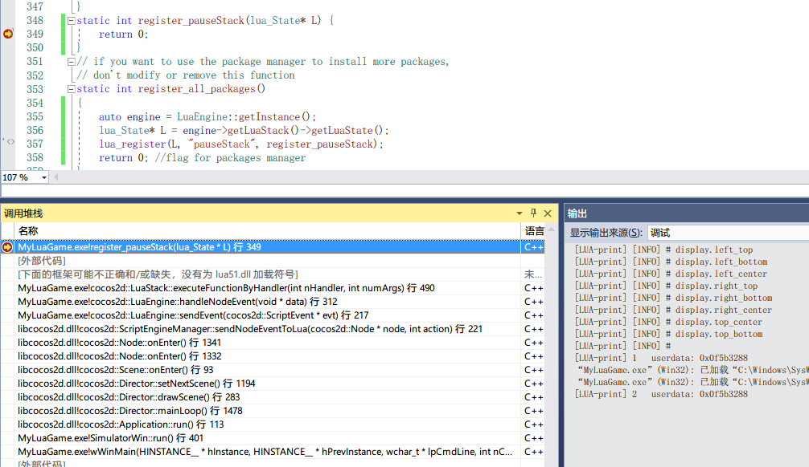

# cocos2dx关键对象
* runtime对象
* lua对象
* io对象
* application对象
* network对象
* 定时器对象
* gl对象
* ui对象

## runtime对象（3.17.2版本）
### win32部分 
```cpp
//frameworks/runtime-src/proj.win32/main.cpp
int WINAPI _tWinMain(HINSTANCE hInstance,
	HINSTANCE hPrevInstance,
	LPTSTR    lpCmdLine,
	int       nCmdShow)
{
	UNREFERENCED_PARAMETER(hPrevInstance);
	UNREFERENCED_PARAMETER(lpCmdLine);
    auto simulator = SimulatorWin::getInstance();
    return simulator->run();
}

//frameworks/runtime-src/proj.win32/SimulatorWin.cpp
SimulatorWin *SimulatorWin::getInstance()
{
    if (!_instance)
    {
        _instance = new SimulatorWin();
    }
    return _instance;
}

SimulatorWin::SimulatorWin()
    : _hwnd(NULL)
    , _hwndConsole(NULL)
    , _app(nullptr)
    , _writeDebugLogFile(nullptr)
{
}

int SimulatorWin::run()
{
    // create the application instance
    _app = new AppDelegate();

    const Rect frameRect = Rect(0, 0, frameSize.width, frameSize.height);

    initGLContextAttrs();
    auto glview = GLViewImpl::createWithRect(title.str(), frameRect, frameScale);
    
    auto director = Director::getInstance();
    director->setOpenGLView(glview);
    director->setAnimationInterval(1.0 / 60.0);

    auto app = Application::getInstance();
    return app->run();
}

//frameworks/cocos2d-x/cocos/platform/win32/CCApplication-win32.cpp
Application * Application::sm_pSharedApplication = nullptr;
Application* Application::getInstance()
{
    return sm_pSharedApplication;
}
Application::Application()
: _instance(nullptr)
, _accelTable(nullptr)
{
    sm_pSharedApplication = this;
}
Application::~Application()
{
    sm_pSharedApplication = nullptr;
}
int Application::run()
{
    initGLContextAttrs();
    // Initialize instance and cocos2d.
    if (!applicationDidFinishLaunching())
    {
        return 1;
    }
    auto director = Director::getInstance();
    auto glview = director->getOpenGLView();
    while(!glview->windowShouldClose())
    {
        if (interval >= _animationInterval.QuadPart)
        {
            director->mainLoop();
            glview->pollEvents();
        }
        else
        {
            Sleep(waitMS);
        }
    }

    // Director should still do a cleanup if the window was closed manually.
    if (glview->isOpenGLReady())
    {
        director->end();
        director->mainLoop();
        director = nullptr;
    }
    glview->release();
    return 0;
}

```
### Android部分
```java
public abstract class Cocos2dxActivity extends Activity implements Cocos2dxHelperListener {
    @Override
    protected void onCreate(final Bundle savedInstanceState) {
        super.onCreate(savedInstanceState);
        onLoadNativeLibraries();


        this.mGLSurfaceView = this.onCreateView();
        this.mGLSurfaceView.setPreserveEGLContextOnPause(true);

        // ...add to FrameLayout
        mFrameLayout.addView(this.mGLSurfaceView);

        this.mGLSurfaceView.setCocos2dxRenderer(new Cocos2dxRenderer());
    }

    protected void onLoadNativeLibraries() {
        System.loadLibrary("xxxxx");
    }
}
public class Cocos2dxRenderer implements GLSurfaceView.Renderer {
    @Override
    public void onSurfaceCreated(final GL10 GL10, final EGLConfig EGLConfig) {
        Cocos2dxRenderer.nativeInit(this.mScreenWidth, this.mScreenHeight);
    }

    @Override
    public void onSurfaceChanged(final GL10 GL10, final int width, final int height) {
        Cocos2dxRenderer.nativeOnSurfaceChanged(width, height);
    }

    @Override
    public void onDrawFrame(final GL10 gl) {
        Cocos2dxRenderer.nativeRender();
    }
}
//android-29/android/opengl/GLSurfaceView.java
public class GLSurfaceView extends SurfaceView implements SurfaceHolder.Callback2 {
    @Override
    protected void onAttachedToWindow() {
        super.onAttachedToWindow();
        if (LOG_ATTACH_DETACH) {
            Log.d(TAG, "onAttachedToWindow reattach =" + mDetached);
        }
        if (mDetached && (mRenderer != null)) {
            int renderMode = RENDERMODE_CONTINUOUSLY;
            if (mGLThread != null) {
                renderMode = mGLThread.getRenderMode();
            }
            mGLThread = new GLThread(mThisWeakRef);
            if (renderMode != RENDERMODE_CONTINUOUSLY) {
                mGLThread.setRenderMode(renderMode);
            }
            mGLThread.start();
        }
        mDetached = false;
    }
}
```
```cpp
//javaactivity-android.cpp
JNIEXPORT jint JNI_OnLoad(JavaVM *vm, void *reserved)
{
    JniHelper::setJavaVM(vm);
    cocos_android_app_init(JniHelper::getEnv());
    return JNI_VERSION_1_4;
}
JNIEXPORT void Java_org_cocos2dx_lib_Cocos2dxRenderer_nativeInit(JNIEnv*  env, jobject thiz, jint w, jint h)
{
    auto director = cocos2d::Director::getInstance();
    auto glview = director->getOpenGLView();
    if (!glview)
    {
        glview = cocos2d::GLViewImpl::create("Android app");
        glview->setFrameSize(w, h);
        director->setOpenGLView(glview);
        cocos2d::Application::getInstance()->run();
    }
}

//frameworks/runtime-src/proj.android/app/jni/helloluamain.cpp
namespace {
std::unique_ptr<AppDelegate> appDelegate;
}

void cocos_android_app_init(JNIEnv* env) {
    appDelegate.reset(new AppDelegate());
}

//Java_org_cocos2dx_lib_Cocos2dxRenderer.cpp
JNIEXPORT void JNICALL Java_org_cocos2dx_lib_Cocos2dxRenderer_nativeRender(JNIEnv* env) {
    cocos2d::Director::getInstance()->mainLoop();
}

//CCApplication-android.cpp
pplication * Application::sm_pSharedApplication = nullptr;
Application::Application()
{
    sm_pSharedApplication = this;
}
Application::~Application()
{
    sm_pSharedApplication = nullptr;
}
int Application::run()
{
    if (! applicationDidFinishLaunching())
    {
        return 0;
    }
    return -1;
}
Application* Application::getInstance()
{
    return sm_pSharedApplication;
}

```

### 跨平台部分 
```cpp
//frameworks/runtime-src/Classes/AppDelegate.h
class AppDelegate : private cocos2d::Application
{

}
void AppDelegate::initGLContextAttrs()
{
    // set OpenGL context attributes: red,green,blue,alpha,depth,stencil,multisamplesCount
    GLContextAttrs glContextAttrs = {8, 8, 8, 8, 24, 8, 0 };
    GLView::setGLContextAttrs(glContextAttrs);
}
bool AppDelegate::applicationDidFinishLaunching()
{
    // set default FPS
    Director::getInstance()->setAnimationInterval(1.0 / 60.0f);

    // register lua module
    auto engine = LuaEngine::getInstance();
    ScriptEngineManager::getInstance()->setScriptEngine(engine);
    lua_State* L = engine->getLuaStack()->getLuaState();
    if (engine->executeScriptFile("main.lua"))
    {
        return false;
    }
    return true;
}
bool Director::init()
{
    _scenesStack.reserve(15);
    _scheduler = new (std::nothrow) Scheduler();
    _actionManager = new (std::nothrow) ActionManager();
    _scheduler->scheduleUpdate(_actionManager, Scheduler::PRIORITY_SYSTEM, false);
    _eventDispatcher = new (std::nothrow) EventDispatcher();
    ...
}
void Director::mainLoop()
{
    drawScene();
    PoolManager::getInstance()->getCurrentPool()->clear(); 
}
void Director::drawScene()
{
    if (! _paused)
    {
        _scheduler->update(_deltaTime);
    }

    _renderer->clear();
    
    /* to avoid flickr, nextScene MUST be here: after tick and before draw.
     * FIXME: Which bug is this one. It seems that it can't be reproduced with v0.9
     */
    if (_nextScene)
    {
        setNextScene();
    }

    pushMatrix(MATRIX_STACK_TYPE::MATRIX_STACK_MODELVIEW);
    
    if (_runningScene)
    {
        //clear draw stats
        _renderer->clearDrawStats();
        
        //render the scene
        if(_openGLView)
            _openGLView->renderScene(_runningScene, _renderer);
    }

    // draw the notifications node
    if (_notificationNode)
    {
        _notificationNode->visit(_renderer, Mat4::IDENTITY, 0);
    }
    _renderer->render();
    popMatrix(MATRIX_STACK_TYPE::MATRIX_STACK_MODELVIEW);
    // swap buffers
    if (_openGLView)
    {
        _openGLView->swapBuffers();
    }
}
void Director::setNextScene()
{
    // If it is not a transition, call onExit/cleanup
    if (! newIsTransition)
    {
        if (_runningScene)
        {
            _runningScene->onExitTransitionDidStart();
            _runningScene->onExit();
        }
        if (_sendCleanupToScene && _runningScene)
        {
            _runningScene->cleanup();
        }
    }
    if (_runningScene)
    {
        _runningScene->release();
    }
    _runningScene = _nextScene;
    _nextScene->retain();
    _nextScene = nullptr;
    if ((! runningIsTransition) && _runningScene)
    {
        _runningScene->onEnter();
        _runningScene->onEnterTransitionDidFinish();
    }
}
void Node::addChildHelper(Node* child, int localZOrder, int tag, const std::string &name, bool setTag)
{
    if( _running )
    {
        child->onEnter();
        if (_isTransitionFinished)
        {
            child->onEnterTransitionDidFinish();
        }
    }
}
void Node::detachChild(Node *child, ssize_t childIndex, bool doCleanup)
{
    if (_running)
    {
        child->onExitTransitionDidStart();
        child->onExit();
    }
    if (doCleanup)
    {
        child->cleanup();
    }
}
void Node::cleanup()
{
#if CC_ENABLE_SCRIPT_BINDING
    if (_scriptType == kScriptTypeLua)
    {
        ScriptEngineManager::sendNodeEventToLua(this, kNodeOnCleanup);
    }
#endif // #if CC_ENABLE_SCRIPT_BINDING
    for( const auto &child: _children)
        child->cleanup();
}
```

##  ```lua``` 对象
### ```lua```实现（虚拟机实现）
#### 基本数据结构
```c
typedef union {
  GCObject *gc;
  void *p;
  lua_Number n;
  int b;
} Value;

#define TValuefields	Value value; int tt

typedef struct lua_TValue {
  TValuefields;
} TValue;

#define CommonHeader	GCObject *next; lu_byte tt; lu_byte marked

typedef struct GCheader {
  CommonHeader;
} GCheader;

union GCObject {
  GCheader gch;
  union TString ts;
  union Udata u;
  union Closure cl;
  struct Table h;
  struct Proto p;
  struct UpVal uv;
  struct lua_State th;  /* thread */
};

typedef union TString {
  L_Umaxalign dummy;  /* ensures maximum alignment for strings */
  struct {
    CommonHeader;
    lu_byte reserved;
    unsigned int hash;
    size_t len;
  } tsv;
} TString;

typedef union Udata {
  L_Umaxalign dummy;  /* ensures maximum alignment for `local' udata */
  struct {
    CommonHeader;
    struct Table *metatable;
    struct Table *env;
    size_t len;
  } uv;
} Udata;

typedef struct Proto {
  CommonHeader;
  TValue *k;  /* constants used by the function */
  Instruction *code;
  struct Proto **p;  /* functions defined inside the function */
  int *lineinfo;  /* map from opcodes to source lines */
  struct LocVar *locvars;  /* information about local variables */
  TString **upvalues;  /* upvalue names */
  TString  *source;
  int sizeupvalues;
  int sizek;  /* size of `k' */
  int sizecode;
  int sizelineinfo;
  int sizep;  /* size of `p' */
  int sizelocvars;
  int linedefined;
  int lastlinedefined;
  GCObject *gclist;
  lu_byte nups;  /* number of upvalues */
  lu_byte numparams;
  lu_byte is_vararg;
  lu_byte maxstacksize;
} Proto;

typedef struct LocVar {
  TString *varname;
  int startpc;  /* first point where variable is active */
  int endpc;    /* first point where variable is dead */
} LocVar;

typedef struct UpVal {
  CommonHeader;
  TValue *v;  /* points to stack or to its own value */
  union {
    TValue value;  /* the value (when closed) */
    struct {  /* double linked list (when open) */
      struct UpVal *prev;
      struct UpVal *next;
    } l;
  } u;
} UpVal;

#define ClosureHeader \
	CommonHeader; lu_byte isC; lu_byte nupvalues; GCObject *gclist; \
	struct Table *env

typedef struct CClosure {
  ClosureHeader;
  lua_CFunction f;
  TValue upvalue[1];
} CClosure;


typedef struct LClosure {
  ClosureHeader;
  struct Proto *p;
  UpVal *upvals[1];
} LClosure;


typedef union Closure {
  CClosure c;
  LClosure l;
} Closure;

typedef union TKey {
  struct {
    TValuefields;
    struct Node *next;  /* for chaining */
  } nk;
  TValue tvk;
} TKey;


typedef struct Node {
  TValue i_val;
  TKey i_key;
} Node;


typedef struct Table {
  CommonHeader;
  lu_byte flags;  /* 1<<p means tagmethod(p) is not present */ 
  lu_byte lsizenode;  /* log2 of size of `node' array */
  struct Table *metatable;
  TValue *array;  /* array part */
  Node *node;
  Node *lastfree;  /* any free position is before this position */
  GCObject *gclist;
  int sizearray;  /* size of `array' array */
} Table;

typedef struct stringtable {
  GCObject **hash;
  lu_int32 nuse;  /* number of elements */
  int size;
} stringtable;

typedef struct CallInfo {
  StkId base;  /* base for this function */
  StkId func;  /* function index in the stack */
  StkId	top;  /* top for this function */
  const Instruction *savedpc;
  int nresults;  /* expected number of results from this function */
  int tailcalls;  /* number of tail calls lost under this entry */
} CallInfo;

typedef struct global_State {
  stringtable strt;  /* hash table for strings */
  lua_Alloc frealloc;  /* function to reallocate memory */
  void *ud;         /* auxiliary data to `frealloc' */
  lu_byte currentwhite;
  lu_byte gcstate;  /* state of garbage collector */
  int sweepstrgc;  /* position of sweep in `strt' */
  GCObject *rootgc;  /* list of all collectable objects */
  GCObject **sweepgc;  /* position of sweep in `rootgc' */
  GCObject *gray;  /* list of gray objects */
  GCObject *grayagain;  /* list of objects to be traversed atomically */
  GCObject *weak;  /* list of weak tables (to be cleared) */
  GCObject *tmudata;  /* last element of list of userdata to be GC */
  Mbuffer buff;  /* temporary buffer for string concatentation */
  lu_mem GCthreshold;
  lu_mem totalbytes;  /* number of bytes currently allocated */
  lu_mem estimate;  /* an estimate of number of bytes actually in use */
  lu_mem gcdept;  /* how much GC is `behind schedule' */
  int gcpause;  /* size of pause between successive GCs */
  int gcstepmul;  /* GC `granularity' */
  lua_CFunction panic;  /* to be called in unprotected errors */
  TValue l_registry;
  struct lua_State *mainthread;
  UpVal uvhead;  /* head of double-linked list of all open upvalues */
  struct Table *mt[NUM_TAGS];  /* metatables for basic types */
  TString *tmname[TM_N];  /* array with tag-method names */
} global_State;

struct lua_State {
  CommonHeader;
  lu_byte status;
  StkId top;  /* first free slot in the stack */
  StkId base;  /* base of current function */
  global_State *l_G;
  CallInfo *ci;  /* call info for current function */
  const Instruction *savedpc;  /* `savedpc' of current function */
  StkId stack_last;  /* last free slot in the stack */
  StkId stack;  /* stack base */
  CallInfo *end_ci;  /* points after end of ci array*/
  CallInfo *base_ci;  /* array of CallInfo's */
  int stacksize;
  int size_ci;  /* size of array `base_ci' */
  unsigned short nCcalls;  /* number of nested C calls */
  unsigned short baseCcalls;  /* nested C calls when resuming coroutine */
  lu_byte hookmask;
  lu_byte allowhook;
  int basehookcount;
  int hookcount;
  lua_Hook hook;
  TValue l_gt;  /* table of globals */
  TValue env;  /* temporary place for environments */
  GCObject *openupval;  /* list of open upvalues in this stack */
  GCObject *gclist;
  struct lua_longjmp *errorJmp;  /* current error recover point */
  ptrdiff_t errfunc;  /* current error handling function (stack index) */
};
```

#### 创建基本元素
```c

Closure *luaF_newCclosure (lua_State *L, int nelems, Table *e) {
  Closure *c = cast(Closure *, luaM_malloc(L, sizeCclosure(nelems)));
  luaC_link(L, obj2gco(c), LUA_TFUNCTION);
  c->c.isC = 1;
  c->c.env = e;
  c->c.nupvalues = cast_byte(nelems);
  return c;
}

Closure *luaF_newLclosure (lua_State *L, int nelems, Table *e) {
  Closure *c = cast(Closure *, luaM_malloc(L, sizeLclosure(nelems)));
  luaC_link(L, obj2gco(c), LUA_TFUNCTION);
  c->l.isC = 0;
  c->l.env = e;
  c->l.nupvalues = cast_byte(nelems);
  while (nelems--) c->l.upvals[nelems] = NULL;
  return c;
}


UpVal *luaF_newupval (lua_State *L) {
  UpVal *uv = luaM_new(L, UpVal);
  luaC_link(L, obj2gco(uv), LUA_TUPVAL);
  uv->v = &uv->u.value;
  setnilvalue(uv->v);
  return uv;
}

Proto *luaF_newproto (lua_State *L) {
  Proto *f = luaM_new(L, Proto);
  luaC_link(L, obj2gco(f), LUA_TPROTO);
  f->k = NULL;
  f->sizek = 0;
  f->p = NULL;
  f->sizep = 0;
  f->code = NULL;
  f->sizecode = 0;
  f->sizelineinfo = 0;
  f->sizeupvalues = 0;
  f->nups = 0;
  f->upvalues = NULL;
  f->numparams = 0;
  f->is_vararg = 0;
  f->maxstacksize = 0;
  f->lineinfo = NULL;
  f->sizelocvars = 0;
  f->locvars = NULL;
  f->linedefined = 0;
  f->lastlinedefined = 0;
  f->source = NULL;
  return f;
}

TString *luaS_newlstr (lua_State *L, const char *str, size_t l) {
  GCObject *o;
  unsigned int h = cast(unsigned int, l);  /* seed */
  size_t step = (l>>5)+1;  /* if string is too long, don't hash all its chars */
  size_t l1;
  for (l1=l; l1>=step; l1-=step)  /* compute hash */
    h = h ^ ((h<<5)+(h>>2)+cast(unsigned char, str[l1-1]));
  for (o = G(L)->strt.hash[lmod(h, G(L)->strt.size)];
       o != NULL;
       o = o->gch.next) {
    TString *ts = rawgco2ts(o);
    if (ts->tsv.len == l && (memcmp(str, getstr(ts), l) == 0)) {
      /* string may be dead */
      if (isdead(G(L), o)) changewhite(o);
      return ts;
    }
  }
  return newlstr(L, str, l, h);  /* not found */
}


Udata *luaS_newudata (lua_State *L, size_t s, Table *e) {
  Udata *u;
  if (s > MAX_SIZET - sizeof(Udata))
    luaM_toobig(L);
  u = cast(Udata *, luaM_malloc(L, s + sizeof(Udata)));
  u->uv.marked = luaC_white(G(L));  /* is not finalized */
  u->uv.tt = LUA_TUSERDATA;
  u->uv.len = s;
  u->uv.metatable = NULL;
  u->uv.env = e;
  /* chain it on udata list (after main thread) */
  u->uv.next = G(L)->mainthread->next;
  G(L)->mainthread->next = obj2gco(u);
  return u;
}

Table *luaH_new (lua_State *L, int narray, int nhash) {
  Table *t = luaM_new(L, Table);
  luaC_link(L, obj2gco(t), LUA_TTABLE);
  t->metatable = NULL;
  t->flags = cast_byte(~0);
  /* temporary values (kept only if some malloc fails) */
  t->array = NULL;
  t->sizearray = 0;
  t->lsizenode = 0;
  t->node = cast(Node *, dummynode);
  setarrayvector(L, t, narray);
  setnodevector(L, t, nhash);
  return t;
}

LUA_API lua_State *lua_newstate (lua_Alloc f, void *ud) {
  int i;
  lua_State *L;
  global_State *g;
  void *l = (*f)(ud, NULL, 0, state_size(LG));
  if (l == NULL) return NULL;
  L = tostate(l);
  g = &((LG *)L)->g;
  L->next = NULL;
  L->tt = LUA_TTHREAD;
  g->currentwhite = bit2mask(WHITE0BIT, FIXEDBIT);
  L->marked = luaC_white(g);
  set2bits(L->marked, FIXEDBIT, SFIXEDBIT);
  preinit_state(L, g);
  g->frealloc = f;
  g->ud = ud;
  g->mainthread = L;
  g->uvhead.u.l.prev = &g->uvhead;
  g->uvhead.u.l.next = &g->uvhead;
  g->GCthreshold = 0;  /* mark it as unfinished state */
  g->strt.size = 0;
  g->strt.nuse = 0;
  g->strt.hash = NULL;
  setnilvalue(registry(L));
  luaZ_initbuffer(L, &g->buff);
  g->panic = NULL;
  g->gcstate = GCSpause;
  g->rootgc = obj2gco(L);
  g->sweepstrgc = 0;
  g->sweepgc = &g->rootgc;
  g->gray = NULL;
  g->grayagain = NULL;
  g->weak = NULL;
  g->tmudata = NULL;
  g->totalbytes = sizeof(LG);
  g->gcpause = LUAI_GCPAUSE;
  g->gcstepmul = LUAI_GCMUL;
  g->gcdept = 0;
  for (i=0; i<NUM_TAGS; i++) g->mt[i] = NULL;
  if (luaD_rawrunprotected(L, f_luaopen, NULL) != 0) {
    /* memory allocation error: free partial state */
    close_state(L);
    L = NULL;
  }
  else
    luai_userstateopen(L);
  return L;
}

```
### ```cc.Ref```等对象```注册```到```lua```虚拟机     
```cpp
// 注册
bool LuaStack::init(void)
{
    _state = lua_open();
    luaL_openlibs(_state);
    toluafix_open(_state);

    // Register our version of the global "print" function
    const luaL_Reg global_functions [] = {
        {"print", lua_print},
        {"release_print",lua_release_print},
        {nullptr, nullptr}
    };
    luaL_register(_state, "_G", global_functions);

    g_luaType.clear();
    register_all_cocos2dx(_state);
}

TOLUA_API int register_all_cocos2dx(lua_State* tolua_S)
{
	tolua_open(tolua_S);
	tolua_module(tolua_S,"cc",0);
	tolua_beginmodule(tolua_S,"cc");
	    
    lua_register_cocos2dx_Ref(tolua_S);
    ...

    tolua_endmodule(tolua_S);
	return 1;
}

int lua_register_cocos2dx_Ref(lua_State* tolua_S)
{
    tolua_usertype(tolua_S,"cc.Ref");
    tolua_cclass(tolua_S,"Ref","cc.Ref","",nullptr);

    tolua_beginmodule(tolua_S,"Ref");
        tolua_function(tolua_S,"release",lua_cocos2dx_Ref_release);
        tolua_function(tolua_S,"retain",lua_cocos2dx_Ref_retain);
        tolua_function(tolua_S,"getReferenceCount",lua_cocos2dx_Ref_getReferenceCount);
    tolua_endmodule(tolua_S);
    std::string typeName = typeid(cocos2d::Ref).name();
    g_luaType[typeName] = "cc.Ref";
    g_typeCast["Ref"] = "cc.Ref";
    return 1;
}

int lua_register_cocos2dx_Node(lua_State* tolua_S)
{
    tolua_usertype(tolua_S,"cc.Node");
    tolua_cclass(tolua_S,"Node","cc.Node","cc.Ref",nullptr);

    tolua_beginmodule(tolua_S,"Node");
        tolua_function(tolua_S,"new",lua_cocos2dx_Node_constructor);
        tolua_function(tolua_S,"addChild",lua_cocos2dx_Node_addChild);
    tolua_endmodule(tolua_S);
    std::string typeName = typeid(cocos2d::Node).name();
    g_luaType[typeName] = "cc.Node";
    g_typeCast["Node"] = "cc.Node";
    return 1;
}
```
### ```cc.Ref,cc.Node``` 等 ```table``` 对象
```lua
local meta = getmetatable(cc.Ref)
dump(cc.Ref)
if meta then
    dump(meta)
end

if true then
    local meta = getmetatable(cc.Node)
    dump(cc.Node)
    if meta then
        dump(meta)
    end
end

if true then
    local meta = getmetatable(cc.Sprite)
    dump(cc.Sprite)
    if meta then
        dump(meta)
    end
end
```
```cmd
[LUA-print] dump from: [string ".\testRef.lua"]:2: in main chunk
[LUA-print] - "<var>" = {
[LUA-print] -     ".isclass" = true
[LUA-print] - }
[LUA-print] dump from: [string ".\testRef.lua"]:4: in main chunk
[LUA-print] - "<var>" = {
[LUA-print] -     ".classname"        = "cc.Ref"
[LUA-print] -     "__add"             = function: 0x0d8a70e8
[LUA-print] -     "__call"            = function: 0x0d8a1ba0
[LUA-print] -     "__div"             = function: 0x0d8a1b20
[LUA-print] -     "__eq"              = function: 0x0d8a1b80
[LUA-print] -     "__gc"              = function: 0x0d8a7228
[LUA-print] -     "__index"           = function: 0x0d8a70a8
[LUA-print] -     "__le"              = function: 0x0d8a1b60
[LUA-print] -     "__lt"              = function: 0x0d8a1b40
[LUA-print] -     "__mul"             = function: 0x0d8a1b00
[LUA-print] -     "__newindex"        = function: 0x0d8a70c8
[LUA-print] -     "__sub"             = function: 0x0d8a7070
[LUA-print] -     "getReferenceCount" = function: 0x0d8a8910
[LUA-print] -     "release"           = function: 0x0d8a8888
[LUA-print] -     "retain"            = function: 0x0d8a88c8
[LUA-print] -     "tolua_ubox" = {
[LUA-print] -         userdata: 0x001bc820 = userdata: 0x0f680578
[LUA-print] -         userdata: 0x001e88c8 = userdata: 0x0d8a6488
[LUA-print] -         userdata: 0x001eb568 = userdata: 0x0f51c5a0
[LUA-print] -         userdata: 0x0c18ac68 = userdata: 0x0f50e7d8
[LUA-print] -         userdata: 0x0c1fe288 = userdata: 0x0f50e348
[LUA-print] -     }
[LUA-print] - }
[LUA-print] dump from: [string ".\testRef.lua"]:9: in main chunk
[LUA-print] - "<var>" = {
[LUA-print] -     ".isclass" = true
[LUA-print] - }
[LUA-print] dump from: [string ".\testRef.lua"]:11: in main chunk
[LUA-print] - "<var>" = {
[LUA-print] -     ".classname"                            = "cc.Node"
[LUA-print] -     "__add"                                 = function: 0x0d8a80d0
[LUA-print] -     "__call"                                = function: 0x0d8a8178
[LUA-print] -     "__div"                                 = function: 0x0d8a8220
[LUA-print] -     "__eq"                                  = function: 0x0d8a8110
[LUA-print] -     "__gc"                                  = function: 0x0d8a7228
[LUA-print] -     "__index"                               = function: 0x0d8a8328
[LUA-print] -     "__le"                                  = function: 0x0d8a80f0
[LUA-print] -     "__lt"                                  = function: 0x0d8aaed8
[LUA-print] -     "__mul"                                 = function: 0x0d8a8200
[LUA-print] -     "__newindex"                            = function: 0x0d8a8348
[LUA-print] -     "__sub"                                 = function: 0x0d8a81e0
[LUA-print] -     "create"                                = function: 0x0d8ad390
...
[LUA-print] -     "tolua_ubox" = {
[LUA-print] -         userdata: 0x001bc820 = userdata: 0x0f680578
[LUA-print] -         userdata: 0x001e88c8 = userdata: 0x0d8a6488
[LUA-print] -         userdata: 0x001eb568 = userdata: 0x0f51c5a0
[LUA-print] -         userdata: 0x0c18ac68 = userdata: 0x0f50e7d8
[LUA-print] -         userdata: 0x0c1fe288 = userdata: 0x0f50e348
[LUA-print] -     }
[LUA-print] - }
[LUA-print] dump from: [string ".\testRef.lua"]:17: in main chunk
[LUA-print] - "<var>" = {
[LUA-print] -     ".isclass" = true
[LUA-print] - }
[LUA-print] dump from: [string ".\testRef.lua"]:19: in main chunk
[LUA-print] - "<var>" = {
[LUA-print] -     ".classname"                       = "cc.Sprite"
[LUA-print] -     "__add"                            = function: 0x0effdb90
[LUA-print] -     "__call"                           = function: 0x0effddf8
[LUA-print] -     "__div"                            = function: 0x0effdbf0
[LUA-print] -     "__eq"                             = function: 0x0effdc50
[LUA-print] -     "__gc"                             = function: 0x0d8a7228
[LUA-print] -     "__index"                          = function: 0x0effdb50
[LUA-print] -     "__le"                             = function: 0x0effdc30
[LUA-print] -     "__lt"                             = function: 0x0effdc10
[LUA-print] -     "__mul"                            = function: 0x0effdbd0
[LUA-print] -     "__newindex"                       = function: 0x0effdb70
[LUA-print] -     "__sub"                            = function: 0x0effdbb0
[LUA-print] -     "create"                           = function: 0x0f034e50
...
[LUA-print] -     "tolua_ubox" = {
[LUA-print] -         userdata: 0x001bc820 = userdata: 0x0f680578
[LUA-print] -         userdata: 0x001e88c8 = userdata: 0x0d8a6488
[LUA-print] -         userdata: 0x001eb568 = userdata: 0x0f51c5a0
[LUA-print] -         userdata: 0x0c18ac68 = userdata: 0x0f50e7d8
[LUA-print] -         userdata: 0x0c1fe288 = userdata: 0x0f50e348
[LUA-print] -     }
[LUA-print] - }
```  
### ```cc.Ref```等 ```table``` 创建的 ```userdata ```  

```lua
local debug = debug
local user = cc.Node:create()
dump(user)
dump(cc.Node)
local usetMeta = debug.getmetatable(user)
local nodeMeta = debug.getmetatable(cc.Node)
print(user,cc.Node,usetMeta,nodeMeta)
```  
```cmd
[LUA-print] dump from: [string ".\testRef.lua"]:19: in main chunk
[LUA-print] - "<var>" = userdata: 0x0e8da4a0
[LUA-print] dump from: [string ".\testRef.lua"]:20: in main chunk
[LUA-print] - "<var>" = {
[LUA-print] -     ".isclass" = true
[LUA-print] - }
[LUA-print] userdata: 0x0e8da4a0	table: 0x0d8e9ca0	table: 0x0d8e8300	table: 0x0d8e8300
```
```lua
local debug = debug
local n1 = cc.Node:create()
local meta = getmetatable(n1)
n1.aaa = 200
local env = debug.getfenv(n1)
dump(env)
print(n1.aaa)

local s1 = n1:getScheduler()
local sid1 = nil
sid1 = s1:scheduleScriptFunc(function ()
    s1:unscheduleScriptEntry(sid1)
    local env = debug.getfenv(n1)--返回了注册表
    dump(env) 
    print(n1.aaa)
end,0.1,false)

```
```cmd
[LUA-print] dump from: [string ".\testRef.lua"]:6: in main chunk
[LUA-print] - "<var>" = {
[LUA-print] -     "aaa" = 200
[LUA-print] - }
[LUA-print] 200
[LUA-print] dump from: [string ".\testRef.lua"]:14: in function <[string ".\testRef.lua"]:11>
[LUA-print] - "<var>" = {
[LUA-print] -     "CCArray" = {
[LUA-print] -         ".classname"               = "CCArray"
[LUA-print] -         ...
[LUA-print] -     }
...
[LUA-print] - }
[LUA-print] nil
```

```cpp
static int class_index_event (lua_State* L)
{
    int t = lua_type(L,1);
    if (t == LUA_TUSERDATA)
    {
        /* Access alternative table */
#ifdef LUA_VERSION_NUM /* new macro on version 5.1 */
        lua_getfenv(L,1);
        if (!lua_rawequal(L, -1, TOLUA_NOPEER)) {
            lua_pushvalue(L, 2); /* key */
            lua_gettable(L, -2); /* on lua 5.1, we trade the "tolua_peers" lookup for a gettable call */
            if (!lua_isnil(L, -1))
                return 1;
        };
#else
...
    }
}
```
### ```lua```与```native```互相调用
```lua
local newNode = cc.Node:create()
local name = newNode:getName()
newNode:enableNodeEvents()
print(1,newNode)
newNode.onEnter = function(self)
    print(2,self)
    pauseStack()
end
local scene = display.newScene()
display.runScene(scene)
newNode:addTo(scene)
```  
  
```cmd
[LUA-print] 1	userdata: 0x0f5b3288
[LUA-print] 2	userdata: 0x0f5b3288
```
```cpp
void Node::onEnter()
{
    for( const auto &child: _children)
        child->onEnter();
    if (_scriptType == kScriptTypeLua)
    {
        ScriptEngineManager::sendNodeEventToLua(this, kNodeOnEnter);
    }
}
void ScriptEngineManager::sendNodeEventToLua(Node* node, int action)
{
    auto scriptEngine = getInstance()->getScriptEngine();
    BasicScriptData data(node,(void*)&action);
    ScriptEvent scriptEvent(kNodeEvent,(void*)&data);
    scriptEngine->sendEvent(&scriptEvent);
}
int LuaEngine::sendEvent(ScriptEvent* evt)
{
    switch (evt->type)
    {
        case kNodeEvent:
            {
               return handleNodeEvent(evt->data);
            }
            break;
        ...
    }
}
int LuaEngine::handleNodeEvent(void* data)
{
    BasicScriptData* basicScriptData = (BasicScriptData*)data;
    int handler = ScriptHandlerMgr::getInstance()->getObjectHandler(basicScriptData->nativeObject, ScriptHandlerMgr::HandlerType::NODE);
    int action = *((int*)(basicScriptData->value));
    switch (action)
    {
        case kNodeOnEnter:
            _stack->pushString("enter");
            break;
    }
    int ret = _stack->executeFunctionByHandler(handler, 1);
    return ret;
}
int LuaStack::executeFunctionByHandler(int nHandler, int numArgs)
{
    int ret = 0;
    if (pushFunctionByHandler(nHandler))                               
    {
        if (numArgs > 0)
        {
            lua_insert(_state, -(numArgs + 1));                      
        }
        ret = executeFunction(numArgs);
    }
    lua_settop(_state, 0);
    return ret;
}

int LuaStack::executeFunction(int numArgs)
{
    int functionIndex = -(numArgs + 1);
    int traceback = 0;
    lua_getglobal(_state, "__G__TRACKBACK__");                      
    lua_insert(_state, functionIndex - 1);                       
    traceback = functionIndex - 1;
    int error = 0;
    error = lua_pcall(_state, numArgs, 1, traceback);                 
    return ret;
}
```

### ```自定义class``` 实现创建的 ```对象(table 或者 userdata)```
```lua
function class(classname, ...)
    local cls = {__cname = classname}

    local supers = {...}
    for _, super in ipairs(supers) do
        local superType = type(super)
        if superType == "function" then
            cls.__create = super
        elseif superType == "table" then
            if super[".isclass"] then
                -- super is native class
                cls.__create = function() return super:create() end
            else
                -- super is pure lua class
                cls.__supers = cls.__supers or {}
                cls.__supers[#cls.__supers + 1] = super
                if not cls.super then
                    -- set first super pure lua class as class.super
                    cls.super = super
                end
            end
        else
            error(string.format("class() - create class \"%s\" with invalid super type",
                        classname), 0)
        end
    end

    cls.__index = cls
    if not cls.__supers or #cls.__supers == 1 then
        setmetatable(cls, {__index = cls.super})
    else
        setmetatable(cls, {__index = function(_, key)
            local supers = cls.__supers
            for i = 1, #supers do
                local super = supers[i]
                if super[key] then return super[key] end
            end
        end})
    end

    if not cls.ctor then
        -- add default constructor
        cls.ctor = function() end
    end
    cls.new = function(...)
        local instance
        if cls.__create then
            instance = cls.__create(...)
        else
            instance = {}
        end
        setmetatableindex(instance, cls)
        instance.class = cls
        instance:ctor(...)
        return instance
    end
    cls.create = function(_, ...)
        return cls.new(...)
    end

    return cls
end
```
```lua
local AClass = class("a")
local BClass = class("b",function() return {["name"] = "b" } end)
local CClass = class("c",cc.Node)
local DClass = class("d",{["name"] = "d"})

local a = AClass:create()
local b = BClass:create()
local c = CClass:create()
local d = DClass:create()
print(a,b,c,d)
dump(a)
dump(b)
dump(c)
dump(d)
print(a,b.name,d,d.name)
```
```cmd
[LUA-print] table: 0x0ec75008	table: 0x0ebf3050	userdata: 0x0ebf3128	table: 0x0ebf01b0
[LUA-print] dump from: [string ".\testRef.lua"]:35: in main chunk
[LUA-print] - "<var>" = {
[LUA-print] -     "class" = {
[LUA-print] -         "__cname" = "a"
[LUA-print] -         "__index" = *REF*
[LUA-print] -         "create"  = function: 0x0ec64930
[LUA-print] -         "ctor"    = function: 0x0ebe7858
[LUA-print] -         "new"     = function: 0x0ec648f0
[LUA-print] -     }
[LUA-print] - }
[LUA-print] dump from: [string ".\testRef.lua"]:36: in main chunk
[LUA-print] - "<var>" = {
[LUA-print] -     "class" = {
[LUA-print] -         "__cname"  = "b"
[LUA-print] -         "__create" = function: 0x0ebe2cd0
[LUA-print] -         "__index"  = *REF*
[LUA-print] -         "create"   = function: 0x0ec8bfe0
[LUA-print] -         "ctor"     = function: 0x0ebe48a8
[LUA-print] -         "new"      = function: 0x0eccc9b8
[LUA-print] -     }
[LUA-print] -     "name"  = "b"
[LUA-print] - }
[LUA-print] dump from: [string ".\testRef.lua"]:37: in main chunk
[LUA-print] - "<var>" = userdata: 0x0ebf3128
[LUA-print] dump from: [string ".\testRef.lua"]:38: in main chunk
[LUA-print] - "<var>" = {
[LUA-print] -     "class" = {
[LUA-print] -         "__cname"  = "d"
[LUA-print] -         "__index"  = *REF*
[LUA-print] -         "__supers" = {
[LUA-print] -             1 = *MAX NESTING*
[LUA-print] -         }
[LUA-print] -         "create"   = function: 0x0ec7a9f0
[LUA-print] -         "ctor"     = function: 0x0ec8ab08
[LUA-print] -         "new"      = function: 0x0ec74f10
[LUA-print] -         "super"    = *REF*
[LUA-print] -     }
[LUA-print] - }
```

```lua
local AClass = class("AClass")
function AClass:ctor(...)
    print("AClass",...)
end
function AClass:funCom(...)
    print("AClass:funCom",...)
    self.acom = ...
end

local BClass = class("BClass",AClass)
function BClass:ctor(...)
    print("BClass",...)
    BClass.super.ctor(self,...)
end
function BClass:funCom(...)
    print("BClass:funCom",...)
    self.bcom = ...
    BClass.super.funCom(self,...)
end

local CClass = class("CClass",AClass,BClass)
function CClass:ctor(...)
    print("CClass ctor",...)
    for i=1,#CClass.__supers do
        CClass.__supers[i]["create"](self,...)
    end
end
function CClass:funCom(...)
    print("CClass:funCom",...)
    self.ccom = ...
    for i=1,#CClass.__supers do
        CClass.__supers[i]["funCom"](self,...)
    end
end
local cins = CClass:create("create param")
cins:funCom("call funcom value")
print(cins.ccom)
print(cins.bcom)
print(cins.acom)
```
```cmd
[LUA-print] CClass ctor	create param
[LUA-print] AClass	create param
[LUA-print] BClass	create param
[LUA-print] AClass	create param
[LUA-print] CClass:funCom	call funcom value
[LUA-print] AClass:funCom	call funcom value
[LUA-print] BClass:funCom	call funcom value
[LUA-print] AClass:funCom	call funcom value
[LUA-print] call funcom value
[LUA-print] call funcom value
[LUA-print] call funcom value
```


```lua
-- testRef.lua
local ComClass = class("com")
--private func and field
local function private_func(view)
    print("call private_func",view)
end
local private_filed_x = {}
function ComClass:ctor(...)
    private_func(self)
    private_filed_x[self] = "init"
    self.not_private_filed_x = {}
end
function ComClass:setX(value)
    private_filed_x[self] = value
end
function ComClass:getX(value)
    return private_filed_x[self]
end
function ComClass:printPrivate()
    print("__private",private_func,private_filed_x)
end
return ComClass

-- main.lua
local ComClass = require "testRef"
local c1 = ComClass:create()
local c2 = ComClass:create()
c1:setX(1000)
c2:setX(20000)
print(c1:getX(),c2:getX())
c1:printPrivate()

package.loaded["testRef"] = nil
collectgarbage("collect")

ComClass = require "testRef"
c1 = ComClass:create()
c2 = ComClass:create()
c1:setX(1001)
c2:setX(20002)
print(c1:getX(),c2:getX())
c1:printPrivate()
```
```cmd
[LUA-print] call private_func	table: 0x0eec2c60
[LUA-print] call private_func	table: 0x0eec68a0
[LUA-print] 1000	20000
[LUA-print] __private	function: 0x0eec6428	table: 0x0eec65d8
[LUA-print] call private_func	table: 0x0ef29468
[LUA-print] call private_func	table: 0x0ef0f2d0
[LUA-print] 1001	20002
[LUA-print] __private	function: 0x0edfd340	table: 0x0ef29278
```

```lua
local n1 = cc.Node:create()
local function success(...)
    n1:setName("success")
    n1:runAction(cc.Sequence:create(cc.DelayTime:create(1.0),cc.CallFunc:create() 
        eventDispatch:dispath("finish")
    end))
    local s1 = n1:getScheduler()
    local sid1 = nil
    sid1 = s1:scheduleScriptFunc(function ()
        s1:unscheduleScriptEntry(sid1)
        eventDispatch:dispath("finish")
    end,1.0,false)

    n1:relase()
end
local function failure(...)
    n1:setName("success")
    n1:relase()
end
n1:addTo(scene)
n1:retain()
http:request("http://www.baidu.com",success,failure)
```

## io 对象
### ```FileUtils``` 对象
* 设置搜索路径(查找文件和热更设置读取lua文件顺序有关) 获取可写路径  
* 创建或者移除目录  
* 读写文件，操作文件 

```cpp
//CCFileUtis.h
class CC_DLL FileUtils
{
public:
    static FileUtils* getInstance();
    ...
}

//CCFileUtils-win32
FileUtils* FileUtils::getInstance()
{
    if (s_sharedFileUtils == nullptr)
    {
        s_sharedFileUtils = new FileUtilsWin32();
        if(!s_sharedFileUtils->init())
        {
          delete s_sharedFileUtils;
          s_sharedFileUtils = nullptr;
          CCLOG("ERROR: Could not init CCFileUtilsWin32");
        }
    }
    return s_sharedFileUtils;
}

//CCFileUtils-android
FileUtils* FileUtils::getInstance()
{
    if (s_sharedFileUtils == nullptr)
    {
        s_sharedFileUtils = new FileUtilsAndroid();
        if (!s_sharedFileUtils->init())
        {
          delete s_sharedFileUtils;
          s_sharedFileUtils = nullptr;
          CCLOG("ERROR: Could not init CCFileUtilsAndroid");
        }
    }
    return s_sharedFileUtils;
}
```  
```lua
local tools = cc.FileUtils:getInstance()
local usetDefault = cc.UserDefault:getInstance()
local old = tools:getSearchPaths()
dump(old)
tools:addSearchPath("aaa")
tools:addSearchPath("bbbb",true)
tools:addSearchPath("cccc")
local new = tools:getSearchPaths()
dump(new)

tools:setSearchPaths({})
dump(tools:getSearchPaths())
tools:setSearchPaths(new)
dump(tools:getSearchPaths())
```
```cmd
[LUA-print] dump from: [string ".\testIO.lua"]:4: in main chunk
[LUA-print] - "<var>" = {
[LUA-print] -     1 = "C:/Users/MaxllMa/AppData/Local/MyLuaGame/debugruntime/"
[LUA-print] -     2 = "D:\studyCocos2dx\build\MyLuaGame\frameworks\runtime-src\proj.win32\..\..\..\/"
[LUA-print] -     3 = "D:\studyCocos2dx\build\MyLuaGame\frameworks\runtime-src\proj.win32\..\..\..\/"
[LUA-print] -     4 = "D:/studyCocos2dx/build/MyLuaGame/simulator/win32/"
[LUA-print] -     5 = "D:\studyCocos2dx\build\MyLuaGame\frameworks\runtime-src\proj.win32\..\..\..\/src/"
[LUA-print] -     6 = "D:\studyCocos2dx\build\MyLuaGame\frameworks\runtime-src\proj.win32\..\..\..\/res/"
[LUA-print] - }
[LUA-print] dump from: [string ".\testIO.lua"]:9: in main chunk
[LUA-print] - "<var>" = {
[LUA-print] -     1 = "D:\studyCocos2dx\build\MyLuaGame\frameworks\runtime-src\proj.win32\..\..\..\/bbbb/"
[LUA-print] -     2 = "C:/Users/MaxllMa/AppData/Local/MyLuaGame/debugruntime/"
[LUA-print] -     3 = "D:\studyCocos2dx\build\MyLuaGame\frameworks\runtime-src\proj.win32\..\..\..\/"
[LUA-print] -     4 = "D:\studyCocos2dx\build\MyLuaGame\frameworks\runtime-src\proj.win32\..\..\..\/"
[LUA-print] -     5 = "D:/studyCocos2dx/build/MyLuaGame/simulator/win32/"
[LUA-print] -     6 = "D:\studyCocos2dx\build\MyLuaGame\frameworks\runtime-src\proj.win32\..\..\..\/src/"
[LUA-print] -     7 = "D:\studyCocos2dx\build\MyLuaGame\frameworks\runtime-src\proj.win32\..\..\..\/res/"
[LUA-print] -     8 = "D:\studyCocos2dx\build\MyLuaGame\frameworks\runtime-src\proj.win32\..\..\..\/aaa/"
[LUA-print] -     9 = "D:\studyCocos2dx\build\MyLuaGame\frameworks\runtime-src\proj.win32\..\..\..\/cccc/"
[LUA-print] - }
[LUA-print] dump from: [string ".\testIO.lua"]:12: in main chunk
[LUA-print] - "<var>" = {
[LUA-print] -     1 = "D:\studyCocos2dx\build\MyLuaGame\frameworks\runtime-src\proj.win32\..\..\..\/"
[LUA-print] - }
[LUA-print] dump from: [string ".\testIO.lua"]:14: in main chunk
[LUA-print] - "<var>" = {
[LUA-print] -     1 = "D:\studyCocos2dx\build\MyLuaGame\frameworks\runtime-src\proj.win32\..\..\..\/bbbb/"
[LUA-print] -     2 = "C:/Users/MaxllMa/AppData/Local/MyLuaGame/debugruntime/"
[LUA-print] -     3 = "D:\studyCocos2dx\build\MyLuaGame\frameworks\runtime-src\proj.win32\..\..\..\/"
[LUA-print] -     4 = "D:\studyCocos2dx\build\MyLuaGame\frameworks\runtime-src\proj.win32\..\..\..\/"
[LUA-print] -     5 = "D:/studyCocos2dx/build/MyLuaGame/simulator/win32/"
[LUA-print] -     6 = "D:\studyCocos2dx\build\MyLuaGame\frameworks\runtime-src\proj.win32\..\..\..\/src/"
[LUA-print] -     7 = "D:\studyCocos2dx\build\MyLuaGame\frameworks\runtime-src\proj.win32\..\..\..\/res/"
[LUA-print] -     8 = "D:\studyCocos2dx\build\MyLuaGame\frameworks\runtime-src\proj.win32\..\..\..\/aaa/"
[LUA-print] -     9 = "D:\studyCocos2dx\build\MyLuaGame\frameworks\runtime-src\proj.win32\..\..\..\/cccc/"
[LUA-print] - }
```

```lua
local tools = cc.FileUtils:getInstance()
local usetDefault = cc.UserDefault:getInstance()
local sep = device.directorySeparator
local writePath = tools:getWritablePath()
if string.byte(writePath,#writePath) == string.byte(sep) then
    writePath = string.sub( writePath,1,-2)
end
local testDir = "test_IO/aaaa/bbb/ddd/eee"
local testWritePath = writePath .. sep .. testDir
print("writePath" .. testWritePath)
local isExits = tools:isDirectoryExist(testWritePath)
print(isExits)
if isExits then
    tools:removeDirectory(testWritePath)
end
tools:createDirectory(testWritePath)
local isExits = tools:isDirectoryExist(testWritePath)
print(isExits)
if isExits then
    tools:removeDirectory(testWritePath)
end
```

### ```UserDefault``` 对象
* 按照key-value模式读取或者设置  
* android使用了jni实现，ios使用了NSUserDefaults实现，其他平台使用了tinyxml2实现  

```cpp
// CCUserDefault.h
class CC_DLL UserDefault
{
public:
    static UserDefault* getInstance();
    ...
}


// CCUserDefault.cpp
#if (CC_TARGET_PLATFORM != CC_PLATFORM_IOS && CC_TARGET_PLATFORM != CC_PLATFORM_MAC && CC_TARGET_PLATFORM != CC_PLATFORM_ANDROID

#endif

// CCUserDefault-android.cpp
Data UserDefault::getDataForKey(const char* pKey, const Data& defaultValue)
{
    ...

    char * encodedDefaultData = NULL;
    unsigned int encodedDefaultDataLen = !defaultValue.isNull() ? base64Encode(defaultValue.getBytes(), defaultValue.getSize(), &encodedDefaultData) : 0;

    string encodedStr = JniHelper::callStaticStringMethod(helperClassName, "getStringForKey", pKey, (const char*)encodedDefaultData);

    if (encodedDefaultData)
        free(encodedDefaultData);

    CCLOG("ENCODED STRING: --%s--%d", encodedStr.c_str(), (int)encodedStr.length());

    unsigned char * decodedData = NULL;
    int decodedDataLen = base64Decode((unsigned char*)encodedStr.c_str(), (unsigned int)encodedStr.length(), &decodedData);

    CCLOG("DECODED DATA: %s %d", decodedData, decodedDataLen);

    if (decodedData && decodedDataLen) {
        Data ret;
        ret.fastSet(decodedData, decodedDataLen);
        return ret;
    }

    return defaultValue;
}
```

### 标准IO操作功能  

```cpp
//liolib.c
static int g_read (lua_State *L, FILE *f, int first) {
  int nargs = lua_gettop(L) - 1;
  int success;
  int n;
  clearerr(f);
  if (nargs == 0) {  /* no arguments? */
    success = read_line(L, f);
    n = first+1;  /* to return 1 result */
  }
  else {  /* ensure stack space for all results and for auxlib's buffer */
    luaL_checkstack(L, nargs+LUA_MINSTACK, "too many arguments");
    success = 1;
    for (n = first; nargs-- && success; n++) {
      if (lua_type(L, n) == LUA_TNUMBER) {
        size_t l = (size_t)lua_tointeger(L, n);
        success = (l == 0) ? test_eof(L, f) : read_chars(L, f, l);
      }
      else {
        const char *p = lua_tostring(L, n);
        luaL_argcheck(L, p && p[0] == '*', n, "invalid option");
        switch (p[1]) {
          case 'n':  /* number */
            success = read_number(L, f);
            break;
          case 'l':  /* line */
            success = read_line(L, f);
            break;
          case 'a':  /* file */
            read_chars(L, f, ~((size_t)0));  /* read MAX_SIZE_T chars */
            success = 1; /* always success */
            break;
          default:
            return luaL_argerror(L, n, "invalid format");
        }
      }
    }
  }
  if (ferror(f))
    return pushresult(L, 0, NULL);
  if (!success) {
    lua_pop(L, 1);  /* remove last result */
    lua_pushnil(L);  /* push nil instead */
  }
  return n - first;
}
```

### ```lsqlite3``` 对象（cocos2dx-lua没有自带该功能）
* sqlite3 操作功能

### 性能测试
```lua
local tools = cc.FileUtils:getInstance()
local usetDefault = cc.UserDefault:getInstance()
local sep = device.directorySeparator
local writePath = tools:getWritablePath()
if string.byte(writePath,#writePath) == string.byte(sep) then
    writePath = string.sub( writePath,1,-2)
end
local testDir = "test_IO"
local testWritePath = writePath .. sep .. testDir
print("writePath" .. testWritePath)
local isExits = tools:isDirectoryExist(testWritePath)
if isExits then
    tools:removeDirectory(testWritePath)
end
tools:createDirectory(testWritePath)

print(tools:isDirectoryExist(testWritePath))

local function getTime()
    return socket.gettime()
end
local lastTime
local function recordStartTime()
    lastTime = getTime()
end
local info = ""
local function recordCostTime(action)
    local cost = getTime() - lastTime
    info = info ..  "do " .. action .. " cost time: " .. tostring(cost) .. "\n"
end


local function fileUtils()
    local readStrFileName = "CMakeLists.txt"
    local readDataFileName = "HelloWorld.png"
    local readStrFileName_fullPath = tools:fullPathForFilename(readStrFileName)
    local readDataFileName_fullPath = tools:fullPathForFilename(readDataFileName)
    recordStartTime()
    local lastStr
    local lastData
    for i=1,1000 do
        lastStr = tools:getStringFromFile(readStrFileName_fullPath)
    end
    for i=1,1000 do
        lastData = tools:getDataFromFile(readDataFileName_fullPath)
    end
    recordCostTime("cc.FileUtils.read")
    --
    recordStartTime()
    for i=1,1000 do
        tools:writeStringToFile(lastStr,testWritePath .. sep .. "CMakeLists" .. tostring(i) .. ".txt")
    end
    for i=1,1000 do
        tools:writeStringToFile(lastData,testWritePath .. sep .. "HelloWorld" .. tostring(i) .. ".png")
    end
    recordCostTime("cc.FileUtils.write")
end

local function userDefault()
    local key1 = "CMakeLists.txt"
    local value1 = "HelloWorld.png"
    local key2 = "CMakeLists2.txt"
    local value2 = "HelloWorld2.png"
    usetDefault:setStringForKey(key1, value1)
    usetDefault:setStringForKey(key2, value2)
    recordStartTime()
    for i=1,1000 do
        usetDefault:getStringForKey(key1)
    end
    for i=1,1000 do
        usetDefault:getStringForKey(value2)
    end
    recordCostTime("cc.UsetDefault.read")
    --
    recordStartTime()
    for i=1,1000 do
        usetDefault:setStringForKey(key1, value1)
        usetDefault:flush()
    end
    for i=1,1000 do
        usetDefault:setStringForKey(key2, value2)
        usetDefault:flush()
    end
    recordCostTime("cc.UsetDefault.write")
end

local function luaio()
    local readStrFileName = testWritePath .. sep  .. "CMakeLists1.txt"
    local readDataFileName = testWritePath .. sep  .. "HelloWorld1.png"
    recordStartTime()
    local lastStr
    local lastData
    for i=1,1000 do
        local fp,err = io.open(readStrFileName,"rb")
        lastStr = fp:read("*a")
        fp:close()
    end
    for i=1,1000 do
        local fp = io.open(readDataFileName,"rb")
        lastData = fp:read("*a")
        fp:close()
    end
    recordCostTime("lua.io.read")
    --
    recordStartTime()
    for i=1,1000 do
        local fp = io.open(testWritePath .. sep .. "CMakeLists_lua" .. tostring(i) .. ".txt","w")
        fp:write(lastStr)
        fp:close()
    end
    for i=1,1000 do
        local fp = io.open(testWritePath .. sep .. "HelloWorld_lua" .. tostring(i) .. ".png","wb")
        fp:write(lastData)
        fp:close()
    end
    recordCostTime("lua.io.write")
end

local function sql()
    local sqlite3 = require "sqlite3"
    local db = sqlite3.open(testWritePath .. sep .. "sqlTest.db")
    local sql = [[create table if not exists table1 (id integer primary key, key_1 text, value_1 text);]]
    db:exec(sql)
    sql = [[
        insert into table1 values(NULL,'CMakeLists.txt','HelloWorld.png');
        insert into table1 values(NULL,'CMakeLists2.txt','HelloWorld2.png');
    ]]
    db:exec(sql)
    recordStartTime()
    for i=1,1000 do
        for row in db:nrows("select * from table1 where key_1 = 'CMakeLists.txt'") do
            local xx = row.value_1
        end
    end
    for i=1,1000 do
        for row in db:nrows("select * from table1 where key_1 = 'CMakeLists2.txt'") do
            local xx = row.value_1
        end
    end
    recordCostTime("sqlite3.read")
    recordStartTime()
    sql = [[
        update table1 set value_1 = 'HelloWorld2.png' where key_1 = 'CMakeLists.txt';
    ]]
    for i=1,20 do
        db:exec(sql)
    end
    sql = [[
        update table1 set value_1 = 'HelloWorld1.png' where key_1 = 'CMakeLists2.txt';
    ]]
    for i=1,20 do
        db:exec(sql)
    end
    recordCostTime("sqlite3.write")
    print(db:close() == sqlite3.OK)
end

local tests = {
    ["fileUtils"] = fileUtils,
    ["userDefault"] = userDefault,
    ["luaio"] = luaio,
    ["sql"] = sql,
}
for k,v in pairs(tests) do
    v()
end
print(info)

```  
```cmd
-- win32
do cc.FileUtils.read cost time: 0.22088813781738
do cc.FileUtils.write cost time: 2.7606067657471
do lua.io.read cost time: 0.15892028808594
do lua.io.write cost time: 1.537223815918
do sqlite3.read cost time: 0.80159568786621
do sqlite3.write cost time: 6.8255558013916
do cc.UsetDefault.read cost time: 0.19490242004395
do cc.UsetDefault.write cost time: 1.0704593658447


--android
do cc.FileUtils.read cost time: 0.3783700466156
do cc.FileUtils.write cost time: 0.8436131477356
do lua.io.read cost time: 0.17239117622375
do lua.io.write cost time: 0.70964217185974
do sqlite3.read cost time: 0.43771314620972
do sqlite3.write cost time: 0.53071808815002
do cc.UsetDefault.read cost time: 0.79533505439758
do cc.UsetDefault.write cost time: 1.009073972702

```

## application 对象
### application
* 打开网页
* 获取版本、语言、os平台  

```cpp
#if CC_TARGET_PLATFORM == CC_PLATFORM_MAC
#include "platform/mac/CCApplication-mac.h"
#elif CC_TARGET_PLATFORM == CC_PLATFORM_IOS
#include "platform/ios/CCApplication-ios.h"
#elif CC_TARGET_PLATFORM == CC_PLATFORM_ANDROID
#include "platform/android/CCApplication-android.h"
#elif CC_TARGET_PLATFORM == CC_PLATFORM_WIN32
#include "platform/win32/CCApplication-win32.h"
#elif CC_TARGET_PLATFORM == CC_PLATFORM_WINRT
#include "platform/winrt/CCApplication.h"
#elif CC_TARGET_PLATFORM == CC_PLATFORM_LINUX
#include "platform/linux/CCApplication-linux.h"
#endif
class CC_DLL Application
{
public:
    virtual const char * getCurrentLanguageCode() override;
    virtual std::string getVersion() override;
    virtual bool openURL(const std::string &url) override;
}
```
###  Device 
* 获取DPI
* 设置常亮
* 震动
```cpp
class CC_DLL Device
{
public:
    static int getDPI();
    static void setKeepScreenOn(bool keepScreenOn);
    static void vibrate(float duration);
    ...
}
```

## newwork 对象
* websocket
* luasocket
* curl
* downloader
* http

### websocket
```cpp
TOLUA_API int tolua_web_socket_open(lua_State* tolua_S){
    tolua_open(tolua_S);
    tolua_reg_Web_Socket_type(tolua_S);
    tolua_module(tolua_S,"cc",0);
    tolua_beginmodule(tolua_S,"cc");
      #ifdef __cplusplus
      tolua_cclass(tolua_S,"WebSocket","cc.WebSocket","",tolua_collect_WebSocket);
      #else
      tolua_cclass(tolua_S,"WebSocket","cc.WebSocket","",NULL);
      #endif
      tolua_beginmodule(tolua_S,"WebSocket");
        tolua_function(tolua_S, "create", tolua_Cocos2d_WebSocket_create00);
        tolua_function(tolua_S, "createByAProtocol", tolua_Cocos2d_WebSocket_createByAProtocol00);
        tolua_function(tolua_S, "createByProtocolArray", tolua_Cocos2d_WebSocket_createByProtocolArray00);
        tolua_function(tolua_S, "getReadyState", tolua_Cocos2d_WebSocket_getReadyState00);
        tolua_function(tolua_S, "close", tolua_Cocos2d_WebSocket_close00);
        tolua_function(tolua_S, "sendString", tolua_Cocos2d_WebSocket_sendString00);
        tolua_variable(tolua_S, "url", websocket_url_getter, nullptr);
        tolua_variable(tolua_S, "protocol", websocket_protocol_getter, nullptr);
      tolua_endmodule(tolua_S);
    tolua_endmodule(tolua_S);
	return 1;
}
TOLUA_API int register_web_socket_manual(lua_State* tolua_S)
{
    if (nullptr == tolua_S)
        return 0 ;
    
    lua_pushstring(tolua_S,"cc.WebSocket");
    lua_rawget(tolua_S,LUA_REGISTRYINDEX);
    if (lua_istable(tolua_S,-1))
    {
        lua_pushstring(tolua_S,"registerScriptHandler");
        lua_pushcfunction(tolua_S,tolua_Cocos2d_WebSocket_registerScriptHandler00);
        lua_rawset(tolua_S,-3);
        lua_pushstring(tolua_S,"unregisterScriptHandler");
        lua_pushcfunction(tolua_S,tolua_Cocos2d_WebSocket_unregisterScriptHandler00);
        lua_rawset(tolua_S,-3);
    }
    lua_pop(tolua_S, 1);
    
    return 1;
}
```
```lua
local scheduler = cc.Director:getInstance():getScheduler()
local function delayCall(time,call)
    local sid1 = nil
    sid1 = scheduler:scheduleScriptFunc(function ()
        scheduler:unscheduleScriptEntry(sid1)
        call()
    end,time,false)
end


local wsSendText = cc.WebSocket:create("ws://echo.websocket.org/", {"myprotocol_1", "myprotocol_2"}, "cacert.pem")
-- local wsSendText = cc.WebSocket:create("127.0.0.1:8080", {"myprotocol_1", "myprotocol_2"}, "cacert.pem")
local function wsSendTextOpen(strData)
    wsSendText:sendString("Send Text WS was opened, url:" .. wsSendText.url .. ", protocol: " .. wsSendText.protocol)
    delayCall(1,function() 
        wsSendText:sendString("this is message from call")
    end)
    delayCall(5,function() 
        wsSendText:close()
    end)
end

local function wsSendTextMessage(strData)
    local strInfo= "response text msg: " .. strData
    print(strInfo)
end

local function wsSendTextClose(strData)
    print("wsiSendText websocket instance closed." .. tostring(strData))
    wsSendText = nil
end

local function wsSendTextError(strData)
    print("sendText Error was error" .. tostring(strData))
end
wsSendText:registerScriptHandler(wsSendTextOpen,cc.WEBSOCKET_OPEN)
wsSendText:registerScriptHandler(wsSendTextMessage,cc.WEBSOCKET_MESSAGE)
wsSendText:registerScriptHandler(wsSendTextClose,cc.WEBSOCKET_CLOSE)
wsSendText:registerScriptHandler(wsSendTextError,cc.WEBSOCKET_ERROR)
```
```cmd
[LUA-print] response text msg: Send Text WS was opened, url:ws://echo.websocket.org/, protocol: myprotocol_1
[LUA-print] response text msg: this is message from call
[LUA-print] wsiSendText websocket instance closed.
```

### luasocket
```lua
-- luasocket.lua
local SOCKET_RECONNECT_TIME = 5			-- socket reconnect try interval
local SOCKET_CONNECT_FAIL_TIMEOUT = 3	-- socket failure timeout

local STATUS_CLOSED = "closed"
local STATUS_NOT_CONNECTED = "Socket is not connected"
local STATUS_ALREADY_CONNECTED = "already connected"
local STATUS_ALREADY_IN_PROGRESS = "Operation already in progress"
local STATUS_TIMEOUT = "timeout"

local scheduler = cc.Director:getInstance():getScheduler()
local socket = require "socket"

local SocketTCP = class("SocketTCP")

SocketTCP.EVENT_DATA = "SOCKET_TCP_DATA"
SocketTCP.EVENT_CLOSE = "SOCKET_TCP_CLOSE"
SocketTCP.EVENT_CLOSED = "SOCKET_TCP_CLOSED"
SocketTCP.EVENT_CONNECTED = "SOCKET_TCP_CONNECTED"
SocketTCP.EVENT_CONNECT_FAILURE = "SOCKET_TCP_CONNECT_FAILURE"

SocketTCP._VERSION = socket._VERSION
SocketTCP._DEBUG = socket._DEBUG

function SocketTCP.getTime()
	return socket.gettime()
end

function SocketTCP:ctor(__host, __port, __retryConnectWhenFailure)
    self.host = __host
    self.port = __port
	self.tickScheduler = nil			-- timer for data
	self.reconnectScheduler = nil		-- timer for reconnect
	self.connectTimeTickScheduler = nil	-- timer for connect timeout
	self.name = 'SocketTCP'
	self.tcp = nil
	self.isRetryConnect = __retryConnectWhenFailure
	self.isConnected = false
end

function SocketTCP:setName( __name )
	self.name = __name
	return self
end


function SocketTCP:setReconnTime(__time)
	SOCKET_RECONNECT_TIME = __time
	return self
end

function SocketTCP:setConnFailTime(__time)
	SOCKET_CONNECT_FAIL_TIMEOUT = __time
	return self
end

function SocketTCP:isIpv6(_domain)
    local result = socket.dns.getaddrinfo(_domain)
    local ipv6 = false
    local ipv6Addr
    if result then
        for k,v in pairs(result) do
            if v.family == "inet6" then
                ipv6 = true
                ipv6Addr = v.addr
                break
            end
        end
    end
    return ipv6,ipv6Addr
end

function SocketTCP:connect(__host, __port, __retryConnectWhenFailure)
	if __host then self.host = __host end
	if __port then self.port = __port end
	if __retryConnectWhenFailure ~= nil then self.isRetryConnect = __retryConnectWhenFailure end
	assert(self.host or self.port, "Host and port are necessary!")
	--printInfo("%s.connect(%s, %d)", self.name, self.host, self.port)
	local isIpv6,ipv6Addr = self:isIpv6(self.host)
	if isIpv6 and ipv6Addr then
        self.host = ipv6Addr
		self.tcp = socket.tcp6()
	else
		self.tcp = socket.tcp()
	end
	self.tcp:settimeout(0)

	if not self:_checkConnect() then
		-- remove the old tcp scheduler
        if self.connectTimeTickScheduler then 
            scheduler:unscheduleScriptEntry(self.connectTimeTickScheduler) 
            self.connectTimeTickScheduler = nil
        end
		self.connectTimeTickScheduler = scheduler:scheduleScriptFunc(handler(self, self._connectTimeTick),0,false)
	end
end

function SocketTCP:send(__data)
	assert(self.isConnected, self.name .. " is not connected.")
	self.tcp:send(__data)
end

function SocketTCP:close( ... )
	--printInfo("%s.close", self.name)
	self.tcp:close();
    if self.connectTimeTickScheduler then 
        scheduler:unscheduleScriptEntry(self.connectTimeTickScheduler) 
        self.connectTimeTickScheduler = nil
    end
    if self.tickScheduler then 
        scheduler:unscheduleScriptEntry(self.tickScheduler) 
        self.tickScheduler = nil
    end
	self:dispatchEvent({name=SocketTCP.EVENT_CLOSE})
end

-- disconnect on user's own initiative.
function SocketTCP:disconnect()
	self:_disconnect()
	self.isRetryConnect = false -- initiative to disconnect, no reconnect.
end

--------------------
-- private
--------------------

function SocketTCP:_checkConnect()
	local __succ = self:_connect()
	if __succ then
		self:_onConnected()
	end
	return __succ
end

function SocketTCP:_connectTimeTick(dt)
	if self.isConnected then return end
	self.waitConnect = self.waitConnect or 0
	self.waitConnect = self.waitConnect + dt
	if self.waitConnect >= SOCKET_CONNECT_FAIL_TIMEOUT then
		self.waitConnect = nil
		self:close()
		self:_connectFailure()
	end
	self:_checkConnect()
end
function SocketTCP:_tick(dt)
	local __body, __status, __partial = self.tcp:receive("*a")	-- read the package body
	--print("body:", __body, "__status:", __status, "__partial:", __partial)
    if __status == STATUS_CLOSED or __status == STATUS_NOT_CONNECTED then
    	self:close()
    	if self.isConnected then
    		self:_onDisconnect()
    	else
    		self:_connectFailure()
    	end
   		return
	end
    if 	(__body and string.len(__body) == 0) or
		(__partial and string.len(__partial) == 0)
	then return end
	if __body and __partial then __body = __body .. __partial end
	self:dispatchEvent({name=SocketTCP.EVENT_DATA, data=(__partial or __body), partial=__partial, body=__body})
end
--- When connect a connected socket server, it will return "already connected"
-- @see: http://lua-users.org/lists/lua-l/2009-10/msg00584.html
function SocketTCP:_connect()
	local __succ, __status = self.tcp:connect(self.host, self.port)
	-- print("SocketTCP._connect:", __succ, __status)
	return __succ == 1 or __status == STATUS_ALREADY_CONNECTED
end

function SocketTCP:_disconnect()
	self.isConnected = false
	self.tcp:shutdown()
	self:dispatchEvent({name=SocketTCP.EVENT_CLOSED})
end

function SocketTCP:_onDisconnect()
	-- print("%s._onDisConnect", self.name);
	self.isConnected = false
	self:dispatchEvent({name=SocketTCP.EVENT_CLOSED})
	self:_reconnect();
end

-- connecte success, cancel the connection timerout timer
function SocketTCP:_onConnected()
	-- print("%s._onConnectd", self.name)
	self.isConnected = true
	self:dispatchEvent({name=SocketTCP.EVENT_CONNECTED})
    if self.connectTimeTickScheduler then 
        scheduler:unscheduleScriptEntry(self.connectTimeTickScheduler) 
        self.connectTimeTickScheduler = nil
    end	
	-- start to read TCP data
	self.tickScheduler = scheduler:scheduleScriptFunc(handler(self, self._tick),0,false)
end

function SocketTCP:_connectFailure(status)
	-- print("%s._connectFailure", self.name);
	self:dispatchEvent({name=SocketTCP.EVENT_CONNECT_FAILURE})
	self:_reconnect();
end

-- if connection is initiative, do not reconnect
function SocketTCP:_reconnect(__immediately)
	if not self.isRetryConnect then return end
	-- print("%s._reconnect", self.name)
	if __immediately then self:connect() return end
    if self.reconnectScheduler then 
        scheduler:unscheduleScriptEntry(self.reconnectScheduler) 
        self.reconnectScheduler = nil
    end
	local __doReConnect = function ()
		self:connect()
	end
	self.reconnectScheduler = scheduler:scheduleScriptFunc(__doReConnect, SOCKET_RECONNECT_TIME,false)
end

return SocketTCP


local luasocket = require "luasocket"
local ls = luasocket.new()
luasocket.dispatchEvent = function(self,data)
    dump(data)
    if data.name == luasocket.EVENT_CONNECTED then
        ls:send("this is  a data from call")
    elseif data.name == luasocket.EVENT_DATA then
        ls:disconnect()
    elseif data.name == luasocket.EVENT_CLOSED then
        ls = nil
    end
end
ls:connect("127.0.0.1",8001,false)
```
```cmd
[LUA-print] dump from: [string ".\testNetwork.lua"]:63: in function 'dispatchEvent'
[LUA-print] - "<var>" = {
[LUA-print] -     "name" = "SOCKET_TCP_CONNECTED"
[LUA-print] - }
[LUA-print] dump from: [string ".\testNetwork.lua"]:63: in function 'dispatchEvent'
[LUA-print] - "<var>" = {
[LUA-print] -     "data"    = "this is  a data from call"
[LUA-print] -     "name"    = "SOCKET_TCP_DATA"
[LUA-print] -     "partial" = "this is  a data from call"
[LUA-print] - }
[LUA-print] dump from: [string ".\testNetwork.lua"]:63: in function 'dispatchEvent'
[LUA-print] - "<var>" = {
[LUA-print] -     "name" = "SOCKET_TCP_CLOSED"
[LUA-print] - }
```
```js
// echo_server.js
const net = require('net')

net.createServer(socket => {
  socket.on('data', function(data){
    console.log('Echoing: %s', data.toString())
    socket.write(data.toString())
  })
}).listen(8001)
```
```cmd
PS D:\studyCocos2dx\build\MyLuaGame\src> node .\echo_server.js
Echoing: this is  a data from call
```


### http
#### xmlhttp

```cpp
class LuaMinXmlHttpRequest : public cocos2d::Ref
{
    void LuaMinXmlHttpRequest::_sendRequest()
    {
        _httpRequest->setResponseCallback([this](cocos2d::network::HttpClient* sender, cocos2d::network::HttpResponse* response){
            if (_isAborted)
                return ;
            
            if (0 != strlen(response->getHttpRequest()->getTag()))
            {
                CCLOG("%s completed", response->getHttpRequest()->getTag());
            }
            
            long statusCode = response->getResponseCode();
            
            if (!response->isSucceed())
            {
                CCLOG("Response failed, error buffer: %s", response->getErrorBuffer());
                if(statusCode == 0)
                {
                    _errorFlag = true;
                    _status    = 0;
                    _statusText.clear();
                }
                // TODO: call back lua function
                int handler = cocos2d::ScriptHandlerMgr::getInstance()->getObjectHandler((void*)this, cocos2d::ScriptHandlerMgr::HandlerType::XMLHTTPREQUEST_READY_STATE_CHANGE );
                
                if (0 != handler)
                {
                    CCLOG("come in handler, handler is %d", handler);
                    cocos2d::CommonScriptData data(handler,"");
                    cocos2d::ScriptEvent event(cocos2d::ScriptEventType::kCommonEvent,(void*)&data);
                    cocos2d::ScriptEngineManager::getInstance()->getScriptEngine()->sendEvent(&event);
                }
                return;
            }
            
            // set header
            std::vector<char> *headers = response->getResponseHeader();
            
            std::string header(headers->begin(), headers->end());
            std::istringstream stream(header);
            std::string line;
            while(std::getline(stream, line)) {
                _gotHeader(line);
            }
            
            /** get the response data **/
            std::vector<char> *buffer = response->getResponseData();
            
            if (statusCode == 200)
            {
                //Succeeded
                _status = 200;
                _readyState = DONE;
                _data.assign(buffer->begin(), buffer->end());
                _dataSize = buffer->size();
            }
            else
            {
                _status = 0;
            }
            
            // TODO: call back lua function
            int handler = cocos2d::ScriptHandlerMgr::getInstance()->getObjectHandler((void*)this, cocos2d::ScriptHandlerMgr::HandlerType::XMLHTTPREQUEST_READY_STATE_CHANGE );
            
            if (0 != handler)
            {
                cocos2d::CommonScriptData data(handler,"");
                cocos2d::ScriptEvent event(cocos2d::ScriptEventType::kCommonEvent,(void*)&data);
                cocos2d::ScriptEngineManager::getInstance()->getScriptEngine()->sendEvent(&event);
            }
            release();
        });
        network::HttpClient::getInstance()->sendImmediate(_httpRequest);
        retain();
    }
}

TOLUA_API int register_xml_http_request(lua_State* L)
{
    tolua_open(L);
    lua_reg_xml_http_request(L);
    tolua_module(L,"cc",0);
    tolua_beginmodule(L,"cc");
      tolua_cclass(L,"XMLHttpRequest","cc.XMLHttpRequest","cc.Ref",lua_collect_xml_http_request);
      tolua_beginmodule(L,"XMLHttpRequest");
        tolua_variable(L, "responseType", lua_get_XMLHttpRequest_responseType, lua_set_XMLHttpRequest_responseType);
        tolua_variable(L, "withCredentials", lua_get_XMLHttpRequest_withCredentials, lua_set_XMLHttpRequest_withCredentials);
        tolua_variable(L, "timeout", lua_get_XMLHttpRequest_timeout, lua_set_XMLHttpRequest_timeout);
        tolua_variable(L, "readyState", lua_get_XMLHttpRequest_readyState, nullptr);
        tolua_variable(L, "status",lua_get_XMLHttpRequest_status,nullptr);
        tolua_variable(L, "statusText", lua_get_XMLHttpRequest_statusText, nullptr);
        tolua_variable(L, "responseText", lua_get_XMLHttpRequest_responseText, nullptr);
        tolua_variable(L, "response", lua_get_XMLHttpRequest_response, nullptr);
        tolua_function(L, "new", lua_cocos2dx_XMLHttpRequest_constructor);
        tolua_function(L, "open", lua_cocos2dx_XMLHttpRequest_open);
        tolua_function(L, "send", lua_cocos2dx_XMLHttpRequest_send);
        tolua_function(L, "abort", lua_cocos2dx_XMLHttpRequest_abort);
        tolua_function(L, "setRequestHeader", lua_cocos2dx_XMLHttpRequest_setRequestHeader);
        tolua_function(L, "getAllResponseHeaders", lua_cocos2dx_XMLHttpRequest_getAllResponseHeaders);
        tolua_function(L, "getResponseHeader", lua_cocos2dx_XMLHttpRequest_getResponseHeader);
        tolua_function(L, "registerScriptHandler", lua_cocos2dx_XMLHttpRequest_registerScriptHandler);
        tolua_function(L, "unregisterScriptHandler", lua_cocos2dx_XMLHttpRequest_unregisterScriptHandler);
      tolua_endmodule(L);
    tolua_endmodule(L);
    return 1;
}

```

```lua
local http = cc.XMLHttpRequest:new()
http.responseType = cc.XMLHTTPREQUEST_RESPONSE_STRING
http:open("GET", "https://www.baidu.com")

local function onReadyStateChanged()
    print(http.response)
    if http.readyState == 4 and (http.status >= 200 and http.status < 207) then
        print(http.statusText)
    else
        print("http.readyState is:", http.readyState, "http.status is: ",http.status)
    end
    http:unregisterScriptHandler()
end
http:registerScriptHandler(onReadyStateChanged)
http:send()
```
```cmd
[LUA-print] <!DOCTYPE html><!--STATUS OK-->
<html>
...
</body></html>

[LUA-print] 200 OK
```

### downloader
```cpp
static const struct luaL_Reg downloaderStaticFns[] = {
    { "new", lua_downloader_new }, 
    /* 
     * cocos2d::Downloader is not a subclass of cocos2d::Ref, 
     * `create()` is not provided.
     */
    //{ "create", lua_downloader_new },  
    { nullptr, nullptr }
};
static const struct luaL_Reg downloaderMemberFns[] = {
    { "createDownloadDataTask", lua_downloader_createDownloadDataTask },
    { "createDownloadFileTask", lua_downloader_createDownloadFileTask },
    { "setOnFileTaskSuccess",   lua_downloader_setOnFileTaskSuccess },
    { "setOnTaskProgress",      lua_downloader_setOnTaskProgress },
    { "setOnTaskError",         lua_downloader_setOnTaskError },
    { "__gc",                   lua_downloader_cleanup },
    { "__tostring",             lua_downloader_tostring },
    { nullptr, nullptr }
};

int register_downloader(lua_State* L)
{
    int stackSize = lua_gettop(L);
    luaL_newmetatable(L, "cc.Downloader");  //stack metatable(cc.Downloader)
    lua_pushstring(L, "__index");           //stack metatable(*), __index
    lua_pushvalue(L, -2);                   //stack metatable(*), __index, metatable(*)
    lua_settable(L, -3);                    //stack metatable(*)
    luaL_register(L, nullptr, downloaderMemberFns);   //stack metatable(*)
    lua_pop(L, 1);                                      //stack *empty*
    luaL_register(L, "cc.Downloader", downloaderStaticFns);   //stack *empty*
    lua_pop(L, 1);
    assert(stackSize == lua_gettop(L));
    return 1;
}
```
```lua
local downloader = cc.Downloader.new()
local writablePath = cc.FileUtils:getInstance():getWritablePath()
local function onTaskSuccess(task)
    if task.identifier == "task_img" then
        print("image download success")
    elseif task.identifier == "task_txt" then
        print("txt download success")
    end
end
local function onProgress(task, bytesReceived, totalBytesReceived, totalBytesExpected)
    if task.identifier == "task_img" then
        print("image download progress " .. tostring(math.floor(totalBytesReceived/totalBytesExpected*100)))
    elseif task.identifier == "task_txt" then
        print("txt download progress " .. tostring(math.floor(totalBytesReceived/totalBytesExpected*100)))
    end
end
local function onTaskError(task, errorCode, errorCodeInternal, errorStr)
    if task.identifier == "task_img" then
        print("image download error: "..errorStr)
    elseif task.identifier == "task_txt" then
        print("txt download error: "..errorStr)
    end
end
downloader:setOnFileTaskSuccess(onTaskSuccess)
downloader:setOnTaskProgress(onProgress)
downloader:setOnTaskError(onTaskError)
downloader:createDownloadFileTask("https://user-images.githubusercontent.com/11390552/27276063-d0798c42-54d1-11e7-9695-940270e24d11.jpg", 
                writablePath .. "/fff.png", "task_img")
downloader:createDownloadFileTask("https://github.com/ARM-software/opengl-es-sdk-for-android/blob/master/README.md",
                 writablePath .. "/fff.txt", "task_txt")
```
```cmd
[LUA-print] txt download progress -136400
[LUA-print] txt download progress -1392300
[LUA-print] image download progress 14
[LUA-print] txt download progress -4821500
[LUA-print] image download progress 35
[LUA-print] txt download progress -6591100
[LUA-print] image download progress 53
[LUA-print] txt download progress -7464600
[LUA-print] txt download success
线程 0x2eb8 已退出，返回值为 0 (0x0)。
[LUA-print] image download progress 100
[LUA-print] image download success
```

### curl
#### 表单上传
```cpp
// https://curl.haxx.se/libcurl/c/postit2.html
#include <stdio.h>
#include <string.h>
 
#include <curl/curl.h>
 
int main(int argc, char *argv[])
{
  CURL *curl;
  CURLcode res;
 
  curl_mime *form = NULL;
  curl_mimepart *field = NULL;
  struct curl_slist *headerlist = NULL;
  static const char buf[] = "Expect:";
 
  curl_global_init(CURL_GLOBAL_ALL);
 
  curl = curl_easy_init();
  if(curl) {
    /* Create the form */ 
    form = curl_mime_init(curl);
 
    /* Fill in the file upload field */ 
    field = curl_mime_addpart(form);
    curl_mime_name(field, "sendfile");
    curl_mime_filedata(field, "postit2.c");
 
    /* Fill in the filename field */ 
    field = curl_mime_addpart(form);
    curl_mime_name(field, "filename");
    curl_mime_data(field, "postit2.c", CURL_ZERO_TERMINATED);
 
    /* Fill in the submit field too, even if this is rarely needed */ 
    field = curl_mime_addpart(form);
    curl_mime_name(field, "submit");
    curl_mime_data(field, "send", CURL_ZERO_TERMINATED);
 
    /* initialize custom header list (stating that Expect: 100-continue is not
       wanted */ 
    headerlist = curl_slist_append(headerlist, buf);
    /* what URL that receives this POST */ 
    curl_easy_setopt(curl, CURLOPT_URL, "https://example.com/examplepost.cgi");
    if((argc == 2) && (!strcmp(argv[1], "noexpectheader")))
      /* only disable 100-continue header if explicitly requested */ 
      curl_easy_setopt(curl, CURLOPT_HTTPHEADER, headerlist);
    curl_easy_setopt(curl, CURLOPT_MIMEPOST, form);
 
    /* Perform the request, res will get the return code */ 
    res = curl_easy_perform(curl);
    /* Check for errors */ 
    if(res != CURLE_OK)
      fprintf(stderr, "curl_easy_perform() failed: %s\n",
              curl_easy_strerror(res));
 
    /* always cleanup */ 
    curl_easy_cleanup(curl);
 
    /* then cleanup the form */ 
    curl_mime_free(form);
    /* free slist */ 
    curl_slist_free_all(headerlist);
  }
  return 0;
}
```


## Scheduler 对象

```cpp
class CC_DLL Timer : public Ref
{
protected:
    Timer();
public:
    void setupTimerWithInterval(float seconds, unsigned int repeat, float delay);
    void setAborted() { _aborted = true; }
    bool isAborted() const { return _aborted; }
    bool isExhausted() const;
    
    virtual void trigger(float dt) = 0;
    virtual void cancel() = 0;
    
    /** triggers the timer */
    void update(float dt)
    {
        if (_elapsed == -1)
        {
            _elapsed = 0;
            _timesExecuted = 0;
            return;
        }

        // accumulate elapsed time
        _elapsed += dt;
        
        // deal with delay
        if (_useDelay)
        {
            if (_elapsed < _delay)
            {
                return;
            }
            _timesExecuted += 1; // important to increment before call trigger
            trigger(_delay);
            _elapsed = _elapsed - _delay;
            _useDelay = false;
            // after delay, the rest time should compare with interval
            if (isExhausted())
            {    //unschedule timer
                cancel();
                return;
            }
        }
        
        // if _interval == 0, should trigger once every frame
        float interval = (_interval > 0) ? _interval : _elapsed;
        while ((_elapsed >= interval) && !_aborted)
        {
            _timesExecuted += 1; // important to increment before call trigger
            trigger(interval);
            _elapsed -= interval;

            if (isExhausted())
            {
                cancel();
                break;
            }

            if (_elapsed <= 0.f)
            {
                break;
            }
        }
    }
    
protected:
    Scheduler* _scheduler; // weak ref
    float _elapsed;
    bool _runForever;
    bool _useDelay;
    unsigned int _timesExecuted;
    unsigned int _repeat; //0 = once, 1 is 2 x executed
    float _delay;
    float _interval;
    bool _aborted;
};
class CC_DLL TimerScriptHandler : public Timer
{
public:
    bool initWithScriptHandler(int handler, float seconds)
    {
        _scriptHandler = handler;
        _elapsed = -1;
        _interval = seconds;
        
        return true;
    }
    int getScriptHandler() const { return _scriptHandler; }
    
    virtual void trigger(float dt) override
    {
        if (0 != _scriptHandler)
        {
            SchedulerScriptData data(_scriptHandler,dt);
            ScriptEvent event(kScheduleEvent,&data);
            ScriptEngineManager::getInstance()->getScriptEngine()->sendEvent(&event);
        }
    }
    virtual void cancel() override;
    
private:
    int _scriptHandler;
};

class SchedulerScriptHandlerEntry : public ScriptHandlerEntry
{
public:
    static SchedulerScriptHandlerEntry* create(int handler, float interval, bool paused);
    virtual ~SchedulerScriptHandlerEntry();
    TimerScriptHandler* getTimer(void) {
        return _timer;
    }
    bool isPaused(void) {
        return _paused;
    }
    void markedForDeletion(void) {
        _markedForDeletion = true;
    }
    bool isMarkedForDeletion(void) {
        return _markedForDeletion;
    }
    
private:
    SchedulerScriptHandlerEntry(int handler)
    : ScriptHandlerEntry(handler)
    , _timer(nullptr)
    , _paused(false)
    , _markedForDeletion(false)
    {
    }
    bool init(float interval, bool paused);
    
    TimerScriptHandler*   _timer;
    bool                _paused;
    bool                _markedForDeletion;
};
class CC_DLL Scheduler : public Ref
{
public:
    void update(float dt)
    {
        ...
        if (!_scriptHandlerEntries.empty())
        {
            for (auto i = _scriptHandlerEntries.size() - 1; i >= 0; i--)
            {
                SchedulerScriptHandlerEntry* eachEntry = _scriptHandlerEntries.at(i);
                if (eachEntry->isMarkedForDeletion())
                {
                    _scriptHandlerEntries.erase(i);
                }
                else if (!eachEntry->isPaused())
                {
                    eachEntry->getTimer()->update(dt);
                }
            }
        }
        ...
    }
    unsigned int scheduleScriptFunc(unsigned int handler, float interval, bool paused)
    {
        SchedulerScriptHandlerEntry* entry = SchedulerScriptHandlerEntry::create(handler, interval, paused);
        _scriptHandlerEntries.pushBack(entry);
        return entry->getEntryId();
    }
    void unscheduleScriptEntry(unsigned int scheduleScriptEntryID)
    {
        for (ssize_t i = _scriptHandlerEntries.size() - 1; i >= 0; i--)
        {
            SchedulerScriptHandlerEntry* entry = _scriptHandlerEntries.at(i);
            if (entry->getEntryId() == (int)scheduleScriptEntryID)
            {
                entry->markedForDeletion();
                break;
            }
        }
    }
}
```

```lua
local scheduler = cc.Director:getInstance():getScheduler()
local sid1 = nil
local sid2 = nil
local sid3 = nil

sid1 = scheduler:scheduleScriptFunc(function() 
    scheduler:unscheduleScriptEntry(sid1)
    print("s1111")
end,0,false)
sid2 = scheduler:scheduleScriptFunc(function() 
    scheduler:unscheduleScriptEntry(sid2)
    print("s22222")
end,0,false)

sid3 = scheduler:scheduleScriptFunc(function() 
    scheduler:unscheduleScriptEntry(sid3)
    print("s333333")
end,0,false)
```
```cmd
[LUA-print] s333333
[LUA-print] s22222
[LUA-print] s1111
```

```lua
local myScheduler = {}
local function add(func)
  myScheduler[#myScheduler + 1] = func
end
local function remove(func)
  for i,v in ipairs(myScheduler) do
    if func == v then
      table.remove(myScheduler,i)
      break
    end
  end
end
local function tick(dt)
  for i,v in ipairs(myScheduler) do
    v(dt)
  end
end
sid1 = function()
  print("s11111")
  remove(sid1)
end
sid2 = function()
  print("s22222")
  remove(sid2)
end
sid3 = function()
  print("s333333")
  remove(sid3)
end
add(sid3)
add(sid2)
add(sid1)
tick(0)
```
```cmd
[LUA-print] s333333
[LUA-print] s11111
```

```lua
local delayIDs = nil
local function remove(func)
  if delayIDs then
    delayIDs[#delayIDs + 1] = func
    return
  end
  for i,v in ipairs(myScheduler) do
    if func == v then
      table.remove(myScheduler,i)
      break
    end
  end
end
local function tick(dt)
  delayIDs = {}
  for i,v in ipairs(myScheduler) do
    v(dt)
  end
  for _,v in ipairs(delayIDs) do
    for i,v1 in ipairs(myScheduler) do
      if v == v1 then
        table.remove(myScheduler,i)
        break
      end
    end
  end
  delayIDs = nil
end
```
```cmd
[LUA-print] s333333
[LUA-print] s22222
[LUA-print] s11111
```