# opengl  
[参考1](https://learnopengl.com/)  
[参考2](http://blog.db-in.com/all-about-opengl-es-2-x-part-1/)  

## 核心模式(Core-profile)和立即模式(Immediate mode)
现在主要使用核心模式为主  

## 扩展

## 状态机(State Machine)

## 对象
```c
/ 创建对象
unsigned int objectId = 0;
glGenObject(1, &objectId);
// 绑定对象至上下文
glBindObject(GL_WINDOW_TARGET, objectId);
// 设置当前绑定到 GL_WINDOW_TARGET 的对象的一些选项
glSetObjectOption(GL_WINDOW_TARGET, GL_OPTION_WINDOW_WIDTH, 800);
glSetObjectOption(GL_WINDOW_TARGET, GL_OPTION_WINDOW_HEIGHT, 600);
// 将上下文对象设回默认
glBindObject(GL_WINDOW_TARGET, 0);
```  
设置的选项将被保存在objectId所引用的对象中，一旦我们重新绑定这个对象到GL_WINDOW_TARGET位置，这些选项就会重新生效。

## GLAD
```c
if (!gladLoadGLLoader((GLADloadproc)glfwGetProcAddress))
{
    std::cout << "Failed to initialize GLAD" << std::endl;
    return -1;
}
```
## 视口
```c
glViewport(0, 0, 800, 600);
```

## 双缓冲(Double Buffer)
应用程序使用单缓冲绘图时可能会存在图像闪烁的问题。 这是因为生成的图像不是一下子被绘制出来的，而是按照从左到右，由上而下逐像素地绘制而成的。

## 顶点数组对象：Vertex Array Object，VAO
顶点数组对象(Vertex Array Object, VAO)可以像顶点缓冲对象那样被绑定，任何随后的顶点属性调用都会储存在这个VAO中。这样的好处就是，当配置顶点属性指针时，你只需要将那些调用执行一次，之后再绘制物体的时候只需要绑定相应的VAO就行了。这使在不同顶点数据和属性配置之间切换变得非常简单，只需要绑定不同的VAO就行了。刚刚设置的所有状态都将存储在VAO中
## 顶点缓冲对象：Vertex Buffer Object，VBO
我们通过顶点缓冲对象(Vertex Buffer Objects, VBO)管理保存顶点数据的内存
## 索引缓冲对象：Element Buffer Object，EBO或Index Buffer Object，IBO

## 着色器(Shader)
  

## 标准化设备坐标(Normalized Device Coordinates, NDC)
与通常的屏幕坐标不同，y轴正方向为向上，(0, 0)坐标是这个图像的中心，而不是左上角。最终你希望所有(变换过的)坐标都在这个坐标空间中，否则它们就不可见了。

你的标准化设备坐标接着会变换为屏幕空间坐标(Screen-space Coordinates)，这是使用你通过glViewport函数提供的数据，进行视口变换(Viewport Transform)完成的。
## 顶点属性
## 向量(Vector)
## 矩阵()
## GLSL
## 纹理环绕方式
## 纹理过滤
## 变换
## 向量
## 矩阵
## GLM
## 局部空间(Local Space，或者称为物体空间(Object Space))
## 世界空间(World Space)
## 观察空间(View Space，或者称为视觉空间(Eye Space))
## 裁剪空间(Clip Space)
## 屏幕空间(Screen Space)
## 模型(Model)
物体的坐标将会从局部变换到世界空间，该变换是由模型矩阵(Model Matrix)实现的。
## 观察(View)
观察空间是将世界空间坐标转化为用户视野前方的坐标而产生的结果，这些组合在一起的变换通常存储在一个观察矩阵(View Matrix)里，它被用来将世界坐标变换到观察空间
## 投影(Projection)
使用投影矩阵能将3D坐标投影(Project)到很容易映射到2D的标准化设备坐标系中
## Z缓冲
## 摄像机
要定义一个摄像机，我们需要它在世界空间中的位置、观察的方向、一个指向它右测的向量以及一个指向它上方的向量。


# 3D世界和OpenGL的基本概念
[参考地址](http://blog.db-in.com/all-about-opengl-es-2-x-part-1/)
## 3D世界
* 模拟人眼，所做的一切皆是为了模拟人眼视觉效果
    - field of view，简称fov,视野，眼睛能睁开的角度  
    - Binocular vision，双眼视觉  
    - onocular vision，单眼视觉  
    - eye's lens，眼睛透镜
    - concave lens，凹透镜
    - convex lens，凸透镜
    - the perpectives，多种透视  
    - the vanish points，消失点  
    - the distortions，扭曲
    - the depth of field，景深
    - the focus，焦点
* 三维物体
    - 根据变换(移动，旋转，缩放)的顺序，最终结果可能完全不同
    - 增加一个维度会使我们的工作难度成倍增加。
* 时间影响
    - 3D世界中的东西需要互动，需要移动，需要加速，需要碰撞，需要改变它们的惯性。

## OpenGL模拟3D世界
openGL是个状态机(具体表现为一些函数设置状态，一些函数使用之前最近函数设置的状态或者数据 )   
让我们想象一下在某个港口有一个港口起重机。 里面有很多集装箱，集装箱里面有很多箱子,openGL状态机类似港口起重机   
* 集装箱类似opengl对象(Textures(纹理),Shaders(着色器程序)，Meshes(网格) 等)    
* 集装箱中的箱子是我们使用opengl创建的，是我们创建的实例,例如VBO VAO Shader Program等各种创建的实例    
* 港口起重机是我们可以访问的OpenGL API。  
  

## OpenGL工作原理
深入到OpenGL的核心，大量计算是直接在GPU中使用硬件加速到浮点来完成的  
OpenGL所做的是让所有的大量计算到GPU，而不是计算CPU中。 GPU处理浮点数比使用GPU要快得多。     
OpenGL为我们提供了许多以优化格式存储图像，数据和信息的功能。 这些优化数据将在稍后由GPU直接处理    

## Opengl工作流程
OpenGL的工作流程通过以下三种概念(东西)来完成  
* Primitives(图元)，opengl中仅有以下三种图元  
    一些OpenGL的版本也支持四边形(四边形)，它只是三角形的一个分支。 但是，由于OpenGL ES是为了实现最高性能而制作的，因此不支持四边形。  
    - 3d point  3d点，可以运作粒子
    - 3d line   3d线，可以当做3d向量使用
    - 3d triangle 3d三角形，可以当做网格的一面(很多三角形组成)
* Buffers(缓冲区)，opengl中仅有以下三种缓冲区    
    缓冲区是临时优化存储。  
    - Frame Buffers(帧缓存区)  
        帧缓冲器是三者中最抽象的。 制作OpenGL的渲染时，您可以将最终图像直接发送到设备的屏幕或帧缓冲区。 所以Frame Buffer是一个临时的图像数据吧？ 不完全是。 您可以将其成像为OpenGL渲染的输出，这可能意味着一组图像，而不仅仅是一个。 什么样的图像？ 3D对象的图像在空间中的深度图像， 3D对象的图像的交集以及对象的可见部分图像。 因此帧缓冲区就像一组图像(颜色，深度，模板)。 所有这些都按照像素信息的二进制数组存储。 
    - Render Buffer(渲染缓存区)  
        渲染缓冲区是一个单个图像的临时存储。 现在您可以更清楚地看到Frame Buffer是Render Buffers的集合。 存在几种渲染缓冲区：颜色，深度和模板。  
        - Color Render Buffer存储由OpenGL渲染生成的最终彩色图像。 Color Render Buffer是彩色(RGB)图像。  
        - 深度渲染缓冲区存储对象的最终Z深度信息。 如果您熟悉3D软件，则可以知道什么是Z深度图像。 它是关于3D空间中物体的Z位置的灰度图像，其中全白表示最接近可见物体，黑色表示最远物体(全黑不可见)
        - 模板渲染缓冲区了解对象的可见部分。 像可见部分的面具。 模板渲染缓冲区是黑白图像。
    - Buffer Objects(缓存对象)    
        缓冲对象是OpenGL称为“服务器端”(或服务器的地址空间)的存储。 缓冲区对象也是一个临时存储，但不像其他存储那样暂时存储。 缓冲区对象可以在整个应用程序执行期间保留。 缓冲区对象可以以优化的格式保存有关3D对象的信息。 这些信息可以是两种类型：结构数据或结构数据的索引数据。    
        结构数据是描述3D对象的数组，如顶点数组，纹理坐标数组或任何您想要的数组。 构数据的索引数据更具体。 索引数组用于指示如何基于结构数组构造网格的面。(可以复用结构数据中的数据)    
        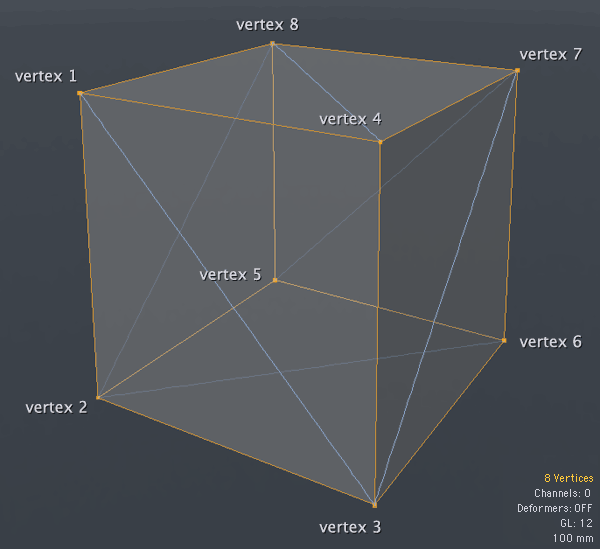  
        第一种是结构数组，如{顶点1，顶点2，顶点3，顶点4，...}，第二种是索引数组，如{0,1,2，0,2,3,2,6,3,2,5,6...}。  
* Rasterize(格栅化)    
栅格化是OpenGL获取有关3D对象(所有坐标，顶点，数学等)的所有信息以创建2D图像的过程。 此图像将进行一些更改，然后它将显示在设备的屏幕上(通常)。  


## OpenGL的管线
着色器就像一小段代码，就像小程序一样，直接在GPU中进行复杂的计算。 复杂如：具有T纹理的表面点的最终颜色，由TB凹凸纹理修改，使用具有镜面水平SL的镜面反射颜色SC，在具有光的功率LP的光L下，具有距离Z的入射角LA 衰落F和所有这些通过投影镜头T位于P位置的相机C的眼睛看到。  
要创建着色器，我们使用类似于C的语言，我们使用OpenGL着色器语言(GLSL)。 OpenGL ES使用一个更严格的版本，称为OpenGL ES Shader Language(也称为GLSL ES或ESSL)。 区别在于你有更多的固定函数，并且可以在GLSL中写入比在GLSL ES中更多的变量，但语法是相同的。    
你可以在一个单独的文件中创建它们或者直接在你的代码中编写，重要的是，包含SL的最终字符串将被发送到OpenGL的核心，而核心将编译Shaders给你(你甚至可以使用pre 编译的二进制着色器，但这是本系列的另一部分)。    
着色器成对使用：顶点着色器和片段着色器。 这个主题需要更多的关注，所以让我们仔细看看Vertex和Fragment着色器。 要了解每个着色器的作用，让我们回到立方体示例。    
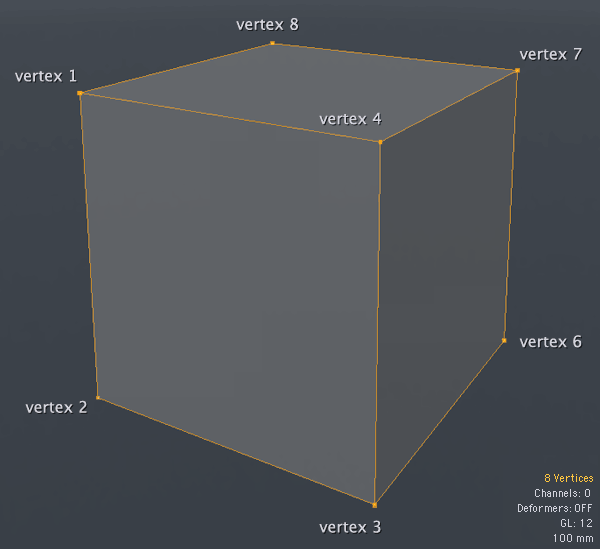    
* Vertex Shader 顶点着色器   
    顶点着色器，也称为VS或VSH，是一个小程序，将在网格的每个顶点执行。    

    看看上面的立方体，正如我早先所说，这个立方体需要8个顶点(现在在这个图像中，顶点5是不可见的，你很快就会理解为什么)。  
    所以这个立方体的VSH将由GPU处理8次。  

    Vertex Shader将做的是定义顶点的最终位置。 
    
    你还记得可编程管道让我们对相机负责吗？ 所以现在是时候了！  
    相机的位置和镜头可能会干扰顶点的最终位置。 Vertex Shader还负责准备并输出一些变量到Fragment Shader。 在OpenGL中，我们可以为Vertex Shader定义变量，但不能直接在Fragment Shader定义变量。 因此，我们的Fragment变量必须通过Vertex Shader传递过去。    
* Fragment Shader 片段着色器   
    您是否注意到顶点5是不可见的？ 这是因为在这个特定的位置和特定的旋转，我们只能看到3个面，这3个面由7个顶点组成。   

    这就是片段着色器的作用！ FSH将在最终图像的每个VISIBLE片段处理。 在这里，您可以将片段理解为像素。 但通常不是一个像素，因为在OpenGL的渲染和设备屏幕上的最终图像的呈现之间有延伸。 因此，根据设备和渲染的配置，片段可能会导致小于实际像素或大于实际像素。 在上面的立方体中，片段着色器将在由7个顶点形成的三个可见面的每个像素处理。  

    在Fragment Shader中，我们将处理与网格表面相关的所有内容，如材质，凹凸效果，阴影和灯光效果，反射，折射，纹理以及我们想要的任何其他类型的效果。 片段着色器的最终输出是RGBA格式的像素颜色。  

现在，您需要知道的最后一件事是关于VSH和FSH如何协同工作。 它是强制性的ONE Vertex Shader到ONE Fragment Shader，不多或少，必须是一对一的。 为了确保我们不犯错误，OpenGL有一个名为Program的东西。 OpenGL中的程序只是VSH和FSH的编译对。 就这样，仅此而已。  

## OpenGL's Error API
为了处理所有错误，OpenGL为我们提供了一个错误API。 这个API非常简单，相对的功能很少。 一个是简单的检查，是或否，只是为了知道某些事情是否成功完成。 另一个是获取错误消息。 所以非常简单。 首先你检查，非常快，如果有错误，那么你得到消息。


## 本章总结
1. OpenGL的逻辑由3个简单的概念组成：Primitives，Buffers和Rasterize。
    * 图元是点，线和三角形。
    * 缓冲区可以是帧缓冲区，渲染缓冲区或缓冲区对象。
    * Rasterize是在像素数据中转换OpenGL数学的过程。
2. OpenGL使用固定或可编程管道。
    * 固定管道旧，慢，大。 有很多固定的功能来处理相机，灯光，材料和效果。
    * 可编程管道比固定管道更容易，快速和清洁，因为在可编程方式中OpenGL让我们，开发人员，处理相机，灯光，材料和效果的任务。
3. 可编程管道是网格的每个顶点处的着色器：顶点着色器和网格的每个VISIBLE片段的片段着色器的同义词。 每对Vertex Shader和Fragment Shader都在一个名为Program的对象中编译。


# OpenGL ES 2.0深入
[参考地址](http://blog.db-in.com/all-about-opengl-es-2-x-part-2/)
## opengl数据类型
```
OpenGL's Data Type		Same as C		    Description
GLboolean (1 bits)		unsigned char		0 to 1
GLbyte (8 bits)		    char		        -128 to 127
GLubyte (8 bits)		unsigned char		0 to 255
GLchar (8 bits)		    char		        -128 to 127
GLshort (16 bits)		short		        -32,768 to 32,767
GLushort (16 bits)		unsigned short		0 to 65,353
GLint (32 bits)		    int		            -2,147,483,648 to 2,147,483,647
GLuint (32 bits)		unsigned int		0 to 4,294,967,295
GLfixed (32 bits)		int		            -2,147,483,648 to 2,147,483,647
GLsizei (32 bits)		int		            -2,147,483,648 to 2,147,483,647
GLenum (32 bits)		unsigned int		0 to 4,294,967,295
GLdouble (64 bits)		double		        −9,223,372,036,854,775,808 to 9,223,372,036,854,775,807
GLbitfield (32 bits)	unsigned int		0 to 4,294,967,295
GLfloat (32 bits)		float		        -2,147,483,648 to 2,147,483,647
GLclampx (32 bits)		int		            Integer clamped to the range 0 to 1
GLclampf (32 bits)		float		        Floating-point clamped to the range 0 to 1
GLclampd (64 bits)		double		        Double clamped to the range 0 to 1
GLintptr		        int		            pointer *
GLsizeiptr		        int		            pointer *
GLvoid		            void		        Can represent any data type
```
有关数据类型的一个非常重要的信息是OpenGL ES不支持64位数据类型，因为移动系统通常需要性能，而多个设备不支持64位处理器。 例如，通过使用OpenGL数据类型，您可以轻松安全地将OpenGL应用程序从C++移动到JavaScript，同时减少更改。 

## opengl 可编程管道 流程图  
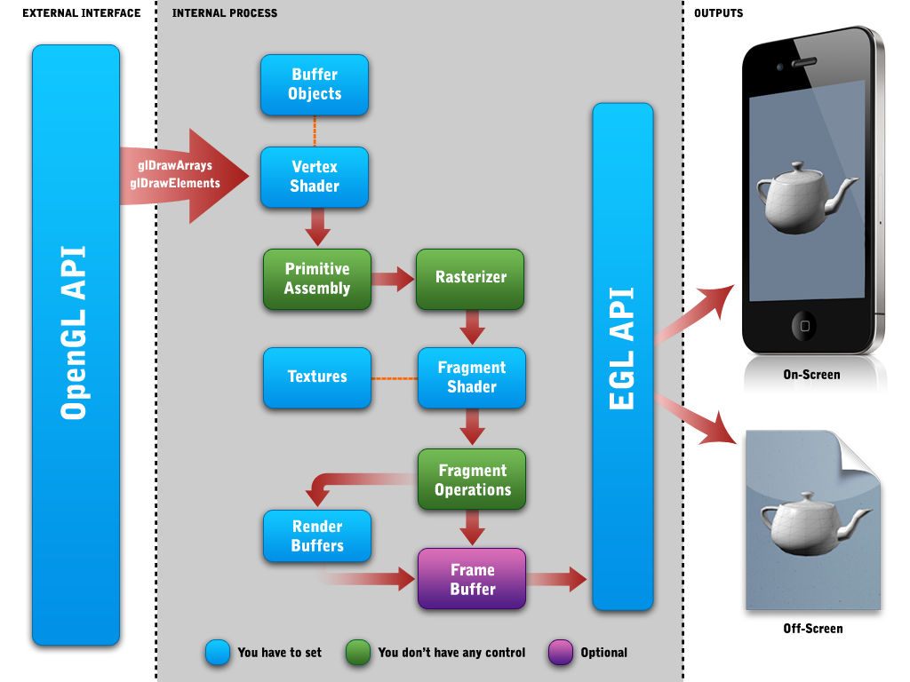   

我现在唯一想说的是关于上图中的“Frame Buffer”。 帧缓冲区被标记为可选，因为您可以选择不直接使用它，但在内部，OpenGL的核心始终至少使用帧缓冲区和颜色渲染缓冲区。  

## Primitives(图元)
你还记得第一部分，当我说图元是点，线和三角形时？ 所有这些都使用空间中的一个或多个点来构造，也称为顶点。 顶点有3个信息，X位置，Y位置和Z位置。 3D点由一个顶点构成，3D线由两个顶点构成，三角形由三个顶点构成。 由于OpenGL总是希望提高性能，因此所有信息都应该是单维数组，更具体地说是浮点值数组。 像这样：
```cpp
GLfloat point3D = {1.0,0.0,0.5};  
GLfloat line3D = {0.5,0.5,0.5,1.0,1.0,1.0};  
GLfloat triangle3D = {0.0,0.0,0.0,0.5,1.0,0.0,1.0,0.0,0.0};  
```

正如您所看到的，OpenGL的浮点数序列顺序没有顶点位置说明，OpenGL会自动将第一个值理解为X值，第二个值作为Y值，第三个值作为Z值。 OpenGL将在3个值的每个序列处循环此解释。 如果要构建点，线或三角形，只需通知OpenGL即可。 如果您愿意，可以自定义此顺序信息，OpenGL可以使用第四个值，但这是高级主题的内容。 现在假设顺序总是X，Y，Z。 上面的坐标将构造如下：  
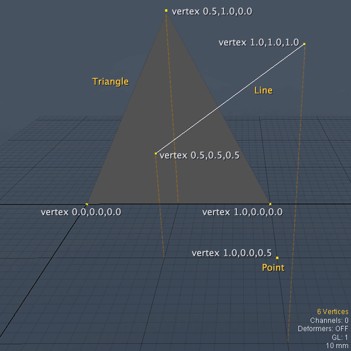   

在此图像中，虚线橙色线条表示您可以更清楚地看到顶点与地板相关的位置。直到这里看起来很简单！但现在出现了一个问题：“好的，那我怎样才能将我的3D模型从3DS Max或Maya转换为OpenGL阵列？”当我学习OpenGL时，我认为可能存在一些我们可以直接导入OpenGL的3D文件格式。    
OpenGL专注于3D世界构建中最重要和最困难的部分。所以它不应该由变化无常的东西负责，比如3D文件格式。存在这么多3D文件格式，.obj，.3ds，.max，，OpenGL不处理3D文件

### 网格和线条优化
一个3D点只有一种方法可以通过OpenGL绘制，但是一条线和一个三角形有三种不同的方式：线条有normal, strip and loop三种模式，三角形有normal, strip and fan三种模式。 根据绘图模式，您可以提高渲染性能并节省应用程序内存。 但是在适当的时候我们将在本教程的后面讨论这个问题。 目前，我们需要知道的是，您可以想象的最复杂的3D网格将由一堆三角形组成。 我们将这些三角形称为“faces”。 因此，让我们使用顶点数组创建一个3D立方体。  
```cpp
// Array of vertices to a cube.
GLfloat cube3D[] =  
{
    0.50,-0.50,-0.50,    // vertex 1
    0.50,-0.50,0.50,    // vertex 2
    -0.50,-0.50,0.50,    // vertex 3
    -0.50,-0.50,-0.50,    // vertex 4
    0.50,0.50,-0.50,    // vertex 5
    -0.50,0.50,-0.50,    // vertex 6
    0.50,0.50,0.50,        // vertex 7
    -0.50,0.50,0.50        // vertex 8
}
```
浮点数的精度对OpenGL来说无关紧要，但它可以为文件节省大量内存和大小（2的精度为0.00，精度为5为0.00000）。 所以我总是喜欢使用低精度，2非常好！ 我不想让你太困惑，但有一些你必须要知道的事情。 通常网格有三个很好的信息：verticex，纹理坐标和法线。 一个好的做法是创建一个包含所有这些信息的单个数组。 这称为结构阵列。 一个简短的例子可能是：  
```cpp
// Array of vertices to a cube.
GLfloat cube3D[] =  
{
    0.50,-0.50,-0.50,    // vertex 1
    0.00,0.33,            // texture coordinate 1
    1.00,0.00,0.00        // normal 1
    0.50,-0.50,0.50,    // vertex 2
    0.33,0.66,            // texture coordinate 2
    0.00,1.00,0.00        // normal 2
    ...
}
```
您可以将此构造结构用于要每个顶点数据的任何类型的信息。 出现了一个问题：好吧，但是这样我的所有数据都只能是一种数据类型，例如GLfloat？ 是。 但是我稍后会在本教程中告诉你这不是问题，因为你只需接受浮点值，所以一切都是GLfloats。 但是现在不要担心，在合适的时间你会理解。 好的，现在我们有一个3D网格，所以让我们开始配置我们的3D应用程序并将这个网格存储到OpenGL的缓冲区中。  

## Buffers（缓存区）
你还记得第一部分我说OpenGL是一台像港口起重机一样工作的状态机吗？ 现在让我们改进一点说明。 OpenGL就像一个带有严重武器和钩子的港口起重机。 所以它可以同时容纳许多容器。  
   
基本上，有四个“手臂”：纹理臂（这是一个双臂），缓冲物体臂（这是一个双臂），渲染缓冲臂和帧缓冲臂。 每个臂一次只能容纳一个容器。 这非常重要，所以我将重复一遍：```每只手臂一次只能容纳一个容器！```  
纹理和缓冲对象臂是双臂，因为它可以容纳两种不同的纹理和缓冲对象  
```每只手臂一次只能容纳一个容器！```    
我们需要的是指示OpenGL的起重机从港口取一个容器，我们可以通过告知容器的名称/ ID来做到这一点。 回到代码，指示OpenGL“拿一个容器”的命令是：glBind*。 因此，每当你看到一个你知道的glBindSomething时，这就是对OpenGL“拿一个容器”的指令。 此规则只存在一个例外，但我们稍后会讨论。 在开始将某些东西绑定到OpenGL之前，我们需要创建那个东西。 我们使用glGen*函数生成“容器”名称/ id。  

### Frame Buffers（帧缓存区）
帧缓冲区是渲染输出的临时存储。 一旦我们的渲染在帧缓冲区中，我们可以选择将其呈现到设备的屏幕中或将其保存为图像文件或使用输出作为快照。 这是与帧缓冲区相关的一对函数：  
* ```GLvoid glGenFramebuffers (GLsizei n, GLuint* framebuffers)```
    - ```n:表示将一次生成多少帧缓冲区名称/ ID的数字。```
    - ```framebuffers:指向存储生成的名称/ ID的变量的指针。 如果生成了多个名称/ id，则此指针将指向数组的开头。```

* ```GLvoid glBindFramebuffer (GLenum target, GLuint framebuffer)```
    - ```target:始终是GL_FRAMEBUFFER，这只是OpenGL的内部约定```
    - ```framebuffers:要绑定的帧缓冲区的名称/ id。```
在我们第一次绑定该对象时，opengl核心将自动完成OpenGL对象的创建过程。 但是这个过程不会为我们生成名称/ ID。 因此建议始终使用glGen*来创建缓冲区名称/ ID，而不是创建自己的名称/ ID。 好像很困惑？ 好的，让我们转到我们的第一行代码，你会更清楚地理解：  
```cpp
GLuint frameBuffer;

// Creates a name/id to our frameBuffer.
glGenFramebuffers(1, &frameBuffer);

// The real Frame Buffer Object will be created here,
// at the first time we bind an unused name/id.
glBindFramebuffer(GL_FRAMEBUFFER, frameBuffer);

// We can suppress the glGenFrambuffers.
// But in this case we'll need to manage the names/ids by ourselves.
// In this case, instead the above code, we could write something like:
//
// GLint frameBuffer = 1;
// glBindFramebuffer(GL_FRAMEBUFFER, frameBuffer);
```  
上面的代码创建了一个名为frameBuffer的Gluint数据类型的实例。 然后我们将frameBuffer变量的内存位置通知glGenFramebuffers，并指示此函数只生成1个name / id（是的，我们可以一次生成多个名称/ ID）。 最后，我们将生成的frameBuffer绑定到OpenGL的核心。  

### Render Buffers（渲染缓存区）
渲染缓冲区是来自OpenGL渲染的图像的临时存储。 这是与渲染缓冲区相关的一对函数：  
* ```GLvoid glGenRenderbuffers (GLsizei n, GLuint* renderbuffers)```
    - ```n:表示将一次生成多少渲染缓存区名称/ ID的数字。```
    - ```renderbuffers:指向存储生成的名称/ ID的变量的指针。 如果生成了多个名称/ id，则此指针将指向数组的开头。```

* ```GLvoid glBindRenderbuffer (GLenum target, GLuint renderbuffer)```
    - ```target:始终是GL_RENDERBUFFER，这只是OpenGL的内部约定```
    - ```renderbuffer:要绑定的渲染缓存区的名称/ id。```

现在，在我们继续之前，你还记得第一部分，当我说渲染缓冲区是一个临时存储，可能是3种类型？ 所以我们需要指定渲染缓冲区的类型和该临时图像的一些属性。 我们使用此函数设置为渲染缓冲区属性：   
* ```GLvoid glRenderbufferStorage (GLenum target, GLenum internalformat, GLsizei width, GLsizei height)```
    - ```target:始终是GL_RENDERBUFFER，这只是OpenGL的内部约定```
    - ```internalformat:这指定了我们想要的渲染缓冲区类型以及此临时图像将使用的颜色格式。 这个参数可以```
        - ```GL_RGBA4，GL_RGB5_A1或GL_RGB56 指定颜色的格式和指定颜色渲染缓冲区```
        - ```GL_DEPTH_COMPONENT16 指定Z深度的渲染缓冲区```
        - ```GL_STENCIL_INDEX或GL_STENCIL_INDEX8 指定带有模板信息的渲染缓冲区```
    - ```width:渲染缓冲区的最终宽度```
    - ```height:渲染缓冲区的最终高度```  

您可以问，“但我会为渲染缓冲区设置这些属性？OpenGL将如何知道哪些渲染缓冲区是这些属性？” 好吧，这就是伟大的OpenGL状态机出现了！ 属性将设置为最后一个渲染缓冲区绑定！ 很简单。 看看我们如何设置3种渲染缓冲区：  
```cpp
GLuint colorRenderbuffer, depthRenderbuffer, stencilRenderbuffer;  
GLint sw = 320, sh = 480; // Screen width and height, respectively.

// Generates the name/id, creates and configures the Color Render Buffer.
glGenRenderbuffers(1, &colorRenderbuffer);  
glBindRenderbuffer(GL_RENDERBUFFER, colorRenderbuffer);  
glRenderbufferStorage(GL_RENDERBUFFER, GL_RGBA4, sw, sh);

// Generates the name/id, creates and configures the Depth Render Buffer.
glGenRenderbuffers(1, &depthRenderbuffer);  
glBindRenderbuffer(GL_RENDERBUFFER, depthRenderbuffer);  
glRenderbufferStorage(GL_RENDERBUFFER, GL_DEPTH_COMPONENT16, sw, sh);

// Generates the name/id, creates and configures the Stencil Render Buffer.
glGenRenderbuffers(1, &stencilRenderbuffer);  
glBindRenderbuffer(GL_RENDERBUFFER, stencilRenderbuffer);  
glRenderbufferStorage(GL_RENDERBUFFER, GL_STENCIL_INDEX8, sw, sh);  
```  
好的，但在我们的立方体应用程序中，我们不需要模板缓冲区，所以让我们优化上面的代码：  
```cpp
GLuint *renderbuffers;  
GLint sw = 320, sh = 480; // Screen width and height, respectively.

// Let's create multiple names/ids at once.
// To do this we declared our variable as a pointer *renderbuffers.
glGenRenderbuffers(2, renderbuffers);

// The index 0 will be our color render buffer.
glBindRenderbuffer(GL_RENDERBUFFER, renderbuffers[0]);  
glRenderbufferStorage(GL_RENDERBUFFER, GL_RGBA4, sw, sh);

// The index 1 will be our depth render buffer.
glBindRenderbuffer(GL_RENDERBUFFER, renderbuffers[1]);  
glRenderbufferStorage(GL_RENDERBUFFER, GL_DEPTH_COMPONENT16, sw, sh);  
```
#### 将RenderBuffers连接到FrameBuffer
* ```GLvoid glFramebufferRenderbuffer (GLenum target, GLenum attachment, GLenum renderbuffertarget, GLuint renderbuffer)```
    - ```target:始终是GL_FRAMEBUFFER，这只是OpenGL的内部约定```
    - ```attachment:这指定了我们想要在帧缓冲区内附加哪种渲染缓冲区，这个参数可以是：```
        - ```GL_COLOR_ATTACHMENT0 绑定颜色渲染缓冲区```
        - ```GL_DEPTH_ATTACHMENT 绑定深度渲染缓冲区```
        - ```GL_STENCIL_ATTACHMENT 绑定模板渲染缓冲区```
    - ```renderbuffertarget:始终是GL_RENDERBUFFER，这只是OpenGL的内部约定```
    - ```renderbuffer:要绑定的渲染缓存区的名称/ id```  
同样的问题出现了：“OpenGL将如何知道哪个帧缓冲器连接这些渲染缓冲区？” 使用状态机！ 最后一个帧缓冲区绑定将接收这些附件。 好的，在继续之前，我们来谈谈Frame Buffer和Render Buffer的组合。 这是他们的样子：  
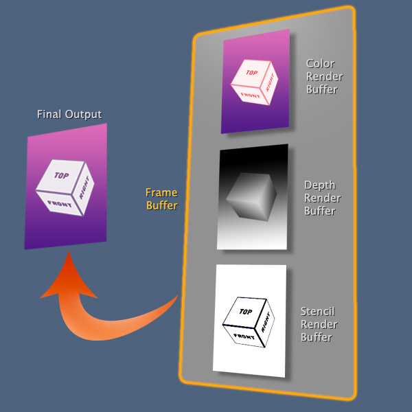   
OpenGL内部始终使用帧缓冲区。 这称为窗口系统提供的帧缓冲区，该名称/id 使用了保留0。 我们控制的帧缓冲区称为应用程序创建的帧缓冲区。   

深度和模板渲染缓冲区是可选项。 但是颜色缓冲区始终处于启用状态  

由于OpenGL的核心也始终使用颜色渲染缓冲区，因此渲染缓冲区名称/id 0保留给它。 为了优化所有可选状态，OpenGL为我们提供了一种打开和关闭某些状态的方法（将每个可选的OpenGL功能理解为状态）。 为此，我们使用以下功能：  
* ```GLvoid glEnable(GLenum capability)```
    - ```capability:要打开的功能。这个参数可以是：```
        - ```GL_TEXTURE_2D```
        - ```GL_CULL_FACE```
        - ```GL_BLEND```
        - ```GL_DITHER```
        - ```GL_STENCIL_TEST```
        - ```GL_DEPTH_TEST```
        - ```GL_SCISSOR_TEST```
        - ```GL_POLYGON_OFFSET_FILL```
        - ```GL_SAMPLE_ALPHA_TO_COVERAGE```
        - ```GL_SAMPLE_COVERAGE```

* ```GLvoid glEnable(GLenum capability)```
    - ```capability:要关闭的功能。这个参数与glEnable相同```

打开/关闭某个功能后，该指令将影响整个OpenGL机器。 有些人喜欢打开一个功能只是暂时使用它然后关闭，但这是不可取的。 它的代价昂贵。 最好的方法是打开一次然后关闭一次。 或者，如果您确实需要，请尽量减少应用程序中的开启/关闭。 因此，回到深度和模板缓冲区，如果您的应用程序需要使用其中一个或两者，请尝试启用您需要的一次。 在我们的立方体示例中，我们只需要一个深度缓冲区，我们可以写：  

```cpp
// Doesn't matter if this is before or after
// we create the depth render buffer.
// The important thing is enable it before try
// to render something which needs to use it.
glEnable(GL_DEPTH_TEST);
```  

稍后我将深入讨论深度和模板测试的内容以及它们与片段着色器的关系。

### Buffer Objects（缓存对象）
缓冲区对象是原始数组的优化存储。 有两种缓冲对象

第一种是我们存储顶点数组，因为它的缓冲对象也称为顶点缓冲对象（VBO）。 在创建缓冲区对象之后，您可以破坏原始数据，因为缓冲区对象（BO）从中创建了一个副本。 我们习惯称之为VBO，但这种缓冲对象可以保存任何类型信息的数组，例如法线数组或纹理坐标数组甚至是结构数组。 要调整名称以适合正确的想法，有些人还将此类缓冲区对象称为数组缓冲区对象（ABO）。  

另一种缓冲区对象是索引缓冲区对象（IBO/EBO）。 你还记得第一部分的索引数组吗？  IBO就是存储那种阵列。 通常，索引数组的数据类型是GLubyte或GLushort。 有些设备支持GLuint，但这就像一个扩展，几乎是供应商必须实现的插件。 大多数人只支持默认行为（GLubyte或GLushort）。 所以我的建议是，总是将你的索引数组限制为GLushort。 好的，现在要创建这些缓冲区，该过程与帧缓冲区和渲染缓冲区非常相似。 首先创建一个或多个名称/ ID，稍后绑定一个缓冲区对象，然后将属性和数据定义到其中。

* ```GLvoid glGenBuffers(GLsizei n, GLuint* buffers)```
    - ```n:表示将一次生成多少缓存对象名称/ ID的数字。```
    - ```buffers:指向存储生成的名称/ ID的变量的指针。 如果生成了多个名称/ id，则此指针将指向数组的开头。```

* ```GLvoid glBindBuffer(GLenum target, GLuint buffer)```
    - ```target:将定义什么样的缓冲区对象，VBO或IBO。 值可以是：```
        - ```GL_ARRAY_BUFFER 指示缓存对象为VBO/ABO```
        - ```GL_ELEMENT_ARRAY_BUFFER 指示缓存对象为IBO/EBO```
    - ```buffer:要绑定的缓存对象的名称/ id。```

现在是时候改进关于Port Crane的钩子的插图了。 BufferObject Hook实际上是一个双钩子。 因为它可以容纳两个缓冲区对象，每种类型都有一个：GL_ARRAY_BUFFER和GL_ELEMENT_ARRAY_BUFFER。 好的，一旦绑定了缓冲区对象就可以定义其属性，或者更好地定义其内容。 由于“BufferObject Hook”是双精度的，并且您可以同时绑定两个缓冲区对象，因此需要指示OpenGL关于要为其设置属性的缓冲区对象的类型。
* ```GLvoid glBufferData(GLenum target, GLsizeiptr size, const GLvoid* data, GLenum usage)```
    - ```target:指示要为其设置属性的缓冲区类型。 该参数可以是GL_ARRAY_BUFFER或GL_ELEMENT_ARRAY_BUFFER。：```
        - ```GL_ARRAY_BUFFER 指示缓存对象为VBO/ABO```
        - ```GL_ELEMENT_ARRAY_BUFFER 指示缓存对象为IBO/EBO```
    - ```size:基本单位的缓冲区大小（字节）```
    - ```data:指向数据的指针```
    - ```usage:用法种类。 这就像帮助OpenGL优化数据的提示。 这可以是三种```
        - ```GL_STATIC_DRAW 这表示不可变数据。 您设置一次并经常使用缓冲区。```
        - ```GL_DYNAMIC_DRAW 这表示可变数据。 您设置一次并经常使用它多次更新其内容```
        - ```GL_STREAM_DRAW 这表示临时数据。 对于熟悉Objective-C的人，这就像一个自动释放。 你设置一次并使用几次。 之后，OpenGL会自动清理并销毁此缓冲区。```

* ```GLvoid glBufferSubData(GLenum target, GLintptr offset, GLsizeiptr size, const GLvoid* data)```
    - ```target:指示要为其设置属性的缓冲区类型。 该参数可以是GL_ARRAY_BUFFER或GL_ELEMENT_ARRAY_BUFFER。：```
        - ```GL_ARRAY_BUFFER 指示缓存对象为VBO/ABO```
        - ```GL_ELEMENT_ARRAY_BUFFER 指示缓存对象为IBO/EBO```
    - ```offset:此数字表示您将开始更改为先前定义的缓冲区对象的偏移量。 给出的这个数字是基本单位（字节）。```
    - ```size:此数字表示先前定义的缓冲区对象的更改大小。 给出的这个数字是基本单位（字节）。```
    - ```data:指向数据的指针```

现在让我们了解这些功能的作用。第一个是glBufferData，您可以使用此函数来设置缓冲区对象及其属性的内容。

如果选择GL_DYNAMIC_DRAW的使用类型，则表示您希望稍后更新该缓冲区对象，为此需要使用第二个缓冲区对象glBufferSubData。当您使用glBufferSubData时，缓冲区对象的大小先前已定义，因此您无法更改它。但是为了优化更新，您可以选择要更新的整个缓冲区对象的一小部分。  

就个人而言，我不喜欢使用GL_DYNAMIC_DRAW，如果你停下来想一想，你会发现3D世界中不存在行为效果，只能改变原始顶点数据，普通数据或纹理坐标数据。通过使用着色器，您几乎可以更改与这些数据相关的所有内容。使用GL_DYNAMIC_DRAW肯定会比使用着色器的方法更加广泛。所以，我的建议是：尽量避免使用GL_DYNAMIC_DRAW！总是倾向于使用着色器功能来实现相同的行为。  

正确创建和配置缓冲区对象后，使用它非常简单。我们需要做的就是绑定所需的缓冲区对象。请记住，我们一次只能绑定一种缓冲区对象。

当缓冲区对象保持绑定时，我们制作的所有绘图命令都将使用它们。使用后是一个好主意解开它们。

## Textures(纹理)
我需要说的第一件事就是2的指数纹理（POT）。 OpenGL只接受POT纹理。那是什么意思？这意味着所有纹理必须具有宽度和高度两个值的幂。像2,4,8,16,32,64,128,256,512或1024像素。对于纹理，1024是更大的尺寸，通常表示纹理的最大可能尺寸。因此，将在OpenGL中使用的所有纹理必须具有如下尺寸：例如64 x 128或256 x 32或512 x 512。您不能使用200 x 200或256 x 100.这是优化GPU中​​内部OpenGL处理​​的规则。

OpenGL中纹理的另一个重要事项是读取像素顺序。通常，图像文件格式存储从左上角开始的像素信息，并逐行移动到右下角。 JPG，PNG，BMP，GIF，TIFF等文件格式使用此像素顺序。但是在OpenGL中，这个顺序颠倒了。 OpenGL中的纹理从左下角开始读取像素并转到右上角。  
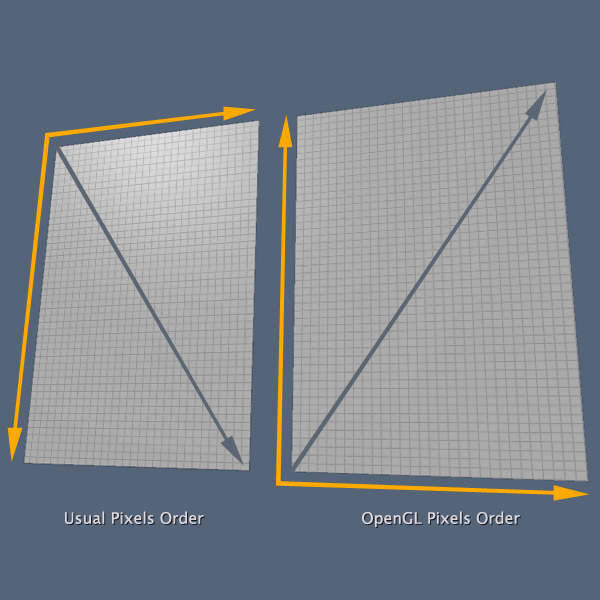   
因此，为了解决这个小问题，我们通常会在将图像数据上传到OpenGL的核心之前对其进行垂直翻转。 如果您的编程语言允许您重新缩放图像，这相当于重新缩放-100％的高度。  
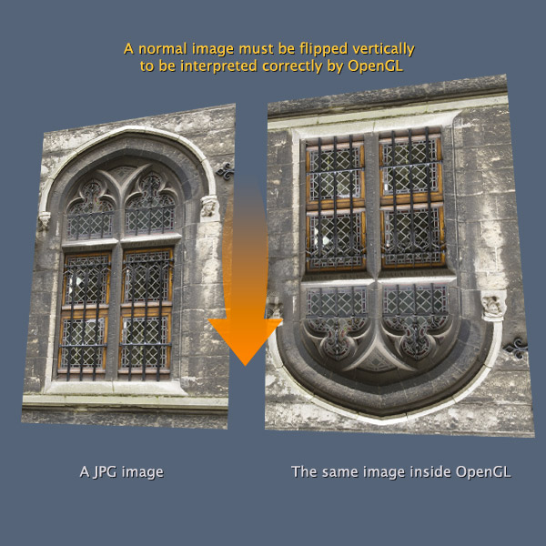    
OpenGL中的纹理以这种方式工作：你有一个图像文件，所以你必须从中提取二进制颜色信息，即十六进制值。您也可以提取Alpha信息，OpenGL支持RGB和RGBA格式。在这种情况下，您需要从图像中提取十六进制+ alpha值。将所有内容存储到像素数组中。使用此像素数组（也称为纹素，因为将在纹理中使用），您可以构造OpenGL的纹理对象。 OpenGL将复制您的数组并以优化的格式存储它，以便在GPU和帧缓冲区中使用（如果需要）。    

OpenGL有一个叫做“纹理单元”的东西，默认情况下，供应商的任何OpenGL实现都必须支持多达32个纹理单元。这些单位表示存储的像素阵列与实际渲染处理之间的临时链接。您将在着色器中使用纹理单位，更具体地说，在片段着色器中使用纹理单位。默认情况下，每个着色器最多可以使用8个纹理，某些供应商的实现支持每个着色器最多16个纹理。此外，OpenGL对着色器对有一个限制，尽管每个着色器最多可以使用8个纹理单元，但这对着色器（顶点和片段）限制为最多使用8个纹理单元

困惑？看，如果你只在一个着色器中使用纹理单元，你最多可以使用8个。但是如果你在一对着色器（不同纹理单位）中使用纹理单元，则不能使用超过8个纹理单元。好吧，OpenGL可以容纳最多32个纹理单元，我们将在着色器中使用，但着色器只支持8，这没有意义，对吧？关键是你可以设置多达32个纹理单元并在许多着色器中使用它。但是如果你需要第33个纹理单元，你需要重新使用第一个32的插槽。非常困惑！我知道......让我们看一下视觉解释是否可以澄清这一点：
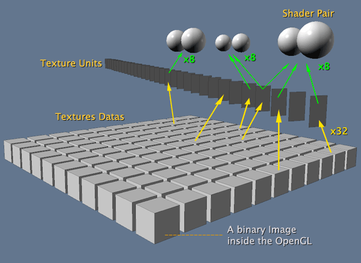    
正如您在该图像中看到的那样，多个着色器对可以多次使用一个纹理单元。

“Shader非常棒！”，一位Khronos开发人员对另一位说，“它们被GPU处理得非常快。对吧！但纹理......嗯..纹理数据仍然在CPU上，它们是更大更多的信息！嗯..所以我们需要一种快速的方法让着色器访问纹理，如桥，或临时的东西。我们可以创建一个可以直接在GPU中处理的纹理单位，就像着色器一样。我们可以限制GPU上运行的当前纹理单元的数量.GPU中的缓存，速度快，效果更好。

用户将纹理数据绑定到纹理单元并指示他的着色器使用该单元！

通常，纹理单元用于片段着色器，但顶点着色器也可以执行查找纹理。这种情况并不常见，但在某些情况下可能会有用

两件非常重要的事情是：首先，你必须使用glActiveTexture（）激活纹理单元，然后使用glBindTexture（）绑定纹理名称/ id。第二个重要的事情是，即使默认情况下OpenGL最多支持32个纹理单元，您也不能使用高于供应商实现中支持的最大纹理单元的插槽数，因此如果您的OpenGL实现不支持超过16纹理单位，你可以使用范围0  -  15的纹理单位。

* ```GLvoid glGenTextures(GLsizei n, GLuint* textures)```
    - ```n:表示将一次生成多少纹理的名称/ ID的数字。```
    - ```textures:指向存储生成的名称/ ID的变量的指针。 如果生成了多个名称/ id，则此指针将指向数组的开头。```

* ```GLvoid glActiveTexture(GLenum texture);```
    - ```texture:指定要激活的纹理单元。必须是GL_TEXTUREi之一```

* ```GLvoid glBindTexture(GLenum target, GLuint texture)```
    - ```target:将定义将是什么样的纹理，2D纹理或3D纹理。 值可以是：```
        - ```GL_TEXTURE_2D 2D纹理```
        - ```GL_TEXTURE_CUBE_MAP 3D纹理```
    - ```texture:要绑定的纹理对象的名称/ id。```

3D纹理或立方体贴图表示六个2D纹理的集合。  

在我们创建了2D纹理之后，我们需要设置它的属性。 Khronos组将OpenGL的核心称为“服务器”，因此当我们定义纹理数据时，他们说这是一个“上传”。 要上传纹理数据并设置一些属性，我们使用：
* ```GLvoid glTexImage2D (GLenum target, GLint level, GLint internalformat, GLsizei width, GLsizei height, GLint border, GLenum format, GLenum type, const GLvoid* pixels)```
    - ```target:将定义将是什么样的纹理，2D纹理或3D纹理。 值可以是：```
        - ```GL_TEXTURE_2D 2D纹理```
        - ```GL_TEXTURE_CUBE_MAP 3D纹理```
    - ```level:此参数表示mip贴图级别。 基本级别为0，现在让我们只使用0。```
    - ```internalformat:表示像素的颜色格式。 这个参数可以是：```
        - ```GL_RGBA RGB+Alpha```
        - ```GL_RGB RGB```
        - ```GL_LUMINANCE_ALPHA 仅适用于Red + Alpha。 在这种情况下，红色通道将代表亮度。```
        - ```GL_LUMINANCE 仅限红色。 在这种情况下，红色通道将代表亮度。```
        - ```GL_ALPHA Alpha```
    - ```width:图像的宽度（以像素为单位）。```
    - ```height:图像的高度（以像素为单位）。```
    - ```border:在OpenGL ES中忽略此参数。 始终使用值0.这只是一个内部常量，可以保存与桌面版本的兼容性。。```
    - ```format:格式必须具有相同的internalformat值。 同样，这只是一个内部OpenGL约定```
    - ```type:表示像素的数据格式。 这个参数可以是：```
        - ```GL_UNSIGNED_BYTE 此格式表示每像素4字节，因此您可以使用8位表示红色，8位表示绿色，8位表示蓝色，8位表示Alpha通道。 此定义适用于所有颜色格式。```
        - ```GL_UNSIGNED_SHORT_4_4_4_4 此格式表示每像素2个字节，因此您可以使用4位表示红色，4位表示绿色，4位表示蓝色，4位表示alpha通道。 此定义仅与RGBA一起使用。```
        - ```GL_UNSIGNED_SHORT_5_5_5_1 此格式表示每像素2个字节，因此您可以使用5位表示红色，5位表示绿色，5位表示蓝色，1位表示Alpha通道。 此定义仅与RGBA一起使用。```
        - ```GL_UNSIGNED_SHORT_5_6_5 此格式表示每像素2个字节，因此您可以使用5位表示红色，6位表示绿色，5位表示蓝色。 此定义仅与RGB一起使用。```
    - ```pixels:指向像素数组的指针。```

首先，与其他“Hooks”相同的行为，对glTexImage2D的调用将设置最后一个纹理绑定的属性。关于mip贴图，它是另一种优化渲染时间的OpenGL功能。简而言之，它所做的是逐步创建原始纹理的较小副本，直到1x1像素的无关紧要的副本。  稍后，在栅格化过程中，OpenGL可以选择要使用的原始副本或其中一个副本，具体取决于3D对象相对于视图的最终大小。现在，不要担心这个功能，在mip贴图之后，我们设置颜色格式，图像的大小，数据的格式以及最终的像素数据。每像素2字节优化的数据格式是优化纹理的最佳方式，您可以随时使用它。请记住，您在OpenGL中使用的颜色不能超过设备和EGL上下文的颜色范围和格式。好的，现在我们知道如何构建基本纹理以及它在OpenGL中的工作原理

## Rasterize(栅格化)
严格意义上的Rasterize只是OpenGL采用3D对象并将其数组转换为2D图像的过程。 之后，片段着色器将处理此可见区域的每个片段。 查看本教程开头的可编程管道图示，您可以看到Rasterize只是图形管道的一小步。 那为什么它如此重要？ 我喜欢说Rasterize步骤之后的所有内容也是一个Rasterize过程，因为稍后完成的所有操作也是从3D对象构建最终的2D图像。 好的，无论如何。 事实上，Rasterize是从3D对象创建图像的过程。 栅格化将发生在场景中的每个3D对象上，并将更新帧缓冲区。 您可以在栅格化过程中通过多种方式进行操作。

### Face Culling（面剔除）
现在是时候谈谈剔除，正面朝向和背面朝向。 OpenGL使用方法来查找和丢弃不可见的面。 想象一下3D应用程序中的一个简单平面。 假设您希望这个平面只在一侧可见（因为它代表墙壁或地板，无论如何）。 默认情况下，OpenGL将渲染该平面的两侧。 要解决此问题，您可以使用剔除。 根据顶点的顺序，OpenGL可以确定网格的正面和背面（更准确地说，它计算每个三角形的正面和背面），使用剔除可以指示OpenGL忽略其中一个边（ 甚至两个）。 看这张图片：  
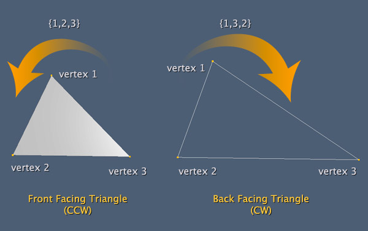    
这个称为剔除的功能是完全灵活的，你至少有三种方法可以做同样的事情。 那张照片只显示了一种方式，但最重要的是了解它是如何工作的。 在图片的情况下，三角形由顶点1，顶点2和顶点3组成。左边的三角形使用{1,2,3}的顺序构造，右边的三角形由{1,3,2}的顺序构成。 默认情况下，剔除会将Counter ClockWise(逆时针)中形成的三角形视为正面，并且不会被剔除。 遵循相同的行为，在图像的右侧，ClockWise（顺时针）中形成的三角形将被视为背面，它将被剔除（在光栅化过程中被忽略）。 要使用此功能，您需要使用参数GL_CULL_FACE使用glEnable函数，并执行此操作，默认行为将如上所述。 但是如果你想自定义它，你可以使用这些功能：
* ```GLvoid glCullFace(GLenum mode)```
    - ```mode:指示将剔除哪个脸部。 这个参数可以```
        - ```GL_BACK 忽略背面朝向。 这是默认行为。```
        - ```GL_FRONT 忽略正面朝向```
        - ```GL_FRONT_AND_BACK 忽略正面朝向和背面朝向```

* ```GLvoid glFrontFace(GLenum mode)```
    - ```mode:指示OpenGL如何定义正面（显然也是背面）。 这个参数可以是：```
        - ```GL_CCW 这将指示OpenGL将逆时针形成的三角形视为正面。 这是默认行为```
        - ```GL_CW 这将指示OpenGL将以时钟方式形成的三角形视为正面。```

如果设置glCullFace（GL_FRONT）和glFrontFace（GL_CW），您将获得与默认相同的行为。  

更改默认行为的另一种方法是更改3D对象的构造顺序，但当然这更加费力，因为您需要更改索引数组。 剔除是Rasterize步骤中首先发生的事情，因此可以确定是否处理片段着色器（下一步）。  

### Per-Fragment Operations（片段操作）
现在让我们在本教程的顶部改进我们的可编程流水线图，更具体地说，在片段后着色器的过程中会发生什么。    
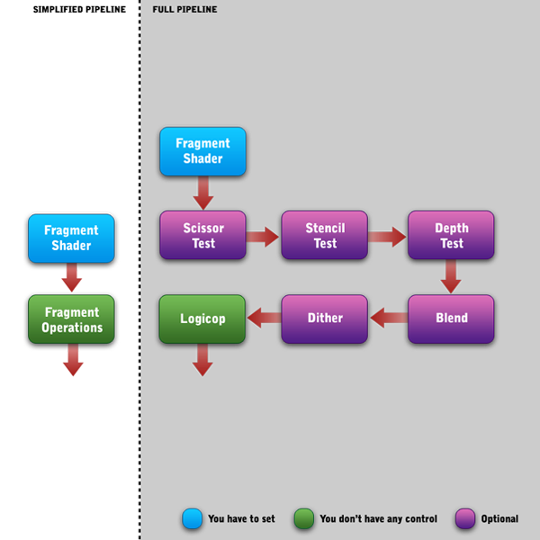    
Fragment Shader和Scissor Test之间存在一个略微省略的步骤。称为“像素所有权测试”的东西。这是一个内部步骤。它将决定OpenGL内部帧缓冲区与当前EGL上下文之间像素的所有权。这对我们来说是一个微不足道的一步。你不能把它用在任何东西上，我只是告诉你，你知道内部会发生什么。对我们这些开发人员来说，这一步完全被忽略了。如您所见，您无法访问的唯一步骤是Logicop。 Logicop是一个内部过程，包括钳位值到0.0  -  1.0范围之类的东西，在所有每个片段操作之后将最终颜色处理到帧缓冲区，附加多重采样和其他类型的内部事物。你不必担心这一点。我们需要关注紫色盒子。紫色框表示默认禁用的进程，如果要使用glEnable函数，则需要使用glEnable函数启用它们。您可以再次查看glEnable参数，但只是为了明确这一点，简而言之，此图像上的紫色框表示以下参数，表示：
* Scissor Test(裁剪测试)：GL_SCISSOR_TEST  - 这可以裁剪图像，因此裁剪区域外的每个片段都将被忽略。
* Stencil Test（模板测试）：GL_STENCIL_TEST  - 像掩码一样工作，掩模由黑白图像定义，其中白色像素表示可见区域。因此，放置在黑色区域的每个片段都将被忽略。这需要模板渲染缓冲区才能工作。
* Depth Test（深度测试）：GL_DEPTH_TEST  - 此测试将当前3D对象的Z深度与先前渲染的其他Z深度进行比较。深度高于另一个的片段将被忽略（这意味着距观察者更远）。这将使用灰度图像完成。这需要深度渲染缓冲区才能工作。
* Blend（混合）：GL_BLEND  - 此步骤可以将新片段与现有片段混合到颜色缓冲区中。
* Dither（抖动）：GL_DITHER  - 这是一个小小的OpenGL技巧。在帧缓冲区可用的颜色有限的系统中，此步骤可以优化颜色使用，使其看起来比实际颜色更多。 Dither没有配置，您只需选择是否使用它。

对于它们中的每一个，OpenGL提供了很少的函数来设置像glScissor，glBlendColor或glStencilFunc这样的过程。有超过10个函数，我告诉过你关于默认行为的信息，比如模板缓冲区中的黑色和白色，但是通过使用这些函数，您可以自定义处理，例如更改模板缓冲区上的黑白行为。再看一下顶部的可编程管道。每次渲染3D对象时，整个管道都将从glDraw*发生到帧缓冲区，但不会进入EGL API。想象一个复杂的场景，一个游戏场景，就像一个反恐精英场景。您可以渲染数十个，也许数百个3D对象，只创建一个静态图像。渲染第一个3D对象时，帧缓冲区将开始填充。如果部分3D对象的片段被一个或多个片段操作忽略，则忽略的片段将不会放置在帧缓冲区中，但请记住，此操作不会排除已存在于帧缓冲区中的片段。最终的反恐精英场景是一个2D图像，可产生许多着色器，灯光，效果和3D物体。因此，每个3D对象都将处理其顶点着色器，也可能是其片段着色器，但这并不意味着其生成的图像将真正可见。那么，现在您了解为什么我说光栅化过程在图中只包含一个步骤。栅格化是顶点着色器和帧缓冲步骤之间的所有内容  

## shaders(着色器)
如果您已经阅读了本系列教程的第一部分并阅读了所有这些内容，那么我认为您现在已经清楚了解着色器是什么以及它们的作用。 为了让我们回忆起来，让我们记住一点：  
* 着色器使用GLSL或GLSL ES（这是GLSL的紧凑版本）  
* 着色器始终成对使用，顶点着色器（VSH）和片段着色器（FSH）。  
* 每次提交渲染命令时都会处理这对着色器，例如glDrawArrays或glDrawElements。  
* 如果您的3D对象有8个顶点，VSH将按顶点处理，因此顶点着色器将被处理8次。 VSH通过确定顶点的最终位置来负责。  
* FSH将在对象的每个可见片段中处理，请记住在图形管道中的“片段操作”之前处理FSH，因此OpenGL不知道其他人面前是什么对象，我的意思是，甚至片段其他人将被处理。 FSH负责定义片段的最终颜色。  
* VSH和FSH必须单独编译并在程序对象中链接在一起。您可以将已编译的着色器重用到多个程序对象中，但只能在每个程序对象上链接一种着色器（VSH和FSH）。  
### Shader and Program Creation（创建shader或者program）
首先让我们谈谈创建着色器对象的过程，在其中放入一些源代码并进行编译。 与任何其他OpenGL对象一样，我们首先为它创建一个nane / id，然后设置它的属性。 与其他OpenGL对象相比，这里的附加过程是编译。 请记住，着色器将由GPU处理，并优化OpenGL将源代码编译为二进制格式的过程。 （可选）如果在二进制文件中有先前编译的着色器，则可以直接加载它，而不是加载源和编译。 但就目前而言，让我们关注编译过程。 这些是与着色器创建过程相关的功能：
* ```GLuint glCreateShader(GLenum type)```
    - ```type:指示将创建哪种着色器。 这个参数可以是：```
        - ```GL_VERTEX_SHADER 创建顶点着色器```
        - ```GL_VERTEX_SHADER 创建片段着色器```

* ```GLvoid glShaderSource(GLuint shader, GLsizei count, const GLchar** string, const GLint* length)```
    - ```shader:glCreateShader函数生成的着色器名称/ id。```
    - ```count:指示您一次传递多少来源。 如果仅上载一个着色器源，则此参数必须为1。```
    - ```string:着色器的来源。 此参数是双指针，因为您可以传递C字符串数组，其中每个元素表示一个源。 指向的数组应该与上面的count参数具有相同的长度。```
    - ```length:指向数组的指针，每个元素表示上述参数的每个C字符串中的字符数。 此数组必须具有与上面count参数中指定的元素数相同的元素。 此参数也可以为NULL。 在这种情况下，上面的字符串参数中的每个元素必须以空值终止。```

* ```GLvoid glCompileShader(GLuint shader)```
    - ```shader:glCreateShader函数生成的着色器名称/ id。```

您创建一个着色器名称/ id，将源代码上传到它，然后编译它。如果将源代码上载到具有其他源的着色器中，则旧源将完全替换。编译着色器后，您无法使用glShaderSource更改源代码。每个Shader对象都具有GLboolean状态，以指示它是否已编译。如果着色器编译时没有错误，则此状态将设置为```TRUE```。此状态适合您在应用程序的调试模式下使用，以检查着色器是否正确编译。与此检查一起，您最好查询提供的信息日志。函数是```glGetShaderiv```来检索状态，```glGetShaderInfoLog```来检索状态消息。我不会在这里讲解函数和参数，但我将在代码示例中简要介绍。重要的是告诉你为着色器保留的OpenGL名称/ ID是一个单独的列表。例如，如果您生成名称为/ id 1的VSH，则此号码将不再使用，如果您现在创建FSH，则新名称/ ID可能为2，依此类推。从来没有VSH具有与FSH相同的名称/ ID，反之亦然。  

一旦正确编译了一对着色器，就可以创建一个程序对象来将两个着色器放入其中。创建程序对象的过程类似于着色器过程。首先你创建一个程序对象，然后你上传一些东西（在这种情况下，你将编译后的着色器放入其中），最后你编译程序（在这种情况下，我们不使用“编译”一词，我们使用“链接” ）。该Program将与什么相关联？该Program将链接一对着色器并将其自身链接到OpenGL的核心。这个过程非常重要，因为在着色器上会发生许多验证。与着色器一样，程序也有链接状态和链接信息日志，您可以使用它来检查错误。一旦程序与成功相关联，您就可以确定：着色器将正常工作。以下是程序对象的功能：

* ```GLuint glCreateProgram(void)```
此函数不需要参数。 这是因为只存在一种程序对象。不想有着色器存在两种，与之将内存位置转换为一个变量相反此函数将直接返回名称/ id，这种不同的行为是因为您不能一次创建多个Program Object，因此您不需要使用指针传递ID。  

* ```GLvoid glAttachShader(GLuint program, GLuint shader)```
    - ```program:glCreateProgram 函数生成的Program名称/ id。```
    - ```shader:glCreateShader函数生成的着色器名称/ id。```

* ```GLvoid glLinkProgram(GLuint program)```
    - ```program:glCreateProgram 函数生成的Program名称/ id。```

重要的是你两次调用glAttachShader，一次调用VSH，另一次调用FSH。 如果您连接两个VSH或两个FSH，程序将无法正确链接，如果您连接两个以上着色器，程序将无法链接。

你可以创建很多程序，但是当你调用glDraw *时，OpenGL将如何知道要使用哪个程序？ OpenGL的Crane没有手臂和钩子来编程对象，对吧？ 那么OpenGL将如何知道呢？ 嗯，程序是我们的例外。 OpenGL没有绑定函数，但是以与钩子相同的方式使用程序。 如果要使用程序，请调用此函数：
* ```GLvoid glUseProgram(GLuint program)```
    - ```program:glCreateProgram 函数生成的Program名称/ id。```

在调用上面的函数之后，每次对glDraw *函数的后续调用都将使用当前正在使用的程序。 与任何其他glBind *函数一样，名称/ id 0保留给OpenGL，如果你调用glUseProgram（0），这将取消绑定任何当前程序。 现在是时候编写代码了，你创建的任何OpenGL应用程序都会有这样的代码：   

```cpp
GLuint _program;
GLuint createShader(GLenum type, const char **source)  
{
    GLuint name;
    // Creates a Shader Object and returns its name/id.
    name = glCreateShader(type);
    // Uploads the source to the Shader Object.
    glShaderSource(name, 1, &source, NULL);
    // Compiles the Shader Object.
    glCompileShader(name);

    // If you are running in debug mode, query for info log.
    // DEBUG is a pre-processing Macro defined to the compiler.
    // Some languages could not has a similar to it.
#if defined(DEBUG)
    GLint logLength;
    // Instead use GL_INFO_LOG_LENGTH we could use COMPILE_STATUS.
    // I prefer to take the info log length, because it'll be 0 if the
    // shader was successful compiled. If we use COMPILE_STATUS
    // we will need to take info log length in case of a fail anyway.
    glGetShaderiv(name, GL_INFO_LOG_LENGTH, &logLength);
    if (logLength > 0)
    {
        // Allocates the necessary memory to retrieve the message.
        GLchar *log = (GLchar *)malloc(logLength);
        // Get the info log message.
        glGetShaderInfoLog(name, logLength, &logLength, log);
        // Shows the message in console.
        printf("%s",log);
        // Frees the allocated memory.
        free(log);
    }
#endif
    return name;
}

GLuint createProgram(GLuint vertexShader, GLuint fragmentShader)  
{
    GLuint name;
    // Creates the program name/index.
    name = glCreateProgram();
    // Will attach the fragment and vertex shaders to the program object.
    glAttachShader(name, vertexShader);
    glAttachShader(name, fragmentShader);
    // Will link the program into OpenGL's core.
    glLinkProgram(_name);
#if defined(DEBUG)
    GLint logLength;
    // This function is different than the shaders one.
    glGetProgramiv(name, GL_INFO_LOG_LENGTH, &logLength);
    if (logLength > 0)
    {
        GLchar *log = (GLchar *)malloc(logLength);
        // This function is different than the shaders one.
        glGetProgramInfoLog(name, logLength, &logLength, log);
        printf("%s",log);
        free(log);
    }
#endif
    return name;
}

void initProgramAndShaders()  
{
    const char *vshSource = "... Vertex Shader source using SL ...";
    const char *fshSource = "... Fragment Shader source using SL ...";
    GLuint vsh, fsh;
    vsh = createShader(GL_VERTEX_SHADER, &vshSource);
    fsh = createShader(GL_FRAGMENT_SHADER, &fshSource);
    _program = createProgram(vsh, fsh);
    // Clears the shaders objects.
    // In this case we can delete the shader because we
    // will not use they anymore and once compiled,
    // the OpenGL stores a copy of they into the program object.
    glDeleteShader(vsh);
    glDeleteShader(fsh);
    // Later you can use the _program variable to use this program.
    // If you are using an Object Oriented Programming is better make
    // the program variable an instance variable, otherwise is better make
    // it a static variable to reuse it in another functions.
    // glUseProgram(_program);
}
```  
在这里，我做了一个简单的细化，使其更加可重用，分离创建OpenGL对象的函数。 例如，相反重写着色器创建的代码，我们可以简单地调用函数createShader并通知我们想要的着色器类型和来自它的源。 与程序相同。 当然，如果您使用的是OOP语言，您可以更详细地说明它，例如，为程序对象和着色器对象创建单独的类。 这是着色器和程序创建的基础，但我们还有更多要看的内容。 让我们转到Shader Language（SL）。 我将专门讨论GLSL ES.
### Shader Language
着色器语言与C标准非常相似。 变量声明和函数语法是相同的，if-then-else和循环也具有相同的语法，SL甚至接受预处理器宏，如＃if，＃ifdef，＃define和其他。 着色器语言尽可能快。 所以要小心循环和条件的使用，它们非常广泛。 请记住，将由GPU处理着色器并优化浮点计算。 为了探索这一巨大的进步，SL拥有独特的数据类型来处理3D世界：  
|SL's Data Type	|Same as C   |Description|
|  ----  | ----  | ---- |
|void|void|Can represent any data type|
|float|float|The range depends on the precision.|
|bool|unsigned char|0 to 1|
|int| char/short/int|The range depends on the precision.|
|vec2|-|Array of 2 float. {x, y}, {r, g}, {s, t}|
|vec3|-|Array of 3 float. {x, y, z}, {r, g, b}, {s, t, r}|
|vec4|-|Array of 4 float. {x, y, z, w}, {r, g, b, a}, {s, t, r, q}|
|bvec2|-|Array of 2 bool. {x, y}, {r, g}, {s, t}|
|bvec3|-|Array of 3 bool. {x, y, z}, {r, g, b}, {s, t, r}|
|bvec4|-|Array of 4 bool. {x, y, z, w}, {r, g, b, a}, {s, t, r, q}|
|ivec2|-|Array of 2 int. {x, y}, {r, g}, {s, t}|
|ivec3|-|Array of 3 int. {x, y, z}, {r, g, b}, {s, t, r}|
|ivec4|-|Array of 4 int. {x, y, z, w}, {r, g, b, a}, {s, t, r, q}|
|mat2|-|Array of 4 float. Represent a matrix of 2x2.|
|mat3|-|Array of 9 float. Represent a matrix of 3x3.|
|mat4|-|Array of 16 float. Represent a matrix of 4x4.|
|sampler2D|-|Special type to access a 2D texture|
|samplerCube|-|Special type to access a Cube texture (3D texture)|

所有 vector数据类型（vec *，bvec *和ivec *）都可以使用“.”访问它们的元素。 语法或数组下标语法“[x]”。 在上表中，您看到了序列{x，y，z，w}，{r，g，b，a}，{s，t，r，q}。 它们是向量元素的访问器。 例如，.xyz可以代表vec4的前三个元素，但是你不能在vec2中使用.xyz，因为vec2中的.xyz超出界限，对于vec2，只能使用.xy。 您也可以更改顺序以实现结果，例如，vec4的.yzx意味着您分别查询第二个，第三个和第一个元素。 三个不同序列的原因是因为vec数据类型可用于表示向量（x，y，z，w），颜色（r，g，b，a）或甚至纹理坐标（s，t，r，q））。 重要的是你不能混合这些集合，例如你不能使用.xrt。 以下示例可以提供帮助：  

```cpp
vec4 myVec4 = vec4(0.0, 1.0, 2.0, 3.0);  
vec3 myVec3;  
vec2 myVec2;
myVec3 = myVec4.xyz;        // myVec3 = {0.0, 1.0, 2.0};  
myVec3 = myVec4.zzx;        // myVec3 = {2.0, 2.0, 0.0};  
myVec2 = myVec4.bg;            // myVec2 = {2.0, 1.0};  
myVec4.xw = myVec2;            // myVec4 = {2.0, 1.0, 2.0, 1.0};  
myVec4[1] = 5.0;            // myVec4 = {2.0, 5.0, 2.0, 1.0};  
```

关于转换，您需要注意一些事情。 SL使用称为精度限定符的东西来定义数据类型的最小值和最大值的范围。 精度限定符是您可以在任何变量声明之前使用的小指令。 与任何数据范围一样，这取决于硬件容量。 因此，下表是关于SL所需的最小范围。 一些供应商可以增加这些范围：  
|Precision	|Floating Point Range	|Integer Range|
|  ----  | ----  | ---- |
|lowp	  |  -2.0 to 2.0	            |-256 to 256|
|mediump|	    -16,384.0 to 16,384.0	|-1,024 to 1,024|
|highp	 |  -4,611,686,018,427,387,904.0 to 4,611,686,018,427,387,904.0	|-65,536 to 65,536|

不是在每个变量上声明一个限定符，而是使用关键字precision定义全局限定符。 精确限定符可以在您需要在数据类型之间进行转换时提供帮助，这应该避免，但如果您确实需要，请使用精确限定符来帮助您。 例如，要将float转换为int，您应该使用mediump float和lowp int，如果您尝试将lowp float（范围-2.0到2.0）转换为lowp int，则所有结果都将介于-2和 2个整数。 要进行转换，必须使用内置函数来处理所需的数据类型。 以下代码可以提供帮助：  

```cpp
precision mediump float;  
precision lowp int;
vec4 myVec4 = vec4(0.0, 1.0, 2.0, 3.0);  
ivec3 myIvec3;  
mediump ivec2 myIvec2;

// This will fail. Because the data types are not compatible.
//myIvec3 = myVec4.zyx;
myIvec3 = ivec3(myVec4.zyx);    // This is OK.  
myIvec2.x = myIvec3.y;            // This is OK.
myIvec2.y = 1024;

// This is OK too, but the myIvec3.x will assume its maximum value.
// Instead 1024, it will be 256, because the precisions are not
// equivalent here.
myIvec3.x = myIvec2.y;  
```  

直接在GPU中工作的一大优势和性能增益是浮点运算。 您可以非常轻松地使用浮点进行乘法或其他操作。 当然，矩阵类型，向量类型和浮点类型完全兼容,您可以在一行中进行复杂的计算，如矩阵乘法，就像这样：  

```cpp
mat4 myMat4;  
mat3 myMat3;  
vec4 myVec4 = vec4(0.0, 1.0, 2.0, 3.0);  
vec3 myVec3 = vec3(-1.0, -2.0, -3.0);  
float myFloat = 2.0;
// A mat4 has 16 elements, could be constructed by 4 vec4.
myMat4 = mat4(myVec4,myVec4,myVec4,myVec4);
// A float will multiply each vector value.
myVec4 = myFloat * myVec4;
// A mat4 multiplying a vec4 will result in a vec4.
myVec4 = myMat4 * myVec4;
// Using the accessor, we can multiply two vector of different orders.
myVec4.xyz = myVec3 * myVec4.xyz;
// A mat3 produced by a mat4 will take the first 9 elements.
myMat3 = mat3(myMat4);
// A mat3 multiplying a vec3 will result in a vec3.
myVec3 = myMat3 * myVec3;  
```  

您也可以使用任何数据类型的数组，甚至可以构造结构，就像在C中一样.SL定义每个着色器必须具有一个函数```void main（）```。 着色器执行将由此函数启动，就像C一样。任何没有此函数的着色器都不会被编译。 SL中的函数与C中的函数完全一样。只记得SL是内联语言，我的意思是，如果你在调用它之前编写了一个函数，那就没关系，否则调用会失败。 因此，如果着色器中有更多函数，请记住void main（）必须是最后写入的函数。 现在是时候深入了解顶点和片段着色器究竟是什么。  

### Vertex and Fragment Structures(顶点和片段结构)
让我们看一下Shaders Pipeline然后我将向您介绍Attributes（顶点属性），uniform（常量），Varyings（变量）和内置函数和内置变量。  

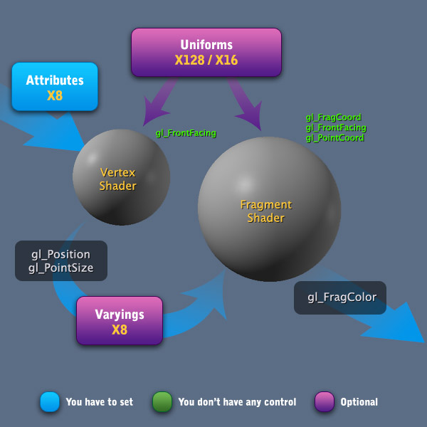    

你的VSH应该总是有一个或多个属性，因为属性用于构造3D对象的顶点，只能按每个顶点附带每个attributes。 要定义最终的顶点位置，您将使用内置变量gl_Position。 如果要绘制3D点，还可以设置gl_PointSize。 稍后，您将在FSH中设置gl_FragColor内置变量。   

Attributes，Uniforms和Varyings用于向GPU传输来自CPU中的数据。  

在进行渲染（调用glDraw *函数）之前，您可能会为VSH中的Attributes设置一些值。 这些值在所有顶点中可以是常数，或者在每个顶点处可以是不同的。 默认情况下，OpenGL可编程管道的任何实现必须至少支持8个属性。     

您不能将任何Varyings（变量）直接设置到FSH，您需要做的是将Varying输出设置到VSH中并准备FSH以接收该变量。正如您在图像中看到的那样，此步骤是可选的，如果使用的话实际上非常罕见地构造了一个不接受任何变化的FSH。 默认情况下，OpenGL可编程管道的任何实现必须至少支持8个变量。  

与着色器通信的另一种方法是使用Uniforms，但顾名思义，Uniforms在所有着色器处理过程中都是常量（所有顶点和所有片段）。 Uniforms的常见用法是采样器，您还记得采样器数据类型吗？ 它们用于保存我们的纹理单位。 你也记得纹理单位，对吧？ 为了明确这一点，采样器数据类型应该类似于int数据类型，但是保留用于纹理的特殊类型（只应该是它）。 支持的最小Uniforms与每种着色器类型不同。 VSH支持至少128个Uniforms，但FSH支持至少16个Uniforms。  

关于内置变量，OpenGL定义了几个变量，这些变量对于我们在每个着色器中是必需的。 VSH必须定义最终的顶点位置，这是通过变量gl_Position完成的，如果当前绘图原语是3D点，那么设置gl_PointSize也是个好主意。 gl_PointSize将指示FSH每个点将影响多少个片段，或简单地说，3D点的屏幕大小。这对于制作像火一样的粒子效果非常有用。在VSH中有一个内置的只读变量，gl_FrontFacing此变量是bool数据类型，它指示当前顶点是否正面。在FSH中，内置输出变量是gl_FragColor。为了与OpenGL的桌面版本兼容，还可以使用gl_FragData。 gl_FragData是一个与可绘制缓冲区相关的数组，但由于OpenGL ES只有一个内部可绘制缓冲区，因此该变量必须始终用作gl_FragData[0]。我的建议是忘记它并专注于gl_FragColor。关于只读的内置变量，FSH有三个：gl_FrontFacing，gl_FragCoord和gl_PointCoord。 gl_FrontFacing在VSH中是相等的，它是一个bool，表示当前片段是否正面。 gl_FragCoord是vec4数据类型，它指示相对于窗口的片段坐标（这里的窗口表示实际的OpenGL视图。当您渲染3D点时使用gl_PointCoord。在指定gl_PointSize的情况下，您可以使用gl_PointCoord来检索纹理例如，点大小总是正方形并以像素给出，因此大小为16表示由4 x 4像素组成的点.gl_PointCoord的范围为0.0  -  1.0，与纹理坐标完全相同内置输出变量中最重要的是最终值。因此你可以在VSH中多次更改gl_Position的值，最终位置将是最终值。对于gl_FragColor也是如此。下表显示内置变量及其数据类型：  

Vertex Shader Built-In Variables    
|Built-In Variable	 |   Precision |	Data Type  |
|  ----  | ----  | ---- |
|gl_Position	            |highp	    |vec4 |
|gl_FrontFacing	        |-	        |bool   |
|gl_PointSize	        |mediump	    |float  |

Fragment Shader Built-In Variables  
|Built-In Variable	    |Precision	|Data Type  |
|  ----  | ----  | ---- |
|gl_FragColor	        |mediump	    |vec4  |
|gl_FrontFacing	        |-	        |bool  |
|gl_FragCoord	        |mediump	    |vec4  |
|gl_PointCoord	        |mediump	    |vec2  |

是时候构建一个真正的着色器。 以下代码构造了一个Vertex和一个片段着色器，它使用了两个纹理贴图。 让我们从VSH开始吧。  
```cpp
precision mediump float;  
precision lowp int;
uniform mat4        u_mvpMatrix;
attribute vec4        a_vertex;  
attribute vec2        a_texture;
varying vec2        v_texture;
void main()  
{
    // Pass the texture coordinate attribute to a varying.
    v_texture = a_texture;

    // Here we set the final position to this vertex.
    gl_Position = u_mvpMatrix * a_vertex;
}
```  

```cpp
precision mediump float;  
precision lowp int;
uniform sampler2D    u_maps[2];
varying vec2        v_texture;
void main()  
{
    // Here we set the diffuse color to the fragment.
    gl_FragColor = texture2D(u_maps[0], v_texture);

    // Now we use the second texture to create an ambient color.
    // Ambient color doesn't affect the alpha channel and changes
    // less than half the natural color of the fragment.
    gl_FragColor.rgb += texture2D(u_maps[1], v_texture).rgb * .4;
}
```
现在是时候回到OpenGL API并准备我们的Attribute和Uniforms，记住我们没有直接控制Varyings，所以我们必须设置一个Attribute在VSH执行期间赋值给Varying。  

### Setting the Attributes and Uniforms(设置attr和unifrom)
要识别着色器内的任何变量，程序对象会定义其变量的位置（位置与索引相同）。一旦知道属性或统一的最终位置，就可以使用该位置来设置其值。

要设置Uniform，OpenGL只向我们提供一种方式：在链接之后，我们根据着色器内的名称检索所需Uniform的位置。

要设置Attribute，OpenGL为我们提供了两种方式：我们可以在程序链接后检索位置，或者可以在程序链接之前定义位置。无论如何我会告诉你两种方式，但是在链接之前设置位置没用，你就会理解为什么。让我们从这个无用的方法开始吧。你还记得glBindSomething =“拿一个容器”规则的例外吗？好的，就是这样。要在程序链接之前设置 attribute location，我们使用以glBindSomething开头的函数，但实际上OpenGL的Port Crane目前不接受任何容器。这里的“绑定”一词与程序对象内的进程有关，程序对象是在属性名和程序内的位置之间建立连接的过程。所以，功能是：  

* ```GLvoid glBindAttribLocation(GLuint program, GLuint index, const GLchar* name)```
    - ```program:glCreateProgram 函数生成的Program名称/ id。```
    - ```index:我们想要设置的位置。```
    - ```name:顶点着色器内的属性名称。```

在创建程序对象之后，但在链接之前，必须调用上述方法。 这是第一个因为我不鼓励使用这个函数的原因。 这是程序对象创建的中间步骤。 显然，您可以选择最适合您应用的方式。 我更喜欢下一个。 现在让我们看看如何在链接过程之后获取Attrib和uniform的位置。 无论选择何种方式，都必须将位置保存到应用程序中的每个着色器变量。 因为稍后您将需要这些位置来设置其值。 以下是链接后使用的函数：
* ```GLint glGetAttribLocation(GLuint program, const GLchar* name)```
    - ```program:glCreateProgram 函数生成的Program名称/ id。```
    - ```name:顶点着色器内的属性名称。```

* ```GLint glGetUniformLocation(GLuint program, const GLchar* name)```
    - ```program:glCreateProgram 函数生成的Program名称/ id。```
    - ```name:顶点着色器内的属性名称。```

一旦我们获得了Attrib和uniform的位置，我们就可以使用这些位置来设置我们想要的值。 OpenGL为我们提供了28个不同的功能来设置我们的Attrib和uniform的值。这些函数分组，允许您定义常量值（Attrib和uniform）或动态值（仅Attrib）。要使用动态Attrib，您需要启用它们一段时间。所以我的重要建议是：将Attrib仅限于动态值！如果你有一个恒定值，请使用uniform！另外，有两件事使得uniform成为恒定值的最佳选择：uniform可以在顶点着色器中使用128次，但Attrib只有8次，另一个原因是因为Attrib不能是数组。我稍后会解释这个事实。目前，虽然默认情况下OpenGL确实使用Attrib作为常量，但它们并不是为此目的而制作的，而是使它们变得动态。无论如何，我将展示如何设置动态Attrib，uniform甚至无用的常量Attrib。uniform可以与任何数据类型一起使用，甚至可以是任何数据类型的结构或数组。以下是设置uniform值的功能：

* ```GLvoid glUniform{1234}{if}(GLint location, T value[N])```
    - ```location:glGetUniformLocation函数返回的位置。```
    - ```value[N]:要根据函数名称的最后一个字母设置的值，i = GLint，f = GLfloat。 您必须根据函数名{1234}中指定的数字重复此参数N次。```

* ```GLvoid glUniform{1234}{if}v(GLint location, GLsizei count, const T* value)```
    - ```location:glGetUniformLocation函数返回的位置。```
    - ```count:您正在设置的数组的长度。 如果您只想设置一个Uniform，则此值为1。 值大于1表示您要将值设置为数组。```
    - ```value:指向要设置的数据的指针。 如果要设置矢量Uniform（例如vec3），则每组3个值将代表着色器中的一个vec3。 值的数据类型必须与函数名称中的字母匹配，i = GLint，f = GLfloat。```

* ```GLvoid glUniformMatrix{234}fv(GLint location, GLsizei count, GLboolean transpose, const GLfloat* value)```
    - ```location:glGetUniformLocation函数返回的位置。```
    - ```count:您正在设置的矩阵数。 如果您只想在着色器中设置一个矩阵{234}，则此值为1。 值大于1表示您要将值设置为矩阵数组，数组在着色器中定义为mat{234} [“count”]。```
    - ```transpose:此参数必须为GL_FALSE，这是与桌面版兼容的内部约定```
    - ```value:数据指针```

函数详细列表
* ``` glUniform1i(GLint location, GLint x)```
* ``` glUniform1f(GLint location, GLfloat x)```
* ``` glUniform2i(GLint location, GLint x, GLint y)```
* ``` glUniform2f(GLint location, GLfloat x, GLfloat y)```
* ``` glUniform3i(GLint location, GLint x, GLint y, GLint z)```
* ``` glUniform3f(GLint location, GLfloat x, GLfloat y, GLfloat z)```
* ``` glUniform4i(GLint location, GLint x, GLint y, GLint z, GLint w)```
* ``` glUniform4f(GLint location, GLfloat x, GLfloat y, GLfloat z, GLfloat w)```
* ``` glUniform1iv(GLint location, GLsizei count, const GLint* v)```
* ``` glUniform1fv(GLint location, GLsizei count, const GLfloat* v)```
* ``` glUniform2iv(GLint location, GLsizei count, const GLint* v)```
* ``` glUniform2fv(GLint location, GLsizei count, const GLfloat* v)```
* ``` glUniform3iv(GLint location, GLsizei count, const GLint* v)```
* ``` glUniform3fv(GLint location, GLsizei count, const GLfloat* v)```
* ``` glUniform4iv(GLint location, GLsizei count, const GLint* v)```
* ``` glUniform4fv(GLint location, GLsizei count, const GLfloat* v)```
* ``` glUniformMatrix2fv(GLint location, GLsizei count, GLboolean transpose, const GLfloat* value)```
* ``` glUniformMatrix3fv(GLint location, GLsizei count, GLboolean transpose, const GLfloat* value)```
* ``` glUniformMatrix4fv(GLint location, GLsizei count, GLboolean transpose, const GLfloat* value)```


记住两个重要的事情：两个着色器都可以使用相同的Uniform，这样做只需将它声明为两者。

第二件事是最重要的，Uniform将被设置为当前正在使用的程序对象。所以你必须在为它设置Uniform和属性值之前开始使用程序。要使用你记得的程序对象，对吗？只需调用glUseProgram，通知所需的名称/ ID。现在让我们看看如何设置值到属性。属性只能用于float，vec2，vec3，vec4，mat2，mat3和mat4等数据类型。属性不能声明为数组或结构。以下是定义属性值的函数。

* ```GLvoid glVertexAttrib{1234}f(GLuint index, GLfloat value[N])```
    - ```index:属性的位置由glGetAttribLocation函数返回或用glBindAttribLocation定义。。```
    - ```value[N]:要设置的值。 您必须根据函数名{1234}中指定的数字重复此参数N次。。```

* ```GLvoid glVertexAttrib{1234}fv(GLuint index, const GLfloat* values)```
    - ```index:属性的位置由glGetAttribLocation函数返回或用glBindAttribLocation定义。。```
    - ```values:要设置的值。 指向包含要设置的值的数组的指针。 仅使用数组中必需的元素，例如，如果通知4个元素的数组，则设置vec3时，仅使用前三个元素。 如果着色器需要自动填充，它将使用vec4的身份（x = 0，y = 0，z = 0，z = 1），例如，如果你设置一个vec3，如果你传递一个2的数组 元素，第三个元素将填充值0.对于矩阵，自动填充将使用矩阵标识。```

* ```GLvoid glVertexAttribPointer(GLuint index, GLint size, GLenum type, GLboolean normalized, GLsizei stride, const GLvoid* ptr)```
    - ```index:属性的位置由glGetAttribLocation函数返回或用glBindAttribLocation定义。。```
    - ```size:每个元素的大小。 这里的值可以是：```
        - ```1:在着色器中设置浮点数```
        - ```2:在着色器中设置vec2```
        - ```3:在着色器中设置vec3```
        - ```4:在着色器中设置vec4```
     - ```type:指定通知数组中使用的OpenGL数据类型。 有效值为：```
        - ```GL_BYTE```
        - ```GL_UNSIGNED_BYTE```
        - ```GL_SHORT```
        - ```GL_UNSIGNED_SHORT```
        - ```GL_FIXED```
        - ```GL_FLOAT```
    - ```normalized:如果设置为true（GL_TRUE），则将标准化非浮点数据类型。 规范化过程将转换后的浮点数放在0.0  -  1.0范围内。 如果将其设置为false（GL_FALSE），则非浮点数据类型将直接转换为浮点数。```
    - ```stride:它表示通知数组中元素的间隔。 如果为0，则将按顺序使用数组元素。 如果此值大于0，则将使用数组中的元素来遵循此步幅。 该值必须以基本机器单位（字节）为单位。```
    - ```ptr:指向包含数据的数组的指针。```

函数详细列表
* ```glVertexAttrib1f(GLuint index, GLfloat x)```
* ```glVertexAttrib2f(GLuint index, GLfloat x, GLfloat y)```
* ```glVertexAttrib3f(GLuint index, GLfloat x, GLfloat y, GLfloat z)```
* ```glVertexAttrib4f(GLuint index, GLfloat x, GLfloat y, GLfloat z, GLfloat w)```
* ```glVertexAttrib1fv(GLuint index, const GLfloat* values)```
* ```glVertexAttrib2fv(GLuint index, const GLfloat* values)```
* ```glVertexAttrib3fv(GLuint index, const GLfloat* values)```
* ```glVertexAttrib4fv(GLuint index, const GLfloat* values)```
* ```glVertexAttribPointer(GLuint index, GLint size, GLenum type, GLboolean normalized, GLsizei stride, const GLvoid* ptr)```

这里令人烦恼的是常量值是着色器的默认行为，如果要将动态值用于属性，则需要暂时启用此功能。 动态值将设置为每个顶点。 您必须使用以下函数来启用和禁用动态值行为：  

* ```GLvoid glEnableVertexAttribArray(GLuint index)```
    - ```index:属性的位置由glGetAttribLocation函数返回或用glBindAttribLocation定义。。```

* ```GLvoid glDisableVertexAttribArray(GLuint index)```
    - ```index:属性的位置由glGetAttribLocation函数返回或用glBindAttribLocation定义。。```

在使用```glVertexAttribPointer```为属性定义每个顶点值之前，必须使用```glEnableVertexAttribArray```启用所需属性的位置以接受动态值。 对于VSH和FSH对，我们可以使用以下代码来设置它们的值：

```cpp
// Assume which _program defined early in another code example.
GLuint mvpLoc, mapsLoc, vertexLoc, textureLoc;

// Gets the locations to uniforms.
mvpLoc = glGetUniformLocation(_program, "u_mvpMatrix");  
mapsLoc = glGetUniformLocation(_program, "u_maps");

// Gets the locations to attributes.
vertexLoc = glGetAttribLocation(_program, "a_vertex");  
textureLoc = glGetAttribLocation(_program, "a_texture");

// ...
// Later, in the render time...
// ...

// Sets the ModelViewProjection Matrix.
// Assume which "matrix" variable is an array with
// 16 elements defined, matrix[16].
glUniformMatrix4fv(mvpLoc, 1, GL_FALSE, matrix);

// Assume which _texture1 and _texture2 are two texture names/ids.
// The order is very important, first you activate
// the texture unit and then you bind the texture name/id.
glActiveTexture(GL_TEXTURE0);  
glBindTexture(GL_TEXTURE_2D, _texture1);  
glActiveTexture(GL_TEXTURE1);  
glBindTexture(GL_TEXTURE_2D, _texture2);

// The {0,1} correspond to the activated textures units.
int textureUnits[2] = {0,1};

// Sets the texture units to an uniform.
glUniform1iv(mapsLoc, 2, &textureUnits);

// Enables the following attributes to use dynamic values.
glEnableVertexAttribArray(vertexLoc);  
glEnableVertexAttribArray(textureLoc);

// Assume which "vertexArray" variable is an array of vertices
// composed by several sequences of 3 elements (X,Y,Z)
// Something like {0.0,0.0,0.0, 1.0,2.0,1.0, -1.0,-2.0,-1.0, ...}
glVertexAttribPointer(vertexLoc, 3, GL_FLOAT, GL_FALSE, 0, vertexArray);

// Assume which "textureArray" is an array of texture coordinates
// composed by several sequences of 2 elements (S,T)
// Something like {0.0,0.0, 0.3,0.2,  0.6, 0.3,  0.3,0.7, ...}
glVertexAttribPointer(textureLoc, 2, GL_FLOAT, GL_FALSE, 0, textureArray);

// Assume which "indexArray" is an array of indices
// Something like {1,2,3,  1,3,4,  3,4,5,  3,5,6,  ...}
glDrawElements(GL_TRIANGLES, 64, GL_UNSIGNED_SHORT, indexArray);

// Disables the vertices attributes.
glDisableVertexAttribArray(vertexLoc);  
glDisableVertexAttribArray(textureLoc); 
```
### using the Buffer Objects
使用缓冲对象非常简单！ 您需要的只是再次绑定缓冲区对象。 你还记得缓冲对象钩子是双重的吗？ 因此，您可以同时绑定GL_ARRAY_BUFFER和GL_ELEMENT_ARRAY_BUFFER。 然后调用glDraw *通知要启动的缓冲区对象的起始索引。 您需要通知start索引而不是数组数据，因此起始编号必须是指向void的指针。 起始索引必须是基本的机器单位（字节）。 对于上面的属性和制服代码，你可以做这样的事情：

```cpp
GLuint arrayBuffer, indicesBuffer;

// Generates the name/ids to the buffers
glGenBuffers(1, &arrayBuffer);  
glGenBuffers(1, &indicesBuffer);

// Assume we are using the best practice to store all informations about
// the object into a single array: vertices and texture coordinates.
// So we would have an array of {x,y,z,s,t,  x,y,z,s,t,  ...}
// This will be our "arrayBuffer" variable.
// To the "indicesBuffer" variable we use a
// simple array {1,2,3,  1,3,4,  ...}

// ...
// Proceed with the retrieving attributes and uniforms locations.
// ...

// ...
// Later, in the render time...
// ...

// ...
// Uniforms definitions
// ...

glBindBuffer(GL_ARRAY_BUFFER, arrayBuffer);  
glBindBuffer(GL_ELEMENT_ARRAY_BUFFER, indicesBuffer);

int fsize = sizeof(float);  
GLsizei str = 5 * fsize;  
void * void0 = (void *) 0;  
void * void3 = (void *) 3 * fsize;

glVertexAttribPointer(vertexLoc, 3, GL_FLOAT, GL_FALSE, str, void0);  
glVertexAttribPointer(textureLoc, 2, GL_FLOAT, GL_FALSE, str, void3);

glDrawElements(GL_TRIANGLES, 64, GL_UNSIGNED_SHORT, void0);  
```

## Rendering
我将展示基本的渲染类型，即设备屏幕的渲染。 正如您之前在本系列教程中所注意到的那样，您可以渲染到屏幕外的表面，如帧缓冲区或纹理，然后将其保存到文件中，或者在设备的屏幕上创建图像，无论您想要什么

### Pre-Render
渲染中我喜欢认为有两个步骤。 第一个是Pre-Render，在这个步骤中你需要清除最后一个渲染的痕迹。 这很重要，因为帧缓冲区中一只存在。 你记得什么是帧缓冲区，对吗？ 来自渲染缓冲区的图像集合。 因此，当您完成渲染时，即使最终图像已呈现到其所需曲面，渲染缓冲区中的图像仍然存活。 Pre-Render步骤的作用就是清理所有渲染缓冲区。 除非您因某种原因需要将以前的图像重用到渲染缓冲区中。 在帧缓冲区中进行清理非常简单。 

* ```GLvoid glClear(GLbitfield mask)```
    - ```mask:代表你想要清理的缓冲区。 这个参数可以是：```
        - ```GL_COLOR_BUFFER_BIT:清理“颜色渲染缓冲区”。```
        - ```GL_DEPTH_BUFFER_BIT:清理“深度渲染缓冲区”。```
        - ```GL_STENCIL_BUFFER_BIT:清理“模板渲染缓冲区”。```
正如您现在所知，与其中一个Port Crane Hook相关的每条指令都会影响最后一个绑定对象。 因此，在调用上述函数之前，请确保已绑定所需的帧缓冲区。 您可以一次清理多个缓冲区，因为掩码参数是位信息，您可以使用按位运算符OR“|”。 像这样的东西：

```cpp
glBindFramebuffer(GL_FRAMEBUFFER, _frameBuffer);  
glClear(GL_COLOR_BUFFER_BIT | GL_DEPTH_BUFFER_BIT); 
```
应在任何glDraw *调用之前调用Pre-Render步骤。 渲染缓冲区清理后，就可以绘制3D对象了。
### Drawing
我在本教程中已经多次展示过它，但是现在是时候深入钻研了它。 在OpenGL中绘制的触发器由两个函数组成：

* ```GLvoid glDrawArrays(GLenum mode, GLint first, GLsizei count)```
    - ```mode:此参数指定将呈现的基元以及其结构的组织方式。 这个参数可以是：```
        - ```GL_POINTS:画点。 点由3个值（x，y，z）的单个序列组成。```
        - ```GL_LINES:画线。 线由3个值（x，y，z / x，y，z）的两个序列组成。```
        - ```GL_LINE_STRIP:绘制线条形成条带。 线由3个值（x，y，z / x，y，z）的两个序列组成。```
        - ```GL_LINE_LOOP:绘制循环线条。 线由3个值（x，y，z / x，y，z）的两个序列组成。```
        - ```GL_TRIANGLES:绘制三角形。 三角形由3个值（x，y，z / x，y，z / x，y，z）的三个序列组成。```
        - ```GL_TRIANGLE_STRIP:绘制形成条带的三角形。 三角形由3个值（x，y，z / x，y，z / x，y，z）的三个序列组成。```
        - ```GL_TRIANGLE_FAN:绘制三角形成扇形。 三角形由3个值的三个序列组成（x，y，z / x，y，z / x，y，z）```
    - ```first:指定启用的顶点数组中的起始索引。```
    - ```count:表示要绘制的顶点数。 这非常重要，它表示顶点元素的数量，而不是顶点数组中元素的数量，注意不要混淆两者。 例如，如果要绘制单个三角形，则此值应为3，因为三角形由3个顶点构成。 但是如果你正在绘制一个正方形（由两个三角形组成），那么它应该是6，因为它由两个3个顶点的序列组成，共有6个元素，依此类推。```

* ```GLvoid glDrawElements(GLenum mode, GLsizei count, GLenum type, const GLvoid* indices)```
    - ```mode:此参数指定将呈现的基元以及其结构的组织方式。 这个参数可以是：```
        - ```GL_POINTS:画点。 点由3个值（x，y，z）的单个序列组成。```
        - ```GL_LINES:画线。 线由3个值（x，y，z / x，y，z）的两个序列组成。```
        - ```GL_LINE_STRIP:绘制线条形成条带。 线由3个值（x，y，z / x，y，z）的两个序列组成。```
        - ```GL_LINE_LOOP:绘制循环线条。 线由3个值（x，y，z / x，y，z）的两个序列组成。```
        - ```GL_TRIANGLES:绘制三角形。 三角形由3个值（x，y，z / x，y，z / x，y，z）的三个序列组成。```
        - ```GL_TRIANGLE_STRIP:绘制形成条带的三角形。 三角形由3个值（x，y，z / x，y，z / x，y，z）的三个序列组成。```
        - ```GL_TRIANGLE_FAN:绘制三角形成扇形。 三角形由3个值的三个序列组成（x，y，z / x，y，z / x，y，z）```
    - ```count:表示要绘制的顶点数。 这非常重要，它表示顶点元素的数量，而不是顶点数组中元素的数量，注意不要混淆两者。 例如，如果要绘制单个三角形，则此值应为3，因为三角形由3个顶点构成。 但是如果你正在绘制一个正方形（由两个三角形组成），那么它应该是6，因为它由两个3个顶点的序列组成，共有6个元素，依此类推。```
    - ```type:表示在索引数组中使用的OpenGL的数据类型。 这个参数可以是：```
        - ```GL_UNSIGNED_BYTE: 索引数据类型为GLubyte```
        - ```GL_UNSIGNED_SHORT:索引数据类型为GLushort```
    - ```indices:指定指向存储索引的位置的指针。```

这里定义了可编程管道中最重要的事情之一，即VSH执行的次数！这是通过参数计数完成的。因此，如果您指定128，则当前正在使用的程序将处理其VSH 128次。当然，GPU会尽可能地优化这个过程，但总的来说，你的VSH将被处理128次以处理所有你定义的属性和uniform

为什么我说要关注顶点元素数与顶点数组中元素数之间的差异？很简单，你可以有一个包含200个元素的顶点数组，但由于某种原因你想在此时只构造一个三角形，所以count将是3，而不是200.如果你使用的是一个索引数组，那么这个数组会更有用。您可以在顶点数组中包含8个元素，但索引数组指定24个元素，在这种情况下，cout将为24.通常，它是您要绘制的顶点元素的数量。如果您正在使用```glDrawArrays```，则count的工作方式类似于每个顶点属性的初始步幅。因此，例如，如果将其设置为2，则顶点着色器中的值将以您在```glVertexAttribPointer```中指定的数组中的索引2开始，而不是0开始。如果您正在使用glDrawElements，则第first参数将像索引数组的初始步幅一样工作，而不是直接指向每个顶点值。类型标识数据类型，实际上它是一个优化提示。如果您的索引数组少于255个元素，那么使用GL_UNSIGNED_BYTE是一个非常好的主意。 OpenGL的一些实现也支持第三种数据类型：GL_UNSIGNED_INT，但这不常见。好的，现在让我们谈谈模式参数中定义的构造模式。这是一个用于构建网格的提示。但是模式对于所有类型的网格都没那么有用。以下图片可以帮助您理解：  
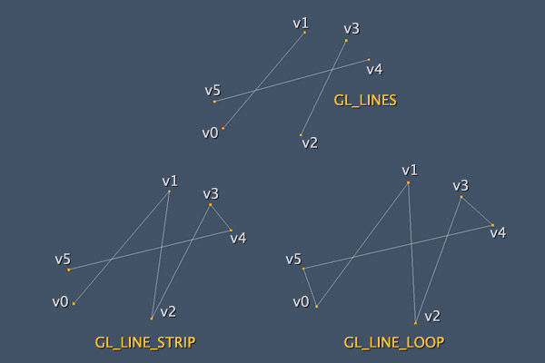  
上图显示了当我们使用其中一种线条绘制模式进行绘制时会发生什么。 上图中的所有绘图都是以{v0，v1，v2，v3，v4，v5}的序列作为顶点数组，假设每个顶点对x，y，z坐标具有唯一值。 正如我之前所说，与任何类型的绘制兼容的模式是GL_LINES，其他模式用于在某些特定情况下进行优化。使用GL_LINES绘制的线条数为3，使用GL_LINE_STRIP绘制的线条数为5，GL_LINE_LOOP为6，始终使用相同的顶点数组和相同数量的VSH循环  

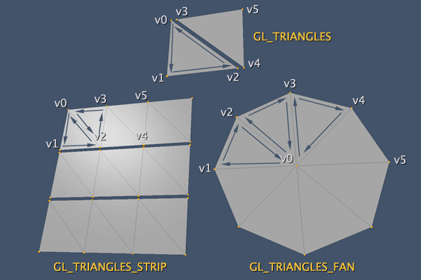  
上图显示了当我们使用其中一个三角形绘制模式绘制时会发生什么。图像中所有指示的图形都是以{v0，v1，v2，v3，v4，v5}的序列作为顶点数组，假设每个顶点具有x，y，z坐标的唯一值。同样，同样的事情，只是基本的GL_TRIANGLES对任何类型的网格都有用，其他模式在某些特定情况下用于优化。使用GL_TRIANGLES_STRIP我们需要重用最后形成的行，在上面的例子中，我们必须使用像{0,1,2,0,2,3,3,2,4，...}这样的索引数组进行绘制。使用GL_TRIANGLES_FAN我们必须始终返回第一个顶点，在图像中我们可以使用{0,1,2,0,2,3,0,3,4，...}作为索引数组。我的建议是尽可能使用GL_TRIANGLES和GL_LINES。 STRIP，LOOP和FAN的优化增益可以通过使用其他技术优化其他区域中的OpenGL绘制来实现，例如减少多边形到网格中的数量或优化着色器处理。

### Render
你必须绑定颜色渲染缓冲区，显然，你也需要绑定帧缓冲区。 这是因为渲染缓冲区保持在帧缓冲区“内部”，你还记得吗， 最终的代码将是这样的：  
```cpp
// glfw: swap buffers and poll IO events (keys pressed/released, mouse moved etc.)
// -------------------------------------------------------------------------------
glfwSwapBuffers(window);
glfwPollEvents();
```
对于使用EGL API的人，该过程只是使用glSwapBufers函数交换内部缓冲区。

OpenGL还提供了一种名为Multisample(多重采样)的东西，它是一种特殊的渲染方式，可以产生抗锯齿图像

## 总结
* 我们看到了OpenGL的数据类型和可编程管道。
* 您的网格（基元）数据必须是信息数组。 应对其进行优化以形成结构阵列。
* OpenGL作为港口起重机工作，有多个带钩的臂。 四个很棒的钩子：帧缓冲钩，渲染缓冲钩，缓冲物钩和纹理钩。
* 帧缓冲区包含3个渲染缓冲区：颜色，深度和模板。 它们形成一幅来自图像OpenGL渲染的。
* 在上传到OpenGL之前，纹理必须具有特定格式（特定像素顺序和每个像素的颜色字节）。 创建OpenGL纹理后，需要激活将在着色器中处理的纹理单元。
* Rasterize是一个很大的过程，包括几个测试和每个片段操作。
* 着色器成对使用，必须位于program。 着色器使用自己的语言GLSL或GLSL ES。
* 您只能在属性中将动态值定义为VSH（每顶点值）。 uniform总是不变的，可以在两种着色器中使用。
* 在开始向其中绘制新内容之前，您需要清理缓冲区。
* 您将为要渲染的每个3D对象调用glDraw*函数。
* 最终渲染步骤使用EGL API（或iOS案例中的EAGL API）进行。

## 3D textures(3d纹理)
## multisampling（多重采样）
## render to off-screen surfaces（离屏绘制）
## per-fragment operations（片段操作）

# Cameras on OpenGL ES 2.x - The ModelViewProjection Matrix(ModelViewProjection矩阵)
[参考地址](http://blog.db-in.com/cameras-on-opengl-es-2-x/)    

正如您已经知道的那样，我们设备屏幕背后的世界只是尝试重现人眼的美丽和复杂性。 为此，我们使用相机，这是现实世界中人眼的模拟。 为了构建相机，我们使用数学方程。  

在这篇文章中，我将讨论它背后的相机和Projection，凸透镜和凹透镜之间的区别，投影，矩阵，四元数以及最后着名的mvp矩阵。  

首先让我们看看相机的基本知识，它在现实世界中的工作原理，镜头差异，变焦如何工作，翻译，旋转和一些类似的概念。 在巩固这些概念之后，让我们深入了解OpenGL，并了解所有这些在我们的应用程序中是如何适应的。 所以我们最终转到代码，我会给你方程式并解释它们是如何工作的。

当我说Khronos委派了许多职责并专注于3D世界最重要的部分时，你还记得我的OpenGL系列教程吗？  

通过OpenGL控制摄像头，我们只有两三种摄像头。 但是当我们开始自己编程相机时，我们可以创建任何类型的相机。 在本文中，我将讨论基本相机：正交相机和透视相机。


## Cameras in the 3D world
## The code behind the 3D world
### Matrices
### Matrices in Deep
### Quaternions
## The code behind the 3D cameras

# OpenGL ES 2.0和2D图形高级技巧
[参考地址](http://blog.db-in.com/all-about-opengl-es-2-x-part-3/)  

1. OpenGL的逻辑由3个简单的概念组成：Primitives，Buffers和Rasterize。
2. OpenGL ES 2.x使用可编程管道，这是Shaders的同义词。
3. OpenGL不了解输出设备，平台或输出表面。 为了在OpenGL的核心和我们的设备之间建立桥梁，我们必须使用EGL（或iOS中的EAGL）。
4. 纹理是至关重要的，应具有特定的像素格式和顺序，以适应OpenGL。
5. 我们通过调用glDraw *来启动渲染过程。 第一步将通过顶点着色器，如果处理过的顶点可以进入片段着色器，则会进行多次检查。
6. 我们网格的原始结构永远不会改变。 我们只需创建转换矩阵即可产生所需的结果。

首先我将讨论2D图形，然后让我们看看什么是多重采样/抗混叠滤波器，我个人不喜欢这种很耗性能的技术。 很多时候，如果没有多重采样，应用程序可以很好地运行，但是简单的多重采样过滤器可以完全破坏该应用程序的性能。有时，真正需要进行临时多重采样以产生平滑的图像。   

稍后我将讨论深度纹理和优化每像素2字节数据格式。 另外，让我们看看PVRTC以及如何将它放在OpenGL的纹理中，除了渲染到屏幕外的表面。  

最后，我将简要介绍一下我自己发现的一些表演成果。 一些提示和技巧今天真的对我很有帮助.  

## 2D graphics with OpenGL(2D图形)
三个基元（三角形，线条和点）适用于3D和2D。  

关于2D图形的第一件事是Z深度。 我们所有的工作都变成了两个维度，这意味着我们不再需要使用深度渲染缓冲区，因为我们绘制的所有内容都将在相同的Z位置（通常为0.0）上进行。

一个问题出现了：“那么OpenGL将如何知道应该在其他对象的前面（或顶部）绘制哪个对象？” 通过按照我们想要的顺序绘制对象非常简单（应首先绘制背景中的对象）。 OpenGL还提供了一个名为Polygon Offset的功能，但它更像是一个调整而不是一个真正的排序。 好的，现在我们可以通过三种方式思考2D图形：   
1. 在同一个Z位置上有很多正方形。
2. 同一个Z位置上有很多点。
3. 以上全部。

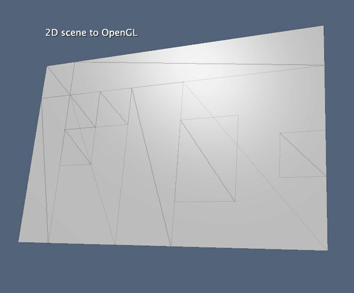    
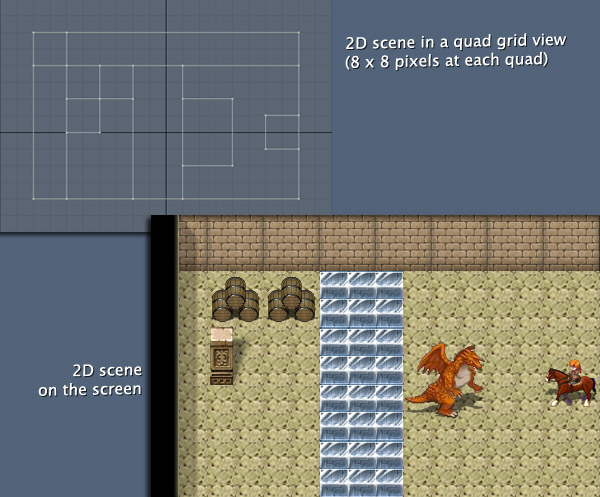   

你可以想象OpenGL是一种状态机，它准备与数百万个三角形一起使用来处理这些三角形，在极端情况下，2D图形可以处理数百个三角形。用简单的词语，一切都将是纹理。因此，我们使用2D的大多数工作都将在纹理上。许多人觉得有必要创建一个API来处理纹理Non-POT纹理，这意味着，使用尺寸为36 x 18,51 x 39等的纹理。我的建议是：“不要那样做！”。使用Non-POT纹理处理2D图形不是一个好主意。正如你在上面的上一张图片中看到的那样，使用假想的网格（应该是POT）总是一个好主意，一个好的选择可能是16x16或32x32。如果您计划使用PVRTC压缩图像文件，最好使用8x8网格，因为PVRTC最小尺寸为8.我不建议使网格小于8x8，因为它不必要精确，可能会增加您的工作开发，它也会影响您的应用程序的性能。 8x8尺寸的网格非常精确，我们很快就会看到网格之间的差异以及何时以及如何使用它们。


## The Grid Concept（Grid网格）  
我认为这是2D应用程序规划中最重要的部分。 例如，在3D游戏中，为了确定角色可以行走的位置，我们必须创建碰撞检测器。 该探测器可以是盒子（边界框）或网格（边界网格，原始的简单复制品）。 在这两种情况下，计算都非常重要且昂贵。 但是在2D应用程序中，如果使用网格，则很容易找到碰撞区域，因为您只有使用X和Y坐标的方形区域！ 这只是一个原因，因为网格非常重要。 我知道你可以提出网格的许多其他优点，比如组织，计算的精确度，屏幕上对象的精度等。  
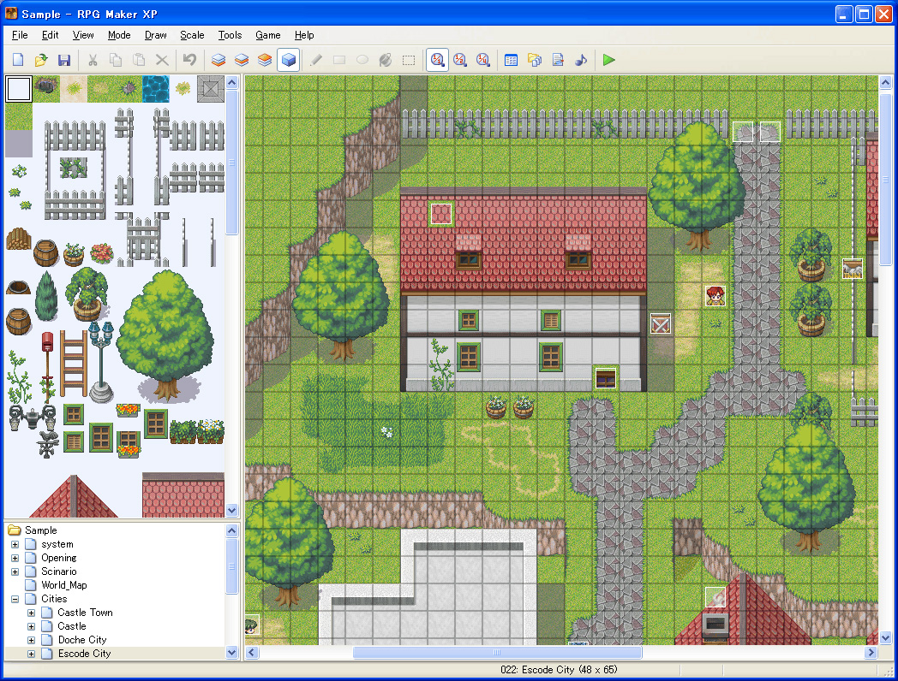    


## The Depth Render Buffer in 2D（2d深度绘制）
了解2D图形如何与OpenGL相结合，我们可以采用更精细的方法思考，就像在2D应用程序中使用Depth Buffer一样。  

通过使用深度渲染缓冲区，您可以在2D应用程序中自由使用3D模型。因此，您可以旋转，缩放和转换关于网格和2D概念的3D模型（无Z转换）。结果要好得多，但随着任何改进，与2D正方形相比，它的性能成本很高。但是混合3D和2D概念还有另一个重要的事情：使用相机。锁定Z平移，而不是在屏幕前面创建单个平面，您可以沿Z轴创建一个很棒的平面，将对象放置在3D应用程序中，并创建具有正交投影的相机。你记得它是什么以及怎么做，对吧？ 在进一步使用2D图形进入摄像机和深度渲染缓冲区之前，重要的是要知道在这一点上，在代码级别，2D和3D图形之间没有真正的区别，因为一切都来自您自己的计划和组织。因此，使用Depth缓冲区的代码与我们在上一部分中看到的相同（单击此处查看上一个教程）。现在让我们来谈谈带有2D图形的相机。
## The Cameras with 2D（2D相机）
好的，我相信你现在知道如何制作相机和正投影，正如你在关于相机的教程中看到的那样，对吧？ （点击这里查看相机教程）。 现在出现了一个问题：“在2D图形中使用相机和深度渲染缓冲区的最佳位置和方法在哪里？”。 以下图片可以帮助更多  


## The Multisampling（多重采样）
## More About Textures（纹理）
### Bytes per Pixel
### PVRTC
## Tips and Tricks（技巧）
### The Cache（缓存）
### Store the Values
### C is Always the Fastest Language