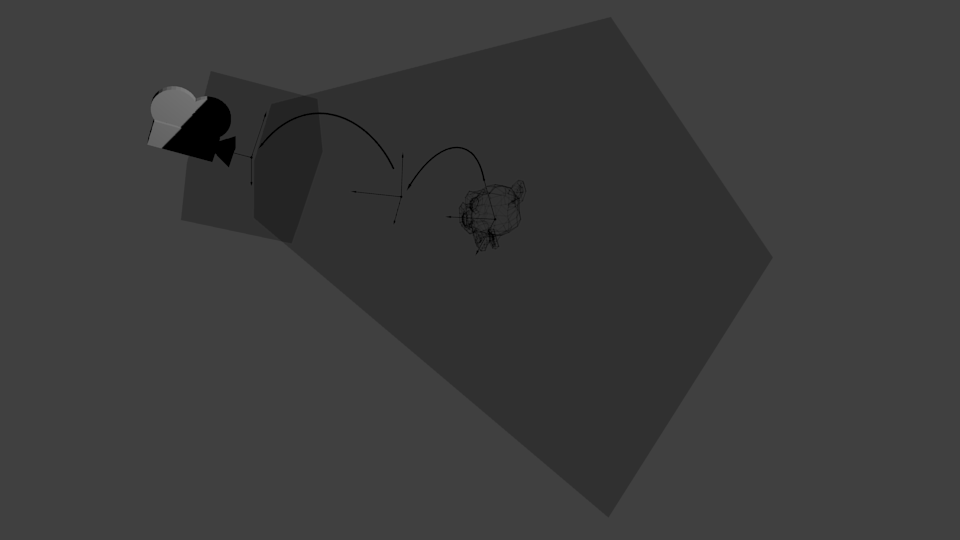
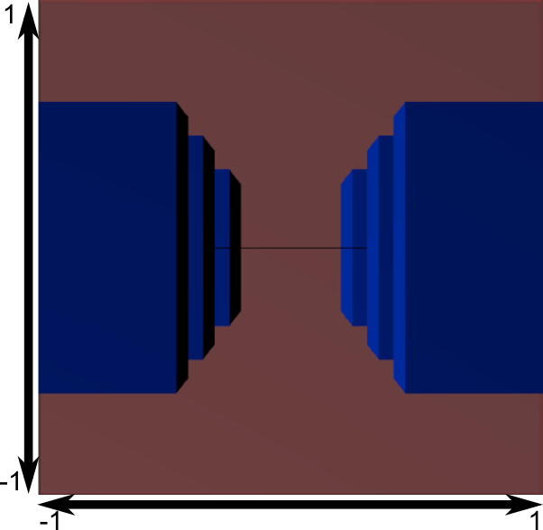

[参考地址1](http://blog.db-in.com/cameras-on-opengl-es-2-x/)    
[参考地址2](http://www.opengl-tutorial.org/cn/beginners-tutorials/tutorial-3-matrices/)    
# The ModelViewProjection Matrix  
大家好，本文将会讲解在3D世界中非常非常重要的一个知识，正如你所知的，为了让屏幕重现人眼复制和美丽的视觉效果，我们使用了相机这个概念，可以模拟真实世界中的人眼，我们使用了数学公式创建相机.  

在本文中，我将介绍这些相机及其背后的公式，凸透镜和凹透镜之间的差异，投影，矩阵，四元数，最后是著名的模型-视图-投影矩阵(Model View Projection Matrix)。

## 本文内容目录  
* Cameras in the real world(真实世界的相机)  
* 3D history(3D历史)   
* Projections(投影)
* Cameras in the 3D world(3D世界中的相机)  
* The code behind the 3D world(3D世界后面的几何原理)
    * Matrices(矩阵)
    * Matrices in Deep(深入矩阵)
    * Quaternions(四元数)
* The code behind the 3D cameras(3D相机的几何原理)  
* Conclusion(总结)  
* MVP(MVP矩阵图示)
-------


首先，让我们看一下相机的基本知识，它在现实世界中的工作原理，镜头差异，变焦的工作原理，平移，旋转和一些类似的概念。 巩固这些概念之后，让我们深入OpenGL，并了解所有这些如何适合我们的应用程序。 因此，我们最终转到代码，我将为您提供方程式并解释它们的工作原理。 

从OpenGL ES 1.x到2.x，相机是Khronos委托的职责之一。 因此，现在我们必须自己创建摄像机。 借助着色器行为，我们可以对应用程序进行惊人的控制，除此之外，我们还可以自由构建出色的3D引擎。  

通过OpenGL控制我们创建的摄像机(opengl只提供了两种或三种摄像机)。 但是，通过创建的相机的参数，我们可以创建任何类型的摄像机。 在本文中，我将讨论基本相机：正交相机和透视相机。  


## Cameras in the real world(真实世界的相机)   
人的眼睛是凸透镜，它会聚图像以便在视网膜上形成倒置的图像。 通常相机的镜头由多个镜头凸起和凹凸形成，但最终的图像看起来更像是一个凸透镜，就像人的眼睛一样。  
最终图像取决于许多因素，而不仅仅是镜头的类型，但一般来说，下面的图像显示了每种镜头后面的图片。  
    
两种类型都可以产生与原始图像相同的图像，我的意思是，具有微小的失真角度，这取决于物体距镜头的距离和视角。 下一张图像将显示相机最重要的属性。  
  
上图中的红色区域对于相机是不可见的，因此这些区域中的任何片段都将被剪裁。 “Depth of Field”(景深)是可见区域，其中的所有片段都是可见的。通常，“景深”这个词也用来描述一种特殊的效果，即镜头模糊的效果。由于人的眼睛有焦点，使焦点外的物体看起来模糊，镜头模糊效果模拟焦点，使焦点外的物体看起来模糊。我为什么没有将“焦点”属性放在上面的图像上呢？由于焦点是某些相机中的特殊功能，因此3D中的基本相机不会实现焦点行为。另一个重要属性是“Angle of View”(视角)，它表示相机可见的水平角度。此角度以外的任何片段都不会对相机可见。有时这个“视角”也用于表示垂直区域，但通常我们更喜欢使用宽度和高度来定义最终图像的宽高比。  

现代相机非常精确，可以使用这些属性和镜头类型组合产生令人敬畏的效果。 现在让我们回到我们的虚拟世界，看看我们如何以数学方式转换这些属性和行为。 但在转向3D相机之前，我们需要更多地了解3D世界中的数学知识。  

## Short history about 3D world(3D历史)

我们的3D世界祖父是欧几里得，也称为亚历山大的欧几里得。 他住在公元前323-283年(哇，有点老！)在希腊城市亚历山大。 欧几里得创造了直到今天我们一直使用的称为欧几里得空间和欧几里得几何的东西，我敢肯定您以前听过这些名字。 基本上，欧几里得空间由3个平面组成，这些平面赋予我们X，Y和Z轴。每个平面都使用传统的几何形状，而这是另一位希腊毕达哥拉斯(570BC-495 BC)做出的巨大贡献。 嗯，不难理解为什么欧几里得发展了他们的概念，希腊人热爱建筑，并且为了构建完美的形式，他们需要在3D虚构的世界中进行所有演算，而无需谈论其哲学和科学激情 。   

我们进入了17世纪初，一位名叫笛卡尔的伟人创造了一种称为笛卡尔坐标系的东西。由于笛卡尔坐标系，我们能够使用矩阵进行欧几里德变换(移动，缩放，旋转)。欧几里得变换是使用传统毕达哥拉斯方法进行的，因此您可以想象其中有多少计算，但是由于使用笛卡尔，我们能够使用矩阵进行欧几里得变换。 简单，快速，就是纯净的美丽！ 3D世界中的矩阵真强大！  

但是欧几里德变换的矩阵并不完美。它们产生一些问题，最大的问题与旋转有关，被称为万向节锁。当您尝试旋转一个平面而其他两个平面无意间相互接触时，会发生这种情况。许多年后，另一位名叫威廉·哈密顿爵士的伟人于1843年创造了一种处理欧几里德旋转和避免万向节锁定的方法，汉密尔顿创造了一种叫做Quaternions(四元数)的东西！ Quaternion是处理3D旋转的更快，更好和最优雅的方式。四元数由虚部(复数)和实部组成。在3D世界中，我们总是使用具有单位向量的计算(其幅度/长度等于1的向量)我们可以丢弃四元数的虚部并且仅使用实数。   

  
  
    

通常，存在物体坐标系和世界坐标系，当物体绕Y轴转动90度以后，物体坐标系的X轴和世界坐标系的Z轴就变成了同一个轴。此时，就产生了万向锁现象。
万向锁产生的原因不是欧拉角也不是旋转顺序，而是我们的思维方式和程序的执行逻辑没有对应，也就是说是我们的观念导致这个情况的发生。

所有这些与相机有什么关系？很简单，基于所有这些，我们开始使用4x4矩阵处理欧几里德变换，并使用具有4个元素的向量来描述一个点的空间(X，Y，Z，W)。 W是齐次坐标元素。我在这里不讨论它，而只是让您知道齐次坐标是由(August FerdinandMöbius)于1827年创建的，用于处理笛卡尔系统中的无穷大概念。无穷大的概念很难适应笛卡尔系统，我们可以为其使用一个复杂的虚数，但这对实际计算而言并不是那么好。因此，为了解决这个问题，莫比乌斯只添加了一个变量W(这是一个实数)，并将我们带回了实数世界。无论如何。关键是矩阵4x4与向量4完全吻合，并且由于我们使用单个矩阵将欧几里德变换转化为3D世界，因此我们认为使用相同的4x4矩阵处理相机中的顶点是一个好主意。

   
上图显示了Matrix 4x4和Quaternions。 如您所见，矩阵有3个独立的平移槽(位置X，Y，Z)，但其他指令在其红色区域混合。 每个旋转(X，Y和Z)影响4个槽，每个刻度(X，Y和Z)影响1个槽。 四元数有4个实数，其中3个表示顶点(X，Y和Z)，这个顶点形成一个方向。 第四个值表示围绕其自身枢轴的旋转。 我们稍后会讨论四元数，但其最酷的特征之一是我们可以从中提取旋转矩阵。 我们可以通过构建一个只填充黄色元素的Matrix 4x4来实现。  

## Projection(投影)  
有以下两种投影类型  
   
   
这很简单，正交投影常用于2D游戏,正交投影在现实世界中不存在，人类的眼睛不可能以这种方式接收图像，因为在我们的眼睛形成的图像上总是有一个消失的点。因此，真正的相机总是使用Perpective投影捕获图像。   

像《星际争霸》这样的游戏使用透视投影来模拟正交投影。 可能吗？ 是的! 由于一切都与镜头行为有关，因此最终图像取决于许多因素，例如，具有大视角的透视投影可能更像是正交投影，我的意思是，它就像是从飞机上向地面看。 从那个距离看，城市看起来像一个模型，消失点似乎没有效果。

 

在继续之前，我们需要做一点题外话，以深刻理解这两个投影之间的区别。您还记得笛卡尔(RenéDescartes)及其笛卡尔系统对吗？在线性代数中，即使在无穷大的情况下，两条平行线也永远不会接触。我们如何处理线性代数中的无穷思想？使用带有∞(无穷大符号)的计算吗？要创建透视投影，我们确实需要一个消失点，并且必须有两条平行线在无穷远处接触。

 
感谢一个叫奥古斯特·费迪南德·莫比乌斯的人，我们可以解决这个小问题。这个人创造了一个叫做“齐次坐标”的东西。这个想法非常简单，令人难以置信(就像我喜欢的那样)。只需将1个最后一个坐标号加到任何维系统中，即坐标w。 2D变成2D +1(x，y-> x，y，w)，3D变成3D +1(x，y，z-> x，y，z，w)。在空间计算中，我们只需将原始值除以w，就可以了！看下面的伪代码：
```cpp
// This is the original cartesian coordinates.
x = 3.0; y = 1.5; 
// This is new homogeneous coordinate.
w = 1.0; 
// Space calculations. 
finalX = x/w; finalY = y/w;
```
在大多数情况下，w将为1.0。它只会改变以表示∞(无穷大)，在这种情况下，w将为0.0！ “ WTF !!!除以0？”不完全是。 w通常用于求解两个方程组，因此，如果我们得到0，则投影将被发送到无穷大。我知道，理论上似乎很困惑，但是一个简单的实际例子就是阴影的产生。当我们在3D场景中有灯光，无穷远或无衰减的灯光时(例如3D世界中的太阳光)，我们可以简单地使用w等于0来创建由该灯光生成的阴影。这样，阴影将可以与原始模型完全一样地投影在墙壁或地板上。显然，现实世界中的光影比这复杂得多，但请记住，在我们的虚拟3D世界中，我们只是在模仿真实的行为。通过一些其他步骤，我们可以模拟更逼真的阴影行为，这对于在其渲染中实现的专业3D软件来说非常好，但是对于游戏不是一个好的解决方案，更逼真的阴影需要CPU和处理器上的大量处理。 GPU。对于游戏而言，使用Möbius投射阴影非常简单，并且对玩家来说非常好！

好的，这一切都与Projections有关，现在让我们转到OpenGL，看看如何用我们的代码实现所有这些概念。矩阵和四元数将是我们的盟友。


## 3D世界中的相机(Cameras in the 3D world)  
我们需要了解的第一件事是有关3D世界中转换的方式。一旦我们定义一个3D对象的结构，其结构将保持不变(元素可以是顶点，纹理坐标和法线)。 逐帧变化的只是一些矩阵(通常只是一个矩阵)。 这些矩阵将根据原始结构产生临时更改。 因此请记住，“原始数据将永远不会改变”！  
因此，当我们深入旋转屏幕上的对象时，我们正在做的是创建一个矩阵，其中包含使旋转因子发生的信息。 然后在着色器中，当我们将该矩阵乘以对象的顶点时，在屏幕上，该对象似乎正在旋转。 其他任何3D元素(例如灯光或照相机)也是如此。 但是相机对象具有特殊的行为，必须反转其上的所有变换。 以下示例可以帮助您了解此问题： 
   

  

请注意，在以上图片中，两种情况下设备屏幕上生成的图像都是相同的。 这种行为使我们产生了一个想法：与对象空间相比，每次摄影机的运动都被反转。 例如，如果摄像机进入+ Z轴，则将产生与将3D对象发送到-Z轴相同的效果。旋转+ Y相机将具有如在其本地-Y轴旋转所述三维物体相同的效果。 因此，保持这个想法，相机的每一次变换都会被翻转，我们将很快使用它。

关于摄影机的下一个概念是如何使局部空间与世界空间交互。 在上面的示例中，如果我们想在局部空间中沿-Y旋转物体，会产生与以摄像机为枢沿+Y方向旋转摄像机并且在XZ平面内绕物体移动摄像机相同的结果。使用矩阵来处理这样的操作会为我们节省大量时间。从局部空间旋转变为全局空间旋转我们所需要做的全部就是改变相乘时矩阵的顺序(A x B = 局部， B x A = 全局，记住矩阵乘法是不满足交换律的)。因此我们必须用摄像机的矩阵乘以物体的矩阵，按照这种顺序。

看起来很混乱，但是请相信我，代码比您想象的简单得多。 让我们回顾一下这些概念并深入研究代码。

OK，我知道谈论技术会让人迷惑，但是相信我，代码会比你想象中的要简单。我们再回顾一下这些概念然后开始进入代码。
* 我们从不会改变物体的结构，改变的只是一些矩阵，这些矩阵会乘以原始物体的结构以得到我们想要的结果。  
* 对于摄像机，在我们构造矩阵之前，所有的变换都应当反转。  
* 摄像机将会是我们在3D世界中的眼睛，我们假设摄像机总是在局部空间，所以最终的矩阵将会是“摄像机矩阵x物体矩阵”的结果，严格按此顺序。  

## 3D世界后面的几何原理(The code behind the 3D world)
我将展示处理这些工作的所有公式，并解释它们的使用方法，但是我不会深入讲述这些公式背后的数学逻辑，也不会讲述这些共识是如何创建的，这不是我此处的目的。如果你很感兴趣想深入知道这些公式是如何创建的，我会向你推荐一本很棒的书，讲解了这些公式是怎么来的，还有一个很棒的数学网站：

* 推荐的书： ```Mathematics for 3D Game Programming and Computer Graphics.```  
* 网站：[地址](http://www.euclideanspace.com)  
EuclideanSpace这个网站的布局不太好，看起来有些业余，但是相信我那里的所有公式都非常可靠，所有的公式。导航通过顶部菜单来实现，初看可能会有些疑惑，但是很有组织，很有数学的思维。

OK，我们开始矩阵。

### 矩阵(Matrices)
有些人认为矩阵就是神奇的黑盒，确实，它可以做出很神奇的事情。但是他不是黑盒，它更像是一个组织良好的包裹，并且我们可以理解魔法使如何工作的，它的“手段”是什么，理解了它如何组织我们可以使用矩阵来做很多事。记住矩阵所做的一切也是欧几里得使用毕达哥拉斯方法和角度的概念所做的。笛卡尔只是把所有的知识放在一个叫做矩阵的包裹里。在3D世界里我们使用4x4矩阵(4行4列)，这种矩阵也被称为方阵(square matrix)。最快最简单的方法在编程语言中表达矩阵是通过数组。更确切地说是一个有16个元素的线性一维数组。
使用线性一维数组我们可以用两种方法来表达一个矩阵，行优先(row-major)或列优先(column-major)。这只是一种惯例，因为实际上左乘(pre-multiply)一个行优先矩阵和右乘(post-multiply)一个列优先矩阵会得到相同的结果。然而，OpenGL选择了列优先的记法，我们也跟随这种方法。
下边是把数组下标使用列优先记法来组织：
#### 列优先记法(Column-Major Notation)
```
    |    0        4        8        12   |
    |                                    |
    |    1        5        9        13   |
    |                                    |
    |    2        6        10       14   |
    |                                    |
    |    3        7        11       15   |
```
接下来我要现实5种矩阵(平移矩阵，缩放矩阵，X旋转矩阵，Y旋转矩阵和Z旋转矩阵)，稍后我们会展示如何把它们合成一个单个的矩阵。

#### 平移矩阵(Translation Matrix)
使用4x4矩阵完成的最简单的操作就是平移，即改变X，Y和Z的位置。非常非常简单，你甚至不需要公式。你需要做的是这个：   
```
    |    1        0        0        X    |
    |                                    |
    |    0        1        0        Y    |
    |                                    |
    |    0        0        1        Z    |
    |                                    |
    |    0        0        0        1    |
```

#### 缩放矩阵(Scale Matrix)
次简单的操作是缩放。正如你在3D专业软件中所看到的，你可以对于每个轴向单独地修改缩放。这一操作不需要公式。你要做的是这个： 
```
    |    SX       0        0        0    |
    |                                    |
    |    0        SY       0        0    |
    |                                    |
    |    0        0        SZ       0    |
    |                                    |
    |    0        0        0        1    |
```

#### 旋转矩阵(Rotate Matrix)
现在我们来点复杂的。是时候使用矩阵来实现绕着```指定轴```的旋转了。我们可以使用右手法则(Right Hand Rule)来思考3D世界的旋转。右手法则定义了所有三个轴的正方向，除此之外还有旋转的顺序。
  
  

我们只用一个角度值来创建一个围绕某轴的旋转矩阵。为实现这一目的，我们要用到正弦和余弦。转角要用弧度值而不是角度值。使用Angle * PI / 180把角度值转为弧度值，使用Angle \ 180 / PI来把弧度值转为角度值。然而我的建议是，为提高性能“提前计算PI / 180和180 / PI的值”。使用宏定义，我喜欢像这样：
```cpp
// Pre-calculated value of PI / 180.
#define kPI180     0.017453

// Pre-calculated value of 180 / PI.
#define k180PI    57.295780

// Converts degrees to radians.
#define degreesToRadians(x) (x * kPI180)

// Converts radians to degrees.
#define radiansToDegrees(x) (x * k180PI)
```

##### X旋转矩阵(Rotate X)
```
    |    1        0        0        0    |
    |                                    |
    |    0      cos(θ)   sin(θ)     0    |
    |                                    |
    |    0     -sin(θ)   cos(θ)     0    |
    |                                    |
    |    0        0        0        1    |
```
##### Y旋转矩阵(Rotate Y)
```
    |  cos(θ)     0    -sin(θ)      0    |
    |                                    |
    |    0        1        0        0    |
    |                                    |
    |  sin(θ)     0     cos(θ)      0    |
    |                                    |
    |    0        0        0        1    |
```
##### Z旋转矩阵(Rotate Z)
```
    |  cos(θ)  -sin(θ)     0        0    |
    |                                    |
    |  sin(θ)   cos(θ)     0        0    |
    |                                    |
    |    0        0        1        0    |
    |                                    |
    |    0        0        0        1    |
```
或许你在其它地方见过有同样的公式但是元素的负号不同，但是请记住，通常它们是使用传统方式来教学，即使用行优先记法，因此记住我们这里用的是列优先记法，列优先记法完美适用于OpenGL的处理过程。

现在该把那些矩阵合到一起了。与字面数字一样，我们需要把它们相乘得到最终结果。但是矩阵的乘法会有些特殊的表现。

* 矩阵乘法不满足交换律。A x B 和 B x A是不同的。  
* 计算乘法A x B即是计算A的每行和B的每列的值相乘的结果。  
* 为计算乘法A x B，A矩阵必须有和B矩阵行数相等的列数。否则不能进行乘法计算。  
然而3D世界中我们总是使用方阵，4x4或者有时候使用3x3，因此我们只能用4x4矩阵与4x4矩阵相乘。现在我们进入代码，使用16元素的数组来计算上边的方程：

#### 矩阵数组公式(Matrix Formulas with Array)
```cpp
typedef float mat4[16];

void matrixIdentity(mat4 m)  
{
    m[0] = m[5] = m[10] = m[15] = 1.0;
    m[1] = m[2] = m[3] = m[4] = 0.0;
    m[6] = m[7] = m[8] = m[9] = 0.0;
    m[11] = m[12] = m[13] = m[14] = 0.0;
}

void matrixTranslate(float x, float y, float z, mat4 matrix)  
{
    matrixIdentity(matrix);

    // Translate slots.
    matrix[12] = x;
    matrix[13] = y;
    matrix[14] = z;   
}

void matrixScale(float sx, float sy, float sz, mat4 matrix)  
{
    matrixIdentity(matrix);

    // Scale slots.
    matrix[0] = sx;
    matrix[5] = sy;
    matrix[10] = sz;
}

void matrixRotateX(float degrees, mat4 matrix)  
{
    float radians = degreesToRadians(degrees);

    matrixIdentity(matrix);

    // Rotate X formula.
    matrix[5] = cosf(radians);
    matrix[6] = -sinf(radians);
    matrix[9] = -matrix[6];
    matrix[10] = matrix[5];
}

void matrixRotateY(float degrees, mat4 matrix)  
{
    float radians = degreesToRadians(degrees);

    matrixIdentity(matrix);

    // Rotate Y formula.
    matrix[0] = cosf(radians);
    matrix[2] = sinf(radians);
    matrix[8] = -matrix[2];
    matrix[10] = matrix[0];
}

void matrixRotateZ(float degrees, mat4 matrix)  
{
    float radians = degreesToRadians(degrees);

    matrixIdentity(matrix);

    // Rotate Z formula.
    matrix[0] = cosf(radians);
    matrix[1] = sinf(radians);
    matrix[4] = -matrix[1];
    matrix[5] = matrix[0];
}
```

#### 矩阵相乘(Matrix Multiplication)
```cpp
void matrixMultiply(mat4 m1, mat4 m2, mat4 result)  
{
    // Fisrt Column
    result[0] = m1[0]*m2[0] + m1[4]*m2[1] + m1[8]*m2[2] + m1[12]*m2[3];
    result[1] = m1[1]*m2[0] + m1[5]*m2[1] + m1[9]*m2[2] + m1[13]*m2[3];
    result[2] = m1[2]*m2[0] + m1[6]*m2[1] + m1[10]*m2[2] + m1[14]*m2[3];
    result[3] = m1[3]*m2[0] + m1[7]*m2[1] + m1[11]*m2[2] + m1[15]*m2[3];

    // Second Column
    result[4] = m1[0]*m2[4] + m1[4]*m2[5] + m1[8]*m2[6] + m1[12]*m2[7];
    result[5] = m1[1]*m2[4] + m1[5]*m2[5] + m1[9]*m2[6] + m1[13]*m2[7];
    result[6] = m1[2]*m2[4] + m1[6]*m2[5] + m1[10]*m2[6] + m1[14]*m2[7];
    result[7] = m1[3]*m2[4] + m1[7]*m2[5] + m1[11]*m2[6] + m1[15]*m2[7];

    // Third Column
    result[8] = m1[0]*m2[8] + m1[4]*m2[9] + m1[8]*m2[10] + m1[12]*m2[11];
    result[9] = m1[1]*m2[8] + m1[5]*m2[9] + m1[9]*m2[10] + m1[13]*m2[11];
    result[10] = m1[2]*m2[8] + m1[6]*m2[9] + m1[10]*m2[10] + m1[14]*m2[11];
    result[11] = m1[3]*m2[8] + m1[7]*m2[9] + m1[11]*m2[10] + m1[15]*m2[11];

    // Fourth Column
    result[12] = m1[0]*m2[12] + m1[4]*m2[13] + m1[8]*m2[14] + m1[12]*m2[15];
    result[13] = m1[1]*m2[12] + m1[5]*m2[13] + m1[9]*m2[14] + m1[13]*m2[15];
    result[14] = m1[2]*m2[12] + m1[6]*m2[13] + m1[10]*m2[14] + m1[14]*m2[15];
    result[15] = m1[3]*m2[12] + m1[7]*m2[13] + m1[11]*m2[14] + m1[15]*m2[15];
}
```

有一点非常重要：“你不能直接组合矩阵，例如对一个矩阵作用旋转矩阵X再作用另外一个旋转矩阵Z。你必须将它们分别创建并将它们两个两个相乘，直到得到最终的结果！”

举个例子，为了平移、旋转和缩放一个对象，你必须分别创建每个矩阵，并进行乘法计算((Scale * Rotation) * Translation)来得到最终的变换矩阵。

### Matrices in Deep(深入矩阵)

是时候打开矩阵的“黑盒”来理解它内部到底发生什么了。之前我使用矩阵但并不知道发生了什么，什么是左乘或右乘一个矩阵，如果所有的矩阵都是列优先矩阵，为什么要对矩阵转置，为什么要使用逆矩阵，我希望和你们分享这些知识：

1. 左乘或右乘矩阵的意义是什么？这代表着事情发生的顺序。在乘法计算中的第二个矩阵将会首先产生作用！如果我们有乘法A x B这表示B会首先生效其次是A。因此如果计算旋转矩阵x平移矩阵，表示这个物体先平移后旋转。对缩放矩阵也是这样。
   
2. 使用上述逻辑，我们可以理解为什么局部旋转(local rotations)和全局旋转(global rotations)的差别就在于将旋转矩阵左乘还是右乘另一个矩阵。如果你总是右乘一个新的旋转矩阵，这表示该物体将先进行这个新的旋转再旋转旧的角度，这就是一个局部旋转。如果你总是左乘一个新的旋转矩阵，这表示该物体先旋转旧的角度再旋转新的，这是全局旋转。  
3. 任意3D物体都拥有三个局部向量：右向量、上向量和前向量。这些向量对于对其作用的欧几里得变换(缩放、旋转和平移)非常重要。特别是做局部变换时。好消息是：是否还记得旋转公式？旋转公示所做的就是将旋转角度转化为这些向量并将其放入矩阵。所以你可以直接从一个旋转矩阵中提取出这些向量，更棒的是矩阵中的这些向量己经是正交化的了。  
    
4. 另一件很酷的事是关于正交矩阵(orthogonal matrices)的，注意不要与标准正交(orthonormal)搞混，后者指的是两个正交向量(orthogonal vectors)。理论上讲，正交矩阵中的行向量和列向量都是单位正交向量，简单而言，我们可以认为正交向量是不带任何缩放的旋转矩阵！我再重复一下，这一点非常重要，正交矩阵是旋转矩阵，纯粹的旋转不带任何的缩放。通过旋转矩阵我们得到的是单位矩阵并且它们总是正交的！单位向量和正交向量到底是什么？很简单，单位向量是指长度/大小为1的向量，所以称之为“单位”向量。正交向量是指两个或两个以上的向量，两两夹角为90度。再看上边的图片，注意右向量(Right)，上向量(Up)和前向量(Look)在3D世界中总是正交的。  
5. 依然是正交矩阵，正交矩阵的逆矩阵等于它的转置矩阵。喔！棒极了！因为计算逆矩阵我们需要至少100次乘法计算以及至少40次的加法计算，但是计算转置我们不需要任何的计算，只需要改变一些值的顺序。这对于我们的性能来说是一个极大的提升。但是为什么我们需要矩阵的逆矩阵？在着色器中计算光照！记住实际上的物体并没有改变，我们仅仅是通过将它们与矩阵相乘来改变对它们的顶点的计算。因此为了计算在全局坐标系下的光照，我们需要对旋转矩阵求逆。当然，很明显我们还需要在其它的很多地方用到逆矩阵，比如摄像机，因此可以用转置来代替逆矩阵真的很棒！不要怀疑，从技术角度来看，逆矩阵表示的就是与原始矩阵相乘(左乘或右乘皆可)可以得到单位矩阵的矩阵。简言之，逆矩阵将原始矩阵中各变换都逆转过来。

你可以从一个矩阵中提取出旋转、缩放和平移的值。但不幸的是不存在从矩阵中提取出负的缩放的精确方法。你可以从《3D Game Programming》或者EuclideanSpace的网站上找到用来提取这些值的公式。这里我不会讨论这些公式因为我有一些更好的建议：“不要从矩阵中提取值，更好的做法是存储对用户友好的值。如存储全局旋转值(X、Y和Z)，局部缩放值(X、Y和Z)以及全局位置值(X、Y和Z)。”


### Quaternions(四元数)
对我来说，四元数是最3D计算中最伟大的发明了。如果矩阵对一些人来说非常严密且是“魔法”，那么对这些人来说四元数就是“奇迹”。四元数简单得难以置信。简言之就是：“取一个向量作为方向，并且将它围绕自己的轴旋转”。  

如果你简单研究一下，你就会发现很多关于它的讨论。四元数是很有争议的！有人喜欢它，也有人讨厌它。有人说它仅仅是流行而已，也有人说它棒极了。为什么会有这些关于四元数的评价？好，这是因为使用旋转矩阵时我们发现了围绕任意轴旋转的公式，可以直接避免全局死锁(Gimbal Lock)，或者换句话说，这个公式可以和四元数产生相同的效果(实际上确实是很相似)。这里我不会展示这一公式，因为我觉得这不是一个好的方案。

关于四元数和围绕任意轴的旋转矩阵之间的战争你会看到人们讨论说这个会花费27次乘法，外加一些求和、正弦、余弦向量长度计算而四元数只需要21或24次乘法计算，等等一些其它的令人反感的讨论！无论如何，在实际的硬件环境下，你可以在你的应用程序中减少1千万次乘法计算而得到的是0.04秒(在iPhone4上1千万次乘法计算是0.12秒)！这并不算显著。为提高应用程序的性能，有一些远比乘法计算更重要的东西。实际上二者之间的这一数字每帧是小于1000的。

那么对于四元数和旋转矩阵最关键的点是什么呢？我对四元数的喜爱源自它的简单！非常有组织，非常清晰，在连续的旋转变换时会难以置信的精确。我将会演示如何使用四元数，而你们可以自己判断。

我们从简单的概念开始。四元数正如它的名字要表达的，是一个4阶的向量(x,y,z,w)。我们常使用四元数的符号w,x,y,z并将w放在第一个，这仅仅是惯例。这并不重要，因为所有的四元数操作总是会使用字母x,y,z或w。有一个需要注意，不要混淆了四元数的w和齐次坐标的w，这是两个完全不同的东西。

四元数是4维向量，因此很多向量操作对它都适用。但是仅仅有几个公式比较重要：乘法计算、归一化(identity)和取反(inverse)。在这三个公式之前，我向你介绍从四元数中提取出一个矩阵的公式。这是最重要的：

#### Quaternion To Matrix(四元数到矩阵)
```cpp
    // This is the arithmetical formula optimized to work with unit quaternions.
    // |1-2y²-2z²        2xy-2zw         2xz+2yw       0|
    // | 2xy+2zw        1-2x²-2z²        2yz-2xw       0|
    // | 2xz-2yw         2yz+2xw        1-2x²-2y²      0|
    // |    0               0               0          1|

    // And this is the code.
    // First Column
    matrix[0] = 1 - 2 * (q.y * q.y + q.z * q.z);
    matrix[1] = 2 * (q.x * q.y + q.z * q.w);
    matrix[2] = 2 * (q.x * q.z - q.y * q.w);
    matrix[3] = 0;

    // Second Column
    matrix[4] = 2 * (q.x * q.y - q.z * q.w);
    matrix[5] = 1 - 2 * (q.x * q.x + q.z * q.z);
    matrix[6] = 2 * (q.z * q.y + q.x * q.w);
    matrix[7] = 0;

    // Third Column
    matrix[8] = 2 * (q.x * q.z + q.y * q.w);
    matrix[9] = 2 * (q.y * q.z - q.x * q.w);
    matrix[10] = 1 - 2 * (q.x * q.x + q.y * q.y);
    matrix[11] = 0;

    // Fourth Column
    matrix[12] = 0;
    matrix[13] = 0;
    matrix[14] = 0;
    matrix[15] = 1;
```
就像矩阵公式一样，这一转换也会产生一个由单位向量组成的正交矩阵。有些地方你会看到算法公式使用w²+x²-y²-z²而不是1-2y²-2z²，不必惊慌，这是因为汉密尔顿最初的四元数更复杂一些。它们有一个虚部(i，j 和k)并且不仅仅是单位四元数。但是在3D世界中我们总是使用单位向量，所以我们可以抛弃四元数的虚部并假设它们总是单位四元数。正是由于这一优化，我们可以使用公式1-2y²-2z²。

#### Quaternion Multiplication(四元数乘法计算)
```cpp
     // Assume that this multiplies q1 x q2, in this order, resulting in "newQ".
    newQ.w = q1.w * q2.w - q1.x * q2.x - q1.y * q2.y - q1.z * q2.z;
    newQ.x = q1.w * q2.x + q1.x * q2.w + q1.y * q2.z - q1.z * q2.y;
    newQ.y = q1.w * q2.y - q1.x * q2.z + q1.y * q2.w + q1.z * q2.x;
    newQ.z = q1.w * q2.z + q1.x * q2.y - q1.y * q2.x + q1.z * q2.w;
```
四元数乘法公式与旋转矩阵的相乘有相同的效果，举例说明。与矩阵相乘相同，四元数的乘法不满足交换律。因此q1 x q2不等于q2 x q1。这里我不会展示具体的算法公式，这是因为两个4维向量的乘法(original multiplication)远比3维向量的叉乘要复杂，并且它需要一次令人迷惑的矩阵乘法计算(实际上算数计算的结果就是上边的代码)。我们来关注重点。如果你有兴趣想了解4维向量乘法计算更多内容可以尝试这个：[地址](http://www.mathpages.com/home/kmath069.htm) 

#### Quaternion Identity(单位四元数)
```cpp
    q.x = 0;
    q.y = 0;
    q.z = 0;
    q.w = 1;
```
#### Quaternion Inverse(四元数反转)
```cpp
    q.x *= -1;
    q.y *= -1;
    q.z *= -1;
    // At this point is a good idea normalize the quaternion again.
```
我喜欢这个取反公式。因为它很简单！它太简单了！并且这三行代码和取矩阵的逆有着相同的效果！是的兄弟，如果你使用四元数来旋转，那么你将不必求矩阵的逆，那样需要100多次乘法和求和计算，你只需以上三行代码。正如我所说，并不是因为处理过程的简化，而是简单！四元数真是太简单了！

到现在一切都OK吗？如果有疑问记得提问。现在我们来看这两个被称为“四元数之战”的原因的公式。我们在其中加入一些旋转角度。为达到这一目的，我们有两种方法：第一种方法使用四元数的概念，提供一个表示旋转方向的向量和围绕此方向旋转的角度，第二种方法使用欧拉角(X，Y和Z)直接提供三个角度值。后者需要更多的乘法计算，但是却对用户更友好，因为它就像是给旋转矩阵设置角度。

#### Axis to Quaternion(四元数的转轴)
```cpp
    // The new quaternion variable.
    vec4 q;

    // Converts the angle in degrees to radians.
    float radians = degreesToRadians(degrees);

    // Finds the Sin and Cosin for the half angle.
    float sin = sinf(radians * 0.5);
    float cos = cosf(radians * 0.5);

    // Formula to construct a new Quaternion based on direction and angle.
    q.w = cos;
    q.x = vec.x * sin;
    q.y = vec.y * sin;
    q.z = vec.z * sin;
```

为了实现连续的旋转你可以构建多个四元数。与矩阵方法相似，通过改变乘法计算的顺序(q1 x q2 或 q2 x q1)来产生局部或全局旋转。记住，与矩阵相似，当你使用乘法计算q1 x q2时这表示：“先旋转q2再q1”。

#### Euler Angles to Quaternion(欧拉角到四元数)
```cpp
    // The new quaternion variable.
    vec4 q;

    // Converts all degrees angles to radians.
    float radiansY = degreesToRadians(degreesY);
    float radiansZ = degreesToRadians(degreesZ);
    float radiansX = degreesToRadians(degreesX);

    // Finds the Sin and Cosin for each half angles.
    float sY = sinf(radiansY * 0.5);
    float cY = cosf(radiansY * 0.5);
    float sZ = sinf(radiansZ * 0.5);
    float cZ = cosf(radiansZ * 0.5);
    float sX = sinf(radiansX * 0.5);
    float cX = cosf(radiansX * 0.5);

    // Formula to construct a new Quaternion based on Euler Angles.
    q.w = cY * cZ * cX - sY * sZ * sX;
    q.x = sY * sZ * cX + cY * cZ * sX;
    q.y = sY * cZ * cX + cY * sZ * sX;
    q.z = cY * sZ * cX - sY * cZ * sX;
```
如你所见，我组织代码使角度的顺序为Y，Z最后X。为什么这样？因为这是将要由四元数产生的旋转的顺序。使用此公式时我们可以调整顺序吗？不，不能。这一公式是为了产生(Y,Z,X)这样的旋转。顺便提一下这是我们所说的“欧拉旋转顺序(Euler Rotation Order)”。如果你想了解更多关于旋转顺序或者说它表示什么，请看这个很棒的视频[地址](http://www.youtube.com/watch?v=zc8b2Jo7mno)。  

这就是四元数的基础。很明显我们有从四元数中取回参数的公式，取出欧拉角，取出向量方向等。对你来说这些都很不错因为你可以查看四元数内部发生了什么。对此我的建议和对于矩阵的一样：“总是存储用户友好的变量来控制你的旋转”。 


## The code behind the 3D cameras(3D相机的几何原理)
我们已经准备好要理解如何创建相机镜头了。现在很容易就明确我们需要做什么。我们需要创建一个矩阵，这个矩阵可以通过顶点的深度来调整顶点的位置。使用我们一开始(景深、近平面、远平面、视角等)看到的一些概念，我们可以计算出一个矩阵来完成优雅且平滑的变化以模拟真实的镜头，这个镜头已经是对人眼的一种模拟了。

如早先所述，我们可以创建两种投影：透视和正交。我不会在这里深入讲解每种投影的数学公式，如果你对投影矩阵背后的概念感兴趣可以在这里找到一个很好的讲解[地址](http://www.songho.ca/opengl/gl_projectionmatrix.html)l。好的，我们来看代码。首先是最基础的一种

### Orthographic Projection(正交投影)
```cpp
    // These paramaters are lens properties.
    // The "near" and "far" create the Depth of Field.
    // The "left", "right", "bottom" and "top" represent the rectangle formed
    // by the near area, this rectangle will also be the size of the visible area.
    float near = 0.001, far = 100.0;
    float left = 0.0, right = 320.0, bottom = 480.0, top = 0.0;

    // First Column
    matrix[0] = 2.0 / (right - left);
    matrix[1] = 0.0;
    matrix[2] = 0.0;
    matrix[3] = 0.0;

    // Second Column
    matrix[4] = 0.0;
    matrix[5] = 2.0 / (top - bottom);
    matrix[6] = 0.0;
    matrix[7] = 0.0;

    // Third Column
    matrix[8] = 0.0;
    matrix[9] = 0.0;
    matrix[10] = -2.0 / (far - near);
    matrix[11] = 0.0;

    // Fourth Column
    matrix[12] = -(right + left) / (right - left);
    matrix[13] = -(top + bottom) / (top - bottom);
    matrix[14] = -(far + near) / (far - near);
    matrix[15] = 1;
```
如你所见，正交矩阵没有“视角”，因为它不需要。你应该还记得正交投影中一切看起来都相等的，单元总是正方形的，换句话说，正交投影是一个线性投影。

上边的代码展示的就是之前我们想象的。投影矩阵会轻微影响旋转(X、 Y 和 Z)，直接影响缩放(主对角线)，而对顶点位置影响更深刻。

### Perspective Projection(透视投影)
```cpp
    // These paramaters are about lens properties.
    // The "near" and "far" create the Depth of Field.
    // The "angleOfView", as the name suggests, is the angle of view.
    // The "aspectRatio" is the cool thing about this matrix. OpenGL doesn't
    // has any information about the screen you are rendering for. So the
    // results could seem stretched. But this variable puts the thing into the
    // right path. The aspect ratio is your device screen (or desired area) width divided
    // by its height. This will give you a number < 1.0 the the area has more vertical
    // space and a number > 1.0 is the area has more horizontal space.
    // Aspect Ratio of 1.0 represents a square area.
    float near = 0.001, far = 100.0;
    float angleOfView = 45.0;
    float aspectRatio = 0.75;

    // Some calculus before the formula.
    float size = near * tanf(degreesToRadians(angleOfView) / 2.0); 
    float left = -size, right = size, bottom = -size / aspectRatio, top = size / aspectRatio;

    // First Column
    matrix[0] = 2 * near / (right - left);
    matrix[1] = 0.0;
    matrix[2] = 0.0;
    matrix[3] = 0.0;

    // Second Column
    matrix[4] = 0.0;
    matrix[5] = 2 * near / (top - bottom);
    matrix[6] = 0.0;
    matrix[7] = 0.0;

    // Third Column
    matrix[8] = (right + left) / (right - left);
    matrix[9] = (top + bottom) / (top - bottom);
    matrix[10] = -(far + near) / (far - near);
    matrix[11] = -1;

    // Fourth Column
    matrix[12] = 0.0;
    matrix[13] = 0.0;
    matrix[14] = -(2 * far * near) / (far - near);
    matrix[15] = 0.0;
```
公式只是轻微的改变，但是现在不再影响X和Y位置，只改变Z位置(深度)。它继续影响旋转X、Y和Z，但对第三列有极大的干扰，那是什么呢？那正是对透视改变和调整宽高比的因子的计算。注意第三列最后一个元素是负的。这会在生成最终矩阵(相乘)时反转宽高比。

现在谈谈最终矩阵。这是很重要的一步。不像其它的矩阵乘法，这一次你不能改变顺序，否则你无法得到期望的结果。这是你需要做的：

取摄像机的View矩阵(一个包含有摄像机的旋转和平移的反转矩阵)，将其右乘投影矩阵Projection：

PROJECTION MATRIX x VIEW MATRIX
请记住，这么做产生的效果会像是“先作用VIEW MATRIX再作用PROJECTION MATRIX”。

现在你有了我们所谓的VIEW * PROJECTION矩阵。使用这个新矩阵要把MODEL矩阵(MODEL矩阵包含了物体的所有旋转、缩放和平移)右乘VIEW * PROJECTION矩阵：VIEW PROJECTION x MODEL。再强调一遍，这表示“先作用MODEL矩阵然后作用VIEWPROJECTION矩阵。”最终你得到了所谓的MODELVIEWPROJECTION矩阵！

好的，我知道你现在在想什么…“卧槽！这么多就只是产生了一个简单的矩阵！”是的，我也这么想。对此有没有更简单更快速的方法？

## 总结 
自此以后，所有的东西都会比这复杂。矩阵和四元数仅仅是构建3D引擎或者个人框架之旅的第一步。所以如果你还没有决定的话，或许现在是时候做一个了。我觉得你会有两个选择：  
* 你可以自己创建一个框架/引擎。
* 可以拿一个现有的框架/引擎并学习如何使用。

现在我们来一起回顾本教程：
* 摄像机有凸透镜或凹透镜。摄像机还有一些属性如景深、视角、近平面和远平面。
* 在3D世界我们可以使用透视这种真正的投影，也可以使用不真实的投影正交投影。
* 摄像机的运作与普通3D物体相反。
* 我们从来不会改变3D物体的结构，我们只使用临时变化的结果。
* 这些变化可以通过矩阵实现。我们有旋转、缩放和平移一个矩阵的公式。我们还可以用四元数来处理旋转。
* 我们还用矩阵来创建透视投影或正交投影摄像机的镜头。

--------------
## MVP矩阵图示
### model matrix(模型矩阵)
这个三维模型由一组顶点定义。顶点的XYZ坐标是相对于物体中心定义的：也就是说，若某顶点位于(0,0,0)，则其位于物体的中心。   
     

我们希望能够移动它，玩家也需要用键鼠控制这个模型。这很简单，只需记住：缩放旋转平移就够了。在每一帧中，用算出的这个矩阵去乘（在GLSL中乘，不是在C++中！）所有的顶点，物体就会移动。唯一不动的是世界空间（World Space）的中心。
  

现在，物体所有顶点都位于世界空间。下图中黑色箭头的意思是：从模型空间（Model Space）（顶点都相对于模型的中心定义）变换到世界空间（顶点都相对于世界空间中心定义）。
  

下图概括了这一过程：
   

### view matrix(观察矩阵)
```
这里再引用一下《飞出个未来》：
引擎推动的不是飞船而是宇宙。飞船压根就没动过
```
   
仔细想想，摄像机的原理也是相通的。如果想换个角度观察一座山，您可以移动摄像机也可以……移动山。后者在实际中不可行，在计算机图形学中却十分方便。   
起初，摄像机位于世界坐标系的原点。移动世界只需乘一个矩阵。假如你想把摄像机向右（X轴正方向）移动3个单位，这和把整个世界（包括网格）向左（X轴负方向）移3个单位是等效的！脑子有点乱？来写代码吧：
```cpp
// Use #include <glm/gtc/matrix_transform.hpp> and #include <glm/gtx/transform.hpp>
glm::mat4 ViewMatrix = glm::translate(glm::mat4(), glm::vec3(-3.0f, 0.0f, 0.0f));
```
下图展示了：从世界空间（顶点都相对于世界空间中心定义）到摄像机空间（Camera Space，顶点都相对于摄像机定义）的变换。
   
趁脑袋还没爆炸，来欣赏一下GLM强大的glm::LookAt函数吧：
```cpp
glm::mat4 CameraMatrix = glm::LookAt(
    cameraPosition, // the position of your camera, in world space
    cameraTarget,   // where you want to look at, in world space
    upVector        // probably glm::vec3(0,1,0), but (0,-1,0) would make you looking upside-down, which can be great too
);
```
下图解释了上述变换过程：
   

### projection matrix(投影矩阵)
现在，我们处于摄像机空间中。这意味着，经历了这么多变换后，现在一个坐标X==0且Y==0的顶点，应该被画在屏幕的中心。但仅有x、y坐标还不足以确定物体是否应该画在屏幕上：它到摄像机的距离（z）也很重要！两个x、y坐标相同的顶点，z值较大的一个将会最终显示在屏幕上。

这就是所谓的透视投影（perspective projection）
  
好在用一个4x4矩阵就能表示这个投影
```cpp
// Generates a really hard-to-read matrix, but a normal, standard 4x4 matrix nonetheless
glm::mat4 projectionMatrix = glm::perspective(
    glm::radians(FoV), // The vertical Field of View, in radians: the amount of "zoom". Think "camera lens". Usually between 90&deg; (extra wide) and 30&deg; (quite zoomed in)
    4.0f / 3.0f,       // Aspect Ratio. Depends on the size of your window. Notice that 4/3 == 800/600 == 1280/960, sounds familiar ?
    0.1f,              // Near clipping plane. Keep as big as possible, or you'll get precision issues.
    100.0f             // Far clipping plane. Keep as little as possible.
);
```
最后一个变换：

从摄像机空间（顶点都相对于摄像机定义）到齐次坐空间（Homogeneous Space）（顶点都在一个小立方体中定义。立方体内的物体都会在屏幕上显示）的变换。

最后一幅图示：
   
再添几张图，以便大家更好地理解投影变换。投影前，蓝色物体都位于摄像机空间中，红色的东西是摄像机的平截头体（frustum）：这是摄像机实际能看见的区域。
  
用投影矩阵去乘前面的结果，得到如下效果：
  
此图中，平截头体变成了一个正方体（每条棱的范围都是-1到1，图不太明显），所有的蓝色物体都经过了相同的变形。因此，离摄像机近的物体就显得大一些，远的显得小一些。这和现实生活一样！

让我们从平截头体的”后面”看看它们的模样：
  
这就是您得到的图像！看上去太方方正正了，因此，还需要做一次数学变换使之适合实际的窗口大小。
  

复合变换：模型观察投影矩阵（MVP）
再来一连串深爱已久的标准矩阵乘法：
```cpp
// C++ : compute the matrix
glm::mat4 MVPmatrix = projection * view * model; // Remember : inverted !
```
```c
// GLSL : apply it
transformed_vertex = MVP * in_vertex;
```

总结  
1. 创建模型观察投影（MVP）矩阵。任何要渲染的模型都要做这一步。  
```cpp
// Projection matrix : 45° Field of View, 4:3 ratio, display range : 0.1 unit <-> 100 units
glm::mat4 Projection = glm::perspective(glm::radians(45.0f), (float) width / (float)height, 0.1f, 100.0f);

// Or, for an ortho camera :
//glm::mat4 Projection = glm::ortho(-10.0f,10.0f,-10.0f,10.0f,0.0f,100.0f); // In world coordinates

// Camera matrix
glm::mat4 View = glm::lookAt(
    glm::vec3(4,3,3), // Camera is at (4,3,3), in World Space
    glm::vec3(0,0,0), // and looks at the origin
    glm::vec3(0,1,0)  // Head is up (set to 0,-1,0 to look upside-down)
    );

// Model matrix : an identity matrix (model will be at the origin)
glm::mat4 Model = glm::mat4(1.0f);
// Our ModelViewProjection : multiplication of our 3 matrices
glm::mat4 mvp = Projection * View * Model; // Remember, matrix multiplication is the other way around
```  

2. 把MVP传给GLSL  
```c
// Get a handle for our "MVP" uniform
// Only during the initialisation
GLuint MatrixID = glGetUniformLocation(programID, "MVP");

// Send our transformation to the currently bound shader, in the "MVP" uniform
// This is done in the main loop since each model will have a different MVP matrix (At least for the M part)
glUniformMatrix4fv(MatrixID, 1, GL_FALSE, &mvp[0][0]);
```

3. 在GLSL中用MVP变换顶点    
```c
// Input vertex data, different for all executions of this shader.
layout(location = 0) in vec3 vertexPosition_modelspace;

// Values that stay constant for the whole mesh.
uniform mat4 MVP;

void main(){
  // Output position of the vertex, in clip space : MVP * position
  gl_Position =  MVP * vec4(vertexPosition_modelspace,1);
}
```
------

## demo
```cpp
// build\opengl\proj.AS\app\src\main\cpp\native.cpp
void show1(){
    static bool init = false;
    static GLuint simpleTriangleProgram;
    static GLuint vPosition;
    static GLfloat triangleVertices[] = {
            0.0f, 1.0f,0.0f,
            -1.0f, -1.0f,0.0f,
            1.0f, -1.0f,0.0f
    };
    if(!init){
        const char glVertexShader[] =
                "attribute vec4 vPosition;\n"
                "void main()\n"
                "{\n"
                "  gl_Position = vPosition;\n"
                "}\n";

        const char glFragmentShader[] =
                "precision mediump float;\n"
                "void main()\n"
                "{\n"
                "  gl_FragColor = vec4(1.0, 0.0, 0.0, 1.0);\n"
                "}\n";
        simpleTriangleProgram = createProgram(glVertexShader,glFragmentShader);
        if(!simpleTriangleProgram){
            LOGE ("Could not create program");
        }
        vPosition = glGetAttribLocation(simpleTriangleProgram,"vPosition");
    }
    init = true;
    glClearColor(0,0,0,0);
    glClear(GL_DEPTH_BUFFER_BIT|GL_COLOR_BUFFER_BIT);
    glUseProgram(simpleTriangleProgram);
    glVertexAttribPointer(vPosition,3,GL_FLOAT,GL_FALSE,0,triangleVertices);
    glEnableVertexAttribArray(vPosition);
    glDrawArrays(GL_TRIANGLES,0,3);
}
```


```cpp
void show2(){
    static bool init = false;
    static GLuint simpleTriangleProgram;
    static GLuint vPosition;
    static GLfloat triangleVertices[] = {
            -0.5f, 1.0f,1.0,
            -1.0f, 0.0f,1.0,
            0.0f, 0.0f,1.0,

            0.5f, 1.0f,0.0,
            0.0f, 0.0f,0.0,
            1.0f, 0.0f,0.0,

            -0.5f, 0.0f,2.0,
            -1.0f, -1.0f,-1.0,
            0.0f, -1.0f,-1.0,

            0.5f, 0.0f,-2.0,
            0.0f, -1.0f,1.0,
            1.0f, -1.0f,1.0,
    };
    if(!init){
        const char glVertexShader[] =
                "attribute vec4 vPosition;\n"
                "void main()\n"
                "{\n"
                "  gl_Position = vPosition;\n"
                "}\n";

        const char glFragmentShader[] =
                "precision mediump float;\n"
                "void main()\n"
                "{\n"
                "  gl_FragColor = vec4(0.0, 1.0, 0.0, 1.0);\n"
                "}\n";
        simpleTriangleProgram = createProgram(glVertexShader,glFragmentShader);
        if(!simpleTriangleProgram){
            LOGE ("Could not create program");
        }
        vPosition = glGetAttribLocation(simpleTriangleProgram,"vPosition");
    }
    init = true;
    glClearColor(0,0,0,0);
    glClear(GL_DEPTH_BUFFER_BIT|GL_COLOR_BUFFER_BIT);
    glUseProgram(simpleTriangleProgram);
    glVertexAttribPointer(vPosition,3,GL_FLOAT,GL_FALSE,0,triangleVertices);
    glEnableVertexAttribArray(vPosition);
    glDrawArrays(GL_TRIANGLES,0,3 * 4);
}
```  
  

```cpp
void showMVPX(){
    static bool init = false;
    static GLuint program;
    static GLuint vertexLocation;
    static GLuint vertexColourLocation;
    static GLuint projectionLocation;
    static GLuint modelViewLocation;
    static Matrix projectMatrix = Matrix::matrixPerspective(45.0f,(float)viewWidth / (float)viewHeight,0.1f,100);;
    Matrix modelViewMatrix = Matrix::identityMatrix;
    static float angle = 0;
    static GLfloat cubeVertices[] = {
            ...
    };
    static GLfloat colour[] = {
           ...
    };
    GLushort indices[] = {
        ...
    };
    if(!init){
        static const char glVertexShader[] =
                "attribute vec4 vertexPosition;\n"
                "attribute vec3 vertexColour;\n"
                "varying vec3 fragColour;\n"
                "uniform mat4 projection;\n"
                "uniform mat4 modelView;\n"
                "void main()\n"
                "{\n"
                "    gl_Position = projection * modelView * vertexPosition;\n"
                "    fragColour = vertexColour;\n"
                "}\n";

        static const char glFragmentShader[] =
                "precision mediump float;\n"
                "varying vec3 fragColour;\n"
                "void main()\n"
                "{\n"
                "    gl_FragColor = vec4(fragColour, 1.0);\n"
                "}\n";
        program = createProgram(glVertexShader,glFragmentShader);
        if(!program){
            LOGE ("Could not create program");
        }
        vertexLocation = glGetAttribLocation(program,"vertexPosition");
        vertexColourLocation = glGetAttribLocation(program, "vertexColour");
        projectionLocation = glGetUniformLocation(program, "projection");
        modelViewLocation = glGetUniformLocation(program, "modelView");

        glEnable(GL_DEPTH_TEST);
    }
    init = true;
    glClearColor(0,0,0,0);
    glClear(GL_DEPTH_BUFFER_BIT|GL_COLOR_BUFFER_BIT);

    modelViewMatrix = Matrix::createRotationX(angle) * modelViewMatrix;
//    modelViewMatrix = Matrix::createRotationY(angle) * modelViewMatrix;
//    modelViewMatrix = Matrix::createRotationZ(angle) * modelViewMatrix;
    modelViewMatrix = Matrix::createTranslation(0.0f,0.0f,-5.0f - (angle / 100.0f)) * modelViewMatrix;

    glUseProgram(program);

    glVertexAttribPointer(vertexLocation,3,GL_FLOAT,GL_FALSE,0,cubeVertices);
    glEnableVertexAttribArray(vertexLocation);
    glVertexAttribPointer(vertexColourLocation,3,GL_FLOAT,GL_FALSE,0,colour);
    glEnableVertexAttribArray(vertexColourLocation);

    glUniformMatrix4fv(projectionLocation,1,GL_FALSE,projectMatrix.getAsArray());
    glUniformMatrix4fv(modelViewLocation,1,GL_FALSE,modelViewMatrix.getAsArray());

    glDrawElements(GL_TRIANGLES,36,GL_UNSIGNED_SHORT,indices);

    angle += 1;
    if (angle > 360)
    {
        angle -= 360;
    }
}
```


```cpp
//    modelViewMatrix = Matrix::createRotationX(angle) * modelViewMatrix;
    modelViewMatrix = Matrix::createRotationY(angle) * modelViewMatrix;
//    modelViewMatrix = Matrix::createRotationZ(angle) * modelViewMatrix;
```


```cpp
//    modelViewMatrix = Matrix::createRotationX(angle) * modelViewMatrix;
//    modelViewMatrix = Matrix::createRotationY(angle) * modelViewMatrix;
    modelViewMatrix = Matrix::createRotationZ(angle) * modelViewMatrix;
```


```cpp
    modelViewMatrix = Matrix::createRotationX(angle) * modelViewMatrix;
    modelViewMatrix = Matrix::createRotationY(angle) * modelViewMatrix;
    modelViewMatrix = Matrix::createRotationZ(angle) * modelViewMatrix;
```


```cpp
    Quaternion qx = Quaternions::construct_quaternion(1,0,0,angle);
    Quaternion qy = Quaternions::construct_quaternion(0,1,0,angle);
    Quaternion qz = Quaternions::construct_quaternion(0,0,1,angle);
    Quaternion qzyx = Quaternions::multiply_quaternions(Quaternions::multiply_quaternions(qx,qy),qz);
    Matrix qzyxMatrix;
    Quaternions::construct_modelview_matrix(qzyx,qzyxMatrix.getAsArray());
//    Quaternions::construct_modelview_matrix(qx,qzyxMatrix.getAsArray());
    modelViewMatrix = qzyxMatrix * modelViewMatrix;
```

------