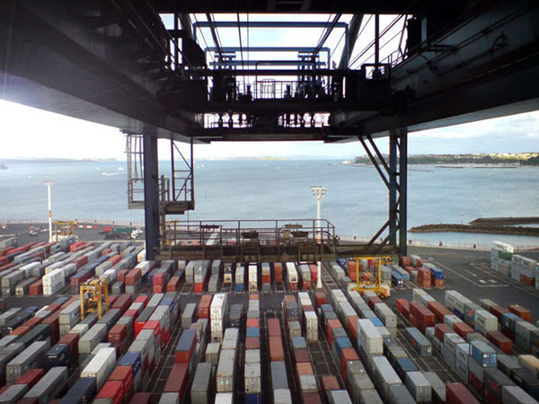
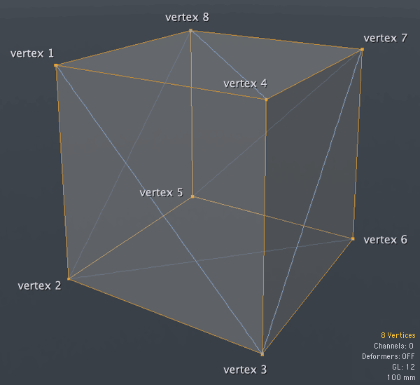
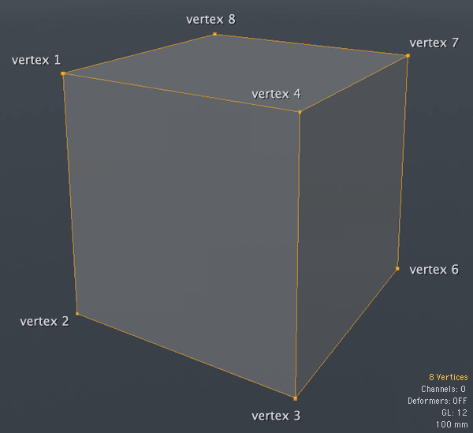

# 目录
* 3D世界和OpenGL的基本概念  

## 3D世界和OpenGL的基本概念
[参考地址](http://blog.db-in.com/all-about-opengl-es-2-x-part-1/)  

### 3D
#### 人眼
* field of view 简称fov,眼睛能观察的角度   
* Binocular vision 双眼视觉   
* onocular vision 单眼视觉   
* eye's lens 人眼（透镜）  
* concave lens 凹透镜  
* convex lens 凸透镜    
* perpectives 透视     
* vanish points 消失点（不可见）    
* distortions 扭曲    
* depth of field 景深  
* focus 焦点  

#### 三维
* 根据变换(移动，旋转，缩放)的顺序，最终结果可能完全不同（和二位不同）  
* 增加一个维度会使我们的工作难度成倍增加（和二位相比）。 

#### 时间影响
* 3D世界中的东西需要互动，需要移动，需要加速，需要碰撞，需要改变它们的惯性。  


[参考](opengl_special_mvpMatrix.md)


## OpenGL模拟3D世界
openGL是个状态机(按照状态机模式运行)，为了加深理解，我们可以想象一下在某个港口有一个港口起重机。 里面有很多集装箱，集装箱里面有很多箱子,openGL类似港口起重机，有以下特性
* 集装箱类似opengl对象(Textures(纹理),Shaders(着色器程序)，Meshes(网格) 等)    
* 集装箱中的箱子是我们使用opengl创建的，也是我们的实例
* 港口起重机是我们可以访问的OpenGL API。  

当我们运行opengl函数就像我们给起重器发送指令，起重机抓起一个集装箱，升起它，持有了一会用于处理所需要的指令，最后再次将集装箱落下，然后将集装箱放到港口的某个位置。application没有权限直接操作港口（opengl管理）,也不能读取和修改集装箱中的内容，也不能直接操作任何集装箱，application只能向起重机发送指令，这是唯一能够影响集装箱的方式。再来一遍，application只能向起重机发送指令，不能直接操作任何集装箱。
  
貌似我们使用opengl很受限制，其实不是，opengl功能强大，他可以重复处理成千上万的功能。使用opengl状态机的另一大优势就是不持有opengl实例，我们不会直接创建任何对象，application通过ID持有来控制对象实例，我们只需要知道容器的标识即可。


## OpenGL工作原理
深入到OpenGL的核心，大量计算是直接在GPU中使用硬件加速到浮点来完成的，CPU是设备的处理器，GPU图形设备的处理器，图形卡减轻了处理器，因为它可以在将内容显示到屏幕之前进行大量计算以处理图像。OpenGL所做的是让所有的大量计算到GPU，而不是计算CPU中。 GPU处理浮点数比使用GPU要快得多。 opengl一直和GPU交互？不完全正确，只是硬图像处理和其他一些事情。OpenGL为我们提供了许多以优化格式存储图像，数据和信息的功能。 这些优化数据将在稍后由GPU直接处理 ，所以，opengl依赖于GPU，是的，如果显卡不支持opengl，我们就不能使用opengl，当设备支持opengl，我们就可以使用。

## Opengl工作逻辑
OpenGL是一个非常简洁且专注的图形库。 您在专业的3D软件中看到的是使用OpenGL实现的复杂作品。 深入来讲，opengl使用了以下几种东西来完成功能
* ```Primitives(图元)```
* ```Buffers(缓冲区)```
* ```Rasterize(格栅化)``` 

OpenGL围绕这三个概念来完成工作。我们单独查看每个概念，以及如何将这三个概念结合起来创建最强大的3D图形库（也可以使用OpenGL来创建2D图形。在OpenGL的2D图像只是在Z深度为0的所有3D对象，我们将稍后讨论）。

### Primitives(图元)
opengl中的图元仅有以下三种图元对象 
* ```3D Point```空间中的3D点（x,y,z)
* ```3D Line```控件中的3D线（两个3D点组成）
* ```3D Triangle```空间中的3D三角形（三个3D点组成）

3d点，可以运作粒子
3d线，可以当做3d向量使用
3d三角形，可以当做网格的一个face(很多三角形组成)
一些OpenGL的版本也支持四边形(四边形)，它只是三角形的一个分支。 但是，由于OpenGL ES是为了实现最高性能而制作的，因此不支持四边形。  

### Buffers(缓冲区)
简单来说，缓冲区是临时优化存储。可以储存大量的信息。
opengl和以下三种buffer交互
* Frame Buffers(帧缓存区)  
* Render Buffer(渲染缓存区)   
* Buffer Objects(缓存对象)    

#### Frame Buffers(帧缓存区)
```Frame Buffers(帧缓存区)```是三者中最抽象的。当application想让OpenGL的渲染时，您可以将最终图像直接发送到设备的屏幕或```帧缓冲区```。 所以Frame Buffer是一个临时的```图像数据```吧？   
不完全是。您可以将其填充为OpenGL渲染的输出，该输出可能意味着一组图像，而不仅仅是一个。哪种图像呢，3D对象的图像在空间中的深度图像， 3D对象的图像的交集以及对象的可见部分图像。 因此帧缓冲区就像一组图像(颜色，深度，模板)。 所有这些都按照像素信息的二进制数组存储。 

#### Render Buffer(渲染缓存区)
```Render Buffer(渲染缓存区)```是一个图像的临时存储。现在您可以更清楚地看到Frame Buffer是一组Render Buffers。存在几种渲染缓冲区：颜色，深度和模板。
* ```Color Render Buffer(颜色渲染缓存)```存储由OpenGL渲染生成的最终颜色图像。Color Render Buffer(颜色渲染缓存)是彩色(RGB)图像。  
* ```Depth Render Buffer(深度渲染缓冲区)```存储对象的最终Z深度信息。如果您熟悉3D软件，则可以知道什么是Z深度图像。它是关于3D空间中物体的Z位置的灰度图像，其中全白表示最接近可见物体，黑色表示最远物体(全黑不可见)
* ```Stencil Render Buffer(模板渲染缓冲区)```是关于对象的可见部分。像可见部分的mask。模板渲染缓冲区是黑白图像。

#### Buffer Objects(缓存对象) 
```Buffer Objects(缓存对象)```是OpenGL称为存储在“服务器端”(或服务器的地址空间)的对象。缓冲区对象也是一个临时存储，但不像其他存储那样暂时存储。缓冲区对象可以在整个应用程序执行期间保留。缓冲区对象可以以优化的格式保存有关3D对象的信息。这些信息可以是两种类型：```结构数据```或```结构数据的索引数据```。       
```结构数据```是描述3D对象的数组，如顶点数组，纹理坐标数组或任何您想要的数组。```结构数据的索引数据```更特殊，用于指示如何基于结构数组构造网格的面。   
查看下图，一个3D立方体。这个立方体有6个面，由8个顶点组成，对吗？
    
上图长方体的6个面都是长方形，但是opengl只能处理三种图元数据，所以我们需要把长方形转换成三角形(opengl三角形图元)，当我们这样做，6个长方形变成了12个三角形，看看上图右下角，显示了8个顶点和12个face(12次drawcall)  

OpenGL中的三角形是三个3D顶点的组合。因此要构建立方体的正面face，我们需要以这种方式告诉OpenGL:{顶点1，顶点2，顶点3}，{顶点1，顶点3，顶点4}。

换句话说，我们需要在每个立方体的面上重复两个顶点。 如果我们的网格具有五边形，我们需要重复4个顶点信息，这可能是最糟糕的；如果是六边形，我们需要重复6个顶点信息，一个七边形，8个顶点信息等等。这是非常庞大的。

因此OpenGL为我们提供了一种更轻松地完成此操作的方法。称为```索引数组```！在上述立方体的示例中，我们可以有一个由8个顶点组成的数组：{顶点1，顶点2，顶点3，顶点4，...}，与其在每个立方体的面上重写这些信息，不如我们构造了一个索引数组:{0,1,2,0,2,3,2,6,3,2,5,6 ...}。（0,2,3 - 0,1,2 - 6,3,2）这一数组的每三个表示一个三角形面。使用此功能，我们可以一次写入顶点信息，然后在索引数组中多次重复使用它。

返回到```缓冲区对象```，第一种是```结构数组```，如{顶点1，顶点2，顶点3，顶点4，...}，第二种是```索引数组```，如{0,1,2，0,2,3,2,6,3,2,5,6...}。 

```缓冲区对象```的巨大优点是它们经过优化以直接在GPU处理中工作，并且创建缓冲区对象后，您不再需要将数组保留在应用程序中。

### Rasterize(格栅化)
```栅格化```是OpenGL获取有关```3D对象(所有坐标，顶点，数学等)```的所有信息以创建2D图像的过程。 此图像将进行一些更改，然后它将显示在设备的屏幕上(通常)。 

但是，这最后一步是像素信息和设备屏幕之间的交互，这是显卡供应商的责任。Khronos小组提供了另一个称为EGL的API，但是在这里系统厂商可能会修改。 我们（开发人员）不直接使用Khronos EGL，而是使用系统的修改版本。([apple](https://developer.apple.com/library/archive/documentation/3DDrawing/Conceptual/OpenGLES_ProgrammingGuide/WorkingwithOpenGLESContexts/WorkingwithOpenGLESContexts.html#//apple_ref/doc/uid/TP40008793-CH2-SW1))

因此，当您制作OpenGL渲染时，可以选择使用供应商的EGL实现直接渲染到屏幕上，还是渲染到帧缓冲区。渲染到帧缓冲区后，您仍在OpenGL API中，但是内容仍不会显示在设备的屏幕上。直接渲染到设备的屏幕，您可以打开OpenGL API并输入EGL API。因此，在渲染时，您可以选择两个输出之一。

但是，不必担心，正如我所说，每个供应商都可以自己实现EGL API。 例如，Apple不允许您直接渲染到设备的屏幕，您始终需要渲染到帧缓冲区，然后使用Apple的EGL实现将内容显示在设备的屏幕上。


## OpenGL的管线
我之前说过“可编程管线”和“固定管线”。但是可编程管道到底是什么呢？

可编程管线是图形库，由我们负责照相机，灯光，材质和效果相关的一切责任。我们可以与著名的着色器一起工作。因此，每当您听到有关的“可编程管道”即为Shaders

```着色器(Shaders)```就像一小段代码，就像小程序一样，直接在GPU中进行复杂的计算。复杂如：具有T纹理的表面点的最终颜色，由TB凹凸纹理修改，使用具有镜面水平SL的镜面反射颜色SC，在具有光的功率LP的光L下，具有距离Z的入射角LA 衰落F和所有这些通过投影镜头T位于P位置的相机C的眼睛看到。  

它由CPU处理非常复杂，而图形库仍在可以处理他。因此可编程管道就是我们来管理这种事情。

要创建着色器，我们使用类似于C的语言，我们使用OpenGL着色器语言(GLSL)。OpenGL ES使用一个更严格的版本，称为OpenGL ES Shader Language(也称为GLSL ES或ESSL)。区别在于你有更多的固定函数，并且可以在GLSL中写入比在GLSL ES中更多的变量，但语法是相同的。    

你可以在一个单独的文件中创建它们或者直接在你的代码中编写，重要的是，包含SL的最终字符串将被发送到OpenGL的核心，而核心将编译Shaders给你(你甚至可以使用pre编译的二进制着色器，但这不是本系列的一部分)。

着色器成对使用:```Vertex(顶点)着色器```和```Fragment(片段)着色器```。这个主题需要更多的关注，所以让我们仔细看看Vertex和Fragment着色器。 要了解每个着色器的作用，让我们回到立方体示例。  
   

### Vertex Shader 顶点着色器   
```Vertex Shader 顶点着色器```也称为VS或VSH，是一个小程序，将在网格的每个顶点执行。    

看看上面的立方体，正如我早先所说，这个立方体需要8个顶点(现在在这个图像中，顶点5是不可见的，你很快就会理解为什么)。所以这个立方体的VSH将由GPU处理8次。   

```Vertex Shader```将最终决定顶点的位置。您还记得可编程管道让我们由摄像机负责吗？ 现在是时候了！

相机的位置和镜头可能会决定顶点的最终位置。```Vertex Shader```还负责准备并输出一些变量到```Fragment Shader```。在OpenGL中，我们可以为```Vertex Shader```定义变量，但不能直接在```Fragment Shader```定义变量。因此，我们的```Fragment变量```必须通过```Vertex Shader```传递过去。    

### Fragment Shader 片段着色器   
看看上面的图片  

您是否注意到顶点5是不可见的？ 这是因为在这个特定的位置和特定的旋转，我们只能看到3个面，这3个面由7个顶点组成。 

这就是片段着色器的作用！ ```FSH```将在最终图像的每个VISIBLE片段处理。在这里，您可以将片段理解为像素。但通常不是一个像素，因为在OpenGL的渲染和设备屏幕上的最终图像的呈现之间有延伸 因此，根据设备和渲染的配置，片段可能会导致小于实际像素或大于实际像素。在上面的立方体中，片段着色器将在由7个顶点形成的三个可见面的每个像素处理。  

在```Fragment Shader```中，我们将处理与网格表面相关的所有内容，如材质，凹凸效果，阴影和灯光效果，反射，折射，纹理以及我们想要的任何其他类型的效果。片段着色器的最终输出是RGBA格式的像素颜色。

### program 
现在，您需要知道的最后一件事是关于```VSH```和```FSH```如何协同工作。它是强制性的```ONE Vertex Shader```到```ONE Fragment Shader```，不多不少，必须是一对一的。为了确保我们不犯错误，OpenGL有一个名为Program的东西。 OpenGL中的程序只是VSH和FSH的编译对。

## OpenGL's Error API
为了处理所有错误，OpenGL为我们提供了一个错误API。 这个API非常简单，相对的功能很少。一个是简单的检查，是或否，只是为了知道某些事情是否成功完成。另一个是获取错误消息。所以非常简单。首先你检查，非常快，如果有错误，那么你得到消息。

## 本章总结
1. OpenGL的逻辑由3个简单的概念组成：Primitives，Buffers和Rasterize。
    * 图元是点，线和三角形。
    * 缓冲区可以是帧缓冲区，渲染缓冲区或缓冲区对象。
    * Rasterize是在像素数据中转换OpenGL数学的过程。
2. OpenGL使用固定或可编程管道。
    * 固定管道旧，慢，大。 有很多固定的功能来处理相机，灯光，材料和效果。
    * 可编程管道比固定管道更容易，快速和清洁，因为在可编程方式中OpenGL让我们，开发人员，处理相机，灯光，材料和效果的任务。
3. 可编程管道是网格的每个顶点处的着色器：顶点着色器和网格的每个VISIBLE片段的片段着色器的同义词。 每对Vertex Shader和Fragment Shader都在一个名为Program的对象中编译。